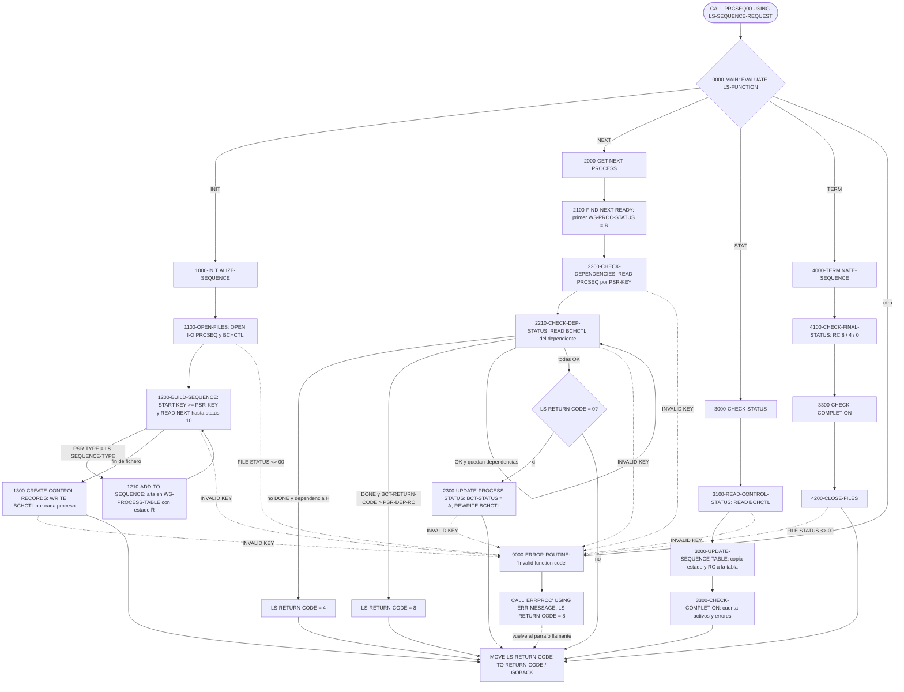
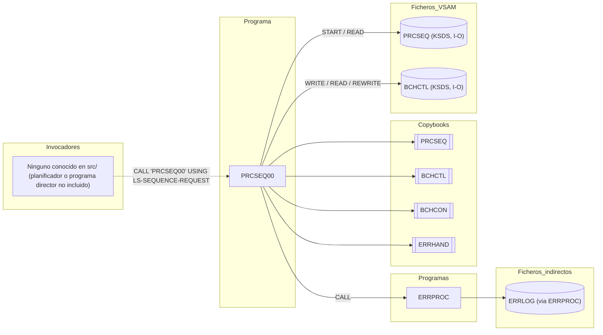

# PRCSEQ00 — Gestor de secuencia de procesos batch

> Generado a partir del análisis del código fuente `src/programs/batch/PRCSEQ00.cbl`. Ver el [grafo de dependencias global](../technical/dependency-graph.md).

## Ficha técnica
| Campo | Valor |
| --- | --- |
| Ruta | `src/programs/batch/PRCSEQ00.cbl` |
| Categoría | batch |
| Tipo | subrutina común (batch, sin CICS ni DB2) |
| Líneas | 345 |
| Punto de entrada | subrutina invocada por `CALL` con `PROCEDURE DIVISION USING LS-SEQUENCE-REQUEST`; ningún JCL ni programa del repositorio la invoca |
| Invocado por | ninguno conocido en `src/` (el grafo de dependencias lo lista entre los "programas sin invocador conocido") |
| Invoca a | `ERRPROC` (`CALL 'ERRPROC' USING ERR-MESSAGE`) |

## Propósito
`PRCSEQ00` ("Process Sequence Manager") es el componente de control batch encargado de construir y gobernar la **secuencia de ejecución de los procesos de un día de negocio**. A partir de las definiciones de proceso del fichero VSAM `PRCSEQ` (copybook `PRCSEQ`), genera los registros de control de cada job en el fichero `BCHCTL` (copybook `BCHCTL`), entrega al invocador el siguiente proceso listo para ejecutar tras comprobar sus dependencias, refresca el estado de la secuencia a partir de `BCHCTL` y, al terminar, calcula un código de retorno global.

Encaja en la capa de *Batch Control* descrita en `system-architecture.md` (junto a `BCHCTL00`, `RCVPRC00` y `CKPRST`): `BCHCTL00` gestiona el ciclo de vida de un job individual, `RCVPRC00` la recuperación, y `PRCSEQ00` la ordenación y las dependencias entre jobs. Está diseñado como una **máquina de estados invocada varias veces** por un planificador o programa director (código de función `INIT` → `NEXT`/`STAT`… → `TERM`), manteniendo la tabla de secuencia en WORKING-STORAGE entre llamadas.

## Funcionamiento

El programa no tiene bucle principal propio: cada `CALL` ejecuta una única función seleccionada por `LS-FUNCTION` y devuelve el control con `GOBACK`.

### `0000-MAIN`
`EVALUATE TRUE` sobre las condiciones de nivel 88 de `LS-FUNCTION`:

| Función | Párrafo ejecutado | Efecto |
| --- | --- | --- |
| `INIT` (`FUNC-INIT`) | `1000-INITIALIZE-SEQUENCE` | Abre ficheros, carga la tabla de procesos y crea los registros de control |
| `NEXT` (`FUNC-NEXT`) | `2000-GET-NEXT-PROCESS` | Devuelve el siguiente proceso `READY` cuyas dependencias se cumplen y lo marca `ACTIVE` |
| `STAT` (`FUNC-STAT`) | `3000-CHECK-STATUS` | Lee el estado real de un proceso en `BCHCTL` y actualiza la tabla interna |
| `TERM` (`FUNC-TERM`) | `4000-TERMINATE-SEQUENCE` | Calcula el código de retorno final y cierra ficheros |
| otro | `9000-ERROR-ROUTINE` | Error `Invalid function code` |

Al final copia `LS-RETURN-CODE` al registro especial `RETURN-CODE` y hace `GOBACK`.

### Función `INIT` — `1000-INITIALIZE-SEQUENCE`
1. **`1100-OPEN-FILES`**: `OPEN I-O` de `PROCESS-SEQ-FILE` (DD `PRCSEQ`) y de `BATCH-CONTROL-FILE` (DD `BCHCTL`). Si el `FILE STATUS` no es `'00'` se ejecuta `9000-ERROR-ROUTINE`, pero el flujo **continúa** (no hay salida anticipada).
2. **`1200-BUILD-SEQUENCE`**: inicializa `WS-PROCESS-TABLE` y `WS-PROCESS-COUNT`, sitúa el índice `WS-PROC-IX` en 1, mueve `LS-PROCESS-DATE` a `PSR-KEY` y hace `START PROCESS-SEQ-FILE KEY >= PSR-KEY`. Después recorre el fichero con `READ ... NEXT RECORD` hasta `WS-PSR-STATUS = '10'` (fin de fichero), y por cada registro cuyo `PSR-TYPE` coincide con `LS-SEQUENCE-TYPE` ejecuta `1210-ADD-TO-SEQUENCE`.
3. **`1210-ADD-TO-SEQUENCE`**: incrementa `WS-PROCESS-COUNT`, guarda `PSR-PROCESS-ID` en `WS-PROC-ID`, asigna como `WS-PROC-SEQ` el número de orden (el propio contador), fija `WS-PROC-STATUS = BCT-STAT-READY` (`'R'`) y avanza el índice.
4. **`1300-CREATE-CONTROL-RECORDS`**: para cada entrada de la tabla (`WS-SEQUENCE-IX` de 1 a `WS-PROCESS-COUNT`) inicializa `BATCH-CONTROL-RECORD`, rellena la clave (`BCT-JOB-NAME` = id del proceso, `BCT-PROCESS-DATE` = `LS-PROCESS-DATE`, `BCT-SEQUENCE-NO` = orden), pone `BCT-STATUS = 'R'` y hace `WRITE`. Un `INVALID KEY` (p. ej. clave duplicada) dispara `9000-ERROR-ROUTINE`.

### Función `NEXT` — `2000-GET-NEXT-PROCESS`
1. **`2100-FIND-NEXT-READY`**: recorre la tabla en orden y copia a `LS-NEXT-PROCESS` el primer proceso con `WS-PROC-STATUS = 'R'` (`EXIT PERFORM` al encontrarlo). Si agota la tabla, deja `LS-NEXT-PROCESS = SPACES`.
2. **`2200-CHECK-DEPENDENCIES`**: mueve `LS-NEXT-PROCESS` a `PSR-PROCESS-ID` y lee la definición del proceso en `PRCSEQ` (`READ` directo por `PSR-KEY`). Luego recorre las `PSR-DEP-COUNT` dependencias (`PSR-DEP-ENTRY`) con el subíndice `WS-SUB`, ejecutando `2210-CHECK-DEP-STATUS` y abandonando el bucle en cuanto `LS-RETURN-CODE` deja de ser cero.
3. **`2210-CHECK-DEP-STATUS`**: lee en `BCHCTL` el registro del job dependiente (`BCT-JOB-NAME = PSR-DEP-ID(WS-SUB)`, `BCT-PROCESS-DATE = LS-PROCESS-DATE`) y aplica las reglas:
   - Si el dependiente **no** está `DONE` (`BCT-STATUS-DONE`) y la dependencia es dura (`PSR-DEP-HARD`, `'H'`) → `LS-RETURN-CODE = BCT-RC-WARNING` (4). Si es blanda (`'S'`) no se altera nada.
   - Si **sí** está `DONE` pero `BCT-RETURN-CODE > PSR-DEP-RC(WS-SUB)` (el RC real del dependiente supera el máximo admitido) → `LS-RETURN-CODE = BCT-RC-ERROR` (8).
4. Solo si `LS-RETURN-CODE = ZERO` se ejecuta **`2300-UPDATE-PROCESS-STATUS`**: lee el registro del proceso en `BCHCTL`, lo marca `BCT-STATUS = BCT-STAT-ACTIVE` (`'A'`), toma la hora con `ACCEPT WS-CURRENT-TIME FROM TIME STAMP`, la mueve a `BCT-START-TIME` y hace `REWRITE`.

### Función `STAT` — `3000-CHECK-STATUS`
1. **`3100-READ-CONTROL-STATUS`**: lee en `BCHCTL` el registro del proceso identificado por `LS-NEXT-PROCESS` + `LS-PROCESS-DATE` (aquí `LS-NEXT-PROCESS` actúa como **entrada**: el invocador debe indicar qué proceso consultar).
2. **`3200-UPDATE-SEQUENCE-TABLE`**: busca en la tabla la entrada con `WS-PROC-ID = BCT-JOB-NAME` y copia `BCT-STATUS` → `WS-PROC-STATUS` y `BCT-RETURN-CODE` → `WS-PROC-RC`.
3. **`3300-CHECK-COMPLETION`**: recuenta en `WS-ACTIVE-COUNT` los procesos en estado `'A'` y en `WS-ERROR-COUNT` los que están en `'E'`. No modifica `LS-RETURN-CODE` ni devuelve los contadores al invocador.

### Función `TERM` — `4000-TERMINATE-SEQUENCE`
1. **`4100-CHECK-FINAL-STATUS`**: reutiliza `3300-CHECK-COMPLETION` y fija `LS-RETURN-CODE`: 8 (`BCT-RC-ERROR`) si `WS-ERROR-COUNT > 0`; si no, 4 (`BCT-RC-WARNING`) si `WS-ACTIVE-COUNT > 0`; en otro caso 0 (`BCT-RC-SUCCESS`).
2. **`4200-CLOSE-FILES`**: `CLOSE` de ambos ficheros y comprobación de ambos `FILE STATUS`.

### `9000-ERROR-ROUTINE`
Rellena `ERR-PROGRAM = 'PRCSEQ00'`, fuerza `LS-RETURN-CODE = BCT-RC-ERROR` (8) y llama a `ERRPROC` pasando `ERR-MESSAGE`. El texto del error (`ERR-TEXT`) lo ha rellenado el párrafo llamante. No hay `GOBACK` ni `STOP RUN`: el control vuelve al párrafo que detectó el error y la ejecución continúa.

## Interfaz

- **Parámetros / LINKAGE SECTION / COMMAREA**: `PROCEDURE DIVISION USING LS-SEQUENCE-REQUEST` (no hay COMMAREA; no es CICS).

  | Campo | PIC | Sentido | Descripción |
  | --- | --- | --- | --- |
  | `LS-FUNCTION` | `X(4)` | entrada | `'INIT'`, `'NEXT'`, `'STAT'` o `'TERM'` (condiciones 88 `FUNC-INIT`, `FUNC-NEXT`, `FUNC-STAT`, `FUNC-TERM`) |
  | `LS-PROCESS-DATE` | `X(8)` | entrada | Fecha de proceso; se usa como parte de `BCT-KEY` y, en `INIT`, como clave de posicionamiento en `PRCSEQ` |
  | `LS-SEQUENCE-TYPE` | `X(3)` | entrada | Tipo de secuencia a construir; se compara con `PSR-TYPE` (`'INI'`, `'PRC'`, `'RPT'`, `'TRM'` según `PRCSEQ.cpy`) |
  | `LS-NEXT-PROCESS` | `X(8)` | salida en `NEXT` / entrada en `STAT` | Id del siguiente proceso listo (o `SPACES` si no hay); en `STAT`, proceso cuyo estado se consulta |
  | `LS-RETURN-CODE` | `S9(4) COMP` | salida (y entrada implícita) | Código de retorno; el programa nunca lo pone a cero por sí mismo salvo en `4100-CHECK-FINAL-STATUS` |

- **Ficheros (DDNAME, organización, modo de apertura, clave)**:

  | DDNAME | Nombre interno (`SELECT`) | Registro (copybook) | Organización / acceso | Apertura | Clave (`RECORD KEY`) | Operaciones |
  | --- | --- | --- | --- | --- | --- | --- |
  | `PRCSEQ` | `PROCESS-SEQ-FILE` | `PROCESS-SEQUENCE-RECORD` (`PRCSEQ`) | `INDEXED`, `ACCESS MODE DYNAMIC`, `FILE STATUS WS-PSR-STATUS` | `I-O` (en `INIT`), `CLOSE` en `TERM` | `PSR-KEY` = `PSR-PROCESS-ID` X(8) + `PSR-VERSION` 9(2) | `START`, `READ NEXT`, `READ` directo (solo lectura, pese al `I-O`) |
  | `BCHCTL` | `BATCH-CONTROL-FILE` | `BATCH-CONTROL-RECORD` (`BCHCTL`) | `INDEXED`, `ACCESS MODE DYNAMIC`, `FILE STATUS WS-BCT-STATUS` | `I-O` (en `INIT`), `CLOSE` en `TERM` | `BCT-KEY` = `BCT-JOB-NAME` X(8) + `BCT-PROCESS-DATE` X(8) + `BCT-SEQUENCE-NO` 9(4) | `WRITE`, `READ` directo, `REWRITE` |

  Ninguno de los dos ficheros está definido en `src/database/vsam/vsam-definitions.txt` ni referenciado por ningún JCL de `src/jcl/`.

- **Tablas DB2 y sentencias SQL**: No aplica.
- **Mapas BMS / comandos CICS**: No aplica.
- **Códigos de retorno / RETURN-CODE**: `0000-MAIN` copia `LS-RETURN-CODE` a `RETURN-CODE` antes del `GOBACK`. Valores que asigna el propio programa (constantes de `BCHCON`):

  | Valor | Constante | Cuándo |
  | --- | --- | --- |
  | 0 | `BCT-RC-SUCCESS` | Solo en `TERM`, si no hay procesos en `'A'` ni en `'E'` |
  | 4 | `BCT-RC-WARNING` | En `NEXT`, si una dependencia dura (`'H'`) aún no está `DONE`; en `TERM`, si quedan procesos `ACTIVE` |
  | 8 | `BCT-RC-ERROR` | En `NEXT`, si un dependiente terminó con `BCT-RETURN-CODE` superior a `PSR-DEP-RC`; y en cualquier paso por `9000-ERROR-ROUTINE` (función inválida, errores de OPEN/START/READ/WRITE/REWRITE/CLOSE) |

  En `INIT`, `NEXT` (sin incidencias) y `STAT` el programa **no toca** `LS-RETURN-CODE`, por lo que devuelve el valor que traía el invocador.

## Estructuras de datos clave

### Copybooks
| Copybook | Ubicación en el programa | Aporta |
| --- | --- | --- |
| `PRCSEQ` (`src/copybook/batch/PRCSEQ.cpy`) | `FD PROCESS-SEQ-FILE` | `PROCESS-SEQUENCE-RECORD`: clave `PSR-KEY` (id + versión), `PSR-TYPE` (INI/PRC/RPT/TRM), `PSR-TIMING`, tabla `PSR-DEP-ENTRY OCCURS 10` (`PSR-DEP-ID`, `PSR-DEP-TYPE` H/S, `PSR-DEP-RC`), `PSR-CONTROL` (programa, parm, `PSR-MAX-RC`, restart), `PSR-SCHEDULE`, `PSR-RECOVERY`, `PSR-AUDIT`. Incluye además un segundo nivel 01 `STANDARD-SEQUENCES` con literales de secuencias estándar (`INITDAY`, `CKPCLR`, `DATEVAL`, `TRNVAL00`, `POSUPD00`, `HISTLD00`, `RPTGEN00`, `BCKLOD00`, `ENDDAY`) que el programa no utiliza |
| `BCHCTL` (`src/copybook/batch/BCHCTL.cpy`) | `FD BATCH-CONTROL-FILE` | `BATCH-CONTROL-RECORD`: `BCT-KEY` (job + fecha + secuencia), `BCT-STATUS` con 88 `BCT-STATUS-READY/ACTIVE/WAITING/DONE/ERROR`, `BCT-PROCESS-CONTROL` (`BCT-START-TIME` X(8), `BCT-END-TIME`), `BCT-DEPENDENCIES` (`BCT-PREREQ-JOBS OCCURS 10`, no usado aquí), `BCT-RETURN-INFO` (`BCT-RETURN-CODE`), `BCT-STATISTICS` |
| `BCHCON` (`src/copybook/batch/BCHCON.cpy`) | WORKING-STORAGE | Constantes: estados `BCT-STAT-READY/ACTIVE/WAITING/DONE/ERROR` (`R/A/W/D/E`), umbrales `BCT-RC-SUCCESS/WARNING/ERROR/SEVERE/CRITICAL` (0/4/8/12/16), límites (`BCT-MAX-PREREQ` 10, `BCT-MAX-RESTARTS` 3, `BCT-WAIT-INTERVAL` 300, `BCT-MAX-WAIT-TIME` 3600), tipos de proceso y dependencia, nombres especiales y mensajes. El programa solo usa los estados y los umbrales de RC |
| `ERRHAND` (`src/copybook/common/ERRHAND.cpy`) | WORKING-STORAGE | `ERR-MESSAGE` (`ERR-TIMESTAMP`, `ERR-PROGRAM`, `ERR-CATEGORY`, `ERR-CODE`, `ERR-SEVERITY`, `ERR-TEXT` X(80), `ERR-DETAILS`) que se pasa a `ERRPROC`; categorías, códigos estándar y estados VSAM (`ERR-VSAM-EOF` = `'10'`, etc.), estos últimos no usados (el código compara literales) |

### WORKING-STORAGE propio
| Campo | PIC | Uso |
| --- | --- | --- |
| `WS-PSR-STATUS`, `WS-BCT-STATUS` | `X(2)` | `FILE STATUS` de `PRCSEQ` y `BCHCTL` |
| `WS-CURRENT-TIME` | `X(26)` | Marca de tiempo del `ACCEPT ... FROM TIME STAMP` |
| `WS-SEQUENCE-IX` | `9(4) COMP` | Subíndice de recorrido de la tabla en `1300`, `2100`, `3200`, `3300` |
| `WS-PROCESS-COUNT` | `9(4) COMP` | Número de procesos cargados en la tabla |
| `WS-ACTIVE-COUNT`, `WS-ERROR-COUNT` | `9(4) COMP` | Contadores de `3300-CHECK-COMPLETION` |
| `WS-PROCESS-TABLE` / `WS-PROC-ENTRY OCCURS 100 INDEXED BY WS-PROC-IX` | — | Tabla en memoria de la secuencia: `WS-PROC-ID` X(8), `WS-PROC-SEQ` 9(4) COMP, `WS-PROC-STATUS` X(1), `WS-PROC-RC` S9(4) COMP. Límite fijo de **100 procesos** sin comprobación de desbordamiento |
| `WS-SUB` | — | Subíndice usado en `2200`/`2210` para recorrer `PSR-DEP-ENTRY`; **no está declarado** en el programa ni en ningún copybook |

La tabla y los ficheros abiertos persisten en WORKING-STORAGE entre llamadas: el diseño asume que el invocador mantiene `PRCSEQ00` cargado (sin `CANCEL`) durante toda la secuencia `INIT` → … → `TERM`. No hay persistencia de la tabla en fichero ni checkpoint.

## Reglas de negocio y validaciones
1. **Selección de función**: solo se admiten `INIT`, `NEXT`, `STAT` y `TERM`; cualquier otro valor es error (RC 8).
2. **Filtro de la secuencia**: en `INIT` solo entran en la tabla los registros de `PRCSEQ` cuyo `PSR-TYPE` es igual a `LS-SEQUENCE-TYPE`; el orden de la secuencia es el orden físico de clave del fichero (id de proceso + versión), y el número de secuencia (`WS-PROC-SEQ`/`BCT-SEQUENCE-NO`) es simplemente la posición 1..n.
3. **Estado inicial**: todo proceso de la secuencia se da de alta en `BCHCTL` con `BCT-STATUS = 'R'` (READY), `BCT-JOB-NAME` = id de proceso, `BCT-PROCESS-DATE` = fecha recibida.
4. **Selección del siguiente proceso**: el primero de la tabla (en orden de secuencia) cuyo estado en la tabla interna sea `'R'`. No se tiene en cuenta `PSR-TIMING`, `PSR-SCHEDULE` (días activos, fin de mes, festivos) ni `PSR-START-TIME`, aunque existan en el copybook.
5. **Dependencias duras y blandas** (`2210-CHECK-DEP-STATUS`):
   - Dependencia `'H'` (hard) con el job dependiente sin llegar a `DONE` → RC 4 (aviso; el proceso no se lanza).
   - Dependencia `'S'` (soft) sin llegar a `DONE` → se ignora.
   - Dependiente `DONE` con `BCT-RETURN-CODE > PSR-DEP-RC` → RC 8 (error; el proceso no se lanza). Esta regla se aplica tanto a dependencias duras como blandas.
   - La comprobación se detiene en la primera dependencia que produce RC distinto de cero.
6. **Arranque de proceso**: solo si `LS-RETURN-CODE = 0` tras las dependencias se marca el registro `BCHCTL` como `'A'` y se estampa `BCT-START-TIME`. El programa no ejecuta el proceso: se limita a devolver su id en `LS-NEXT-PROCESS`.
7. **Cierre de la secuencia** (`TERM`): RC 8 si algún proceso está en `'E'`, RC 4 si alguno sigue en `'A'`, RC 0 en otro caso. Los procesos que quedaron en `'R'` (nunca lanzados) o `'W'` no influyen en el resultado.
8. No hay commits ni umbrales de checkpoint: el programa no usa DB2 ni `CKPRST`.

## Manejo de errores y recuperación
- **FILE STATUS**: se comprueba explícitamente solo en `OPEN` (`1100`) y `CLOSE` (`4200`) contra el literal `'00'`, y en el bucle de lectura de `1200` contra `'10'`. El resto de operaciones (`START`, `READ`, `WRITE`, `REWRITE`) confían únicamente en la cláusula `INVALID KEY`; los errores que no son de clave (p. ej. status `3x`/`4x`/`9x`) no se detectan.
- **Ruta de error única** (`9000-ERROR-ROUTINE`): fija `ERR-PROGRAM`, pone `LS-RETURN-CODE = 8` y llama a `ERRPROC`, que escribe `ERR-MESSAGE` en el fichero `ERRLOG` y lo muestra por `DISPLAY`. No se rellenan `ERR-CATEGORY`, `ERR-CODE`, `ERR-SEVERITY`, `ERR-TIMESTAMP` ni `ERR-DETAILS` (ERRPROC recibe `ERR-MESSAGE`, cuya estructura no coincide campo a campo con su `LS-ERROR-REQUEST`, que además espera un `LS-RETURN-CODE` al final).
- **Sin abortar**: tras cualquier error la ejecución continúa en el párrafo llamante (no hay `GOBACK`, `STOP RUN` ni flag de "error ya notificado"), lo que puede encadenar errores secundarios (p. ej. leer un fichero que no se pudo abrir).
- **SQLCODE / CICS**: No aplica.
- **Checkpoint / restart / rollback**: no implementados en este programa. La única "recuperación" es la que hace el invocador a partir del RC; el estado de los jobs vive en `BCHCTL` (y su restauración corresponde a `RCVPRC00`, que comparte `PRCSEQ` y `BCHCTL`).

## Dependencias

## Observaciones y problemas detectados

### Errores de compilación / referencias sin resolver
1. **`WS-SUB` no está definido.** Se usa como subíndice en `2200-CHECK-DEPENDENCIES` y `2210-CHECK-DEP-STATUS` (líneas 230-254) pero no aparece en la WORKING-STORAGE ni en `BCHCON`, `BCHCTL`, `PRCSEQ` o `ERRHAND`. El programa no compila tal cual.
2. **`ACCEPT WS-CURRENT-TIME FROM TIME STAMP`** (`2300-UPDATE-PROCESS-STATUS`): `TIME STAMP` no es una opción estándar de `ACCEPT ... FROM` en Enterprise COBOL (las válidas son `DATE`, `DAY`, `DAY-OF-WEEK`, `TIME` y sus variantes `YYYYMMDD`/`YYYYDDD`); salvo que exista un nombre mnemotécnico definido en `SPECIAL-NAMES` (no lo hay), probablemente no compila. El mismo patrón se repite en otros programas del repositorio (p. ej. `ERRPROC`). Además, el valor de 26 bytes se mueve a `BCT-START-TIME`, que es `X(8)`, con truncamiento.
3. El comentario de cabecera "Detailed procedures to be implemented" (líneas 124-137) sugiere que los párrafos de detalle se añadieron a posteriori sobre un esqueleto; el comentario ha quedado obsoleto pero los párrafos sí existen.

### Errores lógicos
4. **Posicionamiento por fecha sobre una clave que no es fecha** (`1200-BUILD-SEQUENCE`): `MOVE LS-PROCESS-DATE TO PSR-KEY` y `START ... KEY >= PSR-KEY`, pero `PSR-KEY` es `PSR-PROCESS-ID` + `PSR-VERSION` y el registro `PRCSEQ` no contiene ningún campo de fecha. El mensaje `'No sequence found for date'` confirma que la intención era un fichero con clave por fecha. En la práctica se posiciona en el primer proceso cuyo id es alfabéticamente `>=` a la cadena de fecha; como en EBCDIC los dígitos ordenan después de las letras, con ids alfabéticos el `START` probablemente devuelve `INVALID KEY` o salta todos los registros.
5. **Riesgo de bucle infinito tras un `START` fallido**: si el `START` falla, se notifica el error pero el `PERFORM UNTIL WS-PSR-STATUS = '10'` se ejecuta igualmente. Un `READ NEXT` sin posición válida devuelve un status distinto de `'10'` y no activa `AT END`, por lo que la condición de salida nunca se cumple.
6. **Claves incompletas en las lecturas directas de `BCHCTL`** (`2210`, `2300`, `3100`): solo se rellenan `BCT-JOB-NAME` y `BCT-PROCESS-DATE`; `BCT-SEQUENCE-NO`, tercer componente de `BCT-KEY`, conserva el valor del último registro leído o escrito. Como los registros se crearon en `1300` con `BCT-SEQUENCE-NO` = posición en la secuencia, los `READ` directos solo aciertan por casualidad y normalmente terminan en `'... record not found'`.
7. **Clave incompleta en la lectura de `PRCSEQ`** (`2200`): se rellena `PSR-PROCESS-ID` pero no `PSR-VERSION`, que queda con el valor residual del último registro leído.
8. **La función `NEXT` no marca el proceso en la tabla interna**: `2300` actualiza `BCHCTL` a `'A'` pero `WS-PROC-STATUS` sigue en `'R'`. Sin una llamada `STAT` intermedia para ese proceso, la siguiente llamada `NEXT` devolverá **el mismo proceso** otra vez.
9. **Fin de secuencia tratado como error**: cuando no queda ningún proceso `'R'`, `2100` deja `LS-NEXT-PROCESS = SPACES` pero `2200` intenta igualmente leer la definición con clave en blanco, provocando `'Process definition not found'` y RC 8. No existe un código de retorno específico de "no hay más procesos".
10. **`LS-RETURN-CODE` nunca se inicializa**: el programa solo lo escribe en las ramas de error, en `2210` y en `4100`. En `INIT` y `STAT` correctos devuelve el valor que traía; en `NEXT`, la condición `IF LS-RETURN-CODE = ZERO` depende de que el invocador lo haya puesto a cero antes de cada llamada, y un RC 4 de una llamada anterior impediría arrancar procesos en las siguientes.
11. **Continuación tras error**: `9000-ERROR-ROUTINE` no interrumpe el flujo. Por ejemplo, si falla el `OPEN` de `PRCSEQ`, se sigue con `1200` y `1300` sobre ficheros no abiertos; si falla el `READ` de `BCHCTL` en `2300`, se hace `REWRITE` de un registro no leído.
12. **Sin control de desbordamiento** de `WS-PROCESS-TABLE` (`OCCURS 100`): `1210-ADD-TO-SEQUENCE` incrementa `WS-PROC-IX` sin comprobar el límite.
13. **`STAT` no devuelve información al invocador**: `3300` calcula `WS-ACTIVE-COUNT` y `WS-ERROR-COUNT` pero no los expone ni modifica `LS-RETURN-CODE`; solo `TERM` los aprovecha.
14. **`TERM` ignora los procesos no lanzados**: un proceso que quedó en `'R'` o `'W'` no altera el RC final, por lo que una secuencia incompleta puede terminar con RC 0.
15. **Regla de dependencia dura incoherente**: una dependencia dura no satisfecha produce RC 4 (aviso), mientras que un dependiente terminado con RC excesivo produce RC 8; y la comprobación de RC se aplica también a dependencias blandas. Puede ser intencionado (aviso = "espera", error = "no ejecutable"), pero no está documentado en el código.
16. `PRCSEQ` se abre en modo `I-O` aunque solo se lee; bastaría `INPUT`.
17. Estado inicial de los ficheros en llamadas sin `INIT`: si el invocador llama a `NEXT`/`STAT`/`TERM` sin haber hecho `INIT` en la misma unidad de ejecución, los ficheros están cerrados y la tabla vacía; el programa no lo detecta.

### Inconsistencias entre copybooks
18. `BCHCON` define tipos de proceso `INI/UPD/RPT/CLN` (`BCT-TYPE-*`) y tipos de dependencia `R/O/X` (`BCT-DEP-*`), mientras que `PRCSEQ.cpy` usa `INI/PRC/RPT/TRM` (`PSR-TYPE-*`) y `H/S` (`PSR-DEP-HARD/SOFT`). `PRCSEQ00` usa las de `PRCSEQ.cpy`; las de `BCHCON` quedan sin uso y contradictorias.
19. `PRCSEQ.cpy` incluye el nivel 01 `STANDARD-SEQUENCES` con cláusulas `VALUE` dentro de un `FD` (donde `VALUE` en ítems que no son 88 no tiene efecto o no está permitido, según la versión del compilador). Además, de los programas que nombra solo existen en `src/` `HISTLD00` y, con otro nombre, `POSUPDT` (no `POSUPD00`); `INITDAY`, `CKPCLR`, `DATEVAL`, `TRNVAL00`, `RPTGEN00`, `BCKLOD00` y `ENDDAY` no existen en el repositorio.

### Discrepancias con la documentación técnica
20. `system-architecture.md` y `data-dictionary.md` describen un **"Process Control File (PRCCTL)"** secuencial de 80 bytes (`PROCESS-CONTROL-RECORD`, con `PRC-DATE`, `PRC-SEQUENCE`, `PRC-DEPENDENCY` única) y un `BCHCTL` de 200 bytes con clave `BCH-PROCESS-DATE + BCH-PROCESS-ID` y estados `W/P/C/E`. El código real usa un KSDS `PRCSEQ` (registro `PROCESS-SEQUENCE-RECORD`, hasta 10 dependencias, sin fecha) y un `BCHCTL` con clave `BCT-JOB-NAME + BCT-PROCESS-DATE + BCT-SEQUENCE-NO` y estados `R/A/W/D/E`. **Prevalece el código**; la documentación técnica está desactualizada respecto a los copybooks.
21. El diagrama "Batch Control Flow" de `system-architecture.md` muestra al planificador leyendo `PRCCTL` y creando registros en `BCHCTL`, que es exactamente el papel de `PRCSEQ00`, pero el programa no aparece nombrado en la arquitectura ni existe JCL, programa director o definición VSAM (`vsam-definitions.txt`) que lo respalde. `development-backlog.md` lo marca como completado ("Dependency resolution", "Process scheduling", "Error recovery", "Status reporting"), lo que no se corresponde con el estado real del código (no compila y no implementa planificación temporal ni recuperación).

## Referencias
- Programa: [PRCSEQ00.cbl](../../src/programs/batch/PRCSEQ00.cbl)
- Copybooks: [PRCSEQ.cpy](../../src/copybook/batch/PRCSEQ.cpy), [BCHCTL.cpy](../../src/copybook/batch/BCHCTL.cpy), [BCHCON.cpy](../../src/copybook/batch/BCHCON.cpy), [ERRHAND.cpy](../../src/copybook/common/ERRHAND.cpy)
- Programa invocado: [ERRPROC.cbl](../../src/programs/common/ERRPROC.cbl)
- Programas relacionados de control batch: [BCHCTL00.cbl](../../src/programs/batch/BCHCTL00.cbl), [RCVPRC00.cbl](../../src/programs/batch/RCVPRC00.cbl), [CKPRST.cbl](../../src/programs/batch/CKPRST.cbl)
- Definiciones VSAM (no incluyen `PRCSEQ` ni `BCHCTL`): [vsam-definitions.txt](../../src/database/vsam/vsam-definitions.txt)
- Documentación técnica: [system-architecture.md](../technical/system-architecture.md), [data-dictionary.md](../technical/data-dictionary.md), [dependency-graph.md](../technical/dependency-graph.md), [development-backlog.md](../technical/development-backlog.md)
