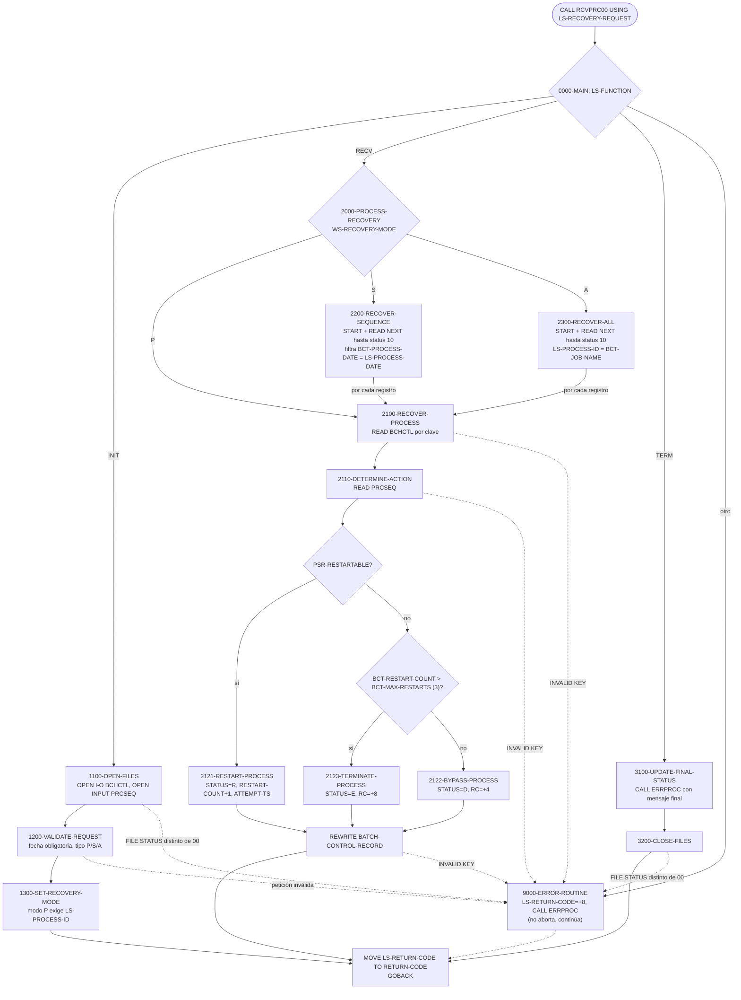
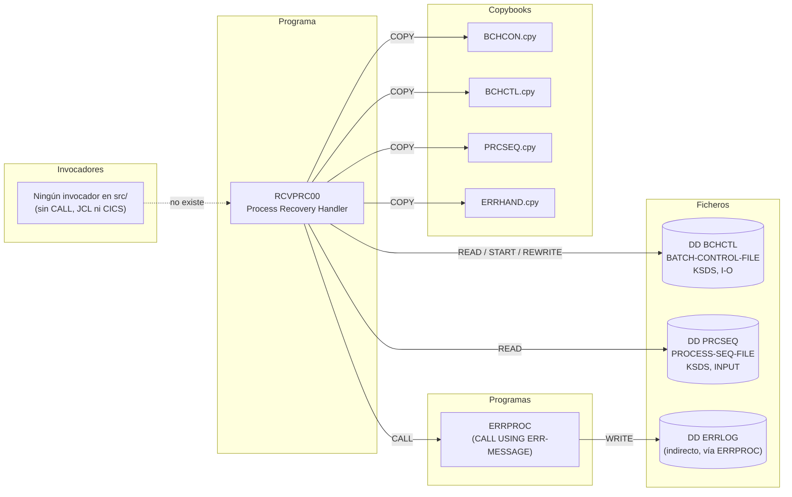

# RCVPRC00 — Gestor de recuperación de procesos batch

> Generado a partir del análisis del código fuente `src/programs/batch/RCVPRC00.cbl`. Ver el [grafo de dependencias global](../technical/dependency-graph.md).

## Ficha técnica
| Campo | Valor |
| --- | --- |
| Ruta | `src/programs/batch/RCVPRC00.cbl` |
| Categoría | batch |
| Tipo | subrutina común (batch, invocada por `CALL` con un área de petición en `LINKAGE SECTION`) |
| Líneas | 302 |
| Punto de entrada | subrutina invocada por `CALL` (`PROCEDURE DIVISION USING LS-RECOVERY-REQUEST`); ningún JCL, programa ni transacción CICS del repositorio la invoca |
| Invocado por | ninguno conocido en `src/` (ver [Observaciones](#observaciones-y-problemas-detectados)) |
| Invoca a | `ERRPROC` (`CALL 'ERRPROC' USING ERR-MESSAGE`) |

## Propósito
`RCVPRC00` ("Process Recovery Handler") es la rutina de recuperación del subsistema de control batch de CLBS. Cuando un proceso planificado (registro del fichero de control `BCHCTL`) termina en error, este programa decide, a partir de la definición del proceso en `PRCSEQ`, si el proceso debe **reintentarse** (vuelve a estado `R` — READY —, incrementando el contador de reintentos), **saltarse** (pasa a `D` — DONE — con código de aviso `+4`) o **darse por terminado** (pasa a `E` — ERROR — con código `+8`), y actualiza el registro de control en consecuencia.

Encaja en la "Batch Control Layer" descrita en `system-architecture.md`, junto a `BCHCTL00` (control de ejecución) y `PRCSEQ00` (secuenciación), con los que comparte copybooks (`BCHCON`, `BCHCTL`, `PRCSEQ`, `ERRHAND`) y ficheros VSAM. Admite tres alcances de recuperación: un proceso concreto (`P`), todos los procesos de una fecha (`S`) o todo el fichero de control (`A`).

## Funcionamiento

El programa está diseñado como una subrutina **con estado** que se invoca en tres fases mediante el campo `LS-FUNCTION` del área de petición: `INIT` → `RECV` → `TERM`. Los ficheros se abren en `INIT`, la recuperación se ejecuta en `RECV` y se cierran en `TERM`. El modo de recuperación (`WS-RECOVERY-MODE`) se fija en `INIT` y se conserva en `WORKING-STORAGE` entre llamadas (el programa no lleva la cláusula `INITIAL`).

### `0000-MAIN`
`EVALUATE TRUE` sobre las condiciones de nivel 88 de `LS-FUNCTION`:
- `FUNC-INIT` (`'INIT'`) → `1000-INITIALIZE-RECOVERY`
- `FUNC-RECV` (`'RECV'`) → `2000-PROCESS-RECOVERY`
- `FUNC-TERM` (`'TERM'`) → `3000-TERMINATE-RECOVERY`
- cualquier otro valor → mensaje `Invalid function code` y `9000-ERROR-ROUTINE`

Al final copia `LS-RETURN-CODE` al registro especial `RETURN-CODE` y hace `GOBACK`.

### Fase `INIT` — `1000-INITIALIZE-RECOVERY`
1. `1100-OPEN-FILES`: `OPEN I-O BATCH-CONTROL-FILE` (DD `BCHCTL`) y `OPEN INPUT PROCESS-SEQ-FILE` (DD `PRCSEQ`). Si el `FILE STATUS` de alguno no es `'00'` se registra el error (`Error opening control file` / `Error opening sequence file`) mediante `9000-ERROR-ROUTINE`, pero la ejecución continúa.
2. `1200-VALIDATE-REQUEST`: exige `LS-PROCESS-DATE` distinto de espacios (`Process date required`) y que `LS-RECOVERY-TYPE` sea `'P'`, `'S'` o `'A'` (`Invalid recovery type`).
3. `1300-SET-RECOVERY-MODE`: copia `LS-RECOVERY-TYPE` a `WS-RECOVERY-MODE`; si el modo es `P` (`WS-RECOVER-PROCESS`) exige además `LS-PROCESS-ID` (`Process ID required for process recovery`).

### Fase `RECV` — `2000-PROCESS-RECOVERY`
`EVALUATE WS-RECOVERY-MODE` (sin `WHEN OTHER`):

- **`'P'` → `2100-RECOVER-PROCESS`** (un proceso concreto)
  1. Monta la clave del registro de control con `LS-PROCESS-ID` → `BCT-JOB-NAME` y `LS-PROCESS-DATE` → `BCT-PROCESS-DATE` (no se informa `BCT-SEQUENCE-NO`) y hace un `READ` aleatorio de `BATCH-CONTROL-FILE`; con `INVALID KEY` registra `Process record not found`.
  2. `2110-DETERMINE-ACTION`: mueve `LS-PROCESS-ID` a `PSR-PROCESS-ID` (no se informa `PSR-VERSION`) y lee la definición del proceso en `PROCESS-SEQ-FILE` (`Process definition not found` si falla). Después decide la acción:
     - si `PSR-RESTARTABLE` (`PSR-RESTART = 'Y'`) → `WS-ACTION-RESTART`;
     - si no, y `BCT-RESTART-COUNT > BCT-MAX-RESTARTS` (constante `3`) → `WS-ACTION-TERMINATE`;
     - en otro caso → `WS-ACTION-BYPASS`.
  3. `2120-EXECUTE-RECOVERY`: `EVALUATE TRUE` sobre `WS-RECOVERY-ACTION`:
     - `2121-RESTART-PROCESS`: `BCT-STATUS = BCT-STAT-READY` (`'R'`), `ADD 1 TO BCT-RESTART-COUNT`, `ACCEPT WS-CURRENT-TIME FROM TIME STAMP` → `BCT-ATTEMPT-TS`, `REWRITE BATCH-CONTROL-RECORD`.
     - `2122-BYPASS-PROCESS`: `BCT-STATUS = BCT-STAT-DONE` (`'D'`), `BCT-RETURN-CODE = BCT-RC-WARNING` (`+4`), `BCT-ERROR-DESC = 'Process bypassed by recovery'`, `REWRITE`.
     - `2123-TERMINATE-PROCESS`: `BCT-STATUS = BCT-STAT-ERROR` (`'E'`), `BCT-RETURN-CODE = BCT-RC-ERROR` (`+8`), `BCT-ERROR-DESC = 'Process terminated by recovery'`, `REWRITE`.
     En los tres casos un `INVALID KEY` en el `REWRITE` produce `Error updating control record`.

- **`'S'` → `2200-RECOVER-SEQUENCE`** (todos los procesos de una fecha)
  Pone `LS-PROCESS-DATE` en `BCT-PROCESS-DATE` y `LOW-VALUES` en `BCT-JOB-NAME`, hace `START BATCH-CONTROL-FILE KEY > BCT-KEY` (`No processes found for date` si falla) y recorre el fichero con `READ ... NEXT RECORD` hasta que `WS-BCT-STATUS = '10'` (fin de fichero, forzado en la rama `AT END`). Para cada registro cuya `BCT-PROCESS-DATE` coincida con `LS-PROCESS-DATE` ejecuta `2100-RECOVER-PROCESS`.

- **`'A'` → `2300-RECOVER-ALL`** (todo el fichero de control)
  Pone `LOW-VALUES` en toda la `BCT-KEY`, `START ... KEY > BCT-KEY` (`No processes found` si falla) y recorre el fichero completo; para cada registro copia `BCT-JOB-NAME` a `LS-PROCESS-ID` y ejecuta `2100-RECOVER-PROCESS`.

### Fase `TERM` — `3000-TERMINATE-RECOVERY`
1. `3100-UPDATE-FINAL-STATUS`: si `LS-RETURN-CODE = ZERO` pone `Recovery completed successfully` en `ERR-TEXT`, si no `Recovery completed with errors`, y en ambos casos llama a `ERRPROC` (se usa el canal de errores también para el mensaje informativo de éxito).
2. `3200-CLOSE-FILES`: `CLOSE` de ambos ficheros; si alguno de los dos `FILE STATUS` no es `'00'` → `Error closing files`.

### `9000-ERROR-ROUTINE`
Pone `'RCVPRC00'` en `ERR-PROGRAM`, `BCT-RC-ERROR` (`+8`) en `LS-RETURN-CODE` y llama a `ERRPROC` con `ERR-MESSAGE`. **No interrumpe la ejecución**: el control vuelve al párrafo que detectó el error y el programa sigue con la siguiente sentencia.

## Interfaz

- **Parámetros / LINKAGE SECTION / COMMAREA**: el programa recibe por referencia la estructura `LS-RECOVERY-REQUEST` (75 bytes):

  | Campo | PIC | Uso |
  | --- | --- | --- |
  | `LS-FUNCTION` | `X(4)` | Fase: `INIT`, `RECV` o `TERM` (niveles 88 `FUNC-INIT`, `FUNC-RECV`, `FUNC-TERM`). |
  | `LS-PROCESS-DATE` | `X(8)` | Fecha de proceso; obligatoria en `INIT`. Se usa como `BCT-PROCESS-DATE` en la clave de `BCHCTL` y como filtro en modo `S`. |
  | `LS-PROCESS-ID` | `X(8)` | Identificador del proceso (`BCT-JOB-NAME` / `PSR-PROCESS-ID`); obligatorio en modo `P`. En modo `A` el programa lo **sobrescribe** con cada `BCT-JOB-NAME` leído. |
  | `LS-RECOVERY-TYPE` | `X(1)` | Alcance: `P` (proceso), `S` (secuencia/fecha), `A` (todo). |
  | `LS-RECOVERY-PARM` | `X(50)` | Declarado pero **no se usa** en ningún párrafo. |
  | `LS-RETURN-CODE` | `S9(4) COMP` | Código de retorno. El programa solo lo escribe con `+8` en `9000-ERROR-ROUTINE`; nunca lo inicializa a cero (debe hacerlo el llamador). |

- **Ficheros (DDNAME, organización, modo de apertura, clave)**:

  | Fichero (FD) | DDNAME | Organización / acceso | Apertura | Clave (`RECORD KEY`) | FILE STATUS | Operaciones |
  | --- | --- | --- | --- | --- | --- | --- |
  | `BATCH-CONTROL-FILE` | `BCHCTL` | `INDEXED`, `ACCESS MODE IS DYNAMIC` (VSAM KSDS) | `I-O` | `BCT-KEY` = `BCT-JOB-NAME`(8) + `BCT-PROCESS-DATE`(8) + `BCT-SEQUENCE-NO`(4) | `WS-BCT-STATUS` | `READ` aleatorio, `START KEY >`, `READ NEXT`, `REWRITE` |
  | `PROCESS-SEQ-FILE` | `PRCSEQ` | `INDEXED`, `ACCESS MODE IS DYNAMIC` (VSAM KSDS) | `INPUT` | `PSR-KEY` = `PSR-PROCESS-ID`(8) + `PSR-VERSION`(2) | `WS-PSR-STATUS` | `READ` aleatorio |

  Longitudes de registro calculadas a partir de los copybooks: `BATCH-CONTROL-RECORD` = 381 bytes; `PROCESS-SEQUENCE-RECORD` = 380 bytes. Ninguno de los dos clústeres está definido en `src/database/vsam/vsam-definitions.txt` ni referenciado por ningún JCL del repositorio.

- **Tablas DB2 y sentencias SQL**: No aplica.

- **Mapas BMS / comandos CICS**: No aplica.

- **Códigos de retorno / RETURN-CODE**:

  | Valor | Origen | Cuándo |
  | --- | --- | --- |
  | `+8` (`BCT-RC-ERROR`) | `9000-ERROR-ROUTINE` → `LS-RETURN-CODE` → `RETURN-CODE` | Cualquier error detectado: función inválida, error de apertura/cierre, validación de la petición, registro no encontrado, error en `REWRITE`. |
  | valor previo de `LS-RETURN-CODE` | `0000-MAIN` (`MOVE LS-RETURN-CODE TO RETURN-CODE`) | Si no hubo errores el programa devuelve lo que ya contuviera `LS-RETURN-CODE` (normalmente `0` si el llamador lo inicializó). |

  Además, sobre el propio registro de control se escriben `BCT-RETURN-CODE = +4` (bypass) o `+8` (terminate); en el reinicio no se toca `BCT-RETURN-CODE`.

## Estructuras de datos clave

| Copybook | Ubicación | Aporta |
| --- | --- | --- |
| `BCHCTL` | `src/copybook/batch/BCHCTL.cpy` | `BATCH-CONTROL-RECORD` (registro del FD `BATCH-CONTROL-FILE`): clave `BCT-KEY`, `BCT-STATUS` (88: READY/ACTIVE/WAITING/DONE/ERROR), `BCT-RETURN-CODE`, `BCT-ERROR-DESC`, `BCT-RESTART-COUNT`, `BCT-ATTEMPT-TS`, etc. |
| `PRCSEQ` | `src/copybook/batch/PRCSEQ.cpy` | `PROCESS-SEQUENCE-RECORD` (registro del FD `PROCESS-SEQ-FILE`): clave `PSR-KEY`, `PSR-RESTART` con 88 `PSR-RESTARTABLE`/`PSR-NO-RESTART`, bloque `PSR-RECOVERY` (`PSR-RECOVERY-PGM`, `PSR-RECOVERY-PARM`, `PSR-ERROR-LIMIT`, no usados por este programa). Incluye también la tabla `STANDARD-SEQUENCES`, que al ir dentro de un FD no puede llevar `VALUE` efectivo (ver observaciones). |
| `BCHCON` | `src/copybook/batch/BCHCON.cpy` | Constantes de `WORKING-STORAGE`: estados `BCT-STAT-READY/DONE/ERROR` (`'R'`,`'D'`,`'E'`), códigos `BCT-RC-WARNING` (+4) y `BCT-RC-ERROR` (+8), umbral `BCT-MAX-RESTARTS` (3). |
| `ERRHAND` | `src/copybook/common/ERRHAND.cpy` | Estructura `ERR-MESSAGE` (`ERR-PROGRAM`, `ERR-TEXT`, …) que se pasa a `ERRPROC`, y constantes de códigos/estados VSAM (no utilizadas aquí; el programa compara literales `'00'` y `'10'`). |

Campos propios de `WORKING-STORAGE`:

| Campo | PIC | Función |
| --- | --- | --- |
| `WS-BCT-STATUS`, `WS-PSR-STATUS` | `X(2)` | `FILE STATUS` de `BCHCTL` y `PRCSEQ`. `WS-BCT-STATUS = '10'` es la condición de salida de los bucles de `2200`/`2300`. |
| `WS-CURRENT-TIME` | `X(26)` | Marca de tiempo (`ACCEPT ... FROM TIME STAMP`) copiada a `BCT-ATTEMPT-TS` en el reinicio. |
| `WS-RECOVERY-MODE` | `X(1)` | Modo de recuperación fijado en `INIT`; 88 `WS-RECOVER-PROCESS` (`P`), `WS-RECOVER-SEQUENCE` (`S`), `WS-RECOVER-ALL` (`A`). Sin `VALUE` inicial. |
| `WS-RECOVERY-ACTION` | `X(1)` | Acción decidida en `2110`; 88 `WS-ACTION-RESTART` (`R`), `WS-ACTION-BYPASS` (`B`), `WS-ACTION-TERMINATE` (`T`). |

No hay contadores de registros procesados ni lógica de commit/checkpoint: cada `REWRITE` se aplica de forma inmediata sobre el KSDS.

## Reglas de negocio y validaciones

1. **Protocolo de tres fases**: la petición debe llegar con `LS-FUNCTION` = `INIT`, `RECV` o `TERM`; cualquier otro valor es error (`Invalid function code`).
2. **Fecha obligatoria**: `LS-PROCESS-DATE` no puede ser espacios, para cualquier tipo de recuperación.
3. **Tipo de recuperación válido**: `LS-RECOVERY-TYPE` ∈ {`P`, `S`, `A`}.
4. **Identificador de proceso obligatorio en modo `P`**: `LS-PROCESS-ID` no puede ser espacios cuando `WS-RECOVER-PROCESS`.
5. **Decisión de la acción de recuperación** (`2110-DETERMINE-ACTION`):
   - proceso definido como reiniciable (`PSR-RESTART = 'Y'`) → **RESTART**, sin límite de reintentos;
   - proceso no reiniciable con `BCT-RESTART-COUNT > 3` (`BCT-MAX-RESTARTS`) → **TERMINATE**;
   - proceso no reiniciable en otro caso → **BYPASS**.
6. **Efectos sobre el registro de control**:
   - RESTART: `BCT-STATUS = 'R'`, `BCT-RESTART-COUNT + 1`, `BCT-ATTEMPT-TS = timestamp actual`;
   - BYPASS: `BCT-STATUS = 'D'`, `BCT-RETURN-CODE = +4`, `BCT-ERROR-DESC = 'Process bypassed by recovery'`;
   - TERMINATE: `BCT-STATUS = 'E'`, `BCT-RETURN-CODE = +8`, `BCT-ERROR-DESC = 'Process terminated by recovery'`.
7. **Selección de registros en modo `S`**: solo se recuperan los registros cuya `BCT-PROCESS-DATE` sea igual a `LS-PROCESS-DATE`; el resto del fichero se lee y se descarta.
8. **Modo `A`**: se intenta recuperar todos los registros del fichero de control sin filtro (aunque, como se indica en observaciones, en la práctica solo los de la fecha indicada pueden localizarse).
9. **Mensaje final**: en `TERM` se emite `Recovery completed successfully` si `LS-RETURN-CODE = 0`, o `Recovery completed with errors` en caso contrario.
10. El estado previo del registro de control (`BCT-STATUS`) **no** se comprueba: se recupera cualquier registro localizado, esté en error o no.

## Manejo de errores y recuperación

- **FILE STATUS**: se comprueba de forma explícita solo tras `OPEN` (ambos ficheros) y tras `CLOSE` (ambos, con una única comprobación conjunta). Las operaciones `READ`, `START` y `REWRITE` se protegen exclusivamente con la cláusula `INVALID KEY`; los estados que no son de clave inválida (p. ej. `9x` de VSAM, `43` en un `REWRITE` sin lectura previa, `46`/`47` en lectura secuencial) no se detectan.
- **Fin de fichero**: en `2200`/`2300` la rama `AT END` fuerza `WS-BCT-STATUS = '10'` para salir del `PERFORM UNTIL`.
- **`9000-ERROR-ROUTINE`**: rutina única de error. Rellena `ERR-PROGRAM` y `LS-RETURN-CODE = +8` y delega en `ERRPROC`, que escribe el mensaje en el fichero `ERRLOG` y lo muestra por `DISPLAY`. No hace `GOBACK` ni `STOP RUN`, por lo que **todos los errores son no fatales** y el programa continúa con la lógica siguiente (ver observaciones). No se informan `ERR-CATEGORY`, `ERR-CODE`, `ERR-SEVERITY` ni `ERR-DETAILS`.
- **SQLCODE / condiciones CICS**: No aplica (no hay DB2 ni CICS).
- **Checkpoint / restart / rollback**: el programa no usa `CKPRST` ni checkpoints propios. Su función es precisamente actuar sobre el registro de control de otros procesos: al poner `BCT-STATUS = 'R'` habilita que el planificador (según los comentarios de `BCHCTL.cpy`) los vuelva a lanzar. Las actualizaciones al KSDS son inmediatas y sin posibilidad de rollback.
- **Errores posibles y mensajes** (todos con retorno `+8`):

  | Párrafo | Condición | `ERR-TEXT` |
  | --- | --- | --- |
  | `0000-MAIN` | `LS-FUNCTION` no es INIT/RECV/TERM | `Invalid function code` |
  | `1100-OPEN-FILES` | `WS-BCT-STATUS` ≠ `00` | `Error opening control file` |
  | `1100-OPEN-FILES` | `WS-PSR-STATUS` ≠ `00` | `Error opening sequence file` |
  | `1200-VALIDATE-REQUEST` | `LS-PROCESS-DATE = SPACES` | `Process date required` |
  | `1200-VALIDATE-REQUEST` | tipo ∉ {P,S,A} | `Invalid recovery type` |
  | `1300-SET-RECOVERY-MODE` | modo `P` y `LS-PROCESS-ID = SPACES` | `Process ID required for process recovery` |
  | `2100-RECOVER-PROCESS` | `READ` BCHCTL `INVALID KEY` | `Process record not found` |
  | `2110-DETERMINE-ACTION` | `READ` PRCSEQ `INVALID KEY` | `Process definition not found` |
  | `2121`/`2122`/`2123` | `REWRITE` `INVALID KEY` | `Error updating control record` |
  | `2200-RECOVER-SEQUENCE` | `START` `INVALID KEY` | `No processes found for date` |
  | `2300-RECOVER-ALL` | `START` `INVALID KEY` | `No processes found` |
  | `3200-CLOSE-FILES` | algún `FILE STATUS` ≠ `00` | `Error closing files` |

## Dependencias

## Observaciones y problemas detectados

1. **Sin invocador conocido.** Ningún programa, JCL ni definición CICS de `src/` llama a `RCVPRC00`. `PRCSEQ.cpy` define `PSR-RECOVERY-PGM`, que probablemente estaba pensado para apuntar a este programa, pero ningún código lo utiliza. El backlog (`development-backlog.md`) lo marca como completado.
2. **Los errores no interrumpen la ejecución.** `9000-ERROR-ROUTINE` solo registra el error y sigue. Consecuencias concretas:
   - si falla el `OPEN`, el programa sigue validando y, en `RECV`, intentará leer/rescribir ficheros no abiertos;
   - en `2100-RECOVER-PROCESS`, si el `READ` de `BCHCTL` falla, se ejecutan igualmente `2110` y `2120`, que evalúan datos del área de registro no cargada y hacen `REWRITE` de un registro que no se ha leído;
   - en `2110`, si el `READ` de `PRCSEQ` falla, se evalúa `PSR-RESTARTABLE` sobre contenido indefinido o del proceso anterior.
3. **Claves incompletas en los `READ` aleatorios.**
   - `2100-RECOVER-PROCESS` informa `BCT-JOB-NAME` y `BCT-PROCESS-DATE` pero no `BCT-SEQUENCE-NO` (tercer componente de `BCT-KEY`). En modo `P` el valor de `BCT-SEQUENCE-NO` es el que quede en el área de registro (indefinido en la primera llamada), por lo que el `READ` solo acertará por casualidad. En modos `S`/`A` funciona porque la clave ya contiene el registro recién leído secuencialmente.
   - `2110-DETERMINE-ACTION` informa `PSR-PROCESS-ID` pero no `PSR-VERSION`; el `READ` aleatorio de `PRCSEQ` depende del valor residual de `PSR-VERSION`.
4. **`2200-RECOVER-SEQUENCE` machaca la clave del registro leído.** Dentro del bucle, `2100-RECOVER-PROCESS` hace `MOVE LS-PROCESS-ID TO BCT-JOB-NAME`; en modo `S` `LS-PROCESS-ID` no es obligatorio y normalmente será espacios, así que el `READ` aleatorio buscará un job en blanco, fallará (`Process record not found`) y, por la observación 2, se seguirá adelante y se hará `REWRITE` con una clave modificada (`INVALID KEY`, status 21). `2300-RECOVER-ALL` sí copia antes `BCT-JOB-NAME` a `LS-PROCESS-ID`; en `2200` falta esa asignación. También falta poner `LS-PROCESS-ID` en `PSR-PROCESS-ID` a partir del registro leído, con el mismo efecto en `2110`.
5. **`2300-RECOVER-ALL` en realidad no recupera "todo".** `2100` siempre sobrescribe `BCT-PROCESS-DATE` con `LS-PROCESS-DATE`, de modo que para cualquier registro con fecha distinta el `READ` aleatorio fallará y el posterior `REWRITE` recibirá `INVALID KEY` por cambio de clave. En la práctica el modo `A` solo puede actuar sobre los registros de la fecha indicada, igual que el modo `S`, pero generando un error por cada registro de otras fechas.
6. **El `START` de `2200` no posiciona por fecha.** `BCT-KEY` tiene `BCT-JOB-NAME` como componente mayor, así que `START KEY > (LOW-VALUES, fecha, …)` se posiciona al inicio del fichero y el bucle recorre el KSDS completo filtrando por `IF`. Funciona, pero es un recorrido completo, no un acceso por rango; la intención del código (posicionar por fecha) solo tendría sentido con la clave `PROCESS-DATE + PROCESS-ID` que describe `data-dictionary.md` (ver observación 10).
7. **Riesgo de bucle infinito.** Los `PERFORM UNTIL WS-BCT-STATUS = '10'` solo terminan cuando `READ NEXT` alcanza `AT END`. Si el `READ NEXT` devuelve otro estado de error (p. ej. `46` tras un `READ` aleatorio fallido dentro de `2100`, que pierde el posicionamiento), no se activa `AT END`, el estado nunca llega a `'10'` y el bucle no termina.
8. **Lógica de decisión probablemente invertida.** `BCT-MAX-RESTARTS` solo se comprueba para procesos **no** reiniciables, cuyo `BCT-RESTART-COUNT` nunca se incrementa (solo lo hace `2121-RESTART-PROCESS`), de modo que la rama TERMINATE es prácticamente inalcanzable y los procesos reiniciables se reintentan sin límite. Lo esperable (inferencia) sería: reiniciable y `RESTART-COUNT < MAX` → RESTART; reiniciable y límite alcanzado → TERMINATE; no reiniciable → BYPASS.
9. **Efecto lateral sobre el parámetro del llamador.** `2300-RECOVER-ALL` escribe en `LS-PROCESS-ID` (campo de `LINKAGE`), por lo que el llamador ve su parámetro modificado con el último `BCT-JOB-NAME` procesado.
10. **Discrepancias con la documentación técnica** (manda el código):
    - `data-dictionary.md` §2.4 describe `BCHCTL` con prefijo `BCH-`, clave `PROCESS-DATE + PROCESS-ID` y 200 bytes; el copybook real `BCHCTL.cpy` usa `BCT-`, clave `JOB-NAME + PROCESS-DATE + SEQUENCE-NO` y 381 bytes.
    - `system-architecture.md` §1.2.1 y `data-dictionary.md` §2.5 hablan de un "Process Control File (PRCCTL)" secuencial de 80 bytes; el código usa el KSDS `PRCSEQ` de 380 bytes (`PRCSEQ.cpy`).
    - Ni `BCHCTL` ni `PRCSEQ` aparecen en `vsam-definitions.txt` ni en ningún JCL, así que no hay definición IDCAMS ni DD que permita ejecutar el programa tal cual.
11. **Desalineación con la interfaz de `ERRPROC`.** Se pasa `ERR-MESSAGE` (370 bytes, que empieza por `ERR-TIMESTAMP` de 18 bytes), pero `ERRPROC` declara `LS-ERROR-REQUEST` sin marca de tiempo y con `LS-RETURN-CODE` al final (354 bytes). `ERRPROC` interpretará los 8 primeros bytes de `ERR-DATE` como programa, `ERR-TIME` como categoría/código/severidad y el texto quedará desplazado 18 bytes; además el `LS-RETURN-CODE` que escribe `ERRPROC` cae dentro de `ERR-DETAILS` del llamador. Este problema es común a todos los programas que llaman a `ERRPROC` con `ERR-MESSAGE`, no exclusivo de `RCVPRC00`.
12. **`ERR-CATEGORY`, `ERR-CODE`, `ERR-SEVERITY` y `ERR-DETAILS` nunca se informan**, y `3100-UPDATE-FINAL-STATUS` usa `ERRPROC` para emitir el mensaje informativo de éxito (queda registrado en `ERRLOG` como si fuera un error, con el `ERR-PROGRAM` que quedase del último error o en blanco).
13. **`LS-RETURN-CODE` no se inicializa.** El programa nunca lo pone a cero; si el llamador no lo inicializa, `RETURN-CODE` y el mensaje final de `3100` dependen de basura. Tampoco distingue avisos (`+4`) de errores: todo error es `+8`.
14. **`RECV` sin `INIT` previo pasa en silencio.** `WS-RECOVERY-MODE` no tiene `VALUE` y `2000-PROCESS-RECOVERY` carece de `WHEN OTHER`, así que una llamada `RECV` sin `INIT` (o con `INIT` fallido en la validación de tipo) no hace nada y no informa error.
15. **`LS-RECOVERY-PARM` y el bloque `PSR-RECOVERY`** (`PSR-RECOVERY-PGM`, `PSR-RECOVERY-PARM`, `PSR-ERROR-LIMIT`) no se utilizan; parte del diseño de recuperación parametrizada está sin implementar.
16. **`ACCEPT WS-CURRENT-TIME FROM TIME STAMP`** no es una forma documentada de `ACCEPT` en Enterprise COBOL (solo `DATE`, `DAY`, `DAY-OF-WEEK`, `TIME`); probablemente no compila sin cambios. El mismo patrón aparece en `ERRPROC` y `PRCSEQ00`.
17. **`COPY PRCSEQ` bajo un `FD`** arrastra el nivel 01 `STANDARD-SEQUENCES` con cláusulas `VALUE`, que en la `FILE SECTION` no tienen efecto (y según el compilador pueden generar avisos). Además ese segundo 01 se convierte en una redefinición implícita del área de registro.
18. **Comprobación de estados de fichero incompleta**: no se verifica `WS-BCT-STATUS` tras `REWRITE` ni `WS-PSR-STATUS` tras `READ` (solo `INVALID KEY`), y `3200-CLOSE-FILES` comprueba ambos estados de una vez, por lo que si el primer `CLOSE` falla y el segundo no, o al revés, el mensaje es el mismo y no se sabe cuál falló.

## Referencias

- Programa: [RCVPRC00.cbl](../../src/programs/batch/RCVPRC00.cbl)
- Copybooks:
  - [BCHCON.cpy](../../src/copybook/batch/BCHCON.cpy) — constantes de control batch
  - [BCHCTL.cpy](../../src/copybook/batch/BCHCTL.cpy) — registro del fichero de control `BCHCTL`
  - [PRCSEQ.cpy](../../src/copybook/batch/PRCSEQ.cpy) — registro del fichero de secuencias `PRCSEQ`
  - [ERRHAND.cpy](../../src/copybook/common/ERRHAND.cpy) — estructura de error `ERR-MESSAGE`
- Programas relacionados:
  - [ERRPROC.cbl](../../src/programs/common/ERRPROC.cbl) — rutina de error invocada
  - [BCHCTL00.cbl](../../src/programs/batch/BCHCTL00.cbl) y [PRCSEQ00.cbl](../../src/programs/batch/PRCSEQ00.cbl) — otros programas de la capa de control batch que comparten los mismos ficheros y copybooks
  - [CKPRST.cbl](../../src/programs/batch/CKPRST.cbl) / [CKPRST.cpy](../../src/copybook/batch/CKPRST.cpy) — checkpoint a nivel de programa (complementario, no usado por `RCVPRC00`)
- Definiciones VSAM: [vsam-definitions.txt](../../src/database/vsam/vsam-definitions.txt) (no incluye `BCHCTL` ni `PRCSEQ`)
- Documentación técnica: [system-architecture.md](../technical/system-architecture.md), [data-dictionary.md](../technical/data-dictionary.md), [dependency-graph.md](../technical/dependency-graph.md), [development-backlog.md](../technical/development-backlog.md)
