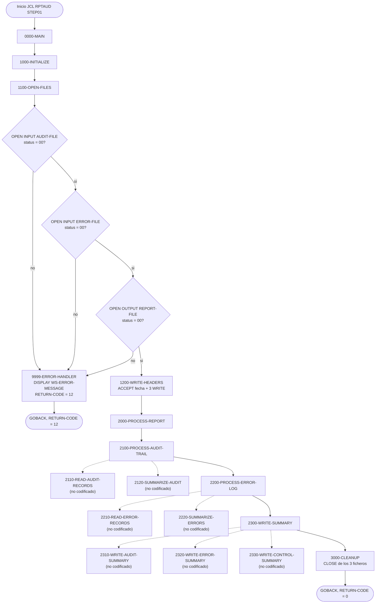
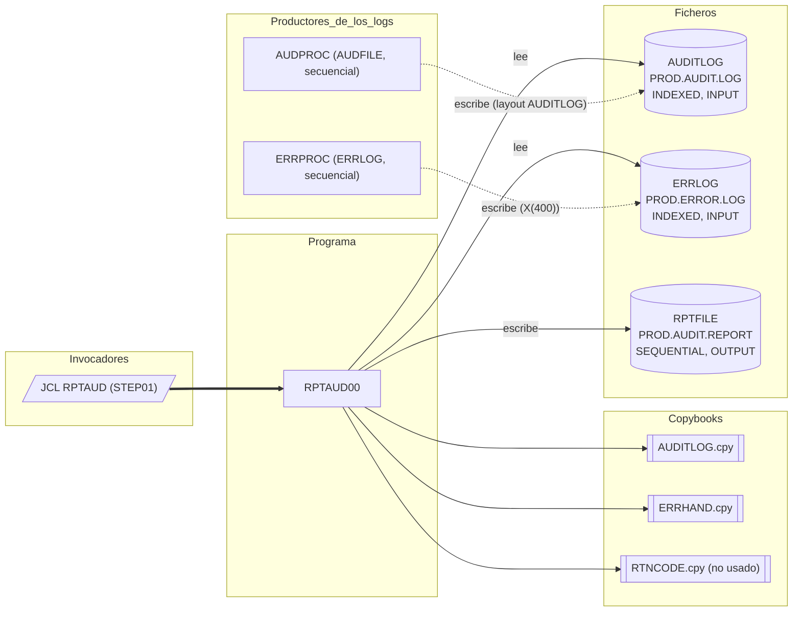

# RPTAUD00 — Generador del informe de auditoría del sistema

> Generado a partir del análisis del código fuente `src/programs/batch/RPTAUD00.cbl`. Ver el [grafo de dependencias global](../technical/dependency-graph.md).

## Ficha técnica
| Campo | Valor |
| --- | --- |
| Ruta | `src/programs/batch/RPTAUD00.cbl` |
| Categoría | batch |
| Tipo | batch |
| Líneas | 147 |
| Punto de entrada | JCL `RPTAUD` (`src/jcl/batch/RPTAUD.jcl`, paso `STEP01`, `EXEC PGM=RPTAUD00`) |
| Invocado por | `JCL:RPTAUD` (no hay ningún `CALL` ni `EXEC CICS LINK` a este programa en `src/`) |
| Invoca a | Ningún programa. Solo incluye los copybooks `AUDITLOG`, `ERRHAND` y `RTNCODE` y accede a los ficheros `AUDITLOG`, `ERRLOG` y `RPTFILE` |

## Propósito
`RPTAUD00` es el programa batch de la capa de *reporting* encargado de producir el **informe de auditoría del sistema** ("SYSTEM AUDIT REPORT"). Según la cabecera del propio fuente, debe consolidar en un único listado de 132 columnas la pista de auditoría de seguridad, la auditoría de procesos, un resumen de errores y una verificación de controles, a partir del log de auditoría (`AUDITLOG`) y del log de errores (`ERRLOG`) que alimentan otros componentes del sistema (`AUDPROC`, `ERRPROC`, `SECMGR`, etc.).

Encaja en el flujo batch de fin de día junto a `RPTPOS00` (informe de posiciones) y `RPTSTA00` (estadísticas del sistema), tal como describe `system-architecture.md` (§2.4 "Reporting Flow"). **Importante:** el código que existe en el repositorio es un esqueleto: abre los ficheros, escribe tres líneas de cabecera y cierra; la lectura de registros, la acumulación de totales y la escritura de los resúmenes se delegan a párrafos que **no están codificados** (ver [Observaciones](#observaciones-y-problemas-detectados)).

## Funcionamiento
Flujo de ejecución, párrafo por párrafo:

1. **`0000-MAIN`** — Párrafo principal. Ejecuta secuencialmente `1000-INITIALIZE`, `2000-PROCESS-REPORT` y `3000-CLEANUP` y termina con `GOBACK`. No hay lógica de restart ni recepción de parámetros (`PARM`).
2. **`1000-INITIALIZE`** — Encadena `1100-OPEN-FILES` y `1200-WRITE-HEADERS`.
3. **`1100-OPEN-FILES`** — Abre los tres ficheros en este orden:
   - `OPEN INPUT AUDIT-FILE` (DD `AUDITLOG`); si `WS-AUDIT-STATUS` ≠ `'00'` mueve el literal `'ERROR OPENING AUDIT FILE'` a `WS-ERROR-MESSAGE` y ejecuta `9999-ERROR-HANDLER`.
   - `OPEN INPUT ERROR-FILE` (DD `ERRLOG`); misma comprobación sobre `WS-ERROR-STATUS` con el mensaje `'ERROR OPENING ERROR FILE'`.
   - `OPEN OUTPUT REPORT-FILE` (DD `RPTFILE`); misma comprobación sobre `WS-REPORT-STATUS` con el mensaje `'ERROR OPENING REPORT FILE'`.
   
   Como `9999-ERROR-HANDLER` acaba en `GOBACK`, cualquier fallo de apertura termina el programa inmediatamente; los `IF` posteriores nunca se evalúan.
4. **`1200-WRITE-HEADERS`** — Obtiene la fecha del sistema con `ACCEPT WS-REPORT-DATE FROM DATE` y escribe tres registros en `REPORT-FILE` mediante `WRITE REPORT-RECORD FROM ...`:
   - `WS-HEADER1`: línea de 132 asteriscos.
   - `WS-HEADER2`: el título `'SYSTEM AUDIT REPORT'` desplazado 40 posiciones (centrado aproximado).
   - `WS-HEADER3`: literal `'REPORT DATE:'` seguido de `WS-REPORT-DATE`.
   
   No se comprueba `WS-REPORT-STATUS` después de los `WRITE`.
5. **`2000-PROCESS-REPORT`** — Orquesta el cuerpo del informe: `2100-PROCESS-AUDIT-TRAIL`, `2200-PROCESS-ERROR-LOG` y `2300-WRITE-SUMMARY`.
6. **`2100-PROCESS-AUDIT-TRAIL`** — Ejecuta `2110-READ-AUDIT-RECORDS` y `2120-SUMMARIZE-AUDIT`. **Ninguno de los dos párrafos existe en el fuente.** La intención (inferida por el nombre y la cabecera del programa) es recorrer secuencialmente `AUDIT-FILE` y acumular totales por tipo/acción/estado de auditoría.
7. **`2200-PROCESS-ERROR-LOG`** — Ejecuta `2210-READ-ERROR-RECORDS` y `2220-SUMMARIZE-ERRORS`. **Tampoco existen.** Presumiblemente recorrerían `ERROR-FILE` acumulando errores por programa/categoría/código.
8. **`2300-WRITE-SUMMARY`** — Ejecuta `2310-WRITE-AUDIT-SUMMARY`, `2320-WRITE-ERROR-SUMMARY` y `2330-WRITE-CONTROL-SUMMARY`. **Ninguno está codificado.** Serían los párrafos que escribirían los bloques de resumen en `REPORT-FILE` (de ahí las áreas `WS-AUDIT-DETAIL` y `WS-ERROR-DETAIL`, definidas pero nunca usadas).
9. **`3000-CLEANUP`** — `CLOSE AUDIT-FILE ERROR-FILE REPORT-FILE` en una única sentencia, sin comprobar los FILE STATUS resultantes.
10. **`9999-ERROR-HANDLER`** — Rutina de error única: `DISPLAY WS-ERROR-MESSAGE`, `MOVE 12 TO RETURN-CODE` y `GOBACK`. No cierra los ficheros que ya estuvieran abiertos ni invoca a ninguna rutina común (`ERRPROC`, `DB2ERR`).

Las flechas discontinuas señalan `PERFORM` a párrafos inexistentes en el fuente.

## Interfaz
- **Parámetros / LINKAGE SECTION / COMMAREA**: No aplica. El programa no tiene `LINKAGE SECTION` ni `PROCEDURE DIVISION USING`; tampoco lee `PARM` del JCL.

- **Ficheros (DDNAME, organización, modo de apertura, clave)**:

| Fichero COBOL | DDNAME | Dataset (JCL `RPTAUD`) | Organización / acceso | Apertura | Clave (`RECORD KEY`) | FILE STATUS | Registro |
| --- | --- | --- | --- | --- | --- | --- | --- |
| `AUDIT-FILE` | `AUDITLOG` | `PROD.AUDIT.LOG` (`DISP=SHR`) | `INDEXED`, `ACCESS MODE IS SEQUENTIAL` | `INPUT` | `AUD-KEY` (**no definido** en el programa ni en `AUDITLOG.cpy`) | `WS-AUDIT-STATUS` | `AUDIT-RECORD` (copybook `AUDITLOG`, 392 bytes) |
| `ERROR-FILE` | `ERRLOG` | `PROD.ERROR.LOG` (`DISP=SHR`) | `INDEXED`, `ACCESS MODE IS SEQUENTIAL` | `INPUT` | `ERR-KEY` (**no definido** en el programa ni en `ERRHAND.cpy`) | `WS-ERROR-STATUS` | Copybook `ERRHAND` (varios niveles 01; el registro con datos sería `ERR-MESSAGE`, 370 bytes) |
| `REPORT-FILE` | `RPTFILE` | `PROD.AUDIT.REPORT` (`DISP=(NEW,CATLG,DELETE)`, `RECFM=FB`, `LRECL=132`) | `SEQUENTIAL`, `RECORDING MODE F`, `BLOCK CONTAINS 0` | `OUTPUT` | — | `WS-REPORT-STATUS` | `REPORT-RECORD PIC X(132)` |

  Los ficheros `AUDIT-FILE` y `ERROR-FILE` se declaran como KSDS (`INDEXED`), pero ni `vsam-definitions.txt` ni ningún JCL de IDCAMS del repositorio los define; solo se documentan `PORTMSTR`, `TRANHIST` y `POSHIST`. La longitud `LRECL=132` del JCL coincide con `REPORT-RECORD`.

- **Tablas DB2 y sentencias SQL**: No aplica. El programa no contiene `EXEC SQL`, no incluye `SQLCA` y el JCL no ejecuta bajo `IKJEFT01`/DSN (a diferencia de lo que indica `system-architecture.md`, ver Observaciones).

- **Mapas BMS / comandos CICS**: No aplica (programa batch puro).

- **Códigos de retorno / RETURN-CODE**:

| Valor | Cuándo |
| --- | --- |
| `0` | Ejecución completa hasta `3000-CLEANUP` y `GOBACK` en `0000-MAIN` (el registro especial `RETURN-CODE` no se modifica, por lo que conserva su valor inicial 0). |
| `12` | Fallo en cualquiera de los tres `OPEN` de `1100-OPEN-FILES` (`FILE STATUS` ≠ `'00'`); lo fija `9999-ERROR-HANDLER` justo antes del `GOBACK`. |

  No se generan otros valores (4, 8, 16) aunque `ERRHAND` (`ERR-WARNING`, `ERR-ERROR`, `ERR-SEVERE`, `ERR-TERMINAL`) y `RTNCODE` los prevén. Un ABEND (p. ej. por FILE STATUS no comprobado tras un `WRITE`/`CLOSE`) no está contemplado en el código.

## Estructuras de datos clave

### Copybooks
| Copybook | Sección donde se incluye | Qué aporta a `RPTAUD00` |
| --- | --- | --- |
| `AUDITLOG` (`src/copybook/common/AUDITLOG.cpy`) | `FILE SECTION` (tras el `SELECT` de `AUDIT-FILE`) | Estructura `AUDIT-RECORD`: cabecera `AUD-HEADER` (`AUD-TIMESTAMP` X(26), `AUD-SYSTEM-ID`, `AUD-USER-ID`, `AUD-PROGRAM`, `AUD-TERMINAL`), `AUD-TYPE` (88: `TRAN`/`USER`/`SYST`), `AUD-ACTION` (88: `CREATE`, `UPDATE`, `DELETE`, `INQUIRE`, `LOGIN`, `LOGOUT`, `STARTUP`, `SHUTDOWN`), `AUD-STATUS` (88: `SUCC`/`FAIL`/`WARN`), `AUD-KEY-INFO` (`AUD-PORTFOLIO-ID`, `AUD-ACCOUNT-NO`), imágenes antes/después y `AUD-MESSAGE`. Es el mismo layout que escribe `AUDPROC`. Se incluye **sin** una sentencia `FD AUDIT-FILE` previa. |
| `ERRHAND` (`src/copybook/common/ERRHAND.cpy`) | `FILE SECTION` (tras `COPY AUDITLOG`) | Cinco registros de nivel 01 pensados para WORKING-STORAGE: `ERR-CATEGORIES` (`VS`, `VL`, `PR`, `SY`), `ERR-RETURN-CODES` (0/4/8/12/16), `ERR-MESSAGE` (timestamp, programa, categoría, código, severidad, `ERR-TEXT` X(80), `ERR-DETAILS` X(256)), `ERR-VSAM-STATUSES` (`00`, `22`, `23`, `10`) y `ERR-VSAM-MSGS`. Todos llevan cláusulas `VALUE`. Se incluye **sin** `FD ERROR-FILE` previo. En el resto del sistema este copybook se usa en WORKING-STORAGE (p. ej. `ERRPROC`, `RPTSTA00`). |
| `RTNCODE` (`src/copybook/common/RTNCODE.cpy`) | `WORKING-STORAGE SECTION` | Área `RETURN-CODE-AREA` (`RC-REQUEST-TYPE` con 88 `I/S/G/L/A`, `RC-PROGRAM-ID`, `RC-CURRENT-CODE`, `RC-HIGHEST-CODE`, `RC-STATUS` `S/W/E/F`, `RC-MESSAGE`, datos de análisis). Es la interfaz de la rutina `RTNCDE00`; **`RPTAUD00` no referencia ningún campo de esta área**. |

### WORKING-STORAGE propia
| Campo | Definición | Uso |
| --- | --- | --- |
| `WS-FILE-STATUS` → `WS-AUDIT-STATUS`, `WS-ERROR-STATUS`, `WS-REPORT-STATUS` | `PIC XX` cada uno | FILE STATUS de los tres ficheros; solo se consultan tras los `OPEN`. |
| `WS-REPORT-HEADERS` → `WS-HEADER1` | X(132) `VALUE ALL '*'` | Línea separadora del informe. |
| `WS-HEADER2` | 40 espacios + X(52) `'SYSTEM AUDIT REPORT'` + 40 espacios (= 132) | Título. |
| `WS-HEADER3` → `WS-REPORT-DATE` | X(15) `'REPORT DATE:'` + `WS-REPORT-DATE` X(10) + X(107) espacios (= 132) | Fecha del informe; se rellena con `ACCEPT ... FROM DATE`, que devuelve 6 caracteres `AAMMDD` (quedan 4 espacios a la derecha y el año es de dos dígitos). |
| `WS-AUDIT-DETAIL` | `WS-AUD-TIMESTAMP` X(26), `WS-AUD-PROGRAM` X(8), `WS-AUD-TYPE` X(10), `WS-AUD-MESSAGE` X(80) + separadores (130 bytes) | Línea de detalle de auditoría. **Definida pero nunca utilizada.** |
| `WS-ERROR-DETAIL` | `WS-ERR-TIMESTAMP` X(26), `WS-ERR-PROGRAM` X(8), `WS-ERR-CODE` X(4), `WS-ERR-MESSAGE` X(80) + separadores (124 bytes) | Línea de detalle de errores. **Definida pero nunca utilizada.** |
| `WS-ERROR-MESSAGE` | **No definida** | Receptor de los mensajes de error de `1100-OPEN-FILES` y operando del `DISPLAY` en `9999-ERROR-HANDLER`. |

No existen contadores, acumuladores, umbrales de commit, indicadores de fin de fichero ni áreas de checkpoint: el programa no tiene ningún bucle de lectura.

## Reglas de negocio y validaciones
El código implementado contiene únicamente reglas técnicas, no de negocio:

1. **Orden de apertura y parada temprana**: los ficheros se abren en el orden `AUDITLOG` → `ERRLOG` → `RPTFILE`; el primer `FILE STATUS` distinto de `'00'` aborta la ejecución con `RETURN-CODE` 12 y un mensaje fijo en `SYSOUT`.
2. **Cabecera fija del informe**: siempre se escriben exactamente tres líneas de cabecera (asteriscos, título, fecha) antes de cualquier detalle, con formato de 132 columnas.
3. **Fecha del informe = fecha del sistema** en el momento de la ejecución (`ACCEPT FROM DATE`, formato `AAMMDD`); no se recibe como parámetro ni se toma del fichero de control batch.
4. **Sin filtros ni selección**: no se aplican criterios de fecha, tipo de evento (`AUD-TYPE`), estado (`AUD-STATUS`) ni severidad (`ERR-SEVERITY`); los 88 de `AUDITLOG` y `ERRHAND` están disponibles pero no se evalúan (no hay ningún `EVALUATE`/`IF` sobre ellos).

Las reglas funcionales anunciadas en la cabecera del fuente y en `development-backlog.md` (pista de auditoría de seguridad, auditoría de procesos, resumen de errores, verificación de controles) corresponderían a los párrafos `21xx`/`22xx`/`23xx`, que no están codificados; por tanto **no hay ninguna regla de negocio verificable en el código**.

## Manejo de errores y recuperación
- **FILE STATUS**: se comprueba únicamente tras los tres `OPEN` de `1100-OPEN-FILES`. No se comprueba tras los `WRITE` de `1200-WRITE-HEADERS` ni tras el `CLOSE` de `3000-CLEANUP`; un fallo de escritura en `RPTFILE` (p. ej. `'34'` espacio agotado) pasaría inadvertido y el job terminaría con `RETURN-CODE` 0.
- **Rutina de error `9999-ERROR-HANDLER`**: `DISPLAY WS-ERROR-MESSAGE` (a `SYSOUT`), `MOVE 12 TO RETURN-CODE`, `GOBACK`. El texto no incluye el valor del FILE STATUS, lo que dificulta el diagnóstico. No se cierran explícitamente los ficheros ya abiertos (el runtime los cierra al finalizar la unidad de ejecución).
- **Rutinas comunes**: no se llama a `ERRPROC`, `DB2ERR`, `ERRHNDL` ni `RTNCDE00`, aunque se incluyen `ERRHAND` y `RTNCODE`. Las constantes `ERR-VSAM-*` y `ERR-RETURN-CODES` no se utilizan.
- **SQLCODE / condiciones CICS**: no aplica (sin DB2 ni CICS).
- **Checkpoint / restart / rollback**: no implementado. Al ser un programa de solo lectura sobre los logs y de generación de un dataset nuevo (`DISP=(NEW,CATLG,DELETE)`), la recuperación consistiría simplemente en relanzar el job; el JCL borra el informe si el paso falla.

## Dependencias

Las relaciones discontinuas con `AUDPROC` y `ERRPROC` son una inferencia: son los programas del repositorio que escriben registros con DDNAME/copybook equivalentes, pero no hay ningún JCL que encadene su salida con la entrada de `RPTAUD00` (los DSN difieren: `PORTFOLIO.AUDIT.FILE` en `PORTDEL.jcl` frente a `PROD.AUDIT.LOG` aquí).

## Observaciones y problemas detectados

### Errores que impiden compilar (según el código tal cual está)
1. **Siete párrafos referenciados por `PERFORM` no existen**: `2110-READ-AUDIT-RECORDS`, `2120-SUMMARIZE-AUDIT`, `2210-READ-ERROR-RECORDS`, `2220-SUMMARIZE-ERRORS`, `2310-WRITE-AUDIT-SUMMARY`, `2320-WRITE-ERROR-SUMMARY` y `2330-WRITE-CONTROL-SUMMARY`. Todo el cuerpo funcional del informe (lectura, totalización y resúmenes) está sin implementar; el programa solo produce la cabecera.
2. **`WS-ERROR-MESSAGE` no está definida** en WORKING-STORAGE (se usa en `1100-OPEN-FILES` y `9999-ERROR-HANDLER`). El mismo patrón se repite en `RPTPOS00` y `RPTSTA00`.
3. **`RECORD KEY IS AUD-KEY` y `RECORD KEY IS ERR-KEY` apuntan a campos inexistentes**: `AUDITLOG.cpy` define `AUD-KEY-INFO` (no `AUD-KEY`) y `ERRHAND.cpy` no define ninguna clave. Además, en un KSDS la clave debe ser un campo del propio registro del fichero.
4. **`COPY AUDITLOG` y `COPY ERRHAND` en la `FILE SECTION` sin sentencia `FD`**: los `SELECT AUDIT-FILE` y `SELECT ERROR-FILE` no tienen su `FD` correspondiente y los niveles 01 de los copybooks quedan fuera de cualquier descripción de fichero. Compárese con `AUDPROC`, que sí codifica `FD AUDIT-FILE` antes de `COPY AUDITLOG`.
5. **`ERRHAND` no es un layout de registro**: contiene cinco niveles 01 con cláusulas `VALUE` (constantes de categorías, códigos de retorno, mensajes VSAM). Las cláusulas `VALUE` en la `FILE SECTION` no están permitidas salvo en condition-names (nivel 88) según la referencia de Enterprise COBOL, y en cualquier caso el área de registro de un fichero de entrada se sobrescribe con cada `READ`. Probablemente el copybook debía ir en WORKING-STORAGE (como en `RPTSTA00` o `ERRPROC`) y el registro de `ERROR-FILE` debía definirse aparte.

### Inconsistencias con el resto del sistema
6. **Organización de los ficheros de entrada incompatible con sus productores**: `RPTAUD00` declara `AUDITLOG` y `ERRLOG` como `INDEXED` (KSDS), mientras que `AUDPROC` escribe su fichero de auditoría como `SEQUENTIAL` (`OPEN EXTEND`, registro `AUDIT-RECORD` de 392 bytes) y `ERRPROC` escribe `ERRLOG` como `SEQUENTIAL` con registros `PIC X(400)`. Ni `AUDITLOG` ni `ERRLOG` aparecen en `vsam-definitions.txt` ni en ningún IDCAMS del repositorio. Además, `ERRLOG` es también el nombre de una tabla DB2 (`src/database/db2/ERRLOG.sql`) utilizada por `DB2ERR` y `ERRHNDL`, y `AUDITLOG` es el nombre de una tabla DB2 sin DDL en la que inserta `SECMGR`: el sistema tiene tres representaciones distintas del log de errores/auditoría (VSAM KSDS, fichero secuencial y tabla DB2) y este programa solo podría leer la primera.
7. **Discrepancia con `system-architecture.md`**: la tabla §5.1.1 indica que `RPTAUD00` depende de `DB2CONN` y `ERRPROC` y accede a DB2 en modo lectura, y el diagrama §2.4 muestra que lee "Audit Data" desde DB2 y la "Transaction History". El código no contiene `EXEC SQL`, no hace `CALL` a ningún programa y no abre `TRANHIST`; el JCL tampoco ejecuta bajo TSO/DSN. Manda el código: `RPTAUD00` es hoy un programa VSAM/QSAM puro sin dependencias de programa.
8. **`development-backlog.md` marca como completadas** las cuatro funciones del informe de auditoría (security audit trails, process audit reporting, error summary reporting, control verification), pero ninguna está implementada.
9. **Grafo de dependencias**: `dependency-graph.md` indica `Invocado por = JCL:RPTAUD` y sin `CALL`, lo que coincide con el código. Los párrafos listados en el grafo (10) son solo los definidos; los 7 párrafos invocados y no definidos no aparecen porque no existen.

### Defectos menores / calidad
10. `ACCEPT WS-REPORT-DATE FROM DATE` devuelve `AAMMDD` (6 caracteres, año de dos dígitos) en un campo `X(10)`; el resultado es una fecha sin formato y con 4 espacios de relleno. Lo habitual sería `ACCEPT ... FROM DATE YYYYMMDD` y un formateo a `AAAA-MM-DD`.
11. No se comprueba el `FILE STATUS` tras los `WRITE` de cabecera ni tras el `CLOSE`.
12. `9999-ERROR-HANDLER` no incluye el código de `FILE STATUS` en el mensaje y no cierra los ficheros ya abiertos.
13. El copybook `RTNCODE` se incluye pero no se usa; el programa fija directamente el registro especial `RETURN-CODE` en lugar de usar la rutina `RTNCDE00`.
14. `WS-AUDIT-DETAIL` y `WS-ERROR-DETAIL` están definidas pero no se referencian. Además, `WS-AUD-TYPE` es `X(10)` mientras que `AUD-TYPE` en el copybook es `X(4)`, y ambas líneas de detalle (130 y 124 bytes) no rellenan las 132 columnas del `REPORT-RECORD`.
15. El nombre del job en `RPTAUD.jcl` es `RPTAUD00` (igual que el programa), mientras que el fichero JCL y el resto de jobs del repositorio usan el nombre corto sin sufijo (`RPTPOS`, `RPTSTA`); cuestión de estilo, sin impacto funcional.
16. La cabecera indica `AUTHOR. CLAUDE.` y `DATE-WRITTEN. 2024-04-09`, posterior a la fecha de los copybooks (2024-03-20); dato meramente informativo.

## Referencias
- Programa: [RPTAUD00.cbl](../../src/programs/batch/RPTAUD00.cbl)
- JCL: [RPTAUD.jcl](../../src/jcl/batch/RPTAUD.jcl)
- Copybooks:
  - [AUDITLOG.cpy](../../src/copybook/common/AUDITLOG.cpy)
  - [ERRHAND.cpy](../../src/copybook/common/ERRHAND.cpy)
  - [RTNCODE.cpy](../../src/copybook/common/RTNCODE.cpy)
- Definiciones VSAM (no incluyen `AUDITLOG` ni `ERRLOG`): [vsam-definitions.txt](../../src/database/vsam/vsam-definitions.txt)
- Programas relacionados (productores de los logs): [AUDPROC.cbl](../../src/programs/common/AUDPROC.cbl), [ERRPROC.cbl](../../src/programs/common/ERRPROC.cbl), [SECMGR.cbl](../../src/programs/online/SECMGR.cbl)
- DDL homónimo en DB2: [ERRLOG.sql](../../src/database/db2/ERRLOG.sql)
- Programas hermanos de la capa de reporting: [RPTPOS00.cbl](../../src/programs/batch/RPTPOS00.cbl), [RPTSTA00.cbl](../../src/programs/batch/RPTSTA00.cbl)
- Documentación: [system-architecture.md](../technical/system-architecture.md), [data-dictionary.md](../technical/data-dictionary.md), [development-backlog.md](../technical/development-backlog.md), [dependency-graph.md](../technical/dependency-graph.md)
