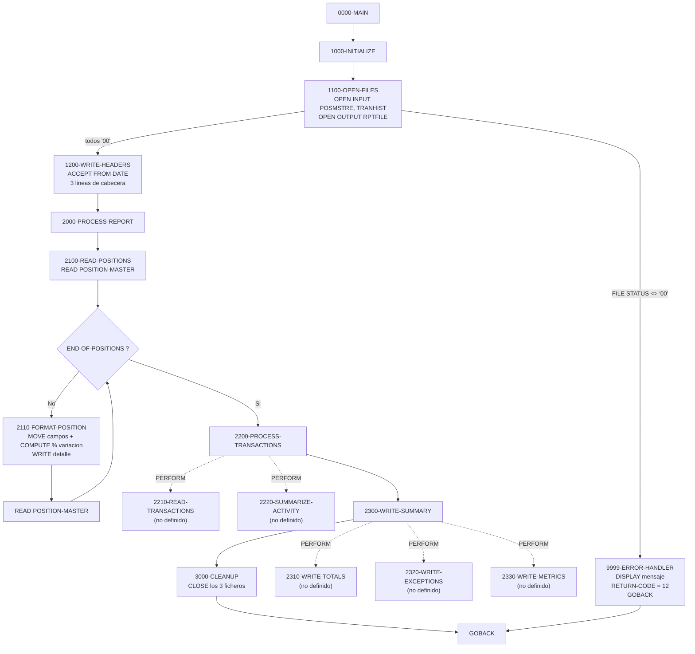
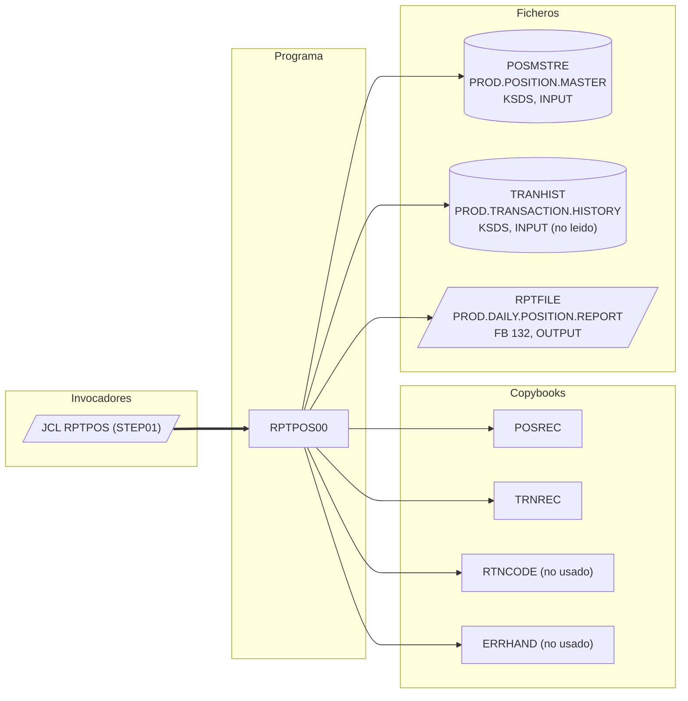

# RPTPOS00 — Generador del informe diario de posiciones

> Generado a partir del análisis del código fuente `src/programs/batch/RPTPOS00.cbl`. Ver el [grafo de dependencias global](../technical/dependency-graph.md).

## Ficha técnica
| Campo | Valor |
| --- | --- |
| Ruta | `src/programs/batch/RPTPOS00.cbl` |
| Categoría | batch |
| Tipo | batch |
| Líneas | 160 |
| Punto de entrada | JCL `RPTPOS` (`src/jcl/batch/RPTPOS.jcl`, paso `STEP01`, `EXEC PGM=RPTPOS00`) |
| Invocado por | `JCL:RPTPOS` (ningún programa lo invoca por `CALL` ni `EXEC CICS LINK`) |
| Invoca a | Ningún programa (sin `CALL`, sin `EXEC CICS`, sin SQL). Solo `COPY` de `POSREC`, `TRNREC`, `RTNCODE` y `ERRHAND` |

## Propósito
`RPTPOS00` es el programa batch encargado de producir el **informe diario de posiciones** (`DAILY POSITION REPORT`) del sistema de gestión de carteras: recorre secuencialmente el fichero maestro de posiciones (`POSMSTRE`) y escribe una línea de detalle por posición (cartera, descripción, cantidad, valor actual y variación porcentual) en un fichero de informe de 132 columnas (`RPTFILE`). Según su cabecera y `system-architecture.md`, también debería incorporar la actividad de transacciones (`TRANHIST`), un apartado de excepciones y métricas de rendimiento, pero esas partes **no están implementadas**: el programa abre el histórico de transacciones sin leerlo nunca y los párrafos de resumen a los que hace `PERFORM` no existen en el fuente. Dentro del flujo batch se sitúa en la fase de *reporting* posterior a la actualización de posiciones (`POSUPDT`/`HISTLD00`), como programa de solo lectura sobre los ficheros VSAM y sin acceso a DB2.

## Funcionamiento

El programa sigue la estructura clásica inicialización → proceso → cierre, con un manejador de errores único (`9999-ERROR-HANDLER`) que aborta la ejecución con `RETURN-CODE = 12`.

1. **`0000-MAIN`** — Ejecuta en secuencia `1000-INITIALIZE`, `2000-PROCESS-REPORT` y `3000-CLEANUP`, y termina con `GOBACK`.
2. **`1000-INITIALIZE`** — Encadena `1100-OPEN-FILES` y `1200-WRITE-HEADERS`.
3. **`1100-OPEN-FILES`** — Abre los tres ficheros y comprueba el `FILE STATUS` de cada `OPEN`:
   - `OPEN INPUT POSITION-MASTER` → si `WS-POSITION-STATUS ≠ '00'`, mensaje `ERROR OPENING POSITION MASTER` y `PERFORM 9999-ERROR-HANDLER`.
   - `OPEN INPUT TRANSACTION-HISTORY` → si `WS-TRAN-STATUS ≠ '00'`, mensaje `ERROR OPENING TRANSACTION HISTORY` y error.
   - `OPEN OUTPUT REPORT-FILE` → si `WS-REPORT-STATUS ≠ '00'`, mensaje `ERROR OPENING REPORT FILE` y error.
4. **`1200-WRITE-HEADERS`** — Obtiene la fecha del sistema con `ACCEPT WS-REPORT-DATE FROM DATE` (formato `YYMMDD`, 6 caracteres, sobre un campo `PIC X(10)`) y escribe tres líneas de cabecera en `REPORT-FILE`:
   - `WS-HEADER1`: 132 asteriscos.
   - `WS-HEADER2`: el literal `DAILY POSITION REPORT` centrado (40 espacios + 52 de texto + 40 espacios).
   - `WS-HEADER3`: `REPORT DATE:` seguido de `WS-REPORT-DATE`.
   No se comprueba el `FILE STATUS` de estas escrituras.
5. **`2000-PROCESS-REPORT`** — Encadena `2100-READ-POSITIONS`, `2200-PROCESS-TRANSACTIONS` y `2300-WRITE-SUMMARY`.
6. **`2100-READ-POSITIONS`** — Lectura secuencial completa del maestro de posiciones con el patrón *read-ahead*: un `READ POSITION-MASTER` inicial con `AT END SET END-OF-POSITIONS TO TRUE`, y después `PERFORM UNTIL END-OF-POSITIONS` que ejecuta `2110-FORMAT-POSITION` y vuelve a leer. Es el único bucle de proceso del programa.
7. **`2110-FORMAT-POSITION`** — Formatea una línea de detalle (`WS-POSITION-DETAIL`) a partir del registro leído y la escribe en el informe:
   - `POS-PORTFOLIO-ID` → `WS-POS-PORTFOLIO` (`PIC X(10)`).
   - `POS-DESCRIPTION` → `WS-POS-DESCRIPTION` (`PIC X(30)`).
   - `POS-QUANTITY` → `WS-POS-QUANTITY` (`PIC ZZZ,ZZZ,ZZ9.99`, edición numérica con supresión de ceros).
   - `POS-CURRENT-VALUE` → `WS-POS-VALUE` (`PIC $$$$,$$$,$$9.99`, símbolo de moneda flotante).
   - `COMPUTE WS-POS-CHANGE-PCT = (POS-CURRENT-VALUE - POS-PREVIOUS-VALUE) / POS-PREVIOUS-VALUE * 100` → `PIC +ZZ9.99` (variación porcentual con signo).
   - `WRITE REPORT-RECORD FROM WS-POSITION-DETAIL`.
8. **`2200-PROCESS-TRANSACTIONS`** — Solo contiene `PERFORM 2210-READ-TRANSACTIONS` y `PERFORM 2220-SUMMARIZE-ACTIVITY`. **Ninguno de los dos párrafos existe** en el fuente.
9. **`2300-WRITE-SUMMARY`** — Solo contiene `PERFORM 2310-WRITE-TOTALS`, `PERFORM 2320-WRITE-EXCEPTIONS` y `PERFORM 2330-WRITE-METRICS`. **Ninguno de los tres párrafos existe** en el fuente.
10. **`3000-CLEANUP`** — `CLOSE POSITION-MASTER TRANSACTION-HISTORY REPORT-FILE` sin comprobar el `FILE STATUS`.
11. **`9999-ERROR-HANDLER`** — `DISPLAY WS-ERROR-MESSAGE`, `MOVE 12 TO RETURN-CODE` y `GOBACK`. Termina el programa inmediatamente sin cerrar los ficheros que ya estuvieran abiertos.

## Interfaz

- **Parámetros / LINKAGE SECTION / COMMAREA**: No aplica. El programa no tiene `LINKAGE SECTION` ni `PROCEDURE DIVISION USING`; no recibe `PARM` del JCL.

- **Ficheros (DDNAME, organización, modo de apertura, clave)**:

| Fichero COBOL | DDNAME | Dataset en `RPTPOS.jcl` | Organización / acceso | Modo | Clave declarada | FILE STATUS | Uso real |
| --- | --- | --- | --- | --- | --- | --- | --- |
| `POSITION-MASTER` | `POSMSTRE` | `PROD.POSITION.MASTER` (`DISP=SHR`) | `INDEXED`, `ACCESS MODE IS SEQUENTIAL` | `INPUT` | `RECORD KEY IS POS-KEY` (26 bytes: `POS-PORTFOLIO-ID` + `POS-DATE` + `POS-INVESTMENT-ID`) | `WS-POSITION-STATUS` | Se lee secuencialmente de principio a fin |
| `TRANSACTION-HISTORY` | `TRANHIST` | `PROD.TRANSACTION.HISTORY` (`DISP=SHR`) | `INDEXED`, `ACCESS MODE IS SEQUENTIAL` | `INPUT` | `RECORD KEY IS TRAN-KEY` (ver observaciones: el copybook define `TRN-KEY`) | `WS-TRAN-STATUS` | Se abre y se cierra, **nunca se lee** |
| `REPORT-FILE` | `RPTFILE` | `PROD.DAILY.POSITION.REPORT` (`DISP=(NEW,CATLG,DELETE)`, `RECFM=FB`, `LRECL=132`) | `SEQUENTIAL`, `RECORDING MODE F`, `BLOCK CONTAINS 0` | `OUTPUT` | — | `WS-REPORT-STATUS` | 3 cabeceras + 1 línea por posición |

- **Tablas DB2 y sentencias SQL**: No aplica. No hay `EXEC SQL` ni `SQLCA`.

- **Mapas BMS / comandos CICS**: No aplica. Es un programa batch puro.

- **Códigos de retorno / RETURN-CODE**:

| Valor | Cuándo |
| --- | --- |
| `0` | Finalización normal por `0000-MAIN` → `GOBACK` (el programa no asigna explícitamente `RETURN-CODE` en el camino feliz, por lo que queda en su valor inicial 0). |
| `12` | Cualquier `OPEN` con `FILE STATUS ≠ '00'` en `1100-OPEN-FILES`, vía `9999-ERROR-HANDLER`. Coincide con `ERR-SEVERE` (`+12`) de `ERRHAND` y con el código `0012 – Critical error` del `data-dictionary.md`, aunque el programa usa el literal `12` y no la constante. |

No se devuelven códigos `4` ni `8`; ningún error de `READ`, `WRITE` o `CLOSE` altera el `RETURN-CODE`.

## Estructuras de datos clave

### Copybooks
| Copybook | Sección | Aporta | Uso efectivo en el programa |
| --- | --- | --- | --- |
| `POSREC` (`src/copybook/common/POSREC.cpy`) | `FILE SECTION` | Registro `POSITION-RECORD`: `POS-KEY` (`POS-PORTFOLIO-ID X(8)`, `POS-DATE X(8)`, `POS-INVESTMENT-ID X(10)`), `POS-DATA` (`POS-QUANTITY S9(11)V9(4) COMP-3`, `POS-COST-BASIS`, `POS-MARKET-VALUE S9(13)V9(2) COMP-3`, `POS-CURRENCY`, `POS-STATUS` con 88 `A/C/P`), `POS-AUDIT`, `POS-FILLER X(50)` | Se usan `POS-KEY`, `POS-PORTFOLIO-ID` y `POS-QUANTITY`. El programa referencia además `POS-DESCRIPTION`, `POS-CURRENT-VALUE` y `POS-PREVIOUS-VALUE`, que **no existen** en el copybook |
| `TRNREC` (`src/copybook/common/TRNREC.cpy`) | `FILE SECTION` | Registro `TRANSACTION-RECORD`: `TRN-KEY` (`TRN-DATE`, `TRN-TIME`, `TRN-PORTFOLIO-ID`, `TRN-SEQUENCE-NO`; 28 bytes), `TRN-DATA` (`TRN-INVESTMENT-ID`, `TRN-TYPE` con 88 `BU/SL/TR/FE`, `TRN-QUANTITY`, `TRN-PRICE`, `TRN-AMOUNT`, `TRN-CURRENCY`, `TRN-STATUS` con 88 `P/D/F/R`), `TRN-AUDIT`, `TRN-FILLER` | Ningún campo se referencia en la `PROCEDURE DIVISION`. La cláusula `RECORD KEY IS TRAN-KEY` no coincide con `TRN-KEY` |
| `RTNCODE` (`src/copybook/common/RTNCODE.cpy`) | `WORKING-STORAGE` | `RETURN-CODE-AREA` (petición `I/S/G/L/A`, `RC-PROGRAM-ID`, `RC-CURRENT-CODE`, `RC-HIGHEST-CODE`, `RC-STATUS`, `RC-MESSAGE`, datos de análisis) para el gestor de códigos de retorno `RTNCDE00` | No se usa ningún campo; el programa manipula directamente el registro especial `RETURN-CODE` |
| `ERRHAND` (`src/copybook/common/ERRHAND.cpy`) | `WORKING-STORAGE` | Categorías de error (`ERR-CAT-VSAM`…), constantes de retorno (`ERR-SUCCESS`=0, `ERR-WARNING`=4, `ERR-ERROR`=8, `ERR-SEVERE`=12, `ERR-TERMINAL`=16), estructura `ERR-MESSAGE` (`ERR-TEXT X(80)`, `ERR-DETAILS X(256)`…), estados VSAM (`'00'`, `'10'`, `'22'`, `'23'`) y textos de error | No se usa ningún campo. El programa emplea `WS-ERROR-MESSAGE`, que **no está definido** ni en el copybook ni en el programa |

### WORKING-STORAGE propio
| Estructura / campo | Definición | Función |
| --- | --- | --- |
| `WS-FILE-STATUS` | `WS-POSITION-STATUS`, `WS-TRAN-STATUS`, `WS-REPORT-STATUS`, cada uno `PIC XX` | `FILE STATUS` de los tres ficheros; solo se consultan tras los `OPEN` |
| `WS-REPORT-HEADERS` | `WS-HEADER1` (132 × `'*'`), `WS-HEADER2` (`DAILY POSITION REPORT` centrado), `WS-HEADER3` (`REPORT DATE:` + `WS-REPORT-DATE PIC X(10)`) | Tres líneas de cabecera del informe, todas de 132 bytes |
| `WS-POSITION-DETAIL` | `WS-POS-PORTFOLIO X(10)`, `WS-POS-DESCRIPTION X(30)`, `WS-POS-QUANTITY ZZZ,ZZZ,ZZ9.99`, `WS-POS-VALUE $$$$,$$$,$$9.99`, `WS-POS-CHANGE-PCT +ZZ9.99`, separadores de 2 espacios y relleno final de 40 | Línea de detalle por posición (125 bytes; `WRITE ... FROM` rellena hasta 132 con espacios) |
| `REPORT-RECORD` | `PIC X(132)` (en `FD REPORT-FILE`) | Buffer de salida del informe |

No hay contadores de registros, acumuladores de totales, flags de fin de fichero definidos (`END-OF-POSITIONS` se usa pero no se declara), ni umbrales de checkpoint/commit: el programa no participa en el marco de checkpoint/restart (`CKPRST`/`BCHCTL`).

## Reglas de negocio y validaciones

Las reglas realmente implementadas en el código son pocas:

1. **Cobertura total del maestro**: se listan *todas* las posiciones de `POSMSTRE` en orden de clave (`POS-PORTFOLIO-ID`, `POS-DATE`, `POS-INVESTMENT-ID`), sin filtrar por `POS-STATUS` (activa/cerrada/pendiente), por fecha de posición ni por cartera. No se utilizan las condiciones 88 `POS-STATUS-ACTIVE`/`CLOSED`/`PEND`.
2. **Cálculo de variación porcentual** (`2110-FORMAT-POSITION`):
   `WS-POS-CHANGE-PCT = (POS-CURRENT-VALUE − POS-PREVIOUS-VALUE) / POS-PREVIOUS-VALUE × 100`, editado como `+ZZ9.99` (rango representable −999,99 % a +999,99 %; valores mayores se truncan por la izquierda al no haber `ON SIZE ERROR`). No hay protección frente a `POS-PREVIOUS-VALUE = 0` (división por cero → abend o resultado indefinido según opciones de compilación).
3. **Formato del informe**: 132 columnas, tres líneas de cabecera y una línea por posición; la fecha de informe se toma del sistema (`ACCEPT ... FROM DATE`, `YYMMDD`), no de los datos.
4. **Condición de abort**: cualquier fallo al abrir un fichero (`FILE STATUS ≠ '00'`) detiene el trabajo con `RETURN-CODE 12`.

Reglas **anunciadas pero no implementadas** (comentario de cabecera, `development-backlog.md` y `system-architecture.md`): resumen de actividad de transacciones, informe de excepciones, métricas de rendimiento, totales y "reconciliación de posiciones". No hay ningún `EVALUATE` sobre `TRN-TYPE` ni tratamiento de tipos de transacción.

## Manejo de errores y recuperación

- **Errores de fichero (`FILE STATUS`)**: solo se comprueban los tres `OPEN`. Ante `FILE STATUS ≠ '00'` se mueve un literal descriptivo a `WS-ERROR-MESSAGE` y se ejecuta `9999-ERROR-HANDLER`, que hace `DISPLAY` del mensaje (a `SYSOUT`), fija `RETURN-CODE = 12` y `GOBACK`. Los `READ` de `POSITION-MASTER` solo tratan `AT END`; cualquier otro estado (p. ej. `'23'`, `'30'`, `'9x'`) no se detecta y el bucle continuaría con el último registro en memoria hasta que se produzca `AT END`. Los `WRITE` a `REPORT-FILE` y los `CLOSE` no comprueban estado.
- **Cierre de ficheros en error**: `9999-ERROR-HANDLER` no cierra los ficheros ya abiertos (por ejemplo, si falla el `OPEN` de `RPTFILE`, `POSMSTRE` y `TRANHIST` quedan abiertos hasta que el *run-time* los cierre al finalizar el paso).
- **SQLCODE / DB2**: No aplica; el programa no accede a DB2 (a pesar de que `system-architecture.md` §5.1.1 lo lista con dependencia de `DB2CONN`).
- **Condiciones CICS**: No aplica.
- **Checkpoint / restart / rollback**: No implementados. El programa no usa `CKPRST`, `BCHCTL` ni ningún mecanismo de reinicio; al ser de solo lectura sobre VSAM y escribir un dataset nuevo (`DISP=(NEW,CATLG,DELETE)`), la recuperación consiste en relanzar el job (el `DELETE` condicional del JCL elimina el informe parcial si el paso abenda). Esto es coherente con `data-dictionary.md` §8.1, donde el proceso de informes (`RPTGEN00`) figura con `Restart = No`.
- **Rutinas de error comunes**: no se invoca `ERRPROC`, `ERRHNDL` ni `DB2ERR`, ni se rellena la estructura `ERR-MESSAGE` de `ERRHAND`, ni se usa `RTNCDE00`/`RETURN-CODE-AREA`. El tratamiento de errores es local y mínimo.

## Dependencias

No hay programas invocados (`CALL`/`LINK`), tablas DB2 ni mapas BMS. Los datasets `PROD.POSITION.MASTER` y `PROD.TRANSACTION.HISTORY` se comparten (`DISP=SHR`) con otros programas que declaran los mismos DDNAMEs (`UTLVAL00` usa `POSMSTRE` y `TRANHIST`; `INQPORT` incluye `POSREC`).

## Observaciones y problemas detectados

El programa, tal y como está en el repositorio, **no compilaría**: contiene varias referencias a párrafos y campos que no están definidos. Es un esqueleto incompleto pese a que `development-backlog.md` marca sus cuatro funcionalidades como completadas.

### Errores de compilación (referencias sin resolver)
1. **Párrafos inexistentes**: `2200-PROCESS-TRANSACTIONS` hace `PERFORM` de `2210-READ-TRANSACTIONS` y `2220-SUMMARIZE-ACTIVITY`; `2300-WRITE-SUMMARY` hace `PERFORM` de `2310-WRITE-TOTALS`, `2320-WRITE-EXCEPTIONS` y `2330-WRITE-METRICS`. Ninguno de los cinco párrafos está codificado (el mismo patrón se repite en `RPTAUD00` y `RPTSTA00`).
2. **Flag `END-OF-POSITIONS` no declarado**: se usa en `SET END-OF-POSITIONS TO TRUE` y `PERFORM UNTIL END-OF-POSITIONS` pero no existe ningún nivel 88 con ese nombre en `WORKING-STORAGE`.
3. **`WS-ERROR-MESSAGE` no declarado**: se usa en `1100-OPEN-FILES` y `9999-ERROR-HANDLER`, pero ni el programa ni `ERRHAND` (que define `ERR-TEXT`/`ERR-MESSAGE`) lo definen. Mismo defecto en `RPTAUD00`, `RPTSTA00`, `UTLVAL00`, `TSTGEN00`, etc.
4. **Campos inexistentes en `POSREC`**: `2110-FORMAT-POSITION` referencia `POS-DESCRIPTION`, `POS-CURRENT-VALUE` y `POS-PREVIOUS-VALUE`. `POSREC.cpy` solo ofrece `POS-QUANTITY`, `POS-COST-BASIS`, `POS-MARKET-VALUE`, `POS-CURRENCY`, `POS-STATUS` y campos de auditoría; no hay descripción ni valor anterior. Probablemente la intención era usar `POS-MARKET-VALUE` como valor actual, pero el valor previo no está disponible en el registro (no puede calcularse la variación diaria sin leer la posición del día anterior, que sí existe como clave `POS-DATE`).
5. **Clave `TRAN-KEY` vs `TRN-KEY`**: el `SELECT TRANSACTION-HISTORY` declara `RECORD KEY IS TRAN-KEY`, mientras que `TRNREC.cpy` define el grupo como `TRN-KEY`. `TRAN-KEY` no existe (el mismo error aparece en `UTLVAL00`).
6. **Falta el `FD` de los ficheros VSAM**: en la `FILE SECTION` se hace `COPY POSREC` y `COPY TRNREC` directamente, sin las sentencias `FD POSITION-MASTER` / `FD TRANSACTION-HISTORY` que deben preceder a los registros nivel 01. Los copybooks solo contienen el nivel 01, así que los registros quedan sin asociar a los ficheros del `SELECT` y la cláusula `RECORD KEY IS POS-KEY` no puede resolverse dentro del `FD` correspondiente.

### Lógica incompleta o incorrecta
7. `TRANSACTION-HISTORY` se abre y se cierra pero **nunca se lee**; toda la parte de "Transaction activity", "Exception reporting" y "Performance metrics" anunciada en el comentario de cabecera es inexistente.
8. **División por cero** potencial en el `COMPUTE` de `WS-POS-CHANGE-PCT` cuando `POS-PREVIOUS-VALUE = 0` (posición nueva); no hay `ON SIZE ERROR` ni comprobación previa.
9. **Fecha de informe mal formateada**: `ACCEPT ... FROM DATE` devuelve `YYMMDD` (6 posiciones, año de dos dígitos) que se mueve a `WS-REPORT-DATE PIC X(10)`; el informe muestra p. ej. `REPORT DATE:240409` sin separadores ni siglo. Sería más apropiado `FROM DATE YYYYMMDD` y un formateo posterior.
10. **Truncamiento/relleno de identificador**: `POS-PORTFOLIO-ID` es `X(8)` y se mueve a `WS-POS-PORTFOLIO X(10)`; inocuo, pero indica que el layout del informe se diseñó para otro registro de posición (posiblemente el de `data-dictionary.md`, que tampoco coincide con `POSREC`).
11. **Errores de lectura no controlados**: los `READ` solo gestionan `AT END`; un `FILE STATUS` distinto de `'00'`/`'10'` no se detecta. Los `WRITE` y `CLOSE` tampoco comprueban estado.
12. `9999-ERROR-HANDLER` hace `GOBACK` sin cerrar ficheros abiertos.
13. Los copybooks `RTNCODE` y `ERRHAND` se incluyen pero **no se usa ningún campo** de ellos; el código de retorno se fija con el literal `12` en lugar de `ERR-SEVERE`, y no se integra con `RTNCDE00`.
14. Sin filtrado por `POS-STATUS` ni por `POS-DATE`: el "informe diario" lista todas las posiciones históricas del maestro (la clave incluye la fecha), no solo las del día.

### Discrepancias con la documentación técnica
15. `system-architecture.md` §5.1.1 indica que `RPTPOS00` depende de `DB2CONN` y `ERRPROC` y tiene acceso DB2 de lectura; el código no tiene `EXEC SQL`, ni `CALL` a `DB2CONN`/`ERRPROC`. **Manda el código**: es un programa VSAM puro sin DB2.
16. `system-architecture.md` §1.2.2/§1.2.5 y `development-backlog.md` atribuyen al programa "cálculo de valoraciones", "resúmenes de transacciones" y "reconciliación de posiciones", marcados como completados; en el código solo existe el listado de posiciones.
17. `data-dictionary.md` §2.2 describe `POSMSTRE` con clave `ACCOUNT-NO + FUND-ID` (15 bytes, registro de 250 bytes) y campos `POS-SHARE-BAL`, `POS-AVG-COST`, etc. El copybook real `POSREC.cpy` usa clave `POS-PORTFOLIO-ID + POS-DATE + POS-INVESTMENT-ID` (26 bytes) y otros campos. Igualmente §2.3 define `TRANHIST` como ESDS con `HISTORY-RECORD`, mientras que el programa lo trata como KSDS con `TRANSACTION-RECORD` de `TRNREC`. El código y `vsam-definitions.txt` (TRANHIST KSDS, clave de 20 bytes) prevalecen sobre el diccionario.
18. `vsam-definitions.txt` no define ningún cluster para el maestro de posiciones (`PROD.POSITION.MASTER`); solo `PORTMSTR`, `TRANHIST` y `POSHIST`. Además, la definición de `TRANHIST` indica `KEY LENGTH: 20` cuando la clave descrita (8+6+8+6) y `TRN-KEY` suman 28 bytes; y `POSHIST` indica `KEY LENGTH: 18` frente a los 26 bytes de su estructura de clave (idéntica a `POS-KEY`). Probablemente `POSMSTRE` debería corresponder a `POSHIST`, pero no se define en el repositorio.
19. El nombre del job en `RPTPOS.jcl` es `RPTPOS00` (igual que el programa) mientras que el fichero JCL se llama `RPTPOS`. `data-dictionary.md` §8.1/§9.1 y la secuencia `SEQ-END-OF-DAY` de `PRCSEQ.cpy` se refieren al proceso de informes como `RPTGEN00`, identificador que no corresponde a ningún programa ni JCL de `src/`; no hay nada que vincule `RPTGEN00` con `RPTPOS00`. Ningún JCL encadena `RPTPOS` tras `HISTLD00`/`POSUPD00` (según el grafo de dependencias, `RPTPOS00` solo es invocado por su propio JCL).

## Referencias

- Programa: [RPTPOS00.cbl](../../src/programs/batch/RPTPOS00.cbl)
- JCL de ejecución: [RPTPOS.jcl](../../src/jcl/batch/RPTPOS.jcl)
- Copybooks:
  - [POSREC.cpy](../../src/copybook/common/POSREC.cpy)
  - [TRNREC.cpy](../../src/copybook/common/TRNREC.cpy)
  - [RTNCODE.cpy](../../src/copybook/common/RTNCODE.cpy)
  - [ERRHAND.cpy](../../src/copybook/common/ERRHAND.cpy)
- Definiciones VSAM: [vsam-definitions.txt](../../src/database/vsam/vsam-definitions.txt)
- Programas hermanos con la misma estructura: [RPTAUD00.cbl](../../src/programs/batch/RPTAUD00.cbl), [RPTSTA00.cbl](../../src/programs/batch/RPTSTA00.cbl), [UTLVAL00.cbl](../../src/programs/utility/UTLVAL00.cbl)
- Documentación técnica: [system-architecture.md](../technical/system-architecture.md), [data-dictionary.md](../technical/data-dictionary.md), [development-backlog.md](../technical/development-backlog.md), [dependency-graph.md](../technical/dependency-graph.md)
