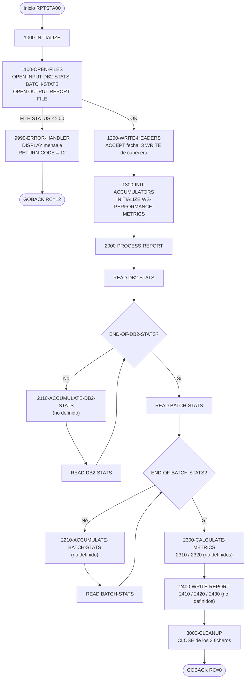
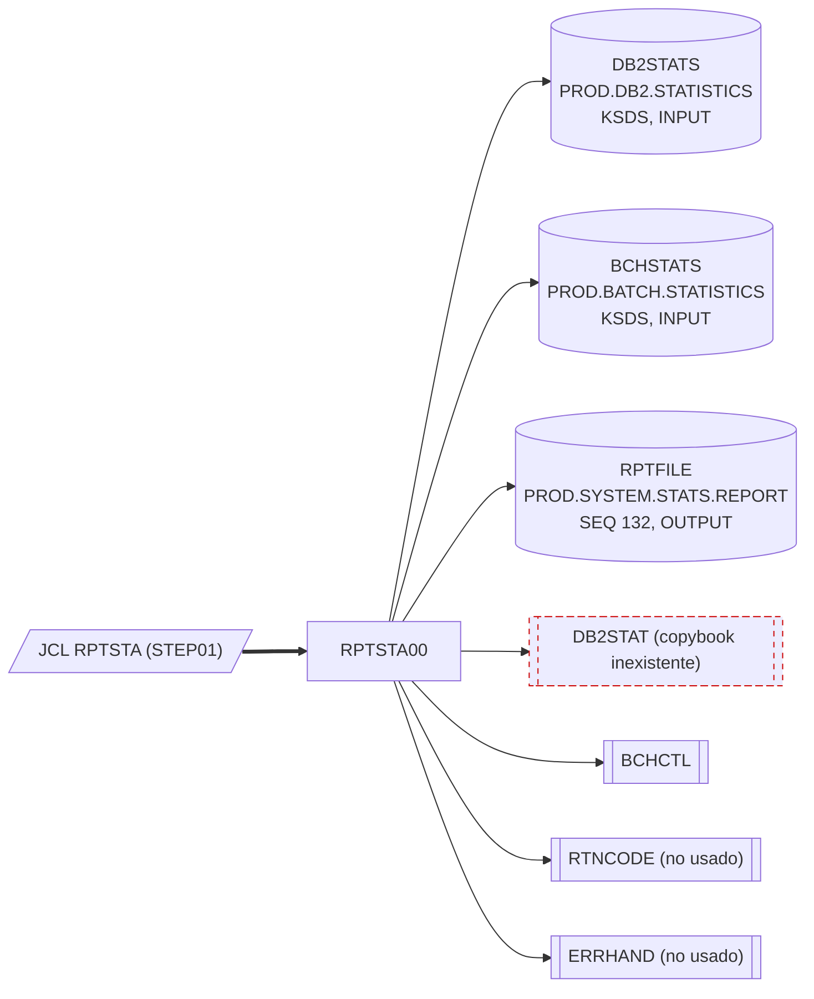

# RPTSTA00 — Generador del informe de estadísticas y rendimiento del sistema

> Generado a partir del análisis del código fuente `src/programs/batch/RPTSTA00.cbl`. Ver el [grafo de dependencias global](../technical/dependency-graph.md).

## Ficha técnica
| Campo | Valor |
| --- | --- |
| Ruta | `src/programs/batch/RPTSTA00.cbl` |
| Categoría | batch |
| Tipo | batch |
| Líneas | 185 |
| Punto de entrada | JCL `RPTSTA` (`src/jcl/batch/RPTSTA.jcl`, `STEP01 EXEC PGM=RPTSTA00`) |
| Invocado por | JCL `RPTSTA` (job `RPTSTA00`). Ningún programa lo invoca por `CALL` ni `LINK`. |
| Invoca a | Ninguno (no hay `CALL`, `EXEC CICS` ni `EXEC SQL`). Copybooks: `DB2STAT` (inexistente), `BCHCTL`, `RTNCODE`, `ERRHAND`. |

## Propósito
RPTSTA00 es el programa batch de la capa de informes ("Reporting Components" en `system-architecture.md`) encargado de producir el **"SYSTEM STATISTICS AND PERFORMANCE REPORT"**: un listado de 132 columnas con las estadísticas de actividad DB2 (número de llamadas, tiempo de respuesta medio) y de ejecución batch (jobs ejecutados, tasa de éxito), más un apartado de análisis de tendencias. Para ello lee secuencialmente dos ficheros VSAM KSDS de estadísticas (`DB2STATS` y `BCHSTATS`), acumula métricas en WORKING-STORAGE y escribe el informe en el fichero secuencial `RPTFILE`.

Es importante señalar desde el principio que **el programa está incompleto**: la estructura principal (apertura de ficheros, cabeceras, bucles de lectura, cierre y gestión de errores) está codificada, pero los párrafos que acumulan, calculan y escriben las secciones del informe se invocan sin estar definidos. Tal como está en el repositorio, el programa no compila (ver [Observaciones](#observaciones-y-problemas-detectados)).

## Funcionamiento

### `0000-MAIN`
Secuencia lineal clásica de tres fases y `GOBACK`:
1. `PERFORM 1000-INITIALIZE`
2. `PERFORM 2000-PROCESS-REPORT`
3. `PERFORM 3000-CLEANUP`

### `1000-INITIALIZE`
Encadena `1100-OPEN-FILES`, `1200-WRITE-HEADERS` y `1300-INIT-ACCUMULATORS`.

- **`1100-OPEN-FILES`**: abre `DB2-STATS` (INPUT), `BATCH-STATS` (INPUT) y `REPORT-FILE` (OUTPUT), en ese orden. Tras cada `OPEN` comprueba que el FILE STATUS correspondiente (`WS-DB2-STATUS`, `WS-BCH-STATUS`, `WS-REPORT-STATUS`) sea `'00'`; si no lo es, mueve un mensaje literal (`'ERROR OPENING DB2 STATS'`, `'ERROR OPENING BATCH STATS'` o `'ERROR OPENING REPORT FILE'`) a `WS-ERROR-MESSAGE` y ejecuta `9999-ERROR-HANDLER`, que termina el programa.
- **`1200-WRITE-HEADERS`**: obtiene la fecha con `ACCEPT WS-REPORT-DATE FROM DATE` y escribe tres líneas de cabecera en `REPORT-FILE` mediante `WRITE REPORT-RECORD FROM ...`:
  - `WS-HEADER1`: 132 asteriscos.
  - `WS-HEADER2`: el título `SYSTEM STATISTICS AND PERFORMANCE REPORT` centrado (35 espacios + 62 caracteres + 35 espacios).
  - `WS-HEADER3`: `REPORT DATE:` seguido de `WS-REPORT-DATE`.
  No se comprueba `WS-REPORT-STATUS` tras los `WRITE`.
- **`1300-INIT-ACCUMULATORS`**: `INITIALIZE WS-PERFORMANCE-METRICS`, poniendo a cero los ocho acumuladores numéricos de DB2 y batch.

### `2000-PROCESS-REPORT`
Es el corazón del programa y se divide en cuatro sub-fases:

- **`2100-PROCESS-DB2-STATS`**: patrón de lectura anticipada. Hace un primer `READ DB2-STATS` con `AT END SET END-OF-DB2-STATS TO TRUE` y luego un `PERFORM UNTIL END-OF-DB2-STATS` que, por cada registro, ejecuta `2110-ACCUMULATE-DB2-STATS` y vuelve a leer. El fichero es INDEXED con `ACCESS MODE IS SEQUENTIAL`, por lo que se recorre completo en orden de clave `STAT-KEY`.
- **`2200-PROCESS-BATCH-STATS`**: idéntico patrón sobre `BATCH-STATS` (clave `BCH-KEY`, flag `END-OF-BATCH-STATS`), invocando `2210-ACCUMULATE-BATCH-STATS` por registro.
- **`2300-CALCULATE-METRICS`**: invoca `2310-CALC-DB2-METRICS` y `2320-CALC-BATCH-METRICS`. Por los campos de salida definidos (`WS-DB2-AVG-RESP`, `WS-SUCCESS-RATE`) se infiere que aquí se calcularía el tiempo medio de respuesta DB2 (probablemente `WS-DB2-ELAPSED / WS-DB2-CALLS`) y el porcentaje de éxito batch (probablemente `WS-BATCH-SUCCESS / WS-BATCH-JOBS * 100`), pero **no hay código que lo confirme**.
- **`2400-WRITE-REPORT`**: invoca `2410-WRITE-DB2-SECTION`, `2420-WRITE-BATCH-SECTION` y `2430-WRITE-TREND-ANALYSIS`. Las líneas de detalle preparadas en WORKING-STORAGE (`WS-DB2-DETAIL`, `WS-BATCH-DETAIL`) sugieren que las dos primeras secciones escribirían una línea cada una; para el análisis de tendencias no existe ninguna estructura de datos.

**Ninguno de los siete párrafos de nivel 2xx0 (`2110-`, `2210-`, `2310-`, `2320-`, `2410-`, `2420-`, `2430-`) está definido en el fuente.**

### `3000-CLEANUP`
Un único `CLOSE DB2-STATS BATCH-STATS REPORT-FILE`, sin comprobación de FILE STATUS.

### `9999-ERROR-HANDLER`
`DISPLAY WS-ERROR-MESSAGE`, `MOVE 12 TO RETURN-CODE` y `GOBACK`. Al hacer `GOBACK` dentro de un párrafo ejecutado por `PERFORM`, el programa termina inmediatamente sin volver al punto de llamada ni ejecutar `3000-CLEANUP`.

### Diagrama de flujo

## Interfaz

- **Parámetros / LINKAGE SECTION / COMMAREA**: No aplica. El programa no tiene LINKAGE SECTION ni `PROCEDURE DIVISION USING`; tampoco lee `SYSIN` ni `PARM`.

- **Ficheros (DDNAME, organización, modo de apertura, clave)**:

| Fichero COBOL | DDNAME | DSN (JCL `RPTSTA`) | Organización / acceso | Modo | Clave | FILE STATUS |
| --- | --- | --- | --- | --- | --- | --- |
| `DB2-STATS` | `DB2STATS` | `PROD.DB2.STATISTICS` | INDEXED (KSDS) / SEQUENTIAL | INPUT | `STAT-KEY` (no definida en el repositorio) | `WS-DB2-STATUS` |
| `BATCH-STATS` | `BCHSTATS` | `PROD.BATCH.STATISTICS` | INDEXED (KSDS) / SEQUENTIAL | INPUT | `BCH-KEY` (no definida; `BCHCTL` define `BCT-KEY`) | `WS-BCH-STATUS` |
| `REPORT-FILE` | `RPTFILE` | `PROD.SYSTEM.STATS.REPORT` | SEQUENTIAL, `RECORDING MODE F`, `BLOCK CONTAINS 0` | OUTPUT | — | `WS-REPORT-STATUS` |

  El registro de salida `REPORT-RECORD` es `PIC X(132)`, coherente con `DCB=(RECFM=FB,LRECL=132,BLKSIZE=0)` del JCL. El JCL crea el informe con `DISP=(NEW,CATLG,DELETE)`, por lo que una reejecución del job con el dataset ya catalogado fallaría en la asignación JCL.

- **Tablas DB2 y sentencias SQL**: No aplica. A pesar del nombre del fichero `DB2STATS`, el programa no contiene `EXEC SQL`, no incluye `SQLCA` y el JCL no ejecuta bajo `IKJEFT01`/DSN.

- **Mapas BMS / comandos CICS**: No aplica.

- **Códigos de retorno / RETURN-CODE**:

| RETURN-CODE | Cuándo |
| --- | --- |
| `0` | Ejecución completa hasta `3000-CLEANUP` (el programa nunca asigna explícitamente `RETURN-CODE` en la ruta normal). |
| `12` | Fallo en cualquiera de los tres `OPEN` de `1100-OPEN-FILES` (`9999-ERROR-HANDLER`). Es la única ruta que fija el RC. |

  Errores de `READ`, `WRITE` o `CLOSE` no se detectan: el programa terminaría con RC 0 o abendaría por el runtime, según el error.

## Estructuras de datos clave

### Copybooks
| Copybook | Ubicación | Sección | Qué aporta a RPTSTA00 |
| --- | --- | --- | --- |
| `DB2STAT` | **No existe en `src/copybook/`** | FILE SECTION | Debería definir el registro del fichero `DB2-STATS` y su clave `STAT-KEY`. Solo existe el *programa* `src/programs/common/DB2STAT.cbl`, que no es un copybook. `UTLMON00` tiene la misma dependencia rota. |
| `BCHCTL` | `src/copybook/batch/BCHCTL.cpy` | FILE SECTION | Registro `BATCH-CONTROL-RECORD` del fichero de control batch: clave `BCT-KEY` (`BCT-JOB-NAME`, `BCT-PROCESS-DATE`, `BCT-SEQUENCE-NO`), estado `BCT-STATUS` (88: READY/ACTIVE/WAITING/DONE/ERROR), `BCT-START-TIME`/`BCT-END-TIME`, `BCT-RETURN-CODE`, `BCT-RESTART-COUNT`, etc. Se usa aquí como layout del fichero `BATCH-STATS`, aunque el `SELECT` referencia una clave `BCH-KEY` que el copybook no define. |
| `RTNCODE` | `src/copybook/common/RTNCODE.cpy` | WORKING-STORAGE | `RETURN-CODE-AREA` (petición, códigos actual/máximo, estado, mensaje). **Ningún campo se usa** en el programa. |
| `ERRHAND` | `src/copybook/common/ERRHAND.cpy` | WORKING-STORAGE | Categorías de error, códigos estándar (`ERR-SUCCESS`..`ERR-TERMINAL`), estructura `ERR-MESSAGE` y constantes de estado VSAM. **Ningún campo se usa**; el programa emplea `WS-ERROR-MESSAGE`, que no está en este copybook ni en WORKING-STORAGE. |

### WORKING-STORAGE propio
| Estructura | Campos | Uso |
| --- | --- | --- |
| `WS-FILE-STATUS` | `WS-DB2-STATUS`, `WS-BCH-STATUS`, `WS-REPORT-STATUS` (`PIC XX`) | FILE STATUS de los tres ficheros; solo se consultan tras `OPEN`. |
| `WS-REPORT-HEADERS` | `WS-HEADER1` (132 `*`), `WS-HEADER2` (título), `WS-HEADER3` (`REPORT DATE:` + `WS-REPORT-DATE PIC X(10)`) | Cabeceras escritas en `1200-WRITE-HEADERS`. |
| `WS-PERFORMANCE-METRICS` → `WS-DB2-METRICS` | `WS-DB2-CALLS PIC 9(9)`, `WS-DB2-ELAPSED`, `WS-DB2-CPU`, `WS-DB2-WAIT` (`PIC 9(9)V99`) | Acumuladores DB2; inicializados en `1300-`, nunca incrementados (párrafo 2110 ausente). |
| `WS-PERFORMANCE-METRICS` → `WS-BATCH-METRICS` | `WS-BATCH-JOBS`, `WS-BATCH-SUCCESS`, `WS-BATCH-FAILED` (`PIC 9(9)`), `WS-BATCH-ELAPSED` (`PIC 9(9)V99`) | Acumuladores batch; misma situación. |
| `WS-DETAIL-LINES` → `WS-DB2-DETAIL` | `'DB2 CALLS:'` + `WS-DB2-CALLS-OUT PIC ZZZ,ZZZ,ZZ9`, `'AVG RESPONSE:'` + `WS-DB2-AVG-RESP PIC ZZ,ZZ9.999` | Línea de detalle de la sección DB2 (121 bytes; se rellenaría con espacios hasta 132 en el `WRITE ... FROM`). No se usa. |
| `WS-DETAIL-LINES` → `WS-BATCH-DETAIL` | `'BATCH JOBS:'` + `WS-BATCH-TOTAL PIC ZZZ,ZZ9`, `'SUCCESS RATE:'` + `WS-SUCCESS-RATE PIC ZZ9.99` + `'%'` | Línea de detalle de la sección batch (108 bytes). No se usa. |

No hay flags de fin de fichero declarados: `END-OF-DB2-STATS` y `END-OF-BATCH-STATS` se usan como condiciones de nivel 88 pero no existen en ninguna estructura del programa ni de los copybooks incluidos.

No existen umbrales, contadores de commit, ni lógica de checkpoint: el programa es de solo lectura sobre sus entradas y no usa `CKPRST`.

## Reglas de negocio y validaciones
Las reglas efectivamente implementadas en el código son mínimas:

1. **Orden de apertura y fallo rápido**: los tres ficheros deben abrirse con FILE STATUS `'00'`; el primer fallo aborta el programa con RC 12 antes de escribir nada.
2. **Cabecera fija de tres líneas**: asteriscos, título centrado y fecha de generación (`ACCEPT ... FROM DATE`, formato `AAMMDD` de 6 posiciones dejado tal cual en un campo de 10).
3. **Recorrido completo de ambas entradas**: se leen todos los registros de `DB2STATS` y después todos los de `BCHSTATS`, en orden de clave, sin filtro por fecha, job ni tipo de registro.
4. **Acumuladores a cero antes de procesar** (`INITIALIZE WS-PERFORMANCE-METRICS`).

Reglas **inferidas** de los nombres de campos y máscaras de edición, pero **no implementadas** en el fuente:
- Tiempo medio de respuesta DB2 = tiempo total / número de llamadas (`WS-DB2-AVG-RESP`, tres decimales).
- Tasa de éxito batch en porcentaje con dos decimales (`WS-SUCCESS-RATE`), a partir de `WS-BATCH-SUCCESS` y `WS-BATCH-JOBS`; con el layout `BCHCTL`, lo natural sería clasificar por `BCT-STATUS-DONE` / `BCT-STATUS-ERROR` y sumar tiempos de `BCT-START-TIME`/`BCT-END-TIME`.
- Métricas de CPU y espera DB2 (`WS-DB2-CPU`, `WS-DB2-WAIT`) que no tienen línea de salida asociada.
- "Análisis de tendencias" (`2430-WRITE-TREND-ANALYSIS`), sin ninguna estructura de datos de soporte.

## Manejo de errores y recuperación
- **Errores de fichero (FILE STATUS)**: solo se controlan los `OPEN`. Los `READ` usan `AT END` para detectar fin de fichero, pero no comprueban otros estados (p. ej. `'23'`, `'30'`, `'90'`). Los `WRITE` de cabecera y el `CLOSE` no verifican estado. Un error de E/S distinto de fin de fichero provocaría un abend del runtime (no hay `DECLARATIVES`/`USE AFTER ERROR`) o pasaría desapercibido.
- **Rutina de error `9999-ERROR-HANDLER`**: muestra el mensaje con `DISPLAY` (a `SYSOUT`; a diferencia de `UTLMON00`, no usa `UPON CONS`), fija `RETURN-CODE = 12` y hace `GOBACK`. No cierra los ficheros ya abiertos ni registra el error en un log.
- **SQLCODE / condiciones CICS**: no aplica; no hay SQL ni CICS.
- **Checkpoint/restart y rollback**: no implementados. Al no actualizar ningún fichero, la recuperación consiste simplemente en relanzar el job (previa eliminación del dataset `PROD.SYSTEM.STATS.REPORT` por el `DISP=NEW`).
- **Rutinas comunes**: no se invoca a `ERRPROC`, `ERRHNDL` ni `DB2ERR`. Aunque se incluye `ERRHAND`, no se rellena `ERR-MESSAGE` ni se usan los códigos `ERR-*`.

## Dependencias

Nota: el programa `DB2STAT` (`src/programs/common/DB2STAT.cbl`) no es invocado por RPTSTA00 ni produce el fichero `DB2STATS`; escribe sus estadísticas en la tabla temporal DB2 `SESSION.DBSTATS`. En el repositorio no existe ningún productor de `PROD.DB2.STATISTICS` ni de `PROD.BATCH.STATISTICS` (`UTLMON00` también lee `DB2STATS`, pero no lo escribe).

## Observaciones y problemas detectados

### Errores que impiden la compilación
1. **Siete párrafos invocados y no definidos**: `2110-ACCUMULATE-DB2-STATS`, `2210-ACCUMULATE-BATCH-STATS`, `2310-CALC-DB2-METRICS`, `2320-CALC-BATCH-METRICS`, `2410-WRITE-DB2-SECTION`, `2420-WRITE-BATCH-SECTION` y `2430-WRITE-TREND-ANALYSIS`. Toda la lógica de acumulación, cálculo y escritura del cuerpo del informe está ausente; el programa solo produciría las tres cabeceras.
2. **Copybook `DB2STAT` inexistente** (`COPY DB2STAT.` en FILE SECTION). Solo existe el programa homónimo `src/programs/common/DB2STAT.cbl`. Como consecuencia, la clave `STAT-KEY` del `SELECT DB2-STATS` tampoco está definida.
3. **Falta el `FD` de `DB2-STATS` y de `BATCH-STATS`**: los `COPY DB2STAT` y `COPY BCHCTL` aparecen directamente bajo `FILE SECTION` sin la cláusula `FD` que asocie el registro al fichero (compárese con `BCHCTL00`, que hace `FD BATCH-CONTROL-FILE.` seguido de `COPY BCHCTL.`).
4. **Clave `BCH-KEY` no definida**: `SELECT BATCH-STATS ... RECORD KEY IS BCH-KEY`, pero `BCHCTL.cpy` define la clave como `BCT-KEY`.
5. **Condiciones `END-OF-DB2-STATS` y `END-OF-BATCH-STATS` no declaradas**: se usan con `SET ... TO TRUE` y en `PERFORM UNTIL`, pero no existe ningún nivel 88 con esos nombres.
6. **`WS-ERROR-MESSAGE` no declarado**: se usa en `1100-OPEN-FILES` y `9999-ERROR-HANDLER`; `ERRHAND` ofrece `ERR-TEXT`/`ERR-MESSAGE`, no `WS-ERROR-MESSAGE`. El mismo defecto se repite en `RPTAUD00`, `RPTPOS00` y `UTLMON00`.

### Inconsistencias funcionales y de diseño
7. **Layout de `BATCH-STATS` dudoso**: el fichero de "estadísticas batch" (`PROD.BATCH.STATISTICS`) se lee con el registro del fichero de *control* batch (`BATCH-CONTROL-RECORD` de `BCHCTL`), que en el resto del sistema corresponde al DD `BCHCTL`. Puede ser intencionado (derivar estadísticas de los registros de control), pero no se documenta y el DSN es distinto.
8. **Fecha del informe mal formateada**: `ACCEPT WS-REPORT-DATE FROM DATE` devuelve `AAMMDD` (6 posiciones, año de dos dígitos) en un campo `PIC X(10)`, sin conversión a un formato legible ni año de cuatro dígitos.
9. **Copybooks incluidos sin uso**: `RTNCODE` y `ERRHAND` no aportan ningún campo utilizado.
10. **Acumuladores y líneas de detalle sin uso**: `WS-PERFORMANCE-METRICS` y `WS-DETAIL-LINES` se definen (y se inicializan) pero, al faltar los párrafos 2xx0, nunca se actualizan ni se escriben. `WS-DB2-CPU` y `WS-DB2-WAIT` ni siquiera tienen campo de salida.
11. **Control de errores incompleto**: no se verifican FILE STATUS en `READ` (salvo `AT END`), `WRITE` ni `CLOSE`; `9999-ERROR-HANDLER` termina sin cerrar ficheros.
12. **Ficheros VSAM no definidos**: `vsam-definitions.txt` solo define `PORTMSTR`, `TRANHIST` y `POSHIST`; no hay definición (longitud de registro, clave) para `PROD.DB2.STATISTICS` ni `PROD.BATCH.STATISTICS`, y ningún programa del repositorio los escribe.

### Discrepancias con la documentación
13. `system-architecture.md` (sección 2.4 "Reporting Flow") muestra `DB2 ->> RPTSTA00: Read System Statistics`, es decir, lectura desde DB2. El código no contiene SQL: lee ficheros VSAM. Manda el código.
14. `system-architecture.md` (1.2.2 y 1.2.5) atribuye a RPTSTA00 "monitors system performance", "tracks resource utilization" y "generates trend analysis". En el código solo existe la llamada a un párrafo `2430-WRITE-TREND-ANALYSIS` inexistente; la monitorización de recursos está en realidad en `UTLMON00`.
15. `development-backlog.md` marca como completadas (`[x]`) las cuatro funcionalidades de RPTSTA00 (processing statistics, performance metrics, resource utilization, trend analysis); el fuente es un esqueleto sin esa lógica.
16. `dependency-graph.json` lista 12 párrafos para el programa: son los definidos; no recoge los 7 párrafos referenciados pero inexistentes.

## Referencias
- Programa: [RPTSTA00.cbl](../../src/programs/batch/RPTSTA00.cbl)
- JCL: [RPTSTA.jcl](../../src/jcl/batch/RPTSTA.jcl)
- Copybooks:
  - [BCHCTL.cpy](../../src/copybook/batch/BCHCTL.cpy)
  - [ERRHAND.cpy](../../src/copybook/common/ERRHAND.cpy)
  - [RTNCODE.cpy](../../src/copybook/common/RTNCODE.cpy)
  - `DB2STAT` — no existe en `src/copybook/`; programa homónimo: [DB2STAT.cbl](../../src/programs/common/DB2STAT.cbl)
- Programas relacionados:
  - [UTLMON00.cbl](../../src/programs/utility/UTLMON00.cbl) (también lee `DB2STATS` y usa `COPY DB2STAT`)
  - [BCHCTL00.cbl](../../src/programs/batch/BCHCTL00.cbl) (uso correcto de `FD` + `COPY BCHCTL`)
- Definiciones VSAM: [vsam-definitions.txt](../../src/database/vsam/vsam-definitions.txt)
- Documentación técnica:
  - [system-architecture.md](../technical/system-architecture.md)
  - [data-dictionary.md](../technical/data-dictionary.md)
  - [development-backlog.md](../technical/development-backlog.md)
  - [dependency-graph.md](../technical/dependency-graph.md) / [dependency-graph.json](../technical/dependency-graph.json)
