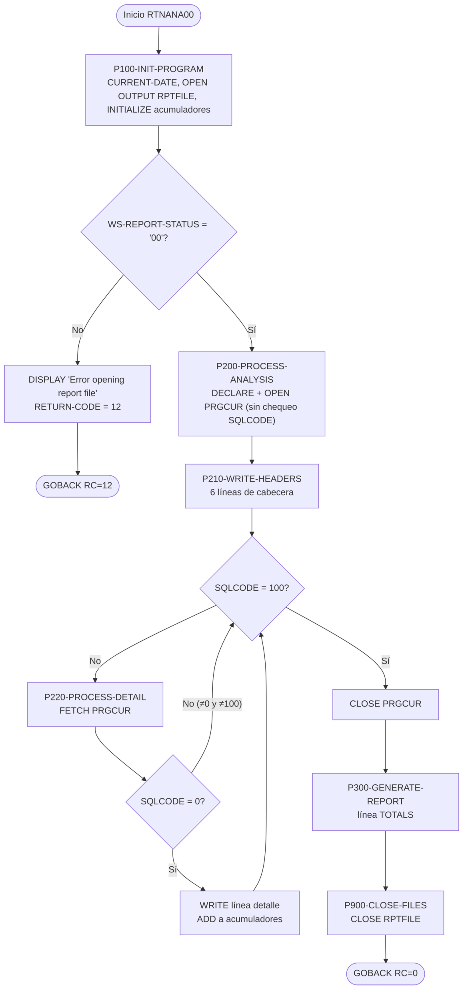
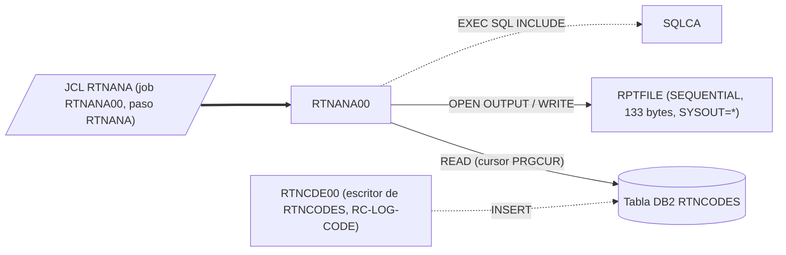

# RTNANA00 — Informe de análisis de códigos de retorno (tabla DB2 RTNCODES)

> Generado a partir del análisis del código fuente `src/programs/batch/RTNANA00.cbl`. Ver el [grafo de dependencias global](../technical/dependency-graph.md).

## Ficha técnica
| Campo | Valor |
| --- | --- |
| Ruta | `src/programs/batch/RTNANA00.cbl` |
| Categoría | batch |
| Tipo | batch (programa principal con acceso DB2 embebido) |
| Líneas | 210 |
| Punto de entrada | JCL `RTNANA` (`src/jcl/RTNANA.jcl`, job `RTNANA00`, paso `RTNANA`, `EXEC PGM=RTNANA00`) |
| Invocado por | JCL `RTNANA`. Ningún programa COBOL lo invoca mediante `CALL` ni `LINK`. |
| Invoca a | Ningún programa (`CALL`/`LINK` inexistentes). Solo usa `EXEC SQL` sobre la tabla `RTNCODES` y escribe el fichero `RPTFILE`. |

## Propósito
`RTNANA00` es una utilidad batch de explotación que lee la tabla DB2 `RTNCODES` (el registro histórico de códigos de retorno que alimenta la subrutina `RTNCDE00` con su función `RC-LOG-CODE`) y produce un informe impreso de 133 posiciones con, para cada `PROGRAM_ID`, el número total de ejecuciones registradas y su desglose por estado (`S` éxito, `W` aviso, `E` error, `F` severo), más una línea final de totales globales. Encaja en la capa de utilidades/reporting del sistema CLBS (junto a `RPTAUD00`, `RPTPOS00`, `RPTSTA00`), como cierre del *Return Code Framework* descrito en `development-backlog.md` ("Add return code analysis utilities"). No forma parte del flujo batch de negocio (validación → actualización de posiciones → carga de histórico) y no actualiza ningún dato: es de solo lectura sobre DB2.

La cabecera del programa promete además "trend analysis" e "identifies error patterns"; el código implementado se limita a la agregación por programa (véase [Observaciones](#observaciones-y-problemas-detectados)).

## Funcionamiento
El programa es lineal: cuatro `PERFORM ... THRU` consecutivos desde el párrafo principal (sin nombre) y `GOBACK`.

1. **`P100-INIT-PROGRAM`**
   - `MOVE FUNCTION CURRENT-DATE TO WS-CURRENT-DATE-DATA`: captura fecha y hora del sistema (se conservan los 16 primeros caracteres: `AAAAMMDD` + `HHMMSSss`).
   - `OPEN OUTPUT REPORT-FILE`. Si `WS-REPORT-STATUS` ≠ `'00'` muestra `Error opening report file: <status>` por `DISPLAY`, pone `RETURN-CODE = 12` y hace `GOBACK` directamente (sin pasar por `P900-CLOSE-FILES`).
   - `INITIALIZE WS-ANALYSIS-AREA`: pone a cero los cinco acumuladores (`WS-PROGRAM-COUNT`, `WS-SUCCESS-COUNT`, `WS-WARNING-COUNT`, `WS-ERROR-COUNT`, `WS-SEVERE-COUNT`) y a espacios `WS-START-TIME`/`WS-END-TIME`.

2. **`P200-PROCESS-ANALYSIS`**
   - Declara el cursor `PRGCUR` (la sentencia `DECLARE CURSOR` está dentro de la PROCEDURE DIVISION, lo que es válido para el precompilador DB2) con la consulta agregada sobre `RTNCODES` agrupada y ordenada por `PROGRAM_ID`.
   - `EXEC SQL OPEN PRGCUR END-EXEC` — **no se comprueba `SQLCODE`**.
   - `PERFORM P210-WRITE-HEADERS`: escribe el bloque de cabeceras.
   - `PERFORM P220-PROCESS-DETAIL THRU P220-EXIT UNTIL SQLCODE = 100`: bucle de lectura del cursor hasta fin de datos.
   - `EXEC SQL CLOSE PRGCUR END-EXEC` — tampoco se comprueba `SQLCODE`.

3. **`P210-WRITE-HEADERS`** — escribe seis registros en `REPORT-FILE`:
   1. `WS-HEADER1` (133 guiones),
   2. `WS-HEADER2` (título `Return Code Analysis Report` centrado),
   3. `WS-HEADER3` con `Report Date:` (`WS-RPT-DATE` ← `WS-CURRENT-DATE`, es decir `AAAAMMDD` sin separadores) y `Report Time:` (`WS-RPT-TIME` ← `STRING HH ':' MM ':' SS`),
   4. `WS-HEADER1`,
   5. `WS-DETAIL-HDR` (columnas `Program`, `Total`, `Success`, `Warning`, `Error`, `Severe`),
   6. `WS-HEADER1`.

4. **`P220-PROCESS-DETAIL`** (una iteración por fila del cursor)
   - `FETCH PRGCUR INTO :WS-DTL-PROGRAM, :WS-DTL-TOTAL, :WS-DTL-SUCCESS, :WS-DTL-WARNING, :WS-DTL-ERROR, :WS-DTL-SEVERE`. Las variables host son directamente los campos de la línea de detalle del informe (`WS-DETAIL-LINE`).
   - Si `SQLCODE = 0`: `WRITE REPORT-RECORD FROM WS-DETAIL-LINE` y suma cada columna a su acumulador global (`ADD WS-DTL-TOTAL TO WS-PROGRAM-COUNT`, etc.).
   - Cualquier otro `SQLCODE` (incluido un error negativo) no hace nada; solo `SQLCODE = 100` termina el bucle desde `P200`.

5. **`P300-GENERATE-REPORT`** — línea de totales: escribe `WS-HEADER1`, mueve la literal `'TOTALS'` a `WS-DTL-PROGRAM` y los cinco acumuladores a las columnas editadas de `WS-DETAIL-LINE`, escribe esa línea y cierra con otro `WS-HEADER1`.

6. **`P900-CLOSE-FILES`** — `CLOSE REPORT-FILE` (sin comprobar `FILE STATUS`). A continuación el párrafo principal hace `GOBACK` con `RETURN-CODE` = 0 salvo que se haya fijado 12 en `P100`.

## Interfaz
- **Parámetros / LINKAGE SECTION / COMMAREA**: No aplica. No hay `LINKAGE SECTION` ni `PROCEDURE DIVISION USING`; el JCL no pasa `PARM=`.

- **Ficheros (DDNAME, organización, modo de apertura, clave)**:

| DDNAME | Nombre COBOL | Organización | Modo | Registro | Clave | Asignación en JCL |
| --- | --- | --- | --- | --- | --- | --- |
| `RPTFILE` | `REPORT-FILE` / `REPORT-RECORD` | `SEQUENTIAL`, `ACCESS MODE SEQUENTIAL`, `RECORDING MODE F`, `BLOCK CONTAINS 0` | `OPEN OUTPUT` | `PIC X(133)` | No aplica | `SYSOUT=*`, `DCB=(RECFM=FBA,LRECL=133,BLKSIZE=0)` |

- **Tablas DB2 y sentencias SQL**:

| Tabla | Acceso | Sentencias | Columnas usadas |
| --- | --- | --- | --- |
| `RTNCODES` (`src/database/db2/RTNCODES.sql`) | READ (solo lectura, sin `COMMIT`/`ROLLBACK`) | `DECLARE PRGCUR CURSOR FOR SELECT PROGRAM_ID, COUNT(*) AS TOTAL, COUNT(CASE WHEN STATUS_CODE = 'S' THEN 1 END), COUNT(CASE WHEN STATUS_CODE = 'W' THEN 1 END), COUNT(CASE WHEN STATUS_CODE = 'E' THEN 1 END), COUNT(CASE WHEN STATUS_CODE = 'F' THEN 1 END) FROM RTNCODES GROUP BY PROGRAM_ID ORDER BY PROGRAM_ID`; `OPEN PRGCUR`; `FETCH PRGCUR INTO ...` (6 variables host); `CLOSE PRGCUR` | `PROGRAM_ID` (`CHAR(8)`), `STATUS_CODE` (`CHAR(1)`) |

  El índice `RTNCODES_PRG_IDX (PROGRAM_ID, TIMESTAMP)` definido en el DDL se ajusta al `GROUP BY / ORDER BY PROGRAM_ID` de la consulta. No se usa `WHERE`: se agrega todo el histórico de la tabla.

- **Mapas BMS / comandos CICS**: No aplica (programa batch puro, sin `EXEC CICS`).

- **Códigos de retorno / RETURN-CODE**:

| Valor | Cuándo |
| --- | --- |
| `0` | Fin normal, **incluso si las sentencias SQL han fallado** (no se propaga ningún error DB2 al `RETURN-CODE`). |
| `12` | Fallo en `OPEN OUTPUT REPORT-FILE` (`WS-REPORT-STATUS` ≠ `'00'`). Se abandona el programa con `GOBACK` sin haber accedido a DB2. |

## Estructuras de datos clave
**Copybooks**: el programa no usa ninguna sentencia `COPY`. La única inclusión es `EXEC SQL INCLUDE SQLCA END-EXEC` (área de comunicación DB2 estándar, aporta `SQLCODE`), anidada bajo el grupo `01 WS-DB2-AREA`.

**WORKING-STORAGE relevante**:

| Campo | Definición | Uso |
| --- | --- | --- |
| `WS-REPORT-STATUS` | `PIC XX` | `FILE STATUS` de `REPORT-FILE`; solo se consulta tras el `OPEN`. |
| `WS-CURRENT-DATE-DATA` | grupo `9(4)/9(2)/9(2)` + `9(2)×4` | Receptor de `FUNCTION CURRENT-DATE` (fecha `WS-CURRENT-DATE` y hora `WS-CURRENT-TIME`). |
| `WS-START-TIME`, `WS-END-TIME` | `PIC X(26)` | Declarados en `WS-ANALYSIS-AREA` pero **nunca referenciados** (no hay filtro temporal en la consulta). |
| `WS-PROGRAM-COUNT`, `WS-SUCCESS-COUNT`, `WS-WARNING-COUNT`, `WS-ERROR-COUNT`, `WS-SEVERE-COUNT` | `PIC S9(8) COMP` | Acumuladores globales para la línea `TOTALS`. |
| `WS-HEADER1` | `PIC X(133) VALUE ALL '-'` | Línea separadora. |
| `WS-HEADER2` | 30 + 73 + 30 = 133 | Título `Return Code Analysis Report`. |
| `WS-HEADER3` | 15 + 10 + 5 + 15 + 8 + 80 = 133 | `Report Date:` `WS-RPT-DATE` / `Report Time:` `WS-RPT-TIME`. |
| `WS-DETAIL-HDR` | 6 columnas de 8/10 + separadores de 2 + relleno 65 = 133 | Cabecera de columnas. |
| `WS-DETAIL-LINE` | `WS-DTL-PROGRAM PIC X(8)` + 5 × `PIC ZZZ,ZZ9` con separadores de 3 + relleno 65 = **122** | Línea de detalle y línea de totales; sus campos numéricos editados se usan **directamente como variables host** del `FETCH`. |

No hay umbrales de commit, contadores de checkpoint ni flags de restart: el programa no escribe en DB2 y no usa el marco `CKPRST`/`BCHCTL` del resto del batch.

## Reglas de negocio y validaciones
- Clasificación de estados: la consulta cuenta por separado las filas con `STATUS_CODE` igual a `'S'` (Success), `'W'` (Warning), `'E'` (Error) y `'F'` (Severe). Estos literales coinciden con los niveles 88 `RC-STATUS-SUCCESS/WARNING/ERROR/SEVERE` de `src/copybook/common/RTNCODE.cpy` y con la lógica de `RTNCDE00` (`P200-SET-RETURN-CODE`: 0 → S, 1-4 → W, 5-8 → E, resto → F), que es quien inserta las filas en `RTNCODES`. Cualquier otro valor de `STATUS_CODE` cuenta en `Total` pero en ninguna de las cuatro columnas.
- Agregación: una línea por `PROGRAM_ID` (`GROUP BY`), en orden alfabético (`ORDER BY`). Sin filtro por fecha ni por programa: se analiza toda la tabla.
- Totales: la línea `TOTALS` es la suma aritmética de las columnas de todas las líneas de detalle escritas (solo las filas con `SQLCODE = 0`).
- Formato: los contadores se presentan con `PIC ZZZ,ZZ9` (máximo 999.999; valores mayores se truncan a la izquierda sin aviso).
- Única validación explícita: éxito del `OPEN` del fichero de informe (`FILE STATUS = '00'`).

## Manejo de errores y recuperación
- **Ficheros**: solo se comprueba `WS-REPORT-STATUS` tras el `OPEN` (→ `DISPLAY` + `RETURN-CODE 12` + `GOBACK`). Ninguno de los `WRITE` ni el `CLOSE` verifican el `FILE STATUS`; al no existir cláusula `DECLARATIVES`, un error de E/S en escritura produciría un abend en tiempo de ejecución o pasaría inadvertido según el tipo de error.
- **DB2 / SQLCODE**: no hay tratamiento de errores SQL. `OPEN PRGCUR` y `CLOSE PRGCUR` no consultan `SQLCODE`; en `P220-PROCESS-DETAIL` solo se actúa si `SQLCODE = 0`, y el bucle de `P200` solo termina con `SQLCODE = 100`. Consecuencia: si el `OPEN` falla (p. ej. `-204` tabla inexistente, `-805` DBRM/paquete no encontrado, `-911` deadlock) el `FETCH` posterior devolverá repetidamente un `SQLCODE` negativo (`-501`, cursor no abierto) que **nunca es 100**, y el programa entra en un bucle infinito escribiendo nada. Un `SQLCODE` positivo distinto de 100 (aviso) en un `FETCH` provocaría el mismo bucle.
- **Propagación**: no se fija `RETURN-CODE` ante errores DB2, por lo que el job terminaría con RC=0 aunque el informe esté vacío o incompleto.
- **Checkpoint/restart, COMMIT/ROLLBACK**: no aplica; el programa es de solo lectura y no participa en el marco de control batch (`BCHCTL`, `CKPRST`).
- **Rutinas comunes**: no llama a `ERRPROC`, `DB2ERR`, `DB2CONN` ni `RTNCDE00`, a diferencia de lo que `system-architecture.md` (§6.1 "Error Handling Components") describe como estándar para programas batch y DB2. Tampoco registra su propio código de retorno en `RTNCODES`.

## Dependencias

Relación indirecta: `RTNANA00` no llama a `RTNCDE00`, pero depende funcionalmente de él, ya que `RTNCDE00.P400-LOG-RETURN-CODE` es el único punto de `src/` que inserta filas en `RTNCODES`. En el grafo global `RTNCDE00` aparece como "programa sin invocador conocido", de modo que en el estado actual del repositorio no hay ningún flujo que alimente la tabla que `RTNANA00` analiza.

## Observaciones y problemas detectados
1. **Bucle infinito ante errores DB2** (`P200-PROCESS-ANALYSIS` / `P220-PROCESS-DETAIL`): la salida del bucle depende exclusivamente de `SQLCODE = 100`. Cualquier fallo en `OPEN PRGCUR` o un `SQLCODE` negativo/positivo distinto de 100 en el `FETCH` deja el programa iterando indefinidamente. Falta un `IF SQLCODE < 0` (o `NOT = 0 AND NOT = 100`) que aborte con `RETURN-CODE` ≥ 12.
2. **Variables host numéricas editadas**: `WS-DTL-TOTAL`, `WS-DTL-SUCCESS`, `WS-DTL-WARNING`, `WS-DTL-ERROR` y `WS-DTL-SEVERE` son `PIC ZZZ,ZZ9` (numérico editado) y se usan como destino del `FETCH INTO`. El precompilador DB2 para COBOL no admite elementos numéricos editados como variables host (los resultados `COUNT(*)` son `INTEGER` y requieren `PIC S9(9) COMP` o equivalente); el programa no debería precompilar tal cual.
3. **`ADD` sobre campos numéricos editados** (`P220-PROCESS-DETAIL`): `ADD WS-DTL-TOTAL TO WS-PROGRAM-COUNT` (y los cuatro `ADD` siguientes) usan como operando fuente un campo `PIC ZZZ,ZZ9`. En Enterprise COBOL los operandos de `ADD` deben ser numéricos (no editados); es un error de compilación adicional. Lo correcto sería recuperar en campos `COMP` intermedios y luego mover a los campos editados.
4. **Errores DB2 no propagados al `RETURN-CODE`**: el job termina con RC=0 aunque el `OPEN`/`FETCH`/`CLOSE` del cursor fallen (en el supuesto de que no se dé el bucle del punto 1), lo que oculta informes vacíos o incompletos al planificador.
5. **`FILE STATUS` no verificado en `WRITE`/`CLOSE`**: solo se controla el `OPEN`. No hay `DECLARATIVES`.
6. **Campos declarados y no usados**: `WS-START-TIME` y `WS-END-TIME` (`WS-ANALYSIS-AREA`) nunca se referencian. Junto con la ausencia de `WHERE` en la consulta, indica que el "trend analysis" / rango temporal anunciado en la cabecera del programa quedó sin implementar: el código solo produce un recuento acumulado por programa.
7. **Desalineación de columnas en el informe**: la cabecera `WS-DETAIL-HDR` usa columnas de 10 caracteres separadas por 2 espacios (paso de 12), mientras que `WS-DETAIL-LINE` usa columnas `ZZZ,ZZ9` de 7 caracteres separadas por 3 espacios (paso de 10). Además `WS-DETAIL-LINE` mide 122 bytes frente a los 133 del registro (el `WRITE ... FROM` rellena con espacios, sin error, pero las columnas no quedan alineadas bajo sus títulos).
8. **Fecha sin formato**: `MOVE WS-CURRENT-DATE TO WS-RPT-DATE` imprime `AAAAMMDD` seguido de dos espacios en un campo de 10 posiciones previsto, probablemente, para `AAAA-MM-DD`.
9. **`RECORDING MODE F` frente a `RECFM=FBA` en el JCL**: el JCL define `RPTFILE` con carácter de control ASA (`FBA`), pero el programa no reserva la primera posición para ese carácter ni usa `WRITE ... AFTER ADVANCING`. Al imprimirse por `SYSOUT`, el primer byte de cada línea (`-` de los separadores, `R` de `Report Date:`, la inicial del `PROGRAM_ID`, etc.) se interpretaría como carácter de control, con saltos de línea imprevistos y pérdida de la primera columna. Inferencia a partir de la combinación programa/JCL; no verificable sin ejecutar.
10. **JCL sin entorno DB2**: `RTNANA.jcl` ejecuta `EXEC PGM=RTNANA00` directamente, sin `IKJEFT01`/`DSN SYSTEM(...) RUN PROGRAM(RTNANA00) PLAN(...)` ni `SYSTSIN`, y sin `DBRMLIB`. Para un programa con SQL embebido esto exigiría un attach CAF/RRSAF explícito que el programa no realiza (no llama a `DB2CONN`). Además no existe en `src/database/db2/` ningún `BIND PACKAGE`/`DBRM` que mencione `RTNANA00` (`PORTPLAN.sql` solo define `PKLIST(*.PORTPKG.*)`). Probablemente el job no podría ejecutarse tal cual.
11. **`01 WS-DB2-AREA.` seguido de `EXEC SQL INCLUDE SQLCA`**: la SQLCA se expande como su propio nivel `01 SQLCA`, con lo que `WS-DB2-AREA` queda como un `01` sin `PIC` ni subordinados, lo que Enterprise COBOL rechaza. Patrón repetido en `RTNCDE00`; probable error de compilación.
12. **Discrepancias con la documentación técnica**: `RTNANA00` no aparece en `system-architecture.md` (ni en la capa de utilidades §1.2.3 ni en las tablas de dependencias §5.1) y no sigue el patrón de error documentado (§6.1: `ERRPROC`/`DB2ERR`). `data-dictionary.md` §8.2 define los códigos de retorno 0/4/8/12/16 pero no documenta la tabla `RTNCODES` ni los estados `S/W/E/F`. Prevalece el código: el programa es autónomo y no usa las rutinas comunes.
13. **Tabla huérfana en el repositorio**: el único escritor de `RTNCODES` (`RTNCDE00`) no es invocado por ningún programa ni JCL de `src/` (véase el grafo global), por lo que el informe generado por `RTNANA00` estaría vacío (solo cabeceras y `TOTALS` a cero) con el código actual.
14. Menor: la consulta pone alias solo a la segunda columna (`AS TOTAL`); es irrelevante funcionalmente pero inconsistente. El job JCL se llama `RTNANA00` y el paso `RTNANA`, mientras que el fichero es `RTNANA.jcl`; el grafo global lo identifica por nombre de fichero (`JCL:RTNANA`).

## Referencias
- Programa: [RTNANA00.cbl](../../src/programs/batch/RTNANA00.cbl)
- JCL de ejecución: [RTNANA.jcl](../../src/jcl/RTNANA.jcl)
- DDL de la tabla analizada: [RTNCODES.sql](../../src/database/db2/RTNCODES.sql)
- Plan DB2 del sistema (sin referencia a este programa): [PORTPLAN.sql](../../src/database/db2/PORTPLAN.sql)
- Programa que alimenta `RTNCODES`: [RTNCDE00.cbl](../../src/programs/batch/RTNCDE00.cbl) y copybook [RTNCODE.cpy](../../src/copybook/common/RTNCODE.cpy) (definición de los estados `S/W/E/F`)
- Contexto de arquitectura: [system-architecture.md](../technical/system-architecture.md), [data-dictionary.md](../technical/data-dictionary.md), [development-backlog.md](../technical/development-backlog.md)
- Grafo de dependencias: [dependency-graph.md](../technical/dependency-graph.md) / [dependency-graph.json](../technical/dependency-graph.json)
