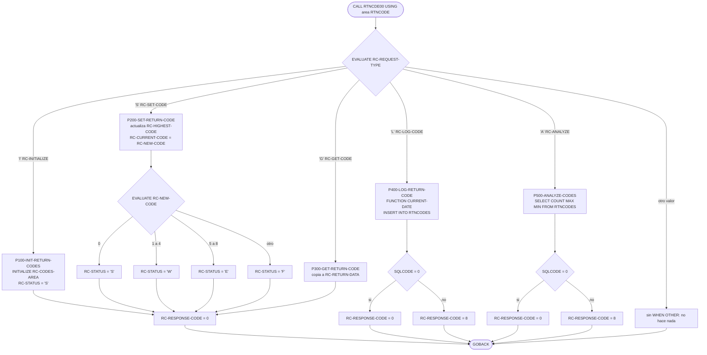
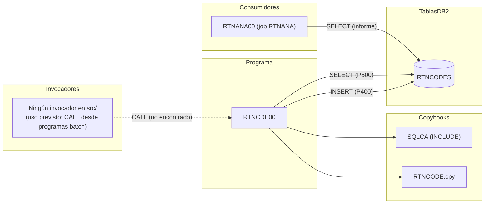

# RTNCDE00 — Gestor estándar de códigos de retorno (subrutina DB2)

> Generado a partir del análisis del código fuente `src/programs/batch/RTNCDE00.cbl`. Ver el [grafo de dependencias global](../technical/dependency-graph.md).

## Ficha técnica
| Campo | Valor |
| --- | --- |
| Ruta | `src/programs/batch/RTNCDE00.cbl` |
| Categoría | batch |
| Tipo | subrutina común (no tiene ficheros propios; recibe toda su entrada por `LINKAGE SECTION` y termina con `GOBACK`) |
| Líneas | 141 |
| Punto de entrada | subrutina pensada para ser invocada por `CALL` con el área `RTNCODE` como parámetro; **ninguno conocido** (ningún JCL, programa ni definición CICS del repositorio lo invoca) |
| Invocado por | Nadie en `src/` (ver [Observaciones](#observaciones-y-problemas-detectados)) |
| Invoca a | Ningún programa. Accede por SQL embebido a la tabla DB2 `RTNCODES` (`INSERT` y `SELECT`) |

## Propósito
`RTNCDE00` es el "Standard Return Code Handler" del sistema: una subrutina reutilizable que centraliza la gestión de códigos de retorno de los programas del CLBS. Ofrece cinco servicios sobre un área de comunicación común (copybook `RTNCODE`): inicializar el área, fijar un nuevo código (calculando el código más alto alcanzado y su clasificación S/W/E/F), consultar el estado actual, registrar el código en la tabla DB2 `RTNCODES` como pista de auditoría, y obtener estadísticas agregadas (total, máximo y mínimo) de los códigos registrados por un programa en una ventana temporal.

Encaja en la capa de soporte transversal (junto a `ERRPROC`, `ERRHNDL` y `DB2ERR`) y alimenta la tabla que después explota el informe batch [RTNANA00](../../src/programs/batch/RTNANA00.cbl) (job `RTNANA`). Según el backlog (`development-backlog.md`, Sprint 5, "Return Code Framework") es la pieza central del marco de códigos de retorno; sin embargo, en el código actual del repositorio ningún programa lo llama.

## Funcionamiento

El programa no tiene `ENVIRONMENT DIVISION` con ficheros, ni bucle de proceso: es un despachador de una sola pasada. Cada invocación ejecuta exactamente un servicio según el valor de `RC-REQUEST-TYPE` y devuelve el control con `GOBACK`.

### Despachador (`PROCEDURE DIVISION USING RC-REQUEST-AREA`)
1. `EVALUATE TRUE` sobre las condiciones 88 de `RC-REQUEST-TYPE`:
   - `RC-INITIALIZE` (`'I'`) → `P100-INIT-RETURN-CODES`
   - `RC-SET-CODE` (`'S'`) → `P200-SET-RETURN-CODE`
   - `RC-GET-CODE` (`'G'`) → `P300-GET-RETURN-CODE`
   - `RC-LOG-CODE` (`'L'`) → `P400-LOG-RETURN-CODE`
   - `RC-ANALYZE` (`'A'`) → `P500-ANALYZE-CODES`
2. No hay `WHEN OTHER`: un tipo de petición desconocido no ejecuta nada y no modifica `RC-RESPONSE-CODE`.
3. `GOBACK`.

### `P100-INIT-RETURN-CODES` — Inicializar
- `INITIALIZE RC-CODES-AREA` (pone a cero `RC-CURRENT-CODE`, `RC-HIGHEST-CODE`, `RC-NEW-CODE` y a espacios `RC-STATUS`).
- `RC-PROGRAM-ID` a espacios; `RC-CURRENT-CODE` y `RC-HIGHEST-CODE` a 0 (redundante con el `INITIALIZE`).
- `SET RC-STATUS-SUCCESS TO TRUE` (`RC-STATUS = 'S'`).
- `RC-RESPONSE-CODE = 0`.
- No toca `RC-MESSAGE`, `RC-ANALYSIS-DATA` ni `RC-RETURN-DATA`.

### `P200-SET-RETURN-CODE` — Fijar código
- Si `RC-NEW-CODE > RC-HIGHEST-CODE`, actualiza `RC-HIGHEST-CODE` (máximo histórico dentro del área del llamador).
- `RC-CURRENT-CODE = RC-NEW-CODE`.
- Clasifica el código en `RC-STATUS` con un `EVALUATE RC-NEW-CODE`:

  | `RC-NEW-CODE` | `RC-STATUS` | Condición 88 |
  | --- | --- | --- |
  | 0 | `'S'` | `RC-STATUS-SUCCESS` |
  | 1 – 4 | `'W'` | `RC-STATUS-WARNING` |
  | 5 – 8 | `'E'` | `RC-STATUS-ERROR` |
  | cualquier otro (≥ 9 o negativo) | `'F'` | `RC-STATUS-SEVERE` |

- `RC-RESPONSE-CODE = 0` (siempre).

### `P300-GET-RETURN-CODE` — Consultar
Copia el estado interno al bloque de salida: `RC-CURRENT-CODE → RC-RETURN-VALUE`, `RC-HIGHEST-CODE → RC-HIGHEST-RETURN`, `RC-STATUS → RC-RETURN-STATUS`, y `RC-RESPONSE-CODE = 0`. Es un servicio puramente de copia: el llamador ya tiene acceso directo a los campos de origen porque comparte la misma área.

### `P400-LOG-RETURN-CODE` — Registrar en DB2
1. `MOVE FUNCTION CURRENT-DATE TO WS-CURRENT-TIME` (se conservan los 16 primeros caracteres `AAAAMMDDHHMMSScc`; el desplazamiento horario se trunca).
2. `INSERT INTO RTNCODES (TIMESTAMP, PROGRAM_ID, RETURN_CODE, HIGHEST_CODE, STATUS_CODE, MESSAGE_TEXT) VALUES (:WS-CURRENT-TIME, :RC-PROGRAM-ID, :RC-CURRENT-CODE, :RC-HIGHEST-CODE, :RC-STATUS, :RC-MESSAGE)`.
3. `SQLCODE = 0` → `RC-RESPONSE-CODE = 0`; en cualquier otro caso → `RC-RESPONSE-CODE = 8`.

### `P500-ANALYZE-CODES` — Analizar
1. `SELECT COUNT(*), MAX(RETURN_CODE), MIN(RETURN_CODE) INTO :RC-TOTAL-CODES, :RC-MAX-CODE, :RC-MIN-CODE FROM RTNCODES WHERE PROGRAM_ID = :RC-PROGRAM-ID AND TIMESTAMP >= :RC-START-TIME AND TIMESTAMP <= :RC-END-TIME`.
2. `SQLCODE = 0` → `RC-RESPONSE-CODE = 0`; en cualquier otro caso → `RC-RESPONSE-CODE = 8`.

### Diagrama de flujo

## Interfaz

- **Parámetros / LINKAGE SECTION / COMMAREA**: el programa declara `01 RC-REQUEST-AREA.` seguido de `COPY RTNCODE.`, y `PROCEDURE DIVISION USING RC-REQUEST-AREA`. El copybook aporta a su vez su propio nivel `01 RETURN-CODE-AREA`, por lo que en realidad hay dos niveles 01 en `LINKAGE` (ver Observaciones). La intención es recibir un único parámetro con la estructura `RETURN-CODE-AREA` del copybook `RTNCODE`:

  | Campo | PIC | Sentido | Uso |
  | --- | --- | --- | --- |
  | `RC-REQUEST-TYPE` | `X` | Entrada | Servicio solicitado: `'I'`, `'S'`, `'G'`, `'L'`, `'A'` |
  | `RC-PROGRAM-ID` | `X(8)` | Entrada | Programa al que pertenece el código (clave de `RTNCODES`) |
  | `RC-CURRENT-CODE` | `S9(4) COMP` | Estado | Último código fijado |
  | `RC-HIGHEST-CODE` | `S9(4) COMP` | Estado | Máximo código fijado hasta el momento |
  | `RC-NEW-CODE` | `S9(4) COMP` | Entrada | Código a fijar en `'S'` |
  | `RC-STATUS` | `X` | Estado | Clasificación `S`/`W`/`E`/`F` |
  | `RC-MESSAGE` | `X(80)` | Entrada | Texto que se graba en `MESSAGE_TEXT` en `'L'` |
  | `RC-RESPONSE-CODE` | `S9(8) COMP` | Salida | Resultado de la llamada: 0 correcto, 8 error SQL |
  | `RC-START-TIME`, `RC-END-TIME` | `X(26)` | Entrada | Ventana temporal para `'A'` (cadena timestamp DB2) |
  | `RC-TOTAL-CODES` | `S9(8) COMP` | Salida | `COUNT(*)` en `'A'` |
  | `RC-MAX-CODE`, `RC-MIN-CODE` | `S9(4) COMP` | Salida | `MAX`/`MIN(RETURN_CODE)` en `'A'` |
  | `RC-RETURN-VALUE`, `RC-HIGHEST-RETURN`, `RC-RETURN-STATUS` | `S9(4) COMP`, `S9(4) COMP`, `X` | Salida | Copia del estado devuelta por `'G'` |

  El estado (`RC-CURRENT-CODE`, `RC-HIGHEST-CODE`, `RC-STATUS`) vive en el área del llamador, no en `RTNCDE00`: la subrutina es *stateless* y el llamador debe conservar el área entre llamadas.

- **Ficheros (DDNAME, organización, modo de apertura, clave)**: No aplica. No hay `FILE-CONTROL` ni `FD`.

- **Tablas DB2 y sentencias SQL**:

  | Tabla | Sentencia | Párrafo | Columnas / host variables |
  | --- | --- | --- | --- |
  | `RTNCODES` | `INSERT` | `P400-LOG-RETURN-CODE` | `TIMESTAMP ← :WS-CURRENT-TIME`, `PROGRAM_ID ← :RC-PROGRAM-ID`, `RETURN_CODE ← :RC-CURRENT-CODE`, `HIGHEST_CODE ← :RC-HIGHEST-CODE`, `STATUS_CODE ← :RC-STATUS`, `MESSAGE_TEXT ← :RC-MESSAGE` |
  | `RTNCODES` | `SELECT COUNT(*), MAX(RETURN_CODE), MIN(RETURN_CODE)` | `P500-ANALYZE-CODES` | `INTO :RC-TOTAL-CODES, :RC-MAX-CODE, :RC-MIN-CODE`; filtro por `PROGRAM_ID`, `TIMESTAMP BETWEEN :RC-START-TIME y :RC-END-TIME` (expresado con `>=` y `<=`) |

  `EXEC SQL INCLUDE SQLCA END-EXEC` dentro de `WS-DB2-AREA`. No hay `COMMIT`, `ROLLBACK`, cursores ni variables indicadoras de nulos. La DDL está en [RTNCODES.sql](../../src/database/db2/RTNCODES.sql): clave primaria `(TIMESTAMP, PROGRAM_ID)` e índices `RTNCODES_PRG_IDX (PROGRAM_ID, TIMESTAMP)` —el que aprovecha la consulta de `P500`— y `RTNCODES_STS_IDX (STATUS_CODE, TIMESTAMP)`.

- **Mapas BMS / comandos CICS**: No aplica.

- **Códigos de retorno / RETURN-CODE**: el programa no fija el registro especial `RETURN-CODE`. El resultado de cada llamada se comunica en `RC-RESPONSE-CODE`:

  | `RC-RESPONSE-CODE` | Cuándo |
  | --- | --- |
  | 0 | Servicios `'I'`, `'S'`, `'G'` siempre; `'L'` y `'A'` cuando `SQLCODE = 0` |
  | 8 | `'L'` o `'A'` con `SQLCODE ≠ 0` (incluye avisos con `SQLCODE > 0`, p. ej. +100) |
  | sin cambios | `RC-REQUEST-TYPE` no reconocido |

## Estructuras de datos clave

- **Copybook [RTNCODE](../../src/copybook/common/RTNCODE.cpy)** (`src/copybook/common/RTNCODE.cpy`): define `RETURN-CODE-AREA`, el contrato completo de la subrutina (tipo de petición con condiciones 88, identificador de programa, área de códigos, mensaje, código de respuesta, datos de análisis y datos de retorno). Es el único copybook del programa. Lo incluyen también `RPTAUD00`, `RPTPOS00`, `RPTSTA00`, `TSTGEN00`, `TSTVAL00`, `UTLMNT00`, `UTLMON00` y `UTLVAL00`, pero en `WORKING-STORAGE` y sin llegar a usar ninguno de sus campos ni a llamar a `RTNCDE00`.
- **`SQLCA`** (incluido vía `EXEC SQL INCLUDE SQLCA`): solo se consulta `SQLCODE`.
- **`WS-CURRENT-TIME`** (`WORKING-STORAGE`): grupo de 16 dígitos `AAAA MM DD HH MM SS cc` que recibe el resultado de `FUNCTION CURRENT-DATE` y se usa directamente como host variable del `TIMESTAMP` en el `INSERT`.
- No hay flags de fin de fichero, contadores de registros ni umbrales de commit: el programa no procesa lotes.

## Reglas de negocio y validaciones

1. **Clasificación de severidad** (`P200`): `0` = éxito (`S`); `1..4` = aviso (`W`); `5..8` = error (`E`); cualquier otro valor, incluidos negativos y ≥ 9, = severo (`F`). Los valores estándar del sistema 0/4/8/12/16 ([data-dictionary.md §8.2](../technical/data-dictionary.md)) quedan mapeados a S/W/E/F/F respectivamente.
2. **Código más alto** (`P200`): `RC-HIGHEST-CODE` solo crece (`IF RC-NEW-CODE > RC-HIGHEST-CODE`); nunca se reduce hasta una nueva inicialización `'I'`. Un código negativo nunca pasa a ser el máximo.
3. **Traza de auditoría** (`P400`): cada registro `'L'` graba el código actual, el máximo alcanzado, el estado y hasta 80 caracteres de mensaje, sellados con la fecha/hora del sistema en el momento de la llamada (no con una hora suministrada por el llamador).
4. **Análisis por programa y ventana temporal** (`P500`): solo se agregan filas cuyo `PROGRAM_ID` coincide exactamente (comparación `CHAR(8)`) y cuyo `TIMESTAMP` está dentro del intervalo cerrado `[RC-START-TIME, RC-END-TIME]`.
5. **Sin validaciones de entrada**: no se comprueba que `RC-PROGRAM-ID` esté informado, que `RC-START-TIME <= RC-END-TIME`, ni que `RC-REQUEST-TYPE` sea válido.

## Manejo de errores y recuperación

- **FILE STATUS**: no aplica (sin ficheros).
- **SQLCODE**: solo se evalúa en `P400` y `P500` con la prueba binaria `SQLCODE = 0`. Cualquier otro valor (negativo o positivo) se traduce en `RC-RESPONSE-CODE = 8`. El `SQLCODE` original no se devuelve al llamador, no se escribe en `RC-MESSAGE` y no se registra en `ERRLOG`.
- **Sin integración con el marco de errores**: a pesar de que la cabecera del programa indica "Integrates with error handling framework", no hay ningún `CALL` a `ERRPROC`, `DB2ERR` ni `ERRHNDL`, ni se usa el copybook `ERRHAND`.
- **Sin control de unidad de trabajo**: no ejecuta `COMMIT` ni `ROLLBACK`; la confirmación del `INSERT` depende del llamador o del fin del paso.
- **Checkpoint/restart**: no aplica; no interactúa con `CKPRST` ni con el fichero de control de `BCHCTL00`.
- **Condiciones CICS**: no aplica.
- **Tipo de petición desconocido**: se ignora silenciosamente (ver Observaciones).

## Dependencias

## Observaciones y problemas detectados

1. **Doble nivel 01 en `LINKAGE SECTION` / parámetro vacío.** El programa codifica `01 RC-REQUEST-AREA.` e inmediatamente `COPY RTNCODE.`, pero el copybook ya contiene su propio `01 RETURN-CODE-AREA`. El resultado son dos niveles 01: `RC-REQUEST-AREA` queda como elemento 01 sin `PIC` ni subordinados (error de compilación en Enterprise COBOL) y `RETURN-CODE-AREA` —donde están todos los campos `RC-*` que usa el programa— no aparece en el `PROCEDURE DIVISION USING`, por lo que no estaría direccionada. Tal como está escrito, el programa no compila o, si se corrigiese el 01 vacío sin más, referenciaría memoria no direccionada. Corrección probable: eliminar la línea `01 RC-REQUEST-AREA.` y usar `PROCEDURE DIVISION USING RETURN-CODE-AREA`.
2. **Host variable `:WS-CURRENT-TIME` incompatible con la columna `TIMESTAMP`.** `WS-CURRENT-TIME` es un grupo con subgrupos (`WS-CURRENT-DATE`) de 16 dígitos sin separadores (`AAAAMMDDHHMMSScc`). El precompilador DB2 trata un grupo como *host structure* y no admite subgrupos anidados; y aunque se aceptase como `CHAR(16)`, no es un formato de cadena timestamp válido para DB2 (se esperaría `AAAA-MM-DD-HH.MM.SS.NNNNNN` o similar), por lo que el `INSERT` devolvería probablemente `SQLCODE -180` y siempre `RC-RESPONSE-CODE = 8`.
3. **Sin variables indicadoras en `P500`.** `MAX(RETURN_CODE)` y `MIN(RETURN_CODE)` devuelven NULL cuando no hay filas en el rango; sin indicadores, DB2 devuelve `SQLCODE -305` y el servicio `'A'` falla precisamente en el caso "sin incidencias", que debería ser el resultado normal.
4. **Riesgo de clave duplicada (`SQLCODE -803`).** La clave primaria de `RTNCODES` es `(TIMESTAMP, PROGRAM_ID)`. Dos registros del mismo programa dentro de la misma centésima de segundo (resolución máxima de `WS-CURRENT-TIME`) colisionan.
5. **`SQLCODE` se pierde.** Se colapsa a 0/8 sin propagar el código real ni el texto, y no se usa `ERRPROC`/`DB2ERR` ni la tabla `ERRLOG`, en contra de lo que anuncia la cabecera ("Integrates with error handling framework") y de la arquitectura descrita en [system-architecture.md §6](../technical/system-architecture.md) (todos los accesos DB2 deben pasar por `DB2ERR`).
6. **Falta `WHEN OTHER` en el despachador.** Un `RC-REQUEST-TYPE` inválido no hace nada y deja `RC-RESPONSE-CODE` con el valor de la llamada anterior, por lo que el llamador puede interpretar como éxito una petición que no se ejecutó.
7. **Código muerto / marco no conectado.** Ningún programa hace `CALL 'RTNCDE00'` ni existe JCL ni definición CICS para él (coincide con el grafo de dependencias: "programas sin invocador conocido"). Los nueve programas que incluyen `RTNCODE` lo hacen en `WORKING-STORAGE` sin referenciar ningún campo `RC-*`. El backlog marca como completadas las tareas "Implement return code propagation" y "Create return code logging", pero el código no lo refleja. La tabla `RTNCODES` que lee `RTNANA00` nunca llegaría a poblarse.
8. **Clasificación de severidad no alineada con la convención documentada.** `data-dictionary.md §8.2` define códigos discretos 0/4/8/12/16 con acciones distintas para 12 (abend) y 16 (error de entorno); `P200` usa rangos (1–4, 5–8, resto) y agrupa 12 y 16 bajo el mismo estado `'F'`. Además, los códigos negativos se clasifican como severos pero nunca actualizan `RC-HIGHEST-CODE`.
9. **Dos marcos de códigos de retorno paralelos.** Coexisten `RTNCODE.cpy` (usado por este programa) y [RETHND.cpy](../../src/copybook/common/RETHND.cpy) (`RETURN-HANDLING`, con valores 0/4/8/12/16 y condiciones 88 `RC-SUCCESS`/`RC-WARNING`/...), con nombres similares pero estructuras incompatibles. `RETHND` además declara un campo `RETURN-CODE`, que colisiona con el registro especial del mismo nombre.
10. **Categorización.** El grafo de dependencias clasifica el programa como `batch` por su ubicación en `src/programs/batch/`, pero funcionalmente es una subrutina común (sin ficheros, con `LINKAGE`, `GOBACK`); encajaría mejor en `src/programs/common/` junto a `ERRPROC`, `DB2ERR`, etc.
11. **Precisión de `RC-MAX-CODE`/`RC-MIN-CODE`.** La columna `RETURN_CODE` es `INTEGER`, mientras que las host variables son `S9(4) COMP` (SMALLINT); valores fuera de ±9999 producirían truncamiento/`SQLCODE -304`. Poco probable en la práctica, pero es una inconsistencia de tipos.
12. **`RTNCODES` no aparece en `db2-definitions.sql`** (el DDL consolidado solo define `PORTFOLIO_MASTER`, `INVESTMENT_POSITIONS` y `TRANSACTION_HISTORY`); la tabla solo existe en el fichero independiente `RTNCODES.sql`, sin `TABLESPACE` ni `DATABASE` asignados, a diferencia de `ERRLOG.sql` y `POSHIST.sql`.
13. **Redundancias menores.** En `P100` el `INITIALIZE RC-CODES-AREA` ya pone a cero `RC-CURRENT-CODE` y `RC-HIGHEST-CODE`, que se vuelven a poner a 0 explícitamente. En `P300` los campos copiados a `RC-RETURN-DATA` ya son visibles para el llamador en la misma área.

## Referencias

- Programa: [RTNCDE00.cbl](../../src/programs/batch/RTNCDE00.cbl)
- Copybook: [RTNCODE.cpy](../../src/copybook/common/RTNCODE.cpy)
- Copybook relacionado (marco alternativo): [RETHND.cpy](../../src/copybook/common/RETHND.cpy)
- DDL: [RTNCODES.sql](../../src/database/db2/RTNCODES.sql), [db2-definitions.sql](../../src/database/db2/db2-definitions.sql), [PORTPLAN.sql](../../src/database/db2/PORTPLAN.sql)
- Consumidor de la tabla `RTNCODES`: [RTNANA00.cbl](../../src/programs/batch/RTNANA00.cbl), JCL [RTNANA.jcl](../../src/jcl/RTNANA.jcl)
- Programas que incluyen `RTNCODE` sin usarlo: [RPTAUD00.cbl](../../src/programs/batch/RPTAUD00.cbl), [RPTPOS00.cbl](../../src/programs/batch/RPTPOS00.cbl), [RPTSTA00.cbl](../../src/programs/batch/RPTSTA00.cbl), [TSTGEN00.cbl](../../src/programs/test/TSTGEN00.cbl), [TSTVAL00.cbl](../../src/programs/test/TSTVAL00.cbl), [UTLMNT00.cbl](../../src/programs/utility/UTLMNT00.cbl), [UTLMON00.cbl](../../src/programs/utility/UTLMON00.cbl), [UTLVAL00.cbl](../../src/programs/utility/UTLVAL00.cbl)
- Documentación: [dependency-graph.md](../technical/dependency-graph.md), [system-architecture.md](../technical/system-architecture.md), [data-dictionary.md](../technical/data-dictionary.md), [development-backlog.md](../technical/development-backlog.md)
