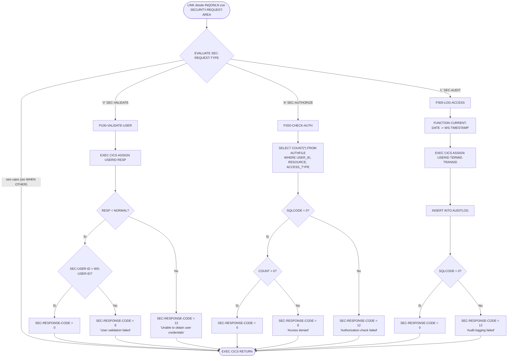
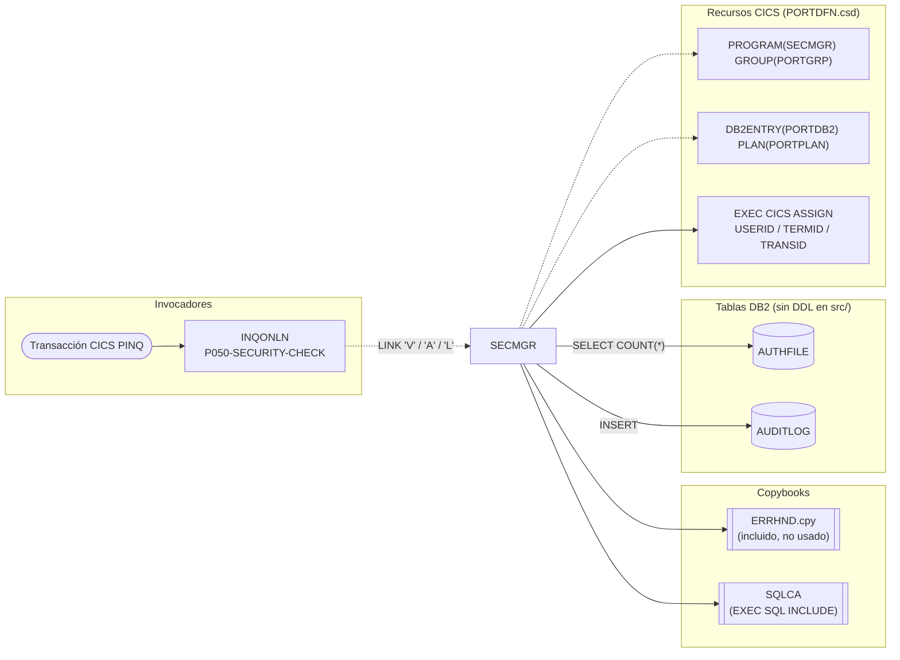

# SECMGR — Gestor de seguridad de la capa online (validación, autorización y auditoría)

> Generado a partir del análisis del código fuente `src/programs/online/SECMGR.cbl`. Ver el [grafo de dependencias global](../technical/dependency-graph.md).

## Ficha técnica
| Campo | Valor |
| --- | --- |
| Ruta | `src/programs/online/SECMGR.cbl` |
| Categoría | online |
| Tipo | CICS online (subrutina invocada por `EXEC CICS LINK`) |
| Líneas | 135 |
| Punto de entrada | Subrutina invocada por `LINK` desde `INQONLN` (no tiene transacción CICS propia; está definido como `PROGRAM(SECMGR)` en el grupo `PORTGRP` de `src/cics/PORTDFN.csd`) |
| Invocado por | `INQONLN` (párrafo `P050-SECURITY-CHECK`, tres `LINK` consecutivos con `SEC-REQUEST-TYPE` = `'V'`, `'A'`, `'L'`) |
| Invoca a | Ningún programa (ni `CALL` ni `LINK`). Accede a las tablas DB2 `AUTHFILE` (lectura) y `AUDITLOG` (inserción) y usa los comandos CICS `ASSIGN` y `RETURN` |

## Propósito
`SECMGR` es el componente de seguridad de aplicación de la capa online del sistema de carteras. Centraliza tres servicios que la transacción de consulta `PINQ` (`INQONLN`) necesita antes de atender cualquier petición de usuario: comprobar que el usuario indicado por el llamador coincide con el usuario realmente firmado en CICS, comprobar en la tabla DB2 `AUTHFILE` que dicho usuario tiene permiso sobre un recurso (programa) con un tipo de acceso concreto, y dejar constancia del acceso en la tabla de auditoría DB2 `AUDITLOG`. Se sitúa por debajo de `INQONLN` y por encima de DB2/CICS; no interactúa con pantallas ni con ficheros VSAM.

## Funcionamiento
El programa no tiene párrafo de inicialización ni bucle: cada `LINK` ejecuta exactamente una de tres operaciones, seleccionada por el campo `SEC-REQUEST-TYPE` de la COMMAREA, y devuelve el control con `EXEC CICS RETURN`.

### Cuerpo principal (`PROCEDURE DIVISION USING SECURITY-REQUEST-AREA`)
1. `EVALUATE TRUE` sobre las condiciones de nivel 88 de `SEC-REQUEST-TYPE`:
   - `SEC-VALIDATE` (`'V'`) → `PERFORM P100-VALIDATE-USER THRU P100-EXIT`.
   - `SEC-AUTHORIZE` (`'A'`) → `PERFORM P200-CHECK-AUTH THRU P200-EXIT`.
   - `SEC-AUDIT` (`'L'`) → `PERFORM P300-LOG-ACCESS THRU P300-EXIT`.
   - No hay rama `WHEN OTHER`: con cualquier otro valor no se ejecuta nada y `SEC-RESPONSE-CODE` conserva el valor que traía de la llamada anterior.
2. `EXEC CICS RETURN END-EXEC` devuelve el control al programa que hizo el `LINK`.

### `P100-VALIDATE-USER` — validación del usuario
1. `EXEC CICS ASSIGN USERID(WS-USER-ID) RESP(SEC-RESPONSE-CODE)` obtiene el ID del usuario firmado en la tarea CICS. Nótese que el código de respuesta CICS se recibe directamente en el campo de respuesta de la COMMAREA.
2. Si `SEC-RESPONSE-CODE = DFHRESP(NORMAL)`:
   - Si `SEC-USER-ID` (informado por el llamador) es igual a `WS-USER-ID` (obtenido de CICS) → `SEC-RESPONSE-CODE = 0`.
   - Si no → `SEC-ERROR-INFO = 'User validation failed'`, `SEC-RESPONSE-CODE = 8`.
3. Si el `ASSIGN` falla → `SEC-ERROR-INFO = 'Unable to obtain user credentials'`, `SEC-RESPONSE-CODE = 12`.

### `P200-CHECK-AUTH` — comprobación de autorización
1. Ejecuta `SELECT COUNT(*) INTO :WS-DB2-AREA FROM AUTHFILE WHERE USER_ID = :SEC-USER-ID AND RESOURCE = :SEC-RESOURCE-NAME AND ACCESS_TYPE = :SEC-ACCESS-TYPE`.
2. `EVALUATE SQLCODE`:
   - `WHEN 0`: si `WS-DB2-AREA > 0` (hay al menos una fila de autorización) → `SEC-RESPONSE-CODE = 0`; si no → `'Access denied'`, `SEC-RESPONSE-CODE = 8`.
   - `WHEN OTHER` → `'Authorization check failed'`, `SEC-RESPONSE-CODE = 12`.
3. La intención es un modelo de lista de control de acceso: existe autorización si hay una fila `(usuario, recurso, tipo de acceso)` en `AUTHFILE`. Ver en "Observaciones" por qué la implementación actual del host variable es defectuosa.

### `P300-LOG-ACCESS` — registro de auditoría
1. `MOVE FUNCTION CURRENT-DATE TO WS-TIMESTAMP` (fecha/hora del sistema, 21 caracteres en formato `AAAAMMDDhhmmsscc±hhmm`, en un campo `PIC X(26)`).
2. `EXEC CICS ASSIGN USERID(WS-USER-ID) TERMID(WS-TERMINAL-ID) TRANSID(WS-TRANSACTION-ID)` sin `RESP`: recupera usuario, terminal y transacción del contexto CICS.
3. Copia `SEC-RESOURCE-NAME` → `WS-PROGRAM-NAME` y `SEC-ACCESS-TYPE` → `WS-ACCESS-TYPE`.
4. `INSERT INTO AUDITLOG (TIMESTAMP, USER_ID, TERMINAL_ID, TRANS_ID, PROGRAM, ACCESS_TYPE) VALUES (...)` con los seis campos de `WS-SECURITY-AREA`.
5. Si `SQLCODE = 0` → `SEC-RESPONSE-CODE = 0`; si no → `'Audit logging failed'`, `SEC-RESPONSE-CODE = 12`.

### Secuencia completa vista desde el llamador
`INQONLN.P050-SECURITY-CHECK` encadena las tres operaciones y solo avanza a la siguiente si la anterior devolvió `0`: primero `'V'` (con `SEC-USER-ID` rellenado por el propio `INQONLN` mediante `EXEC CICS ASSIGN USERID`), después `'A'` con `SEC-RESOURCE-NAME = 'INQONLN'` y `SEC-ACCESS-TYPE = 'READ'`, y por último `'L'` reutilizando esos mismos valores para la fila de auditoría.

## Interfaz
- **Parámetros / LINKAGE SECTION / COMMAREA**: el programa declara en `LINKAGE SECTION` la estructura `SECURITY-REQUEST-AREA` (109 bytes) y la recibe en `PROCEDURE DIVISION USING SECURITY-REQUEST-AREA`. El llamador (`INQONLN`) la pasa como `COMMAREA` de `EXEC CICS LINK`, usando una copia local idéntica (`WS-SECURITY-REQUEST`) porque no existe copybook común para esta área.

  | Campo | PIC | Dirección | Descripción |
  | --- | --- | --- | --- |
  | `SEC-REQUEST-TYPE` | `X` | Entrada | Operación: `'V'` validar usuario (`SEC-VALIDATE`), `'A'` autorizar (`SEC-AUTHORIZE`), `'L'` auditar (`SEC-AUDIT`) |
  | `SEC-USER-ID` | `X(8)` | Entrada | Usuario a validar / autorizar |
  | `SEC-RESOURCE-NAME` | `X(8)` | Entrada | Recurso (nombre de programa) a autorizar / auditar |
  | `SEC-ACCESS-TYPE` | `X(8)` | Entrada | Tipo de acceso (p. ej. `'READ'`) |
  | `SEC-RESPONSE-CODE` | `S9(8) COMP` | Salida | `0` OK, `8` rechazo funcional, `12` error técnico (ver abajo). En `P100` también recibe temporalmente el `RESP` del `ASSIGN` |
  | `SEC-ERROR-INFO` | `X(80)` | Salida | Texto de error en inglés; no se limpia cuando la operación termina bien |

- **Ficheros (DDNAME, organización, modo de apertura, clave)**: No aplica. El programa no tiene `FILE-CONTROL` ni `FILE SECTION`.

- **Tablas DB2 y sentencias SQL**:

  | Tabla | Párrafo | Sentencia | Acceso | Columnas referenciadas | DDL en `src/` |
  | --- | --- | --- | --- | --- | --- |
  | `AUTHFILE` | `P200-CHECK-AUTH` | `SELECT COUNT(*) INTO :WS-DB2-AREA ... WHERE USER_ID = :SEC-USER-ID AND RESOURCE = :SEC-RESOURCE-NAME AND ACCESS_TYPE = :SEC-ACCESS-TYPE` | READ | `USER_ID`, `RESOURCE`, `ACCESS_TYPE` | No |
  | `AUDITLOG` | `P300-LOG-ACCESS` | `INSERT INTO AUDITLOG (TIMESTAMP, USER_ID, TERMINAL_ID, TRANS_ID, PROGRAM, ACCESS_TYPE) VALUES (:WS-TIMESTAMP, :WS-USER-ID, :WS-TERMINAL-ID, :WS-TRANSACTION-ID, :WS-PROGRAM-NAME, :WS-ACCESS-TYPE)` | WRITE | `TIMESTAMP`, `USER_ID`, `TERMINAL_ID`, `TRANS_ID`, `PROGRAM`, `ACCESS_TYPE` | No |

  No hay `COMMIT`/`ROLLBACK` explícitos: la unidad de trabajo se cierra con el syncpoint implícito del `EXEC CICS RETURN` de la transacción `PINQ`. El acceso a DB2 desde CICS se hace a través de la `DB2ENTRY(PORTDB2)` con `PLAN(PORTPLAN)` y `AUTHTYPE(USERID)` definida en `PORTDFN.csd`, es decir, el SQL se ejecuta con la autorización DB2 del usuario firmado.

- **Mapas BMS / comandos CICS**: no usa mapas BMS. Comandos CICS:

  | Comando | Párrafo | Opciones | Control de errores |
  | --- | --- | --- | --- |
  | `EXEC CICS ASSIGN` | `P100-VALIDATE-USER` | `USERID(WS-USER-ID)` | `RESP(SEC-RESPONSE-CODE)` |
  | `EXEC CICS ASSIGN` | `P300-LOG-ACCESS` | `USERID`, `TERMID`, `TRANSID` | Sin `RESP` |
  | `EXEC CICS RETURN` | cuerpo principal | — | — |

- **Códigos de retorno / RETURN-CODE**: no usa `RETURN-CODE` ni `GOBACK`; el resultado se devuelve en `SEC-RESPONSE-CODE`:

  | Valor | Significado | Situaciones |
  | --- | --- | --- |
  | `0` | Éxito | Usuario coincide; existe fila de autorización; auditoría insertada |
  | `8` | Rechazo funcional | `'User validation failed'` (usuario distinto del firmado), `'Access denied'` (sin fila en `AUTHFILE`) |
  | `12` | Error técnico | `'Unable to obtain user credentials'` (`ASSIGN` no NORMAL), `'Authorization check failed'` (SQLCODE ≠ 0 en el `SELECT`), `'Audit logging failed'` (SQLCODE ≠ 0 en el `INSERT`) |
  | (sin cambio) | Tipo de petición desconocido | El campo no se modifica; el llamador puede interpretar erróneamente un `0` heredado como éxito |

## Estructuras de datos clave
- **Copybook `ERRHND`** (`src/copybook/online/ERRHND.cpy`): estructura estándar de error online (`ERR-PROGRAM`, `ERR-PARAGRAPH`, `ERR-SQLCODE`, `ERR-CICS-RESP`, `ERR-CICS-RESP2`, `ERR-SEVERITY`, `ERR-MESSAGE`, `ERR-ACTION`, `ERR-TRACE`). Se incluye bajo `01 WS-ERROR-AREA` pero **ningún campo se utiliza** en el programa: los errores se comunican exclusivamente por `SEC-RESPONSE-CODE`/`SEC-ERROR-INFO` y nunca se invoca a `ERRHNDL`.
- **`EXEC SQL INCLUDE SQLCA`** bajo `01 WS-DB2-AREA`: área de comunicación SQL. El programa evalúa `SQLCODE` tras cada sentencia. El nombre `WS-DB2-AREA` se usa además como host variable del `SELECT COUNT(*)` y en la comparación `WS-DB2-AREA > 0` (ver Observaciones).
- **`WS-SECURITY-AREA`** (WORKING-STORAGE): campos de contexto obtenidos de CICS y copiados de la COMMAREA para alimentar la fila de auditoría:

  | Campo | PIC | Origen |
  | --- | --- | --- |
  | `WS-USER-ID` | `X(8)` | `ASSIGN USERID` |
  | `WS-TERMINAL-ID` | `X(4)` | `ASSIGN TERMID` |
  | `WS-TRANSACTION-ID` | `X(4)` | `ASSIGN TRANSID` |
  | `WS-PROGRAM-NAME` | `X(8)` | `SEC-RESOURCE-NAME` |
  | `WS-ACCESS-TYPE` | `X(8)` | `SEC-ACCESS-TYPE` |
  | `WS-TIMESTAMP` | `X(26)` | `FUNCTION CURRENT-DATE` |

- **`SECURITY-REQUEST-AREA`** (LINKAGE): descrita en "Interfaz". Los niveles 88 `SEC-VALIDATE`/`SEC-AUTHORIZE`/`SEC-AUDIT` solo existen en `SECMGR`; el llamador mueve los literales `'V'`, `'A'`, `'L'` directamente.
- No hay flags, contadores ni umbrales (no es un programa de proceso masivo; no hay commits cada N registros).

## Reglas de negocio y validaciones
1. **Identidad del usuario** (`P100`): el usuario que el llamador declara (`SEC-USER-ID`) debe coincidir exactamente (comparación `PIC X(8)` completa) con el usuario firmado en CICS (`ASSIGN USERID`). Cualquier discrepancia se considera intento de suplantación y devuelve `8`.
2. **Autorización por lista de control de acceso** (`P200`): el acceso se concede si y solo si existe al menos una fila en `AUTHFILE` con la terna exacta `(USER_ID, RESOURCE, ACCESS_TYPE)`. No hay comodines, jerarquía de roles ni autorización por defecto: si la tabla no contiene la fila, el resultado es `'Access denied'`. Los valores se comparan tal cual (campos `CHAR` rellenos con espacios, p. ej. `'READ    '`).
3. **Trazabilidad obligatoria** (`P300`): cada acceso autorizado se registra con marca de tiempo, usuario, terminal, transacción, programa y tipo de acceso. El fallo de auditoría se devuelve como error técnico (`12`), lo que en `INQONLN` provoca el tratamiento de error y el fin de la transacción: la política implícita es "sin auditoría no hay servicio".
4. **Gradación de códigos**: `0` = permitir, `8` = denegar por regla de negocio, `12` = imposibilidad técnica de decidir. El llamador (`INQONLN`) trata cualquier valor distinto de `0` como error y no distingue entre `8` y `12`.
5. **Operación única por invocación**: el programa no encadena validación→autorización→auditoría internamente; la orquestación y el orden son responsabilidad del llamador.

## Manejo de errores y recuperación
- **Condiciones CICS**: solo el `ASSIGN` de `P100` usa `RESP`; el `ASSIGN` de `P300` y el `RETURN` no tienen `RESP` ni `HANDLE CONDITION`, por lo que una condición excepcional en ellos seguiría la acción por defecto de CICS (abend de la tarea). No hay `HANDLE ABEND`.
- **SQLCODE**: se inspecciona con `EVALUATE SQLCODE` (`P200`) e `IF SQLCODE = 0` (`P300`). Cualquier valor distinto de `0` (incluidos avisos positivos como `+100`, que no deberían producirse en un `COUNT(*)`) se trata como error técnico y se traduce a `SEC-RESPONSE-CODE = 12` con un mensaje fijo; el `SQLCODE` concreto **no se propaga** al llamador ni se registra en ningún sitio. No se usa `WHENEVER SQLERROR`.
- **Rollback / recuperación**: no hay `EXEC CICS SYNCPOINT` ni `ROLLBACK`. Si el `INSERT` en `AUDITLOG` se ejecuta con éxito y después la transacción `PINQ` termina anormalmente, CICS/DB2 deshacen la inserción con el backout de la unidad de trabajo; si la transacción termina normalmente, el syncpoint implícito del `RETURN` final la confirma.
- **FILE STATUS / checkpoint-restart**: no aplica (sin ficheros, programa online sin estado).
- **ERRPROC / ERRHNDL / DB2ERR**: no se invocan. Aunque se incluye el copybook `ERRHND`, no se rellena ni se hace `LINK` a `ERRHNDL`; la integración con el manejador de errores centralizado la realiza el llamador `INQONLN` (`P900-ERROR-ROUTINE`) a partir de `SEC-ERROR-INFO`.
- **Mensajes de error**: cinco literales fijos en inglés (`'User validation failed'`, `'Unable to obtain user credentials'`, `'Access denied'`, `'Authorization check failed'`, `'Audit logging failed'`). `SEC-ERROR-INFO` no se inicializa a espacios en el camino de éxito, así que un mensaje de una llamada anterior puede quedar residual en la COMMAREA.

## Dependencias

## Observaciones y problemas detectados
1. **Host variable inválido en `P200-CHECK-AUTH`**: `SELECT COUNT(*) INTO :WS-DB2-AREA` usa como destino el grupo `WS-DB2-AREA`, que es el mismo `01` bajo el que se incluye la `SQLCA`. `COUNT(*)` devuelve un único entero y debe recibirse en un host variable elemental numérico (p. ej. `PIC S9(9) COMP`); además, escribir el resultado sobre el área de la SQLCA corrompería el propio `SQLCODE` que se evalúa justo después. La comparación posterior `IF WS-DB2-AREA > 0` compara un grupo alfanumérico con un literal numérico, no un contador. Con toda probabilidad este párrafo no supera el precompilador DB2 y, en cualquier caso, la lógica de autorización no funciona como se describe en la cabecera del programa. Es el hallazgo más grave.
2. **`01` sin `PICTURE` seguidos de otro `01`** (`WS-DB2-AREA` + `INCLUDE SQLCA`, `WS-ERROR-AREA` + `COPY ERRHND`): tanto la SQLCA expandida como `ERRHND.cpy` empiezan con su propio nivel `01` (`SQLCA`, `ERROR-HANDLING`), por lo que `WS-DB2-AREA` y `WS-ERROR-AREA` quedan como elementos elementales sin `PIC`, algo que Enterprise COBOL rechaza en compilación. El mismo patrón se repite en `INQONLN`, `DB2ONLN` y `ERRHNDL`, así que es un defecto sistémico del repositorio, no exclusivo de `SECMGR`.
3. **Recepción de la COMMAREA mediante `PROCEDURE DIVISION USING SECURITY-REQUEST-AREA`**: en un programa CICS invocado con `LINK ... COMMAREA(...)`, el área se direcciona a través de `DFHCOMMAREA` (o `EXEC CICS ADDRESS COMMAREA`); el traductor CICS antepone `DFHEIBLK` y `DFHCOMMAREA` a la lista `USING`, de modo que `SECURITY-REQUEST-AREA` quedaría como tercer parámetro sin argumento correspondiente y, probablemente, sin dirección válida en ejecución. `ERRHNDL` sí usa la convención correcta (`01 DFHCOMMAREA` en LINKAGE); `SECMGR` y `DB2ONLN` no. Es una inferencia a partir del comportamiento documentado del traductor; el repositorio no incluye listados de compilación que lo confirmen.
4. **Formato de `WS-TIMESTAMP`**: `FUNCTION CURRENT-DATE` produce 21 caracteres `AAAAMMDDhhmmsscc±hhmm`, que se insertan en la columna `TIMESTAMP` de `AUDITLOG`. Si esa columna es de tipo DB2 `TIMESTAMP` (no se puede verificar: no hay DDL), el literal no tiene un formato de marca de tiempo válido y el `INSERT` fallaría con `SQLCODE -180`, devolviendo siempre `'Audit logging failed'`.
5. **Tablas `AUTHFILE` y `AUDITLOG` sin DDL**: no existen en `src/database/db2/` (`db2-definitions.sql`, `ERRLOG.sql`, `POSHIST.sql`, `RTNCODES.sql`) ni se mencionan en `data-dictionary.md`. La columna `RESOURCE` y las columnas de `AUDITLOG` solo se conocen por el SQL de este programa. Tampoco hay `BIND PACKAGE` para `SECMGR` en `PORTPLAN.sql` (solo `BIND PLAN PORTPLAN PKLIST(*.PORTPKG.*)`).
6. **Colisión de nombres `AUDITLOG`**: la tabla DB2 `AUDITLOG` que alimenta `SECMGR` no tiene relación con el copybook `src/copybook/common/AUDITLOG.cpy` (registro `AUDIT-RECORD` de fichero) ni con el DD `AUDITLOG` (`PROD.AUDIT.LOG`) que lee el informe batch `RPTAUD00`. En consecuencia, los eventos de seguridad online que registra `SECMGR` **no aparecen en el informe de auditoría batch**, aunque `system-architecture.md` (§8.1.1) dibuja "Audit Logging → Audit Reports".
7. **Falta `WHEN OTHER` en el `EVALUATE` principal**: con un `SEC-REQUEST-TYPE` no reconocido el programa retorna sin tocar `SEC-RESPONSE-CODE` ni `SEC-ERROR-INFO`. Como `INQONLN` solo comprueba `= 0`, un valor residual `0` de una llamada previa se interpretaría como éxito.
8. **Validación de usuario tautológica en el flujo real**: `INQONLN.P050-SECURITY-CHECK` rellena `SEC-USER-ID` con `EXEC CICS ASSIGN USERID` inmediatamente antes de pedir `'V'`, y `SECMGR` lo compara con el resultado del mismo comando. En la única cadena de llamada existente la validación no puede fallar salvo por error del `ASSIGN`; solo aportaría valor si el llamador recibiese el usuario de una fuente externa (p. ej. la pantalla).
9. **Copybook `ERRHND` incluido pero no utilizado**: `WS-ERROR-AREA`/`ERROR-HANDLING` nunca se rellena y no se hace `LINK` a `ERRHNDL`, a diferencia de lo que sugiere el diseño de la capa online. El `SQLCODE` real y `EIBRESP` se pierden; solo llega al llamador un texto fijo.
10. **`ASSIGN` sin `RESP` en `P300-LOG-ACCESS`**: a diferencia de `P100`, el segundo `ASSIGN` no controla la respuesta; una condición excepcional provocaría un abend en lugar de un `SEC-RESPONSE-CODE = 12`.
11. **Reutilización de `SEC-RESPONSE-CODE` como `RESP`**: en `P100` el campo de respuesta de la COMMAREA recibe primero el `RESP` de CICS y luego se sobrescribe con `0/8/12`. Funciona, pero mezcla dos dominios de códigos en el mismo campo y dificulta la lectura.
12. **Discrepancias con `system-architecture.md`** (manda el código):
    - §5.1.4 indica que `SECMGR` depende de `DB2ONLN`; el código accede a DB2 con SQL embebido directo y no invoca a `DB2ONLN`.
    - §5.2.2 dibuja `INQPORT → SECMGR` e `INQHIST → SECMGR`; en el código solo `INQONLN` hace `LINK` a `SECMGR` (`INQPORT` e `INQHIST` no lo referencian).
    - §1.2.6 y §8.1.1 atribuyen a `SECMGR` "gestión de sesión" y "alertas de seguridad"; no hay nada de eso implementado (no mantiene estado entre llamadas ni emite alertas).
    - La cabecera del propio programa habla de "Manages DB2 authorization"; en realidad consulta una tabla de aplicación (`AUTHFILE`), no autorizaciones nativas de DB2 (`GRANT`).
13. **Orden de operaciones en `INQONLN`** (afecta al uso de `SECMGR`, no a su código): el llamador ejecuta primero la petición de negocio (`P100-PROCESS-REQUEST` → `INQPORT`/`INQHIST`) y **después** `P050-SECURITY-CHECK`, de modo que la autorización se comprueba una vez ya servida la consulta. Se anota aquí porque invalida en la práctica la protección que `SECMGR` pretende ofrecer.

## Referencias
- Programa: [SECMGR.cbl](../../src/programs/online/SECMGR.cbl)
- Llamador: [INQONLN.cbl](../../src/programs/online/INQONLN.cbl) (párrafo `P050-SECURITY-CHECK`)
- Copybook: [ERRHND.cpy](../../src/copybook/online/ERRHND.cpy)
- Manejador de errores relacionado (no invocado por `SECMGR`): [ERRHNDL.cbl](../../src/programs/online/ERRHNDL.cbl)
- Definiciones CICS: [PORTDFN.csd](../../src/cics/PORTDFN.csd) (`PROGRAM(SECMGR)`, `DB2ENTRY(PORTDB2)`, `TRANSACTION(PINQ)`)
- Plan DB2: [PORTPLAN.sql](../../src/database/db2/PORTPLAN.sql)
- DDL DB2 existente (no incluye `AUTHFILE` ni `AUDITLOG`): [db2-definitions.sql](../../src/database/db2/db2-definitions.sql), [ERRLOG.sql](../../src/database/db2/ERRLOG.sql)
- Copybook homónimo de fichero, no relacionado con la tabla DB2: [AUDITLOG.cpy](../../src/copybook/common/AUDITLOG.cpy); informe batch de auditoría: [RPTAUD00.cbl](../../src/programs/batch/RPTAUD00.cbl), [RPTAUD.jcl](../../src/jcl/batch/RPTAUD.jcl)
- Arquitectura: [system-architecture.md](../technical/system-architecture.md), [data-dictionary.md](../technical/data-dictionary.md)
- Grafo de dependencias: [dependency-graph.md](../technical/dependency-graph.md), [dependency-graph.json](../technical/dependency-graph.json)
