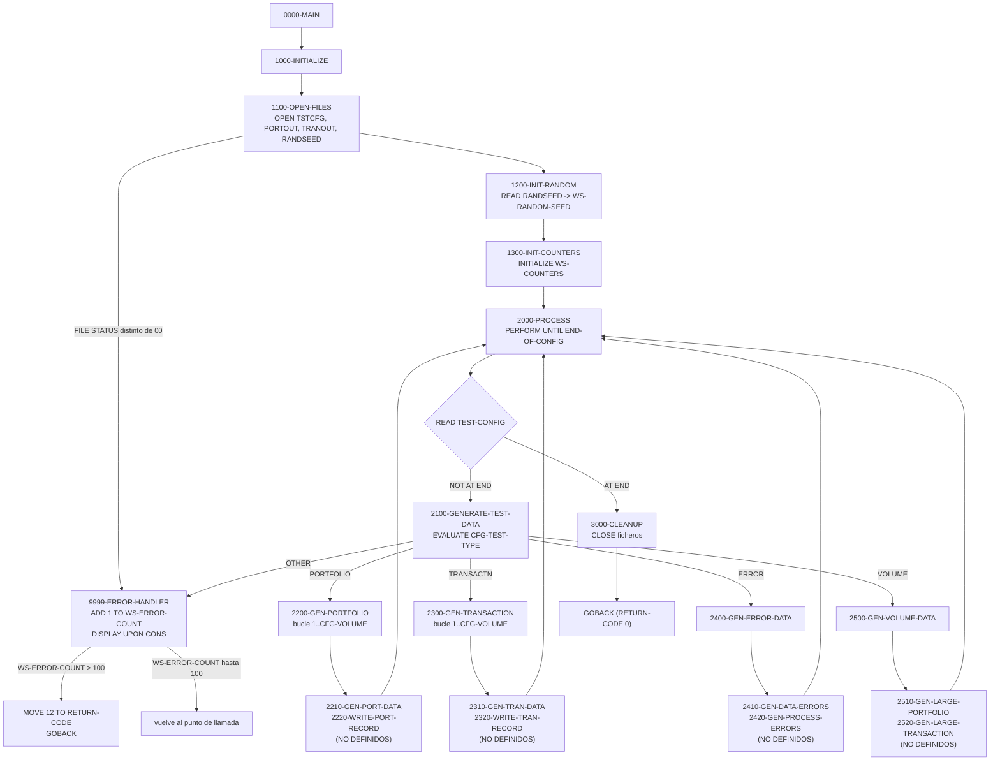
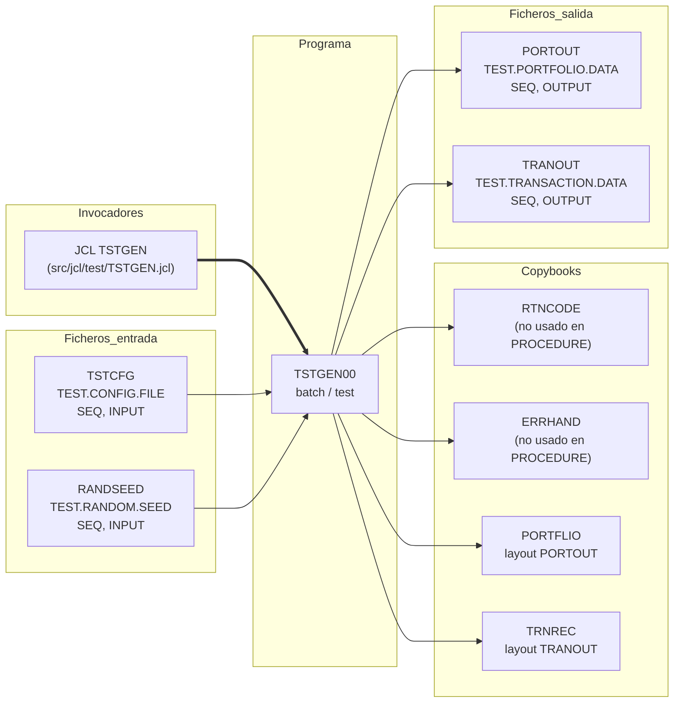

# TSTGEN00 — Generador de datos de prueba (carteras y transacciones)

> Generado a partir del análisis del código fuente `src/programs/test/TSTGEN00.cbl`. Ver el [grafo de dependencias global](../technical/dependency-graph.md).

## Ficha técnica
| Campo | Valor |
| --- | --- |
| Ruta | `src/programs/test/TSTGEN00.cbl` |
| Categoría | test |
| Tipo | batch |
| Líneas | 216 |
| Punto de entrada | JCL `TSTGEN` (`src/jcl/test/TSTGEN.jcl`, paso `STEP01`, `EXEC PGM=TSTGEN00`) |
| Invocado por | JCL `TSTGEN` (job `TSTGEN00`). No es invocado por ningún programa COBOL mediante `CALL` ni `EXEC CICS LINK`. |
| Invoca a | Ningún programa (no hay `CALL`, `LINK` ni `XCTL`). Usa los copybooks `RTNCODE`, `ERRHAND`, `PORTFLIO` y `TRNREC`. |

## Propósito
`TSTGEN00` es el generador de datos de prueba de la capa de test de la CLBS. Su función es leer un fichero de configuración de pruebas (`TSTCFG`) en el que cada registro describe un escenario (tipo de prueba y volumen) y, a partir de una semilla aleatoria leída del fichero `RANDSEED`, producir ficheros secuenciales de carteras (`PORTOUT`) y transacciones (`TRANOUT`) con el formato de los copybooks `PORTFLIO` y `TRNREC`. Estos ficheros están pensados como entrada para el resto de la suite (p. ej. la validación de transacciones `TRNVAL00` o el flujo batch), y su contraparte en la capa de test es `TSTVAL00`, que ejecuta casos de prueba y compara resultados.

En su estado actual el programa es un **esqueleto**: define el flujo de control completo (apertura de ficheros, lectura de la semilla, bucle sobre la configuración, despacho por tipo de prueba y cierre), pero los párrafos que realmente generan y escriben los registros no están codificados (ver [Observaciones](#observaciones-y-problemas-detectados)).

## Funcionamiento

### Flujo principal
1. **`0000-MAIN`** — Ejecuta secuencialmente `1000-INITIALIZE`, `2000-PROCESS` y `3000-CLEANUP`, y termina con `GOBACK`.

2. **`1000-INITIALIZE`** — Encadena tres párrafos de inicialización:
   - **`1100-OPEN-FILES`**: abre `TEST-CONFIG` (`INPUT`), `PORTFOLIO-OUT` (`OUTPUT`), `TRANSACTION-OUT` (`OUTPUT`) y `RANDOM-SEED` (`INPUT`). Tras cada `OPEN` comprueba el `FILE STATUS` correspondiente; si es distinto de `'00'`, mueve un mensaje descriptivo (`'ERROR OPENING CONFIG FILE'`, `'ERROR OPENING PORTFOLIO OUTPUT'`, `'ERROR OPENING TRANSACTION OUTPUT'`, `'ERROR OPENING RANDOM SEED'`) a `WS-ERROR-MESSAGE` y ejecuta `9999-ERROR-HANDLER`. Importante: el manejador de errores **no aborta** en el primer error, por lo que el programa continúa aunque un fichero no se haya abierto.
   - **`1200-INIT-RANDOM`**: hace un único `READ RANDOM-SEED` y copia `SEED-RECORD` (`PIC 9(9)`) a `WS-RANDOM-SEED`. No comprueba `WS-RAND-STATUS` ni contempla `AT END`.
   - **`1300-INIT-COUNTERS`**: `INITIALIZE WS-COUNTERS` (pone a cero `WS-RECORDS-WRITTEN` y `WS-ERROR-COUNT`).

3. **`2000-PROCESS`** — Bucle `PERFORM UNTIL END-OF-CONFIG`. En cada iteración lee un registro de `TEST-CONFIG`; en `AT END` activa el flag `END-OF-CONFIG`, y en `NOT AT END` ejecuta `2100-GENERATE-TEST-DATA`. Cada registro de configuración representa, por tanto, un escenario de generación independiente.

4. **`2100-GENERATE-TEST-DATA`** — `EVALUATE CFG-TEST-TYPE` (campo `PIC X(10)` del registro de configuración) contra las constantes de `WS-TEST-TYPES`:
   | Valor de `CFG-TEST-TYPE` | Párrafo ejecutado |
   | --- | --- |
   | `PORTFOLIO` | `2200-GEN-PORTFOLIO` |
   | `TRANSACTN` | `2300-GEN-TRANSACTION` |
   | `ERROR` | `2400-GEN-ERROR-DATA` |
   | `VOLUME` | `2500-GEN-VOLUME-DATA` |
   | cualquier otro | mensaje `'INVALID TEST TYPE'` → `9999-ERROR-HANDLER` |

5. **`2200-GEN-PORTFOLIO`** — `PERFORM VARYING WS-RECORDS-WRITTEN FROM 1 BY 1 UNTIL WS-RECORDS-WRITTEN > CFG-VOLUME`; en cada vuelta ejecuta `2210-GEN-PORT-DATA` y `2220-WRITE-PORT-RECORD`. Es decir, la intención es generar exactamente `CFG-VOLUME` registros de cartera. **Ninguno de los dos párrafos internos existe en el fuente.**

6. **`2300-GEN-TRANSACTION`** — Misma estructura que el anterior, con `2310-GEN-TRAN-DATA` y `2320-WRITE-TRAN-RECORD` (tampoco definidos), para generar `CFG-VOLUME` transacciones.

7. **`2400-GEN-ERROR-DATA`** — Ejecuta `2410-GEN-DATA-ERRORS` y `2420-GEN-PROCESS-ERRORS` (no definidos). Por los nombres, generaría datos con errores de contenido y errores de proceso, respectivamente. No utiliza `CFG-VOLUME`.

8. **`2500-GEN-VOLUME-DATA`** — Ejecuta `2510-GEN-LARGE-PORTFOLIO` y `2520-GEN-LARGE-TRANSACTION` (no definidos), destinados a volúmenes grandes para pruebas de rendimiento. Tampoco utiliza `CFG-VOLUME`.

9. **`3000-CLEANUP`** — `CLOSE` de los cuatro ficheros en una sola sentencia, sin comprobar `FILE STATUS`.

10. **`9999-ERROR-HANDLER`** — Incrementa `WS-ERROR-COUNT`, muestra `WS-ERROR-MESSAGE` en consola (`DISPLAY ... UPON CONS`, siendo `CONS` el mnemónico de `CONSOLE` definido en `SPECIAL-NAMES`) y, únicamente si el contador supera 100, mueve `12` a `RETURN-CODE` y hace `GOBACK` (fin inmediato del programa, sin pasar por `3000-CLEANUP`). Con 100 errores o menos, el control vuelve al punto de llamada y el proceso continúa.

### Diagrama de flujo

## Interfaz

- **Parámetros / LINKAGE SECTION / COMMAREA**: No aplica. El programa no tiene `LINKAGE SECTION` ni `PROCEDURE DIVISION USING`; no lee `PARM=` del JCL ni `SYSIN`. Toda la parametrización llega por el fichero `TSTCFG`.

- **Ficheros (DDNAME, organización, modo de apertura, clave)**:

  | Fichero COBOL | DDNAME | Organización / acceso | Modo | FILE STATUS | Registro | Dataset en `TSTGEN.jcl` |
  | --- | --- | --- | --- | --- | --- | --- |
  | `TEST-CONFIG` | `TSTCFG` | `SEQUENTIAL` / `SEQUENTIAL`, `RECORDING MODE F` | `INPUT` | `WS-CFG-STATUS` | `CONFIG-RECORD` (80 bytes: `CFG-TEST-TYPE` X(10), `CFG-VOLUME` 9(6), `CFG-PARAMETERS` X(64)) | `TEST.CONFIG.FILE` (`DISP=SHR`) |
  | `PORTFOLIO-OUT` | `PORTOUT` | `SEQUENTIAL`, `RECORDING MODE F` | `OUTPUT` | `WS-PORT-STATUS` | `PORTFOLIO-RECORD` → `COPY PORTFLIO` (148 bytes calculados) | `TEST.PORTFOLIO.DATA` (`NEW,CATLG,DELETE`, `RECFM=FB,LRECL=100`) |
  | `TRANSACTION-OUT` | `TRANOUT` | `SEQUENTIAL`, `RECORDING MODE F` | `OUTPUT` | `WS-TRAN-STATUS` | `TRANSACTION-RECORD` → `COPY TRNREC` (152 bytes calculados) | `TEST.TRANSACTION.DATA` (`NEW,CATLG,DELETE`, `RECFM=FB,LRECL=100`) |
  | `RANDOM-SEED` | `RANDSEED` | `SEQUENTIAL`, `RECORDING MODE F` | `INPUT` | `WS-RAND-STATUS` | `SEED-RECORD` PIC 9(9) (9 bytes) | `TEST.RANDOM.SEED` (`DISP=SHR`) |

  Ninguno de los ficheros es VSAM ni tiene clave: todos son secuenciales (QSAM). Ninguno de los datasets `TEST.*` está definido en `src/database/vsam/vsam-definitions.txt` (ese fichero solo describe `PORTMSTR`, `TRANHIST` y `POSHIST`).

- **Tablas DB2 y sentencias SQL**: No aplica (no hay `EXEC SQL`).

- **Mapas BMS / comandos CICS**: No aplica (programa batch puro, sin `EXEC CICS`).

- **Códigos de retorno / RETURN-CODE**:
  | Valor | Cuándo |
  | --- | --- |
  | `0` | Fin normal por `0000-MAIN` → `GOBACK`. Se devuelve también aunque se hayan producido hasta 100 errores (aperturas fallidas, tipos de prueba inválidos), ya que el programa nunca asigna `RETURN-CODE` en esos casos. |
  | `12` | Solo cuando `WS-ERROR-COUNT > 100` dentro de `9999-ERROR-HANDLER`; se sale con `GOBACK` sin cerrar ficheros. |

  El copybook `RTNCODE` (`RETURN-CODE-AREA`) está incluido pero **no se usa** en ninguna sentencia.

## Estructuras de datos clave

### Copybooks
| Copybook | Ruta | Dónde se incluye | Qué aporta / uso real |
| --- | --- | --- | --- |
| `PORTFLIO` | `src/copybook/common/PORTFLIO.cpy` | `FILE SECTION`, bajo `01 PORTFOLIO-RECORD` (`COPY ... REPLACING ==:PREFIX:== BY ==PORT==`) | Layout del maestro de carteras: `PORT-KEY` (`PORT-ID` X(8), `PORT-ACCOUNT-NO` X(10)), `PORT-CLIENT-INFO`, `PORT-PORTFOLIO-INFO` (`PORT-STATUS` A/C/S), `PORT-FINANCIAL-INFO` (`PORT-TOTAL-VALUE`, `PORT-CASH-BALANCE` COMP-3), `PORT-AUDIT-INFO`, `PORT-FILLER` X(50). Define el formato del fichero `PORTOUT`. El copybook no contiene el pseudo-texto `:PREFIX:`, por lo que el `REPLACING` no tiene efecto. |
| `TRNREC` | `src/copybook/common/TRNREC.cpy` | `FILE SECTION`, bajo `01 TRANSACTION-RECORD` (`COPY ... REPLACING ==:PREFIX:== BY ==TRAN==`) | Layout de transacción: `TRN-KEY` (fecha, hora, cartera, secuencia), `TRN-DATA` (`TRN-TYPE` BU/SL/TR/FE, cantidad, precio, importe, moneda, `TRN-STATUS` P/D/F/R), `TRN-AUDIT`, `TRN-FILLER` X(50). Define el formato del fichero `TRANOUT`. Igual que el anterior, el `REPLACING` no tiene efecto. |
| `RTNCODE` | `src/copybook/common/RTNCODE.cpy` | `WORKING-STORAGE` | Área `RETURN-CODE-AREA` para gestión estandarizada de códigos de retorno (`RC-CURRENT-CODE`, `RC-HIGHEST-CODE`, `RC-STATUS`, etc.). **No se referencia** en la `PROCEDURE DIVISION`. |
| `ERRHAND` | `src/copybook/common/ERRHAND.cpy` | `WORKING-STORAGE` | Constantes de categoría de error (`ERR-CAT-*`), códigos estándar (`ERR-SUCCESS`=0 … `ERR-TERMINAL`=16), estructura `ERR-MESSAGE` y estados VSAM (`ERR-VSAM-*`). **No se referencia** en la `PROCEDURE DIVISION`; en particular no define `WS-ERROR-MESSAGE`, que el programa usa. |

### WORKING-STORAGE relevante
| Campo | PIC | Uso |
| --- | --- | --- |
| `WS-FILE-STATUS` (`WS-CFG-STATUS`, `WS-PORT-STATUS`, `WS-TRAN-STATUS`, `WS-RAND-STATUS`) | XX | `FILE STATUS` de los cuatro ficheros; solo se comprueban tras `OPEN`. |
| `WS-TEST-TYPES` (`WS-PORTFOLIO`='PORTFOLIO', `WS-TRANSACTION`='TRANSACTN', `WS-ERROR-TEST`='ERROR', `WS-VOLUME-TEST`='VOLUME') | X(10) | Literales de comparación del `EVALUATE` de `2100-GENERATE-TEST-DATA`. |
| `WS-END-OF-CONFIG` / 88 `END-OF-CONFIG` | X | Flag de fin de fichero de configuración que gobierna el bucle de `2000-PROCESS`. |
| `WS-RECORDS-WRITTEN` | 9(9) | Variable de control de los bucles `PERFORM VARYING` de `2200`/`2300`. Se reinicia a 1 en cada escenario, por lo que **no acumula** el total de registros escritos. |
| `WS-ERROR-COUNT` | 9(9) | Número de errores tratados por `9999-ERROR-HANDLER`; umbral de abandono: > 100. |
| `WS-RANDOM-SEED`, `WS-RANDOM-NUM`, `WS-RANDOM-DECIMAL` | 9(9), 9(9), 9(9)V99 | Semilla leída de `RANDSEED` y variables de trabajo para números aleatorios. Solo `WS-RANDOM-SEED` recibe un valor; ninguna se utiliza después (no hay `FUNCTION RANDOM` ni cálculo alguno). |
| `WS-PORTFOLIO-DATA` (`WS-PORT-ID` X(10), `WS-PORT-NAME` X(30), `WS-PORT-TYPE` X(2), `WS-PORT-STATUS` X(1), `WS-PORT-BALANCE` 9(15)V99) | — | Área de trabajo prevista para construir la cartera antes de escribirla. No se usa. Sus longitudes no coinciden con `PORTFLIO` (`PORT-ID` es X(8), `PORT-CLIENT-TYPE` X(1), importes S9(13)V99 COMP-3). |
| `WS-TRANSACTION-DATA` (`WS-TRAN-ID` X(12), `WS-TRAN-TYPE` X(2), `WS-TRAN-AMOUNT` 9(15)V99, `WS-TRAN-DATE` X(8), `WS-TRAN-STATUS` X(1)) | — | Área de trabajo prevista para la transacción. No se usa. |

## Reglas de negocio y validaciones
Las reglas efectivamente codificadas son pocas, dado el carácter incompleto del programa:

1. **Un escenario por registro de configuración**: cada registro de `TSTCFG` se procesa de forma independiente; el fichero se recorre completo hasta `AT END`.
2. **Despacho por tipo de prueba**: `CFG-TEST-TYPE` debe ser exactamente `PORTFOLIO`, `TRANSACTN`, `ERROR` o `VOLUME` (comparación de 10 caracteres, sensible a mayúsculas y relleno con espacios). Cualquier otro valor se contabiliza como error `'INVALID TEST TYPE'` y no genera datos, pero el proceso continúa con el siguiente registro.
3. **Volumen de generación**: para `PORTFOLIO` y `TRANSACTN` el número de registros a producir es `CFG-VOLUME` (`PIC 9(6)`, máximo 999.999), recorriendo el bucle de 1 a `CFG-VOLUME` inclusive. Si `CFG-VOLUME` es 0, no se genera nada. Para `ERROR` y `VOLUME` el campo `CFG-VOLUME` se ignora.
4. **`CFG-PARAMETERS`** (X(64)) se lee pero no se interpreta en ningún punto.
5. **Semilla aleatoria**: se toma del primer (y único) registro leído de `RANDSEED`; se guarda pero no se emplea. La intención probable (no implementada) es hacer reproducible la generación pseudoaleatoria.
6. **Tolerancia a errores**: el programa admite hasta 100 errores acumulados antes de abortar con `RETURN-CODE 12`. No hay validación de que `CFG-VOLUME` sea numérico ni de que los ficheros de salida se hayan abierto correctamente antes de intentar escribir.

No existen reglas sobre tipos de transacción (`TRN-TYPE`), estados de cartera, cálculos de importes ni umbrales de commit/checkpoint (no aplica a un generador de ficheros secuenciales sin DB2).

## Manejo de errores y recuperación
- **Errores de fichero (FILE STATUS)**: solo se comprueban los cuatro `OPEN` de `1100-OPEN-FILES`. El `READ` de `RANDOM-SEED`, los `READ` de `TEST-CONFIG` (fuera del `AT END`) y los `CLOSE` no verifican estado. Al no existir cláusulas `DECLARATIVES`/`USE AFTER ERROR`, un error de E/S en un `READ` sin `AT END` con `FILE STATUS` declarado no abenda, pero tampoco se detecta.
- **Manejador centralizado `9999-ERROR-HANDLER`**: contabiliza, muestra el mensaje por consola (`DISPLAY ... UPON CONS`) y solo aborta (`RETURN-CODE 12` + `GOBACK`) al superar 100 errores. En consecuencia, un fallo al abrir `PORTOUT` o `TRANOUT` no detiene el programa, que seguiría hasta intentar escribir (cuando existan los párrafos de escritura). El `GOBACK` desde el manejador omite `3000-CLEANUP`.
- **SQLCODE / condiciones CICS**: No aplica.
- **Checkpoint/restart y rollback**: No implementados. El programa no usa `BCHCTL00`, `CHKPT` ni ningún mecanismo de la infraestructura de checkpoint descrita en `system-architecture.md`; al ser ficheros de salida `DISP=(NEW,CATLG,DELETE)`, una reejecución tras fallo debe partir de cero (el JCL borra el dataset si el paso falla).
- **Llamadas a ERRPROC / ERRHNDL / DB2ERR**: Ninguna. El programa no invoca la rutina común de errores; solo incluye el copybook `ERRHAND` sin usarlo.

## Dependencias

No hay tablas DB2, mapas BMS, programas llamados (`CALL`/`LINK`) ni rutinas de sistema. El programa hermano `TSTVAL00` (JCL `TSTVAL`) no consume directamente `PORTOUT`/`TRANOUT`: sus DD son `TESTCASE`, `EXPECTED`, `ACTUAL` y `TESTRPT`, de modo que el encadenamiento entre ambos no está definido en el repositorio.

## Observaciones y problemas detectados

### Errores que impedirían la compilación
1. **Párrafos ejecutados pero no definidos** (ocho): `2210-GEN-PORT-DATA`, `2220-WRITE-PORT-RECORD`, `2310-GEN-TRAN-DATA`, `2320-WRITE-TRAN-RECORD`, `2410-GEN-DATA-ERRORS`, `2420-GEN-PROCESS-ERRORS`, `2510-GEN-LARGE-PORTFOLIO` y `2520-GEN-LARGE-TRANSACTION`. Toda la lógica de generación y escritura (`WRITE PORTFOLIO-RECORD`/`TRANSACTION-RECORD`) está ausente: el programa, tal cual, **no escribe ningún registro**.
2. **`WS-ERROR-MESSAGE` no está definido** ni en `WORKING-STORAGE` ni en los copybooks `RTNCODE`/`ERRHAND`, pero se usa en cinco `MOVE` y en el `DISPLAY` de `9999-ERROR-HANDLER`. El mismo patrón se repite en otros programas del repositorio (`TSTVAL00`, `RPTPOS00`, `INQONLN`, etc.), lo que sugiere que se asumía un copybook común que no existe en `src/copybook/`.
3. **Nombres duplicados y ambiguos**: `WS-PORT-STATUS` está definido dos veces (`PIC XX` en `WS-FILE-STATUS` y `PIC X(1)` en `WS-PORTFOLIO-DATA`), igual que `WS-TRAN-STATUS` (`PIC XX` en `WS-FILE-STATUS` y `PIC X(1)` en `WS-TRANSACTION-DATA`). Las cláusulas `FILE STATUS IS WS-PORT-STATUS` / `WS-TRAN-STATUS` y los `IF` de `1100-OPEN-FILES` los referencian sin cualificar (`OF WS-FILE-STATUS`), lo que produce referencias ambiguas.
4. **Niveles 01 anidados en la FILE SECTION**: `01 PORTFOLIO-RECORD.` va seguido de `COPY PORTFLIO`, cuyo primer elemento es a su vez `01 PORT-RECORD.`; lo mismo ocurre con `01 TRANSACTION-RECORD.` + `COPY TRNREC`, que expande otro `01 TRANSACTION-RECORD.` (nombre duplicado). Un nivel 01 sin subordinados y un segundo 01 dentro de un mismo `FD` son inválidos tal como están escritos; el programa parece asumir copybooks con niveles 05 y prefijo parametrizable.
5. **`COPY ... REPLACING ==:PREFIX:== BY ==PORT==` / `==TRAN==` sin efecto**: ni `PORTFLIO.cpy` ni `TRNREC.cpy` contienen el pseudo-texto `:PREFIX:`; los campos ya vienen con prefijo fijo `PORT-` y `TRN-` (no `TRAN-`). Las variables de trabajo `WS-TRAN-*` sugieren que el autor esperaba campos `TRAN-*` que no existen.

### Inconsistencias con el JCL y la documentación
6. **Longitud de registro**: `TSTGEN.jcl` define `PORTOUT` y `TRANOUT` con `LRECL=100`, pero el registro `PORTFLIO` mide 148 bytes y `TRNREC` 152 bytes (sumando las PIC, con los COMP-3 de 15 dígitos ocupando 8 bytes). En ejecución real esto provocaría un error de apertura/escritura (`FILE STATUS 39` o abend por conflicto de DCB).
7. **Formato de la semilla**: `RANDSEED` se define como `RECORDING MODE F` con registro de 9 bytes; el JCL no especifica `DCB` para `TEST.RANDOM.SEED`, así que depende de cómo esté catalogado el dataset.
8. **`system-architecture.md`** describe a `TSTGEN00` como generador de "test portfolios, test transactions, error scenarios y volume testing". El código solo contiene el esqueleto de esas cuatro funciones; ninguna está implementada. La documentación de arquitectura describe la intención, no el estado real del código.
9. **`data-dictionary.md`** no documenta los ficheros `TEST.CONFIG.FILE`, `TEST.PORTFOLIO.DATA`, `TEST.TRANSACTION.DATA` ni `TEST.RANDOM.SEED`; el formato del fichero de configuración solo se conoce por la `FD` del programa.

### Problemas lógicos y de robustez (aun completando el código)
10. `9999-ERROR-HANDLER` no aborta ante fallos de `OPEN`: el proceso continúa con ficheros no abiertos, y solo termina tras más de 100 errores. Además, el `GOBACK` del manejador salta `3000-CLEANUP`.
11. `RETURN-CODE` queda en 0 aunque haya habido hasta 100 errores (tipos de prueba inválidos, aperturas fallidas), por lo que el JCL no puede detectar ejecuciones parcialmente erróneas mediante `COND`.
12. `1200-INIT-RANDOM` hace `READ RANDOM-SEED` sin `AT END` ni comprobación de `WS-RAND-STATUS`; con un fichero vacío `WS-RANDOM-SEED` quedaría con contenido indefinido.
13. `WS-RECORDS-WRITTEN` se usa como índice de bucle (reiniciado a 1 en cada escenario) en lugar de acumular los registros escritos, y nunca se muestra ni se devuelve un resumen de ejecución.
14. Variables definidas y nunca usadas: `WS-RANDOM-NUM`, `WS-RANDOM-DECIMAL`, todo `WS-PORTFOLIO-DATA`, todo `WS-TRANSACTION-DATA`, `CFG-PARAMETERS`, y los copybooks `RTNCODE` y `ERRHAND` completos.
15. `CFG-VOLUME` (`PIC 9(6)`) no se valida como numérico antes de usarlo como límite del bucle; un valor no numérico en el fichero de configuración daría un resultado indefinido.

## Referencias
- Programa: [TSTGEN00.cbl](../../src/programs/test/TSTGEN00.cbl)
- JCL de ejecución: [TSTGEN.jcl](../../src/jcl/test/TSTGEN.jcl)
- Copybooks:
  - [PORTFLIO.cpy](../../src/copybook/common/PORTFLIO.cpy)
  - [TRNREC.cpy](../../src/copybook/common/TRNREC.cpy)
  - [RTNCODE.cpy](../../src/copybook/common/RTNCODE.cpy)
  - [ERRHAND.cpy](../../src/copybook/common/ERRHAND.cpy)
- Programa hermano de la capa de test: [TSTVAL00.cbl](../../src/programs/test/TSTVAL00.cbl) y [TSTVAL.jcl](../../src/jcl/test/TSTVAL.jcl)
- Definiciones VSAM (no incluyen los ficheros de test): [vsam-definitions.txt](../../src/database/vsam/vsam-definitions.txt)
- Documentación técnica: [system-architecture.md](../technical/system-architecture.md), [data-dictionary.md](../technical/data-dictionary.md), [dependency-graph.md](../technical/dependency-graph.md)
