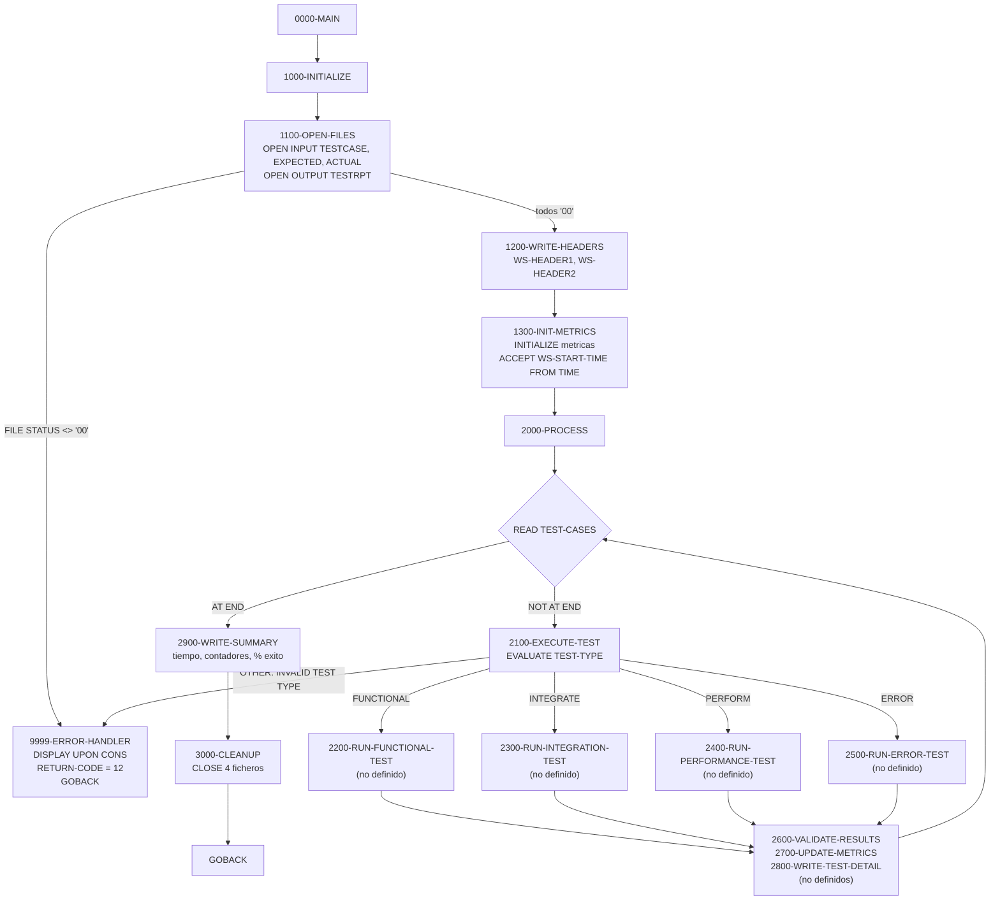
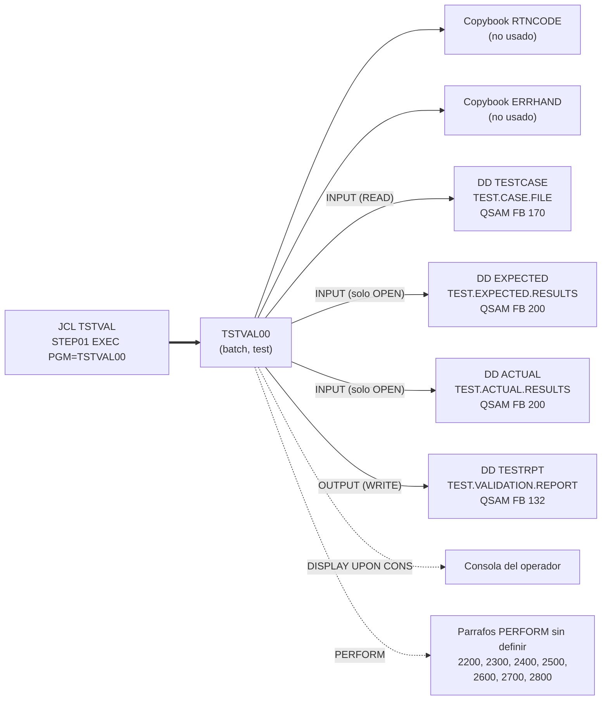

# TSTVAL00 — Suite batch de validación de casos de prueba (esqueleto incompleto)

> Generado a partir del análisis del código fuente `src/programs/test/TSTVAL00.cbl`. Ver el [grafo de dependencias global](../technical/dependency-graph.md).

## Ficha técnica
| Campo | Valor |
| --- | --- |
| Ruta | `src/programs/test/TSTVAL00.cbl` |
| Categoría | test |
| Tipo | batch |
| Líneas | 225 |
| Punto de entrada | JCL `TSTVAL` (`//STEP01 EXEC PGM=TSTVAL00`) |
| Invocado por | `JCL:TSTVAL` (`src/jcl/test/TSTVAL.jcl`). No existe ningún `CALL` ni `EXEC CICS LINK` hacia este programa en `src/`. |
| Invoca a | Ningún programa (no hay `CALL` ni `LINK`). Copybooks: `RTNCODE`, `ERRHAND`. Ficheros: `TESTCASE`, `EXPECTED`, `ACTUAL`, `TESTRPT`. |

## Propósito
`TSTVAL00` es el programa batch de **validación de pruebas** de la capa de test de la CLBS (junto con `TSTGEN00`, el generador de datos de prueba). Su cometido, según la cabecera del propio fuente y `system-architecture.md` (§1.2.4), es leer un fichero de casos de prueba, ejecutar cada caso según su tipo (funcional, integración, rendimiento, error), comparar los resultados reales con los esperados y emitir un informe de validación con métricas de éxito/fallo y tiempo transcurrido.

En su estado actual el programa es un **esqueleto**: define el flujo de control, la apertura/cierre de ficheros, las cabeceras y la línea de resumen del informe, pero **los párrafos que ejecutan, validan y contabilizan las pruebas no están codificados** (ver [Observaciones](#observaciones-y-problemas-detectados)). Tal y como está, el programa no compila.

## Funcionamiento

El flujo de control está organizado con el patrón clásico inicialización → proceso → terminación, orquestado desde `0000-MAIN`:

1. **`0000-MAIN`**: ejecuta en secuencia `1000-INITIALIZE`, `2000-PROCESS` y `3000-CLEANUP`, y termina con `GOBACK`. No hay lógica adicional ni tratamiento de `RETURN-CODE` en este nivel.

2. **`1000-INITIALIZE`**: agrupa las tres tareas de arranque: `1100-OPEN-FILES`, `1200-WRITE-HEADERS` y `1300-INIT-METRICS`.

3. **`1100-OPEN-FILES`**: abre los cuatro ficheros, comprobando el `FILE STATUS` de cada `OPEN` de forma individual:
   - `OPEN INPUT TEST-CASES` → `WS-TEST-STATUS`
   - `OPEN INPUT EXPECTED-RESULTS` → `WS-EXP-STATUS`
   - `OPEN INPUT ACTUAL-RESULTS` → `WS-ACT-STATUS`
   - `OPEN OUTPUT TEST-REPORT` → `WS-RPT-STATUS`

   Si algún status es distinto de `'00'`, mueve un mensaje literal (`'ERROR OPENING TEST CASES'`, `'ERROR OPENING EXPECTED RESULTS'`, etc.) a `WS-ERROR-MESSAGE` y ejecuta `9999-ERROR-HANDLER`, que termina el programa.

4. **`1200-WRITE-HEADERS`**: escribe dos líneas de cabecera en `TEST-REPORT`: `WS-HEADER1` (132 asteriscos) y `WS-HEADER2` (el texto `TEST VALIDATION REPORT` centrado con 30 espacios a cada lado).

5. **`1300-INIT-METRICS`**: `INITIALIZE WS-TEST-METRICS` (pone a cero contadores y tiempos) y captura la hora de inicio con `ACCEPT WS-START-TIME FROM TIME` (formato `HHMMSShh`, 8 dígitos).

6. **`2000-PROCESS`**: bucle `PERFORM UNTIL END-OF-TESTS` que lee secuencialmente `TEST-CASES`. En `AT END` activa el flag `END-OF-TESTS`; en `NOT AT END` ejecuta `2100-EXECUTE-TEST` para el registro leído. Al salir del bucle ejecuta `2900-WRITE-SUMMARY`.

7. **`2100-EXECUTE-TEST`**: despacha según el campo `TEST-TYPE` del registro leído mediante un `EVALUATE`:

   | Valor de `TEST-TYPE` | Constante | Párrafo invocado |
   | --- | --- | --- |
   | `FUNCTIONAL` | `WS-FUNCTIONAL` | `2200-RUN-FUNCTIONAL-TEST` |
   | `INTEGRATE` | `WS-INTEGRATION` | `2300-RUN-INTEGRATION-TEST` |
   | `PERFORM` | `WS-PERFORMANCE` | `2400-RUN-PERFORMANCE-TEST` |
   | `ERROR` | `WS-ERROR` | `2500-RUN-ERROR-TEST` |
   | cualquier otro | — | `'INVALID TEST TYPE'` → `9999-ERROR-HANDLER` (fin del programa) |

   Tras el `EVALUATE`, ejecuta siempre `2600-VALIDATE-RESULTS`, `2700-UPDATE-METRICS` y `2800-WRITE-TEST-DETAIL`.

   **Ninguno de los siete párrafos `2200`–`2800` existe en el fuente**; sólo se referencian. Por el nombre de las estructuras de WORKING-STORAGE se infiere la intención: `2600` compararía `EXPECTED-RECORD` con `ACTUAL-RECORD` y fijaría `TEST-PASSED`; `2700` incrementaría `WS-TOTAL-TESTS` y `WS-TESTS-PASSED`/`WS-TESTS-FAILED`; `2800` rellenaría `WS-TEST-DETAIL` (id, tipo, descripción, estado de 4 caracteres) y lo escribiría en `TEST-REPORT`. Esto es una inferencia: no está codificado.

8. **`2900-WRITE-SUMMARY`**: captura `WS-END-TIME` con `ACCEPT ... FROM TIME`, calcula `WS-ELAPSED-TIME = WS-END-TIME - WS-START-TIME`, mueve los contadores a los campos editados de `WS-SUMMARY-LINE` (`WS-TOTAL-OUT`, `WS-PASSED-OUT`, `WS-FAILED-OUT`), calcula `WS-SUCCESS-RATE = (WS-TESTS-PASSED / WS-TOTAL-TESTS) * 100` y escribe la línea de resumen en el informe. Nótese que `WS-ELAPSED-TIME` se calcula pero **no se escribe** en el informe ni se usa en ningún otro sitio.

9. **`3000-CLEANUP`**: cierra los cuatro ficheros con una única sentencia `CLOSE`. No comprueba `FILE STATUS`.

10. **`9999-ERROR-HANDLER`**: muestra `WS-ERROR-MESSAGE` por consola (`DISPLAY ... UPON CONS`, donde `CONS` es el mnemónico definido en `SPECIAL-NAMES` como `CONSOLE IS CONS`), fija `RETURN-CODE` a 12 y ejecuta `GOBACK` directamente, **sin cerrar los ficheros**.

## Interfaz

- **Parámetros / LINKAGE SECTION / COMMAREA**: No aplica. El programa no tiene `LINKAGE SECTION` ni `PROCEDURE DIVISION USING`; se ejecuta como paso de job sin `PARM`.

- **Ficheros (DDNAME, organización, modo de apertura, clave)**:

  | Fichero COBOL | DDNAME | DSN en `TSTVAL.jcl` | Organización / acceso | Modo | Registro | FILE STATUS | Uso real en el código |
  | --- | --- | --- | --- | --- | --- | --- | --- |
  | `TEST-CASES` | `TESTCASE` | `TEST.CASE.FILE` (`DISP=SHR`) | SEQUENTIAL / SEQUENTIAL, `RECORDING MODE F` | `INPUT` | `TEST-CASE-RECORD` 170 bytes: `TEST-ID` X(10), `TEST-TYPE` X(10), `TEST-DESCRIPTION` X(50), `TEST-PARAMETERS` X(100) | `WS-TEST-STATUS` | Se lee en bucle en `2000-PROCESS` |
  | `EXPECTED-RESULTS` | `EXPECTED` | `TEST.EXPECTED.RESULTS` (`DISP=SHR`) | SEQUENTIAL / SEQUENTIAL, `RECORDING MODE F` | `INPUT` | `EXPECTED-RECORD` X(200) | `WS-EXP-STATUS` | Sólo `OPEN`/`CLOSE`; **nunca se lee** |
  | `ACTUAL-RESULTS` | `ACTUAL` | `TEST.ACTUAL.RESULTS` (`DISP=SHR`) | SEQUENTIAL / SEQUENTIAL, `RECORDING MODE F` | `INPUT` | `ACTUAL-RECORD` X(200) | `WS-ACT-STATUS` | Sólo `OPEN`/`CLOSE`; **nunca se lee** |
  | `TEST-REPORT` | `TESTRPT` | `TEST.VALIDATION.REPORT` (`NEW,CATLG,DELETE`, `RECFM=FB,LRECL=132`) | SEQUENTIAL (sin `ACCESS MODE` explícito), `RECORDING MODE F` | `OUTPUT` | `REPORT-RECORD` X(132) | `WS-RPT-STATUS` | Cabeceras (`1200`) y resumen (`2900`) |

  Ninguno de los ficheros es VSAM ni tiene clave; no aparecen en `src/database/vsam/vsam-definitions.txt`. Todos son QSAM secuenciales.

- **Tablas DB2 y sentencias SQL**: No aplica. El programa no contiene `EXEC SQL` ni `SQLCA`.

- **Mapas BMS / comandos CICS**: No aplica. Programa batch puro.

- **Códigos de retorno / RETURN-CODE**:

  | Valor | Cuándo |
  | --- | --- |
  | `0` | Fin normal por `0000-MAIN` → `GOBACK` (el programa nunca asigna explícitamente 0; es el valor por defecto del registro especial `RETURN-CODE`). |
  | `12` | Cualquier paso por `9999-ERROR-HANDLER`: fallo en el `OPEN` de alguno de los cuatro ficheros, o registro de `TEST-CASES` con `TEST-TYPE` no reconocido. |

  No se usan los códigos 4 ni 8, a pesar de estar definidos en `ERRHAND` (`ERR-WARNING`, `ERR-ERROR`). Tampoco se devuelve un código distinto de 0 cuando hay pruebas fallidas.

## Estructuras de datos clave

### Copybooks
| Copybook | Ruta | Qué aporta | Uso real en TSTVAL00 |
| --- | --- | --- | --- |
| `RTNCODE` | `src/copybook/common/RTNCODE.cpy` | `RETURN-CODE-AREA`: área de gestión de códigos de retorno (`RC-REQUEST-TYPE` con 88 `RC-INITIALIZE`/`RC-SET-CODE`/…, `RC-CURRENT-CODE`, `RC-HIGHEST-CODE`, `RC-STATUS`, `RC-MESSAGE`, datos de análisis). Pensada para dialogar con `RTNCDE00`. | **Ningún campo se referencia.** El programa usa el registro especial `RETURN-CODE`, no `RETURN-CODE-AREA`. |
| `ERRHAND` | `src/copybook/common/ERRHAND.cpy` | Categorías de error (`ERR-CAT-VSAM`, `ERR-CAT-VALID`, …), códigos estándar (`ERR-SUCCESS`=0, `ERR-WARNING`=4, `ERR-ERROR`=8, `ERR-SEVERE`=12, `ERR-TERMINAL`=16), estructura de mensaje `ERR-MESSAGE` (`ERR-PROGRAM`, `ERR-CODE`, `ERR-TEXT` X(80), `ERR-DETAILS`), status VSAM habituales y sus textos. | **Ningún campo se referencia.** El código mueve el texto de error a `WS-ERROR-MESSAGE`, que no está en este copybook (ni en ningún otro sitio); el equivalente sería `ERR-TEXT`. El literal `12` usado en `9999-ERROR-HANDLER` coincide con `ERR-SEVERE`, pero no se usa la constante. |

### WORKING-STORAGE propio
| Estructura | Campos | Función |
| --- | --- | --- |
| `WS-FILE-STATUS` | `WS-TEST-STATUS`, `WS-EXP-STATUS`, `WS-ACT-STATUS`, `WS-RPT-STATUS` (todos `PIC XX`) | `FILE STATUS` de los cuatro ficheros. Sólo se comprueban tras el `OPEN`. |
| `WS-TEST-TYPES` | `WS-FUNCTIONAL`='FUNCTIONAL', `WS-INTEGRATION`='INTEGRATE', `WS-PERFORMANCE`='PERFORM', `WS-ERROR`='ERROR' (todos `PIC X(10)`) | Constantes para el `EVALUATE TEST-TYPE`. Obsérvese que los valores de fichero son `INTEGRATE` y `PERFORM` (truncados a 10 caracteres), no `INTEGRATION`/`PERFORMANCE`. |
| `WS-PROCESSING-FLAGS` | `WS-END-OF-TESTS` (88 `END-OF-TESTS`), `WS-TEST-PASSED` (88 `TEST-PASSED`) | Fin de fichero del bucle principal; resultado de la prueba en curso. `TEST-PASSED` **nunca se asigna ni se consulta** en el código existente. |
| `WS-TEST-METRICS` | `WS-TOTAL-TESTS`, `WS-TESTS-PASSED`, `WS-TESTS-FAILED` (`PIC 9(5)`); `WS-START-TIME`, `WS-END-TIME`, `WS-ELAPSED-TIME` (`PIC 9(8)`) | Contadores y tiempos. Los contadores **nunca se incrementan** (el párrafo `2700-UPDATE-METRICS` no existe). Máximo 99.999 pruebas por ejecución. |
| `WS-REPORT-HEADERS` | `WS-HEADER1` (132 × `*`), `WS-HEADER2` (30 esp. + 'TEST VALIDATION REPORT' en X(72) + 30 esp. = 132) | Cabeceras del informe. |
| `WS-TEST-DETAIL` | `WS-TEST-ID-OUT` X(10), `WS-TEST-TYPE-OUT` X(10), `WS-TEST-DESC-OUT` X(50), `WS-TEST-STATUS-OUT` X(4), rellenos (total 132) | Línea de detalle por prueba. Definida pero **nunca rellenada ni escrita** (falta `2800-WRITE-TEST-DETAIL`). El estado de 4 caracteres sugiere valores tipo `PASS`/`FAIL` (inferencia). |
| `WS-SUMMARY-LINE` | `WS-TOTAL-OUT`, `WS-PASSED-OUT`, `WS-FAILED-OUT` (`ZZ,ZZ9`), `WS-SUCCESS-RATE` (`ZZ9.99`) seguido de `'%'`, literales `TOTAL TESTS:`, `PASSED:`, `FAILED:`, `SUCCESS:` | Línea de resumen final (125 bytes; el `WRITE ... FROM` rellena con espacios hasta 132). |

## Reglas de negocio y validaciones

Reglas efectivamente implementadas en el código:

1. **Apertura obligatoria de los cuatro ficheros**: cualquier `FILE STATUS` distinto de `'00'` en el `OPEN` aborta el programa con `RETURN-CODE` 12 (`1100-OPEN-FILES`). Se comprueba cada fichero por separado, con un mensaje específico por fichero.
2. **Clasificación del caso de prueba por `TEST-TYPE`**: sólo se admiten exactamente los valores `FUNCTIONAL`, `INTEGRATE`, `PERFORM` y `ERROR` (comparación `PIC X(10)` completa, sensible a mayúsculas y espacios de relleno). Cualquier otro valor se considera `INVALID TEST TYPE` y **aborta toda la ejecución** (no se salta el registro ni se continúa con el siguiente).
3. **Cálculo del porcentaje de éxito**: `WS-SUCCESS-RATE = (WS-TESTS-PASSED / WS-TOTAL-TESTS) * 100`, presentado con dos decimales (`ZZ9.99`). No hay cláusula `ON SIZE ERROR`.
4. **Tiempo transcurrido**: `WS-ELAPSED-TIME = WS-END-TIME - WS-START-TIME` sobre valores `HHMMSShh` de `ACCEPT FROM TIME`; es una resta aritmética directa de dos números de 8 dígitos, no una diferencia real en unidades de tiempo (ver Observaciones).
5. **Formato del informe**: dos líneas de cabecera al inicio y una línea de resumen al final, en un fichero de 132 bytes.

Las reglas de validación propiamente dichas (comparación esperado/real, criterios de rendimiento, comprobación de condiciones de error) **no están implementadas** en el repositorio.

## Manejo de errores y recuperación

- **Errores de fichero (`FILE STATUS`)**: sólo se comprueban en los `OPEN` (`1100-OPEN-FILES`). El `READ` de `TEST-CASES` se controla únicamente con `AT END`/`NOT AT END`; un status de error de lectura (p. ej. `'04'`, `'30'`, `'39'`) no se detecta y, sin `AT END`, el bucle seguiría o el runtime abortaría el paso. Los `WRITE` a `TEST-REPORT` y el `CLOSE` no comprueban status.
- **`9999-ERROR-HANDLER`**: único punto de gestión de errores. Escribe `WS-ERROR-MESSAGE` en la consola del operador (`DISPLAY UPON CONS`), pone `RETURN-CODE` = 12 y hace `GOBACK` inmediatamente. Consecuencias:
  - No se cierran los ficheros ya abiertos (el sistema los cierra implícitamente al terminar la unidad de ejecución, pero el informe puede quedar sin la línea de resumen y sin `CATLG` correcto según el `DISP`).
  - No se escribe ninguna traza en `TEST-REPORT`.
  - No se rellena la estructura `ERR-MESSAGE` de `ERRHAND` ni se llama a `ERRPROC`.
- **SQLCODE / DB2**: No aplica; sin acceso DB2.
- **Condiciones CICS**: No aplica.
- **Checkpoint / restart / rollback**: No hay. El programa no usa `CKPRST`, ni commits, ni ficheros de checkpoint; una reejecución arranca desde cero (y el `DISP=(NEW,CATLG,DELETE)` de `TESTRPT` exigiría borrar el informe anterior antes de relanzar el job).
- **Llamadas a `ERRPROC` / `ERRHNDL` / `DB2ERR`**: ninguna, a pesar de que `system-architecture.md` (§5.1.3 y §6.3) asigna `ERRPROC` como manejador de errores de los programas de test.

## Dependencias

Programas relacionados por contexto (sin dependencia directa en el código): `TSTGEN00` genera `TEST.PORTFOLIO.DATA` y `TEST.TRANSACTION.DATA`, pero **ningún job del repositorio produce** `TEST.CASE.FILE`, `TEST.EXPECTED.RESULTS` ni `TEST.ACTUAL.RESULTS`; se asume que se aprovisionan externamente.

## Observaciones y problemas detectados

1. **Siete párrafos referenciados con `PERFORM` no existen** en el fuente: `2200-RUN-FUNCTIONAL-TEST`, `2300-RUN-INTEGRATION-TEST`, `2400-RUN-PERFORMANCE-TEST`, `2500-RUN-ERROR-TEST`, `2600-VALIDATE-RESULTS`, `2700-UPDATE-METRICS` y `2800-WRITE-TEST-DETAIL` (líneas 190–204). Enterprise COBOL emite error de compilación (severidad E) por procedimiento no definido; el programa **no compila**. Toda la lógica de negocio (ejecución, comparación, contabilización y detalle) está pendiente de implementar. El grafo de dependencias automático no lista estos párrafos porque sólo recoge los definidos.
2. **`WS-ERROR-MESSAGE` no está definido** en ninguna parte (ni en WORKING-STORAGE ni en `RTNCODE`/`ERRHAND`), pero se usa en cinco `MOVE` y en el `DISPLAY` de `9999-ERROR-HANDLER`. Segundo error de compilación. El campo homólogo del copybook `ERRHAND` sería `ERR-TEXT` (X(80)).
3. **Los copybooks `RTNCODE` y `ERRHAND` se incluyen pero no se usa ningún campo** de ellos. El manejo de errores usa literales y el registro especial `RETURN-CODE` en lugar de `ERR-SEVERE`, `ERR-MESSAGE` o `RETURN-CODE-AREA`.
4. **`EXPECTED-RESULTS` y `ACTUAL-RESULTS` se abren y cierran pero nunca se leen**; la comparación esperado/real que da nombre al programa no existe.
5. **División por cero potencial en `2900-WRITE-SUMMARY`**: `WS-SUCCESS-RATE = (WS-TESTS-PASSED / WS-TOTAL-TESTS) * 100` sin `ON SIZE ERROR`. Con el código actual `WS-TOTAL-TESTS` es siempre 0 (nunca se incrementa), y también lo sería con un fichero `TESTCASE` vacío. En Enterprise COBOL una división por cero sin `ON SIZE ERROR` deja el resultado indefinido/sin actualizar (o abend según opciones de compilación), no un aborto controlado.
6. **Cálculo incorrecto de `WS-ELAPSED-TIME`**: resta directa de dos valores `HHMMSShh` (no son unidades homogéneas: 1 minuto = 6.000 centésimas, no 10.000). Además, si la ejecución cruza la medianoche el resultado es negativo y, al ser el campo `PIC 9(8)` sin signo, se pierde el signo. El valor calculado tampoco se escribe en el informe.
7. **Un `TEST-TYPE` inválido aborta toda la suite** (`WHEN OTHER` → `9999-ERROR-HANDLER` → `GOBACK`), en lugar de contabilizar el caso como fallido y continuar. Además se produce sin escribir el resumen y sin cerrar ficheros.
8. **`9999-ERROR-HANDLER` no cierra los ficheros** antes del `GOBACK`.
9. **No se comprueba `FILE STATUS` en `READ`, `WRITE` ni `CLOSE`**; sólo en `OPEN`.
10. **`RETURN-CODE` siempre 0 en fin normal**, incluso si hubiera pruebas fallidas; un job posterior no podría condicionar su ejecución (`COND`) al resultado de la validación.
11. **Discrepancia con `system-architecture.md`**: la tabla §5.1.3 indica que `TSTVAL00` depende de `DB2CONN` y `ERRPROC` y tiene acceso DB2 de lectura; la tabla §6.3 asigna `ERRPROC` como manejador de errores de los programas de test. El código **no contiene `EXEC SQL`, ni `CALL` a `DB2CONN`/`ERRPROC`**. Manda el código: el programa es QSAM puro y sin llamadas externas. La descripción funcional de §1.2.4 ("Executes test cases, Validates results, Measures performance, Produces test reports") describe la intención, no lo implementado.
12. **Ficheros de entrada sin productor conocido**: `TEST.CASE.FILE`, `TEST.EXPECTED.RESULTS` y `TEST.ACTUAL.RESULTS` sólo aparecen en `TSTVAL.jcl`; ningún otro JCL ni programa de `src/` los genera. `TSTGEN00` produce `TEST.PORTFOLIO.DATA` y `TEST.TRANSACTION.DATA`, con formatos distintos.
13. **Flag `WS-TEST-PASSED` / 88 `TEST-PASSED` y estructura `WS-TEST-DETAIL` sin uso** (consecuencia directa de los párrafos faltantes).
14. Menor: los valores de tipo `'INTEGRATE'` y `'PERFORM'` están truncados a 10 caracteres y no coinciden con los nombres de sus constantes (`WS-INTEGRATION`, `WS-PERFORMANCE`); cualquier fichero de casos debe usar exactamente esos literales.
15. Menor: el `JOB` de `TSTVAL.jcl` se llama `TSTVAL00` mientras el fichero se llama `TSTVAL.jcl`; el DSN `TEST.CASE.FILE` no lleva DCB, por lo que el `LRECL` real (170 esperado) depende del dataset catalogado.

## Referencias

- Programa: [TSTVAL00.cbl](../../src/programs/test/TSTVAL00.cbl)
- JCL de ejecución: [TSTVAL.jcl](../../src/jcl/test/TSTVAL.jcl)
- Copybooks: [RTNCODE.cpy](../../src/copybook/common/RTNCODE.cpy), [ERRHAND.cpy](../../src/copybook/common/ERRHAND.cpy)
- Programa hermano de la capa de test: [TSTGEN00.cbl](../../src/programs/test/TSTGEN00.cbl), [TSTGEN.jcl](../../src/jcl/test/TSTGEN.jcl)
- Definiciones VSAM (no incluyen los ficheros de este programa): [vsam-definitions.txt](../../src/database/vsam/vsam-definitions.txt)
- Arquitectura del sistema: [system-architecture.md](../technical/system-architecture.md) (§1.2.4, §5.1.3, §6.3)
- Diccionario de datos: [data-dictionary.md](../technical/data-dictionary.md) (no describe los ficheros de test)
- Grafo de dependencias: [dependency-graph.md](../technical/dependency-graph.md), [dependency-graph.json](../technical/dependency-graph.json)
