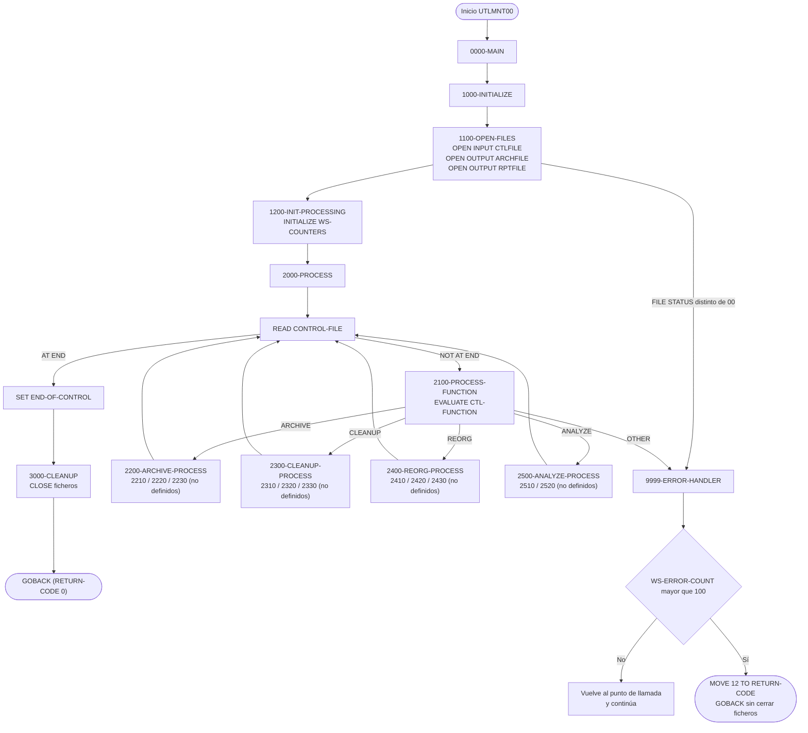
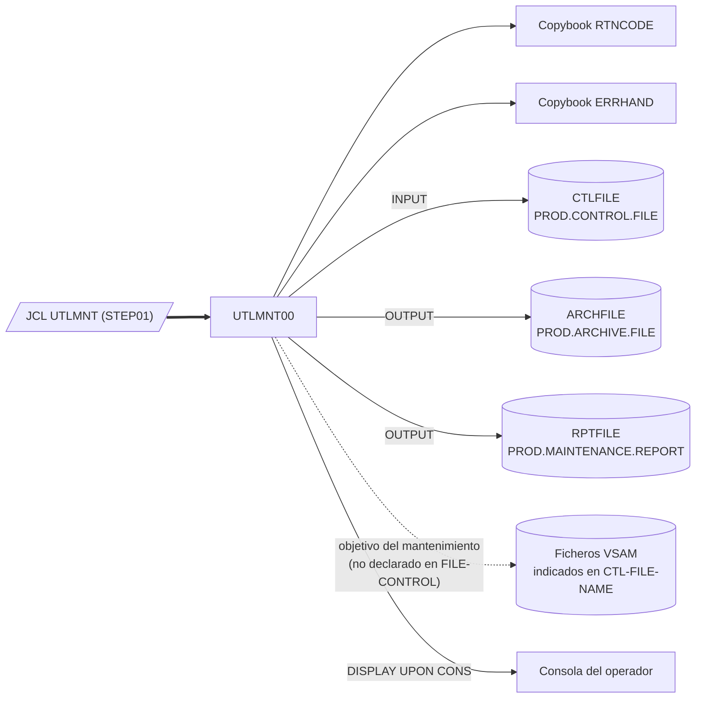

# UTLMNT00 — Utilidad batch de mantenimiento de ficheros (archivado, limpieza, reorganización y análisis)

> Generado a partir del análisis del código fuente `src/programs/utility/UTLMNT00.cbl`. Ver el [grafo de dependencias global](../technical/dependency-graph.md).

## Ficha técnica
| Campo | Valor |
| --- | --- |
| Ruta | `src/programs/utility/UTLMNT00.cbl` |
| Categoría | utility |
| Tipo | batch |
| Líneas | 182 |
| Punto de entrada | JCL `UTLMNT` (`src/jcl/utility/UTLMNT.jcl`, paso `STEP01`, `EXEC PGM=UTLMNT00`) |
| Invocado por | `JCL:UTLMNT` (job `UTLMNT00`). Ningún programa COBOL lo llama mediante `CALL` ni `LINK`. |
| Invoca a | Ningún programa (`CALL`/`LINK` inexistentes). Copybooks: `RTNCODE`, `ERRHAND`. Ficheros: `CTLFILE`, `ARCHFILE`, `RPTFILE`. Sin DB2, sin CICS, sin BMS. |

## Propósito
`UTLMNT00` es la utilidad de mantenimiento de ficheros del sistema de gestión de carteras (CLBS). Su función de negocio es ejecutar, de forma desatendida y dirigida por un fichero de control, operaciones de "housekeeping" sobre los ficheros VSAM del sistema: archivado de datos (`ARCHIVE`), limpieza de registros antiguos (`CLEANUP`), reorganización de clusters VSAM (`REORG`) y recogida de estadísticas con informe (`ANALYZE`). Encaja en la **capa de utilidades** del flujo batch descrito en `system-architecture.md` (junto a `UTLVAL00` y `UTLMON00`), sin acceso a DB2 ni a CICS.

**Importante**: en el estado actual del repositorio el programa es un **esqueleto incompleto**. El bucle de control y la selección de función están implementados, pero las once rutinas de trabajo (`2210-*` a `2520-*`) que realizarían el archivado, la limpieza, la reorganización y el análisis se `PERFORM`an sin estar definidas, por lo que el programa no compilaría tal cual (ver [Observaciones](#observaciones-y-problemas-detectados)).

## Funcionamiento

### Estructura general
El programa sigue el patrón clásico de tres fases `1000-INITIALIZE` → `2000-PROCESS` → `3000-CLEANUP`, orquestado desde `0000-MAIN`, que termina con `GOBACK`.

### Párrafo a párrafo

**`0000-MAIN`**
Ejecuta secuencialmente `1000-INITIALIZE`, `2000-PROCESS` y `3000-CLEANUP` y devuelve el control al sistema con `GOBACK`.

**`1000-INITIALIZE`**
Encadena `1100-OPEN-FILES` y `1200-INIT-PROCESSING`.

**`1100-OPEN-FILES`**
Abre los tres ficheros externos y comprueba el `FILE STATUS` de cada `OPEN`:
- `OPEN INPUT CONTROL-FILE` → si `WS-CTL-STATUS` ≠ `'00'`, mueve `'ERROR OPENING CONTROL FILE'` a `WS-ERROR-MESSAGE` y ejecuta `9999-ERROR-HANDLER`.
- `OPEN OUTPUT ARCHIVE-FILE` → ídem con `WS-ARCH-STATUS` y `'ERROR OPENING ARCHIVE FILE'`.
- `OPEN OUTPUT REPORT-FILE` → ídem con `WS-REPORT-STATUS` y `'ERROR OPENING REPORT FILE'`.

Tras un error de apertura el programa **no termina** (salvo que se supere el umbral de 100 errores del manejador); continúa con la siguiente apertura y con el proceso.

**`1200-INIT-PROCESSING`**
`INITIALIZE WS-COUNTERS`: pone a cero `WS-RECORDS-READ`, `WS-RECORDS-WRITTEN` y `WS-ERROR-COUNT` (que ya tenían `VALUE ZERO`).

**`2000-PROCESS`**
Bucle principal `PERFORM UNTIL END-OF-CONTROL`. En cada iteración lee un registro de `CONTROL-FILE`:
- `AT END` → `SET END-OF-CONTROL TO TRUE` (fin del bucle).
- `NOT AT END` → `PERFORM 2100-PROCESS-FUNCTION`.

Cada registro del fichero de control representa **una orden de mantenimiento**: función a ejecutar (`CTL-FUNCTION`), nombre del fichero objetivo (`CTL-FILE-NAME`, 44 caracteres, longitud máxima de un DSN de z/OS) y parámetros libres (`CTL-PARAMETERS`).

**`2100-PROCESS-FUNCTION`**
`EVALUATE CTL-FUNCTION` contra las constantes de `WS-FUNCTIONS`:

| Valor de `CTL-FUNCTION` | Rutina ejecutada |
| --- | --- |
| `ARCHIVE` | `2200-ARCHIVE-PROCESS` |
| `CLEANUP` | `2300-CLEANUP-PROCESS` |
| `REORG` | `2400-REORG-PROCESS` |
| `ANALYZE` | `2500-ANALYZE-PROCESS` |
| cualquier otro | `'INVALID FUNCTION SPECIFIED'` → `9999-ERROR-HANDLER` |

La comparación es exacta sobre 8 caracteres (`PIC X(8)`), por lo que la función debe ir en mayúsculas, alineada a la izquierda y rellenada con espacios.

**`2200-ARCHIVE-PROCESS`** (función `ARCHIVE`)
Copia `CTL-FILE-NAME` a `WS-VSAM-NAME` y ejecuta `2210-OPEN-VSAM`, `2220-ARCHIVE-RECORDS` y `2230-CLOSE-VSAM`. Por el nombre de los párrafos y por la existencia de `ARCHIVE-FILE` (registros variables de hasta 32.760 bytes), la intención es volcar los registros del VSAM indicado al fichero secuencial de archivo `ARCHFILE`. **Ninguno de los tres párrafos está definido en el fuente.**

**`2300-CLEANUP-PROCESS`** (función `CLEANUP`)
Copia `CTL-FILE-NAME` a `WS-VSAM-NAME` y ejecuta `2310-ANALYZE-SPACE`, `2320-DELETE-OLD` y `2330-UPDATE-CATALOG`. Intención inferida: analizar el espacio ocupado, borrar registros/datasets antiguos y actualizar el catálogo. **Párrafos no definidos.**

**`2400-REORG-PROCESS`** (función `REORG`)
Copia `CTL-FILE-NAME` a `WS-VSAM-NAME` y ejecuta `2410-EXPORT-DATA`, `2420-DELETE-DEFINE` y `2430-IMPORT-DATA`. Es el ciclo estándar de reorganización de un KSDS (exportar → `DELETE`/`DEFINE CLUSTER` → importar), coherente con las definiciones IDCAMS de `src/database/vsam/vsam-definitions.txt`. **Párrafos no definidos.**

**`2500-ANALYZE-PROCESS`** (función `ANALYZE`)
Copia `CTL-FILE-NAME` a `WS-VSAM-NAME` y ejecuta `2510-COLLECT-STATS` y `2520-GENERATE-REPORT`. Intención inferida: recoger estadísticas del fichero y escribirlas en `REPORT-FILE` (132 columnas, formato de listado). **Párrafos no definidos.**

**`3000-CLEANUP`**
`CLOSE CONTROL-FILE ARCHIVE-FILE REPORT-FILE` en una sola sentencia, sin comprobar el `FILE STATUS` del cierre.

**`9999-ERROR-HANDLER`**
Manejador de errores común:
1. `ADD 1 TO WS-ERROR-COUNT`.
2. `DISPLAY WS-ERROR-MESSAGE UPON CONS` (consola del operador, mnemónico `CONS` definido en `SPECIAL-NAMES` como `CONSOLE IS CONS`).
3. Si `WS-ERROR-COUNT > 100` → `MOVE 12 TO RETURN-CODE` y `GOBACK` inmediato (termina el programa desde dentro del párrafo, sin pasar por `3000-CLEANUP`).

Con 100 errores o menos, el manejador **solo registra el mensaje y devuelve el control** al punto de llamada; la ejecución continúa como si no hubiera pasado nada.

### Diagrama de flujo



## Interfaz

- **Parámetros / LINKAGE SECTION / COMMAREA**: No aplica. El programa no tiene `LINKAGE SECTION` ni `PROCEDURE DIVISION USING`; toda la parametrización llega por el fichero de control `CTLFILE`.

- **Ficheros (DDNAME, organización, modo de apertura, clave)**:

| DDNAME | Nombre COBOL | Organización / acceso | Modo | Registro | FILE STATUS | Dataset en JCL `UTLMNT` |
| --- | --- | --- | --- | --- | --- | --- |
| `CTLFILE` | `CONTROL-FILE` | Secuencial (QSAM), `RECORDING MODE F` | `INPUT` | `CONTROL-RECORD` 152 bytes: `CTL-FUNCTION` X(8), `CTL-FILE-NAME` X(44), `CTL-PARAMETERS` X(100) | `WS-CTL-STATUS` | `PROD.CONTROL.FILE`, `DISP=SHR` (sin DCB explícito) |
| `ARCHFILE` | `ARCHIVE-FILE` | Secuencial (QSAM), `RECORDING MODE V` | `OUTPUT` | `ARCHIVE-RECORD` X(32760) | `WS-ARCH-STATUS` | `PROD.ARCHIVE.FILE`, `DISP=(NEW,CATLG,DELETE)`, `RECFM=VB,LRECL=32756`, `SPACE=(CYL,(100,50),RLSE)` |
| `RPTFILE` | `REPORT-FILE` | Secuencial (QSAM), `RECORDING MODE F` | `OUTPUT` | `REPORT-RECORD` X(132) | `WS-REPORT-STATUS` | `PROD.MAINTENANCE.REPORT`, `DISP=(NEW,CATLG,DELETE)`, `RECFM=FB,LRECL=132`, `SPACE=(CYL,(10,5),RLSE)` |

Ninguno de los ficheros es indexado, por lo que no hay claves. Los ficheros VSAM sobre los que actuaría el mantenimiento (`WS-VSAM-NAME`, tomado de `CTL-FILE-NAME`) **no están declarados** en `FILE-CONTROL`: el programa no dispone hoy de ningún `SELECT` para abrirlos, lo que refuerza que las rutinas `22xx`–`25xx` nunca llegaron a implementarse (o se pensaba delegar en IDCAMS/servicios externos, algo que tampoco está codificado).

- **Tablas DB2 y sentencias SQL**: No aplica (no hay `EXEC SQL`, ni `SQLCA`, ni copybooks DB2).

- **Mapas BMS / comandos CICS**: No aplica (programa batch puro; no hay `EXEC CICS`).

- **Códigos de retorno / RETURN-CODE**:

| Situación | `RETURN-CODE` | Cómo termina |
| --- | --- | --- |
| Ejecución normal (con o sin errores, hasta 100 errores acumulados) | `0` (nunca se modifica) | `GOBACK` en `0000-MAIN` tras `3000-CLEANUP` |
| Se supera el umbral: `WS-ERROR-COUNT > 100` (es decir, al 101.º error) | `12` | `GOBACK` inmediato desde `9999-ERROR-HANDLER`, sin cerrar ficheros |

No se utilizan los códigos estandarizados del copybook `ERRHAND` (`ERR-WARNING`=4, `ERR-ERROR`=8, `ERR-SEVERE`=12, `ERR-TERMINAL`=16) ni la estructura `RETURN-CODE-AREA` de `RTNCODE`; el valor `12` está codificado como literal. Ningún error de apertura ni de función inválida altera el `RETURN-CODE`, de modo que un job con hasta 100 errores termina con `RC=0`.

## Estructuras de datos clave

### Copybooks
| Copybook | Ruta | Qué aporta | Uso real en UTLMNT00 |
| --- | --- | --- | --- |
| `RTNCODE` | `src/copybook/common/RTNCODE.cpy` | `RETURN-CODE-AREA`: petición (`RC-REQUEST-TYPE` I/S/G/L/A), `RC-PROGRAM-ID`, códigos actual/máximo/nuevo, `RC-STATUS` (S/W/E/F), `RC-MESSAGE`, datos de análisis. Está pensado para la subrutina `RTNCDE00`. | **Ninguno**: no se referencia ningún campo. |
| `ERRHAND` | `src/copybook/common/ERRHAND.cpy` | Categorías de error (`ERR-CAT-VSAM`, `ERR-CAT-VALID`, `ERR-CAT-PROC`, `ERR-CAT-SYSTEM`), códigos de retorno estándar (`ERR-SUCCESS`…`ERR-TERMINAL`), estructura de mensaje `ERR-MESSAGE` (timestamp, programa, categoría, código, severidad, `ERR-TEXT`, `ERR-DETAILS`) y constantes/mensajes de `FILE STATUS` VSAM (`00`, `10`, `22`, `23`). | **Ninguno**: no se referencia ningún campo. En particular, `WS-ERROR-MESSAGE` **no** está en este copybook (el campo análogo sería `ERR-TEXT`). |

### WORKING-STORAGE
| Campo | Definición | Función |
| --- | --- | --- |
| `WS-CTL-STATUS`, `WS-ARCH-STATUS`, `WS-REPORT-STATUS` | `PIC XX` dentro de `WS-FILE-STATUS` | `FILE STATUS` de los tres ficheros; solo se consultan tras el `OPEN`. |
| `WS-END-OF-CTL` / 88 `END-OF-CONTROL` | `PIC X VALUE 'N'`, `'Y'` = fin | Condición de salida del bucle `2000-PROCESS`. |
| `WS-FUNCTION-FLAG` / 88 `VALID-FUNCTION` | `PIC X VALUE 'N'` | Flag de función válida; **nunca se asigna ni se consulta**. |
| `WS-ARCHIVE`, `WS-CLEANUP`, `WS-REORG`, `WS-ANALYZE` | `PIC X(8)` con valores `'ARCHIVE'`, `'CLEANUP'`, `'REORG'`, `'ANALYZE'` | Constantes de función para el `EVALUATE` de `2100-PROCESS-FUNCTION`. |
| `WS-RECORDS-READ`, `WS-RECORDS-WRITTEN` | `PIC 9(9) VALUE ZERO` | Contadores de registros; se inicializan pero **nunca se incrementan ni se imprimen**. |
| `WS-ERROR-COUNT` | `PIC 9(9) VALUE ZERO` | Número de errores acumulados; umbral de aborto en `9999-ERROR-HANDLER` (`> 100`). |
| `WS-VSAM-NAME` | `PIC X(44)` | DSN del fichero VSAM objetivo, copiado de `CTL-FILE-NAME` en cada función. |
| `WS-VSAM-FUNCTION`, `WS-VSAM-STATUS` | `PIC X(8)`, `PIC XX` | Previstos para la operación VSAM y su estado; **no se usan**. |
| `WS-ERROR-MESSAGE` | — | Texto del error mostrado por consola. **No está definido** ni en el programa ni en los copybooks incluidos. |

### Registro de control (`CONTROL-RECORD`)
```
01  CONTROL-RECORD.                    (152 bytes)
    05  CTL-FUNCTION      PIC X(8).    ARCHIVE | CLEANUP | REORG | ANALYZE
    05  CTL-FILE-NAME     PIC X(44).   DSN del fichero VSAM objetivo
    05  CTL-PARAMETERS    PIC X(100).  Parámetros libres (no interpretados en el código actual)
```
Este layout no aparece en `data-dictionary.md` (que documenta `BCHCTL` y `PRCCTL`, estructuras distintas) ni en ningún copybook; es exclusivo de este programa.

## Reglas de negocio y validaciones
1. **Una orden por registro**: cada registro de `CTLFILE` se procesa de forma independiente y secuencial hasta `AT END`.
2. **Catálogo cerrado de funciones**: solo `ARCHIVE`, `CLEANUP`, `REORG` y `ANALYZE` (mayúsculas, alineadas a la izquierda en 8 posiciones). Cualquier otro valor genera el error `INVALID FUNCTION SPECIFIED`, pero **no detiene** el proceso: se continúa con el siguiente registro.
3. **El fichero objetivo se toma siempre de `CTL-FILE-NAME`** y se copia a `WS-VSAM-NAME` al inicio de cada función; no se valida que esté informado ni que exista.
4. **`CTL-PARAMETERS` no se interpreta** en el código existente (no hay reglas de retención, fechas de corte, etc.).
5. **Umbral de tolerancia a errores**: el programa aborta con `RETURN-CODE 12` únicamente cuando el número acumulado de errores supera 100 (`WS-ERROR-COUNT > 100`).
6. **Composición de las funciones** (por diseño de los párrafos, pendiente de implementación):
   - `ARCHIVE` = abrir VSAM → archivar registros → cerrar VSAM.
   - `CLEANUP` = analizar espacio → borrar antiguos → actualizar catálogo.
   - `REORG` = exportar datos → delete/define → importar datos.
   - `ANALYZE` = recoger estadísticas → generar informe.

No existen cálculos, límites numéricos, fechas ni validaciones de contenido más allá de lo anterior.

## Manejo de errores y recuperación
- **Errores de fichero (`FILE STATUS`)**: solo se comprueban en los tres `OPEN` de `1100-OPEN-FILES`. No se comprueba el estado del `READ` de `CONTROL-FILE` (solo se tratan `AT END`/`NOT AT END`) ni del `CLOSE`. No hay `DECLARATIVES`/`USE AFTER ERROR`.
- **Estrategia**: registrar y continuar. `9999-ERROR-HANDLER` incrementa `WS-ERROR-COUNT`, muestra `WS-ERROR-MESSAGE` en la consola del operador (`DISPLAY ... UPON CONS`) y vuelve al punto de llamada. Solo al superar 100 errores se fija `RETURN-CODE = 12` y se hace `GOBACK`.
- **Consecuencias prácticas**:
  - Si falla la apertura de `CONTROL-FILE`, el programa sigue adelante y entra en `2000-PROCESS`; el `READ` sobre un fichero no abierto no dispara `AT END`, por lo que `END-OF-CONTROL` no se activa nunca. Al existir cláusula `FILE STATUS`, el runtime no aborta: el bucle se repite indefinidamente hasta que el manejador acumula 101 errores… pero el `READ` fallido no invoca al manejador, de modo que muy probablemente el resultado sería un **bucle infinito** (comportamiento inferido del código, no verificado en ejecución).
  - Si falla la apertura de `ARCHIVE-FILE` o `REPORT-FILE`, se continúa y las rutinas de escritura (no implementadas) operarían sobre ficheros cerrados.
  - El `GOBACK` del manejador al superar el umbral deja los ficheros sin cerrar (no pasa por `3000-CLEANUP`); en QSAM el sistema los cierra al terminar el paso, pero no se garantiza el vaciado ordenado de buffers ni se emite ningún mensaje de resumen.
- **SQLCODE / CICS**: no aplica.
- **Checkpoint / restart / rollback**: no implementados. El programa no usa `CKPRST`, ni `BCHCTL`, ni ningún mecanismo de reanudación; una reejecución vuelve a procesar el fichero de control completo. Además, al estar `ARCHFILE` y `RPTFILE` definidos en el JCL con `DISP=(NEW,CATLG,DELETE)` y nombres fijos, una segunda ejecución fallaría en la asignación JCL por dataset ya catalogado (a menos que se borren previamente).
- **Rutinas comunes de error**: no llama a `ERRPROC`, `ERRHNDL` ni `DB2ERR`, a pesar de que `system-architecture.md` (§5.1.2) declara `ERRPROC` como dependencia de `UTLMNT00`.

## Dependencias


## Observaciones y problemas detectados
1. **Once párrafos ejecutados pero no definidos** (error de compilación): `2210-OPEN-VSAM`, `2220-ARCHIVE-RECORDS`, `2230-CLOSE-VSAM`, `2310-ANALYZE-SPACE`, `2320-DELETE-OLD`, `2330-UPDATE-CATALOG`, `2410-EXPORT-DATA`, `2420-DELETE-DEFINE`, `2430-IMPORT-DATA`, `2510-COLLECT-STATS`, `2520-GENERATE-REPORT`. Toda la lógica de negocio real (archivar, limpiar, reorganizar, analizar) está sin implementar. El grafo de dependencias automático no los lista precisamente porque no existen como párrafos.
2. **`WS-ERROR-MESSAGE` no está definido** en ningún sitio (ni en `WORKING-STORAGE`, ni en `RTNCODE`, ni en `ERRHAND`). Se usa en cinco sentencias `MOVE`/`DISPLAY`. Es un defecto sistémico del repositorio: `UTLVAL00`, `UTLMON00`, `RPTAUD00`, `RPTPOS00`, `RPTSTA00`, `TSTGEN00`, `TSTVAL00` e `INQONLN` lo usan igualmente sin definirlo. El copybook `COMMON.cpy` define `ERROR-MESSAGE` (sin prefijo `WS-`) y `ERRHAND` define `ERR-TEXT`, pero ninguno se incluye/usa con ese nombre.
3. **Copybooks incluidos y no utilizados**: `RTNCODE` y `ERRHAND` se copian en `WORKING-STORAGE` pero no se referencia ningún campo de ellos. En particular, el código `12` de retorno está codificado como literal en lugar de usar `ERR-SEVERE`.
4. **Campos declarados sin uso**: `WS-FUNCTION-FLAG`/`VALID-FUNCTION`, `WS-RECORDS-READ`, `WS-RECORDS-WRITTEN`, `WS-VSAM-FUNCTION`, `WS-VSAM-STATUS`. Los contadores nunca se incrementan ni se reportan.
5. **`ARCHIVE-FILE` y `REPORT-FILE` se abren pero nunca se escriben** (`WRITE ARCHIVE-RECORD` / `WRITE REPORT-RECORD` no aparecen). El informe de mantenimiento y el fichero de archivo se generan vacíos.
6. **Los errores de apertura no detienen la ejecución**: tras un `OPEN` fallido el programa continúa. Con `CONTROL-FILE` no abierto, el `READ` de `2000-PROCESS` no activa `AT END` ni invoca al manejador, lo que probablemente provoca un bucle infinito (inferido del código).
7. **`RETURN-CODE` no refleja los errores**: cualquier ejecución con entre 1 y 100 errores (ficheros no abiertos, funciones inválidas) termina con `RC=0`. Solo al 101.º error se devuelve `12`. No hay `RC=4`/`8` intermedios.
8. **`GOBACK` dentro de `9999-ERROR-HANDLER`** termina el programa sin pasar por `3000-CLEANUP` (ficheros sin `CLOSE` explícito) y sin mensaje de resumen.
9. **Longitud del registro de archivo vs. JCL**: `ARCHIVE-RECORD PIC X(32760)` con `RECORDING MODE V`, mientras que el JCL define `LRECL=32756` (`RECFM=VB`). En formato variable el `LRECL` incluye los 4 bytes del RDW, así que la longitud máxima de datos admitida por el JCL sería 32.752 bytes y el máximo teórico de un registro variable en Enterprise COBOL es 32.756; la definición del programa excede probablemente ambos límites (inferencia basada en las reglas de QSAM; no verificado con el compilador).
10. **`CTLFILE` sin DCB en el JCL** y sin definición del dataset `PROD.CONTROL.FILE` en el repositorio; el layout de 152 bytes de `CONTROL-RECORD` solo se conoce por este programa y no está en `data-dictionary.md`.
11. **JCL no reejecutable**: `ARCHFILE` y `RPTFILE` usan `DISP=(NEW,CATLG,DELETE)` con DSN fijos (sin GDG ni calificador de fecha), por lo que la segunda ejecución fallaría por dataset ya existente.
12. **Discrepancias con la documentación técnica**:
    - `system-architecture.md` §5.1.2 indica que `UTLMNT00` depende de `ERRPROC`; el código no hace ningún `CALL`.
    - `system-architecture.md` §1.1 muestra `BP` (Batch Programs) invocando a `UTLMNT00`; en el repositorio el único invocador es el JCL `UTLMNT`, no `BCHCTL00` ni ningún programa.
    - `development-backlog.md` marca como completadas "VSAM file maintenance", "DB2 table maintenance", "Archive processing" y "Cleanup procedures" para `UTLMNT00`; el código no implementa ninguna de ellas y no tiene acceso DB2.
    - La cabecera del programa menciona "Space management" como función; no existe función `SPACE` en el `EVALUATE` (solo el párrafo no definido `2310-ANALYZE-SPACE` dentro de `CLEANUP`).
    - `system-architecture.md` §10 referencia `/documentation/operations/utilities-guide.md`, que no existe en el repositorio.
13. **Nomenclatura**: el fichero JCL se llama `UTLMNT.jcl` pero la tarjeta `JOB` se llama `UTLMNT00` (igual que el programa); no es un error, pero puede confundir en el grafo de dependencias (`JCL:UTLMNT`).
14. `SPECIAL-NAMES` aparece en la lista de "párrafos" del grafo automático; es una cláusula de `CONFIGURATION SECTION`, no un párrafo de `PROCEDURE DIVISION` (falso positivo del extractor, no un problema del programa).

## Referencias
- Programa: [UTLMNT00.cbl](../../src/programs/utility/UTLMNT00.cbl)
- JCL de ejecución: [UTLMNT.jcl](../../src/jcl/utility/UTLMNT.jcl)
- Copybooks: [RTNCODE.cpy](../../src/copybook/common/RTNCODE.cpy), [ERRHAND.cpy](../../src/copybook/common/ERRHAND.cpy)
- Copybooks relacionados (no incluidos, pero relevantes para `ERROR-MESSAGE`): [COMMON.cpy](../../src/copybook/common/COMMON.cpy)
- Definiciones VSAM del sistema (ficheros candidatos a mantenimiento): [vsam-definitions.txt](../../src/database/vsam/vsam-definitions.txt)
- Programas hermanos de la capa de utilidades: [UTLVAL00.cbl](../../src/programs/utility/UTLVAL00.cbl), [UTLMON00.cbl](../../src/programs/utility/UTLMON00.cbl)
- Documentación técnica: [system-architecture.md](../technical/system-architecture.md), [data-dictionary.md](../technical/data-dictionary.md), [development-backlog.md](../technical/development-backlog.md), [dependency-graph.md](../technical/dependency-graph.md), [dependency-graph.json](../technical/dependency-graph.json)
