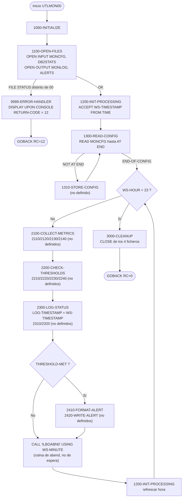
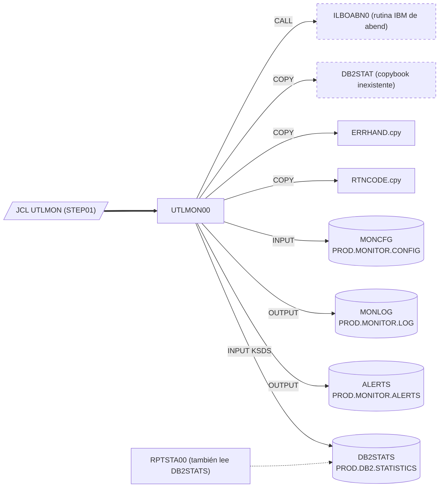

# UTLMON00 — Utilidad batch de monitorización del sistema (esqueleto incompleto)

> Generado a partir del análisis del código fuente `src/programs/utility/UTLMON00.cbl`. Ver el [grafo de dependencias global](../technical/dependency-graph.md).

## Ficha técnica
| Campo | Valor |
| --- | --- |
| Ruta | `src/programs/utility/UTLMON00.cbl` |
| Categoría | utility |
| Tipo | batch |
| Líneas | 221 |
| Punto de entrada | JCL `UTLMON` (`src/jcl/utility/UTLMON.jcl`, `STEP01 EXEC PGM=UTLMON00`) |
| Invocado por | JCL `UTLMON` (job `UTLMON00`). Ningún programa COBOL lo invoca con `CALL` ni `LINK`. |
| Invoca a | Rutina de sistema `ILBOABN0` (`CALL 'ILBOABN0' USING WS-MINUTE`). No invoca a ningún otro programa del repositorio (ni `ERRPROC`, ni `DB2CONN`). |

## Propósito
`UTLMON00` es la utilidad de monitorización del sistema de la CLBS. Según su cabecera y su diseño, debe leer un fichero de configuración de umbrales (`MONCFG`), recoger periódicamente métricas de CPU, memoria, DASD y DB2, compararlas con los umbrales configurados, escribir el estado en un log de monitorización (`MONLOG`) y generar alertas (`ALERTS`) cuando se supere algún umbral. Encaja en la capa de utilidades descrita en `system-architecture.md` (§1.2.3 y §7.1), como proceso batch de larga duración que se ejecuta en paralelo a los procesos de negocio.

En su estado actual el programa es un **esqueleto**: sólo están codificados la apertura/cierre de ficheros, la lectura del fichero de configuración, el bucle principal y la rutina de error. Los párrafos que realmente recogen métricas, comprueban umbrales, escriben el log y las alertas están referenciados por `PERFORM` pero **no existen** en el fuente, por lo que el programa no compila tal cual (ver [Observaciones](#observaciones-y-problemas-detectados)).

## Funcionamiento

### `0000-MAIN`
1. `PERFORM 1000-INITIALIZE`: abre ficheros, toma la hora inicial y carga la configuración.
2. `PERFORM 2000-PROCESS UNTIL WS-HOUR = 23`: bucle de monitorización que se repite hasta que la hora del sistema (`WS-HOUR`) sea 23. Es decir, la intención es que el monitor se ejecute durante toda la jornada y termine a las 23 h.
3. `PERFORM 3000-CLEANUP`: cierra los cuatro ficheros.
4. `GOBACK`.

### `1000-INITIALIZE`
Ejecuta en secuencia `1100-OPEN-FILES`, `1200-INIT-PROCESSING` y `1300-READ-CONFIG`.

### `1100-OPEN-FILES`
Abre los cuatro ficheros y comprueba el `FILE STATUS` de cada `OPEN`; si alguno no es `'00'` mueve un texto descriptivo a `WS-ERROR-MESSAGE` y ejecuta `9999-ERROR-HANDLER` (que termina el programa con `RETURN-CODE = 12`):

| Fichero | Modo | Mensaje de error |
| --- | --- | --- |
| `MONITOR-CONFIG` (`MONCFG`) | `OPEN INPUT` | `ERROR OPENING CONFIG FILE` |
| `MONITOR-LOG` (`MONLOG`) | `OPEN OUTPUT` | `ERROR OPENING MONITOR LOG` |
| `ALERT-FILE` (`ALERTS`) | `OPEN OUTPUT` | `ERROR OPENING ALERT FILE` |
| `DB2-STATS` (`DB2STATS`) | `OPEN INPUT` | `ERROR OPENING DB2 STATS` |

Nota: como `9999-ERROR-HANDLER` hace `GOBACK`, los ficheros abiertos hasta ese momento quedan sin `CLOSE` explícito (el run-time los cierra al terminar).

### `1200-INIT-PROCESSING`
`ACCEPT WS-TIMESTAMP FROM TIME`. Obtiene la hora del sistema (formato `HHMMSSCC`, 8 caracteres) en la estructura `WS-TIMESTAMP`. Este párrafo se reutiliza al final de cada iteración de `2000-PROCESS` para refrescar la hora y así evaluar la condición de salida del bucle. Ver en Observaciones el problema de alineación de esta sentencia.

### `1300-READ-CONFIG`
Bucle `PERFORM UNTIL END-OF-CONFIG` que lee secuencialmente `MONITOR-CONFIG`:
- `AT END` → `SET END-OF-CONFIG TO TRUE`.
- `NOT AT END` → `PERFORM 1310-STORE-CONFIG` (**párrafo no definido** en el fuente; tampoco existe en WORKING-STORAGE ninguna tabla `OCCURS` donde almacenar los umbrales leídos).

Cada registro de configuración (`CONFIG-RECORD`, 91 bytes) describe un umbral: tipo de recurso, tipo de umbral, valor, nivel de alerta y acción.

### `2000-PROCESS` (cuerpo del bucle)
Cada iteración ejecuta, en este orden:
1. `2100-COLLECT-METRICS` → `PERFORM` de `2110-GET-CPU-METRICS`, `2120-GET-MEMORY-METRICS`, `2130-GET-DASD-METRICS`, `2140-GET-DB2-METRICS` (**ninguno definido**). Su cometido previsto es rellenar `WS-CURRENT-METRICS`.
2. `2200-CHECK-THRESHOLDS` → `PERFORM` de `2210-CHECK-UTILIZATION`, `2220-CHECK-RESPONSE`, `2230-CHECK-QUEUES`, `2240-CHECK-ERRORS` (**ninguno definido**). Su cometido previsto es comparar las métricas con los umbrales y activar `THRESHOLD-MET`.
3. `2300-LOG-STATUS` → mueve `WS-TIMESTAMP` a `LOG-TIMESTAMP` y hace `PERFORM` de `2310-LOG-RESOURCES` y `2320-LOG-PERFORMANCE` (**no definidos**), que serían los que rellenan el resto de `LOG-RECORD` y ejecutan el `WRITE` sobre `MONITOR-LOG`.
4. `2400-GENERATE-ALERTS` → sólo si `THRESHOLD-MET` es verdadero, `PERFORM 2410-FORMAT-ALERT` y `2420-WRITE-ALERT` (**no definidos**), que formatearían y escribirían `ALERT-RECORD` en `ALERT-FILE`.
5. `CALL 'ILBOABN0' USING WS-MINUTE`. Por el contexto (bucle de sondeo periódico) probablemente se pretendía una pausa entre muestreos; sin embargo `ILBOABN0` es la rutina de abend de la biblioteca COBOL de IBM (fuerza un abend de usuario con el código recibido como parámetro), no una rutina de espera. Ver Observaciones.
6. `PERFORM 1200-INIT-PROCESSING` para refrescar `WS-TIMESTAMP` antes de volver a evaluar `UNTIL WS-HOUR = 23`.

### `3000-CLEANUP`
`CLOSE MONITOR-CONFIG MONITOR-LOG ALERT-FILE DB2-STATS`. No comprueba los `FILE STATUS` del cierre.

### `9999-ERROR-HANDLER`
`DISPLAY WS-ERROR-MESSAGE UPON CONS` (la mnemónica `CONS` está asociada a `CONSOLE` en `SPECIAL-NAMES`, es decir, el mensaje va a la consola del operador), `MOVE 12 TO RETURN-CODE` y `GOBACK`. Es un tratamiento terminal: cualquier error de apertura aborta el job con RC=12.

## Interfaz
- **Parámetros / LINKAGE SECTION / COMMAREA**: No aplica. El programa no tiene `LINKAGE SECTION` ni `PROCEDURE DIVISION USING`; no recibe `PARM` del JCL.

- **Ficheros (DDNAME, organización, modo de apertura, clave)**:

| DDNAME | Nombre COBOL (FD) | Organización / acceso | Modo apertura | Clave | Registro | Dataset en `UTLMON.jcl` |
| --- | --- | --- | --- | --- | --- | --- |
| `MONCFG` | `MONITOR-CONFIG` | `SEQUENTIAL` / `SEQUENTIAL`, `RECORDING MODE F` | `INPUT` | — | `CONFIG-RECORD` (91 bytes) | `PROD.MONITOR.CONFIG`, `DISP=SHR` |
| `MONLOG` | `MONITOR-LOG` | `SEQUENTIAL` / `SEQUENTIAL`, `RECORDING MODE F` | `OUTPUT` | — | `LOG-RECORD` (77 bytes) | `PROD.MONITOR.LOG`, `DISP=(NEW,CATLG,DELETE)`, `LRECL=132` |
| `ALERTS` | `ALERT-FILE` | `SEQUENTIAL` (sin `ACCESS MODE` explícito → secuencial), `RECORDING MODE F` | `OUTPUT` | — | `ALERT-RECORD` (126 bytes) | `PROD.MONITOR.ALERTS`, `DISP=(NEW,CATLG,DELETE)`, `LRECL=132` |
| `DB2STATS` | `DB2-STATS` | `INDEXED` / `DYNAMIC` (VSAM KSDS) | `INPUT` | `STAT-KEY` (debería venir del copybook `DB2STAT`, inexistente) | Sin `FD` en el fuente (se espera del copybook) | `PROD.DB2.STATISTICS`, `DISP=SHR` |

  Aunque `DB2-STATS` se abre en `INPUT`, ningún párrafo existente lo lee: se presume que lo haría `2140-GET-DB2-METRICS`.

- **Tablas DB2 y sentencias SQL**: No aplica. Pese al nombre del fichero `DB2-STATS`, el programa no contiene `EXEC SQL` ni incluye `SQLCA`; las "estadísticas DB2" se leen (en teoría) de un fichero VSAM, no de tablas DB2.

- **Mapas BMS / comandos CICS**: No aplica (programa batch puro).

- **Códigos de retorno / RETURN-CODE**:

| Valor | Cuándo |
| --- | --- |
| `0` | Terminación normal por `GOBACK` en `0000-MAIN` (no se asigna explícitamente; es el valor por defecto de `RETURN-CODE`). |
| `12` | Cualquier `OPEN` con `FILE STATUS` distinto de `'00'` (`9999-ERROR-HANDLER`). |
| Abend de usuario | `CALL 'ILBOABN0'` en `2000-PROCESS` provocaría un abend en la primera iteración del bucle (código de abend derivado de `WS-MINUTE`; ver Observaciones). |

## Estructuras de datos clave

### Copybooks
| Copybook | Sección | Aporta | Uso real en el programa |
| --- | --- | --- | --- |
| `DB2STAT` | `FILE SECTION` | Debería aportar el `FD DB2-STATS` y el layout del registro, incluida la clave `STAT-KEY`. | **No existe** en `src/copybook/`. Existe un *programa* `src/programs/common/DB2STAT.cbl` (colector de estadísticas DB2 vía SQL) con el mismo nombre, pero no es un copybook y no define `STAT-KEY`. El mismo `COPY DB2STAT` aparece en `RPTSTA00.cbl`. |
| `RTNCODE` | `WORKING-STORAGE` | `RETURN-CODE-AREA` (`RC-REQUEST-TYPE`, `RC-CURRENT-CODE`, `RC-HIGHEST-CODE`, `RC-STATUS`, `RC-MESSAGE`, …) para gestión centralizada de códigos de retorno. | Ningún campo se referencia; el programa usa directamente el registro especial `RETURN-CODE`. |
| `ERRHAND` | `WORKING-STORAGE` | `ERR-CATEGORIES`, `ERR-RETURN-CODES` (`ERR-SUCCESS`=0 … `ERR-TERMINAL`=16), `ERR-MESSAGE` (`ERR-PROGRAM`, `ERR-TEXT`, …), `ERR-VSAM-STATUSES`. | Ningún campo se referencia. El programa mueve textos a `WS-ERROR-MESSAGE`, que **no está definido** ni en `ERRHAND` ni en el propio programa. |

### WORKING-STORAGE relevante
| Estructura | Campos | Función |
| --- | --- | --- |
| `WS-FILE-STATUS` | `WS-CFG-STATUS`, `WS-LOG-STATUS`, `WS-ALERT-STATUS`, `WS-DB2-STATUS` (`PIC XX`) | `FILE STATUS` de cada fichero; sólo se consultan tras el `OPEN`. |
| `WS-RESOURCE-TYPES` | `WS-CPU`='CPU', `WS-MEMORY`='MEMORY', `WS-DASD`='DASD', `WS-DB2`='DB2' | Constantes para comparar con `CFG-RESOURCE-TYPE`. No referenciadas en el código existente. |
| `WS-THRESHOLD-TYPES` | `WS-UTILIZATION`='UTIL', `WS-RESPONSE`='RESPONSE', `WS-QUEUE`='QUEUE', `WS-ERROR`='ERROR' | Constantes para comparar con `CFG-THRESHOLD-TYPE`. No referenciadas. |
| `WS-ALERT-LEVELS` | `WS-INFO`='INFO', `WS-WARNING`='WARNING', `WS-CRITICAL`='CRITICAL' | Constantes de nivel de alerta (`CFG-ALERT-LEVEL` / `ALERT-LEVEL`). No referenciadas. |
| `WS-PROCESSING-FLAGS` | `WS-END-OF-CONFIG` (88 `END-OF-CONFIG`), `WS-THRESHOLD-MET` (88 `THRESHOLD-MET`) | Fin de fichero de configuración; indicador de umbral superado que gobierna `2400-GENERATE-ALERTS`. `THRESHOLD-MET` nunca se pone a `'Y'` en el código existente. |
| `WS-CURRENT-METRICS` | `WS-CPU-UTIL`, `WS-MEMORY-UTIL`, `WS-DASD-UTIL`, `WS-DB2-UTIL` (`9(3)V99`), `WS-DB2-RESP` (`9(5)V99`), `WS-DB2-QUEUE`, `WS-DB2-ERRORS` (`9(5)`) | Últimas métricas muestreadas (porcentajes de utilización, tiempo de respuesta, cola y errores DB2). Nunca se rellenan en el código existente. |
| `WS-TIMESTAMP` | `WS-DATE` (`WS-YEAR`, `WS-MONTH`, `WS-DAY`) + `WS-TIME` (`WS-HOUR`, `WS-MINUTE`, `WS-SECOND`, `WS-HUNDREDTH`), 16 bytes | Marca de tiempo; `WS-HOUR` controla el fin del bucle y `WS-MINUTE` es el argumento de `ILBOABN0`. |

### Registros de fichero
- `CONFIG-RECORD`: `CFG-RESOURCE-TYPE X(10)`, `CFG-THRESHOLD-TYPE X(10)`, `CFG-THRESHOLD-VALUE 9(9)V99`, `CFG-ALERT-LEVEL X(10)`, `CFG-ALERT-ACTION X(50)`.
- `LOG-RECORD`: `LOG-TIMESTAMP X(26)`, `LOG-RESOURCE-TYPE X(10)`, `LOG-METRIC-NAME X(20)`, `LOG-METRIC-VALUE 9(9)V99`, `LOG-STATUS X(10)`.
- `ALERT-RECORD`: `ALERT-TIMESTAMP X(26)`, `ALERT-LEVEL X(10)`, `ALERT-RESOURCE X(10)`, `ALERT-MESSAGE X(80)`.

## Reglas de negocio y validaciones
Las únicas reglas efectivamente implementadas son:
1. **Todos los ficheros deben abrirse correctamente** (`FILE STATUS = '00'`); en caso contrario el job termina con RC=12 y un mensaje en consola.
2. **Carga completa de la configuración antes de monitorizar**: `1300-READ-CONFIG` consume todo `MONCFG` hasta `AT END` antes de entrar en el bucle.
3. **Ventana de ejecución**: el bucle de monitorización se repite mientras `WS-HOUR` sea distinto de 23; la intención es terminar el monitor a las 23 h.
4. **Alertas condicionadas**: sólo se formatea/escribe una alerta cuando `THRESHOLD-MET` está activo.

Reglas *previstas por el diseño* (constantes y layouts presentes) pero **sin implementación** en el fuente:
- Clasificación de recursos `CPU`/`MEMORY`/`DASD`/`DB2` y de umbrales `UTIL`/`RESPONSE`/`QUEUE`/`ERROR`, con niveles `INFO`/`WARNING`/`CRITICAL` y una acción libre de 50 caracteres (`CFG-ALERT-ACTION`).
- Comparación de `WS-CURRENT-METRICS` contra `CFG-THRESHOLD-VALUE` por tipo de recurso/umbral.
- No hay commits, checkpoints ni contadores de registros (no aplica: no hay actualización de datos).

## Manejo de errores y recuperación
- **FILE STATUS**: se comprueba únicamente en los cuatro `OPEN`. No se comprueba en `READ MONITOR-CONFIG` (sólo se usa `AT END`), ni en los `WRITE`/`READ` previstos, ni en el `CLOSE`.
- **Rutina de error** `9999-ERROR-HANDLER`: `DISPLAY ... UPON CONS` + `RETURN-CODE = 12` + `GOBACK`. No registra el error en ningún fichero, no informa a `ERRPROC` ni rellena `ERR-MESSAGE` de `ERRHAND`, a diferencia de lo que indica la matriz de errores de `system-architecture.md` §6.3 (utilidades → `ERRPROC`, recuperación por *restart*).
- **SQLCODE**: no aplica (sin SQL).
- **CICS**: no aplica.
- **Checkpoint/restart y rollback**: no existen. Como `MONLOG` y `ALERTS` se crean con `DISP=(NEW,CATLG,DELETE)`, un fin anormal borra las salidas; un fin normal las cataloga y una reejecución posterior fallaría por dataset ya catalogado salvo que se borren antes.
- **Abend**: la llamada a `ILBOABN0` dentro del bucle provocaría, de facto, un abend de usuario en cada ciclo de monitorización (ver Observaciones).

## Dependencias

## Observaciones y problemas detectados
1. **Párrafos referenciados pero no definidos** (el programa no compila): `1310-STORE-CONFIG`, `2110-GET-CPU-METRICS`, `2120-GET-MEMORY-METRICS`, `2130-GET-DASD-METRICS`, `2140-GET-DB2-METRICS`, `2210-CHECK-UTILIZATION`, `2220-CHECK-RESPONSE`, `2230-CHECK-QUEUES`, `2240-CHECK-ERRORS`, `2310-LOG-RESOURCES`, `2320-LOG-PERFORMANCE`, `2410-FORMAT-ALERT`, `2420-WRITE-ALERT`. Toda la lógica funcional (recogida de métricas, umbrales, escritura de log y alertas) está ausente; no hay ningún `WRITE` ni `READ DB2-STATS` en el fuente.
2. **Copybook `DB2STAT` inexistente** en `src/copybook/` (`COPY DB2STAT` en la `FILE SECTION`). Sin él faltan el `FD DB2-STATS`, el layout del registro y la clave `STAT-KEY` declarada en `SELECT DB2-STATS`. Existe un programa homónimo `src/programs/common/DB2STAT.cbl`, lo que sugiere una confusión de nombres. `RPTSTA00.cbl` tiene el mismo problema.
3. **`WS-ERROR-MESSAGE` no definido**: se usa en `1100-OPEN-FILES` y `9999-ERROR-HANDLER` pero no aparece ni en WORKING-STORAGE ni en `ERRHAND`/`RTNCODE`. El mismo defecto se repite en `UTLMNT00.cbl` y `UTLVAL00.cbl`.
4. **`ACCEPT WS-TIMESTAMP FROM TIME` mal alineado**: `TIME` devuelve 8 caracteres (`HHMMSSCC`) que se depositan al inicio del grupo de 16 bytes, es decir, en `WS-DATE` (`WS-YEAR`/`WS-MONTH`/`WS-DAY`); `WS-TIME` (y con ella `WS-HOUR` y `WS-MINUTE`) queda con espacios. En consecuencia la condición `UNTIL WS-HOUR = 23` no se cumpliría nunca (bucle sin fin) y `WS-DATE` nunca contiene una fecha (no hay `ACCEPT ... FROM DATE`). Lo correcto sería `ACCEPT WS-TIME FROM TIME` y `ACCEPT WS-DATE FROM DATE YYYYMMDD`.
5. **`CALL 'ILBOABN0' USING WS-MINUTE`**: `ILBOABN0` es la rutina de abend de la biblioteca COBOL de IBM (fuerza un abend de usuario con el código pasado, que debe ser un binario `PIC S9(4) COMP`), no una rutina de espera. Por el contexto probablemente se pretendía "dormir" hasta el siguiente muestreo; tal como está, el programa abendaría en la primera iteración de `2000-PROCESS`, y además el parámetro `WS-MINUTE` es `PIC 9(2)` DISPLAY, tipo incorrecto para esa rutina.
6. **`THRESHOLD-MET` nunca se activa** ni se reinicia entre iteraciones; `WS-CURRENT-METRICS` nunca se rellena; las tablas de constantes `WS-RESOURCE-TYPES`, `WS-THRESHOLD-TYPES` y `WS-ALERT-LEVELS` no se usan. No existe ninguna estructura (`OCCURS`) donde `1310-STORE-CONFIG` pudiera guardar los umbrales leídos.
7. **Copybooks `RTNCODE` y `ERRHAND` incluidos pero no utilizados**: ningún campo de `RETURN-CODE-AREA` ni de `ERR-MESSAGE`/`ERR-RETURN-CODES` se referencia.
8. **Discrepancia de longitudes con el JCL**: `UTLMON.jcl` define `MONLOG` y `ALERTS` con `LRECL=132`, mientras que los `FD` (`RECORDING MODE F`) definen registros de 77 y 126 bytes respectivamente. En Enterprise COBOL esta discrepancia de atributos provocaría probablemente un `FILE STATUS 39` en el `OPEN OUTPUT` (y por tanto RC=12). No hay definición del dataset `PROD.MONITOR.CONFIG` (91 bytes esperados) en el repositorio.
9. **Dataset `PROD.DB2.STATISTICS` (KSDS) no definido** en `src/database/vsam/vsam-definitions.txt` ni en `data-dictionary.md`; tampoco existe JCL que lo cargue.
10. **Discrepancias con `system-architecture.md`**: §5.1.2 indica que `UTLMON00` depende de `DB2CONN` y `ERRPROC` y tiene acceso DB2 "Read/Write"; el código no llama a ninguno de los dos ni contiene SQL. §6.3 asigna a las utilidades el manejador `ERRPROC` con recuperación por *restart*; el programa sólo hace `DISPLAY UPON CONSOLE` y `GOBACK` con RC=12. §7.2.1 describe notificaciones al control batch (`BCH`) que no existen en el código. Manda el código: `UTLMON00` es un batch de ficheros sin DB2 ni integración con `ERRPROC`.
11. **Reejecución**: `MONLOG` y `ALERTS` usan `DISP=(NEW,CATLG,DELETE)` sin paso previo de borrado, por lo que una segunda ejecución del job fallaría por dataset duplicado. El nombre del job en el JCL es `UTLMON00` mientras que el fichero se llama `UTLMON.jcl` (inconsistencia menor de nomenclatura).
12. `9999-ERROR-HANDLER` termina sin cerrar los ficheros ya abiertos y no comprueba `FILE STATUS` en `READ`/`CLOSE`. Los mensajes de error van sólo a la consola del operador (`CONSOLE`), no a `SYSOUT`/`SYSPRINT`.

## Referencias
- Programa: [UTLMON00.cbl](../../src/programs/utility/UTLMON00.cbl)
- JCL: [UTLMON.jcl](../../src/jcl/utility/UTLMON.jcl)
- Copybooks: [ERRHAND.cpy](../../src/copybook/common/ERRHAND.cpy), [RTNCODE.cpy](../../src/copybook/common/RTNCODE.cpy) (`DB2STAT` no existe en el repositorio)
- Programa homónimo al copybook ausente: [DB2STAT.cbl](../../src/programs/common/DB2STAT.cbl)
- Otro lector del fichero `DB2STATS`: [RPTSTA00.cbl](../../src/programs/batch/RPTSTA00.cbl)
- Definiciones VSAM: [vsam-definitions.txt](../../src/database/vsam/vsam-definitions.txt)
- Programas hermanos de la capa de utilidades: [UTLMNT00.cbl](../../src/programs/utility/UTLMNT00.cbl), [UTLVAL00.cbl](../../src/programs/utility/UTLVAL00.cbl)
- Arquitectura: [system-architecture.md](../technical/system-architecture.md) (§1.2.3, §5.1.2, §6.3, §7.1), [data-dictionary.md](../technical/data-dictionary.md)
- Grafo de dependencias: [dependency-graph.md](../technical/dependency-graph.md), [dependency-graph.json](../technical/dependency-graph.json)
