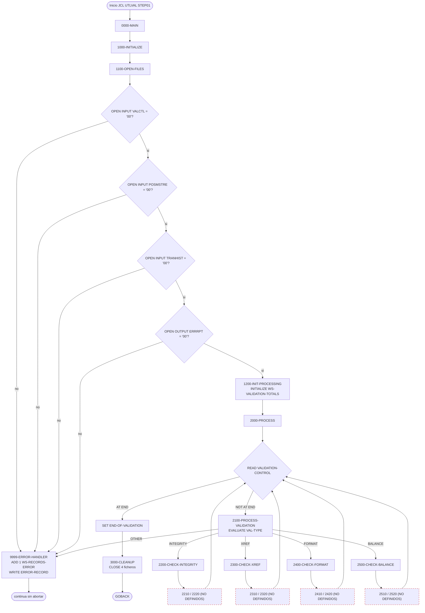
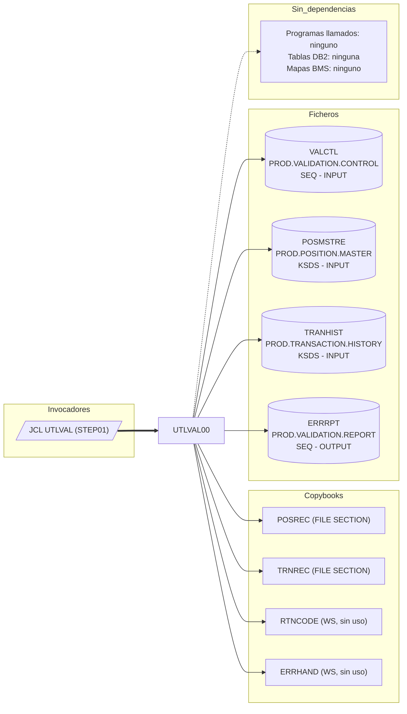

# UTLVAL00 — Utilidad batch de validación de datos (integridad, referencias cruzadas, formato y cuadre)

> Generado a partir del análisis del código fuente `src/programs/utility/UTLVAL00.cbl`. Ver el [grafo de dependencias global](../technical/dependency-graph.md).

## Ficha técnica
| Campo | Valor |
| --- | --- |
| Ruta | `src/programs/utility/UTLVAL00.cbl` |
| Categoría | utility |
| Tipo | batch |
| Líneas | 190 |
| Punto de entrada | JCL `UTLVAL` (`src/jcl/utility/UTLVAL.jcl`, paso `STEP01`, `EXEC PGM=UTLVAL00`) |
| Invocado por | `JCL:UTLVAL` (no hay ningún `CALL` ni `EXEC CICS LINK` a este programa en `src/`) |
| Invoca a | Ningún programa (`CALL`/`LINK`: ninguno). Copybooks: `POSREC`, `TRNREC`, `RTNCODE`, `ERRHAND`. Ficheros: `VALCTL`, `POSMSTRE`, `TRANHIST`, `ERRRPT` |

## Propósito
`UTLVAL00` es la utilidad de **validación de datos** de la capa de utilidades del sistema de gestión de carteras (CLBS). Según su cabecera y `system-architecture.md` (§1.2.3), debe realizar cuatro tipos de comprobación sobre los ficheros maestros VSAM: integridad de datos, validación de referencias cruzadas, verificación de formato y conciliación de saldos, escribiendo las anomalías detectadas en un informe de errores secuencial.

El programa se gobierna mediante un fichero de control (`VALCTL`) en el que cada registro indica el tipo de validación a ejecutar (`INTEGRITY`, `XREF`, `FORMAT`, `BALANCE`). Se ejecuta como paso batch independiente vía el JCL `UTLVAL`, leyendo en modo solo lectura el maestro de posiciones (`POSMSTRE`) y el histórico de transacciones (`TRANHIST`).

**Importante:** en el estado actual del repositorio el programa es un **esqueleto incompleto**: los ocho párrafos que implementan realmente las validaciones (`2210-…`, `2220-…`, `2310-…`, `2320-…`, `2410-…`, `2420-…`, `2510-…`, `2520-…`) se invocan con `PERFORM` pero **no existen** en el fuente, y hay varias referencias sin resolver que impedirían la compilación (ver [Observaciones](#observaciones-y-problemas-detectados)).

## Funcionamiento

### Flujo principal

1. **`0000-MAIN`** — Párrafo raíz. Ejecuta en secuencia `1000-INITIALIZE`, `2000-PROCESS` y `3000-CLEANUP` y termina con `GOBACK`. No fija `RETURN-CODE`.

2. **`1000-INITIALIZE`** — Ejecuta `1100-OPEN-FILES` y `1200-INIT-PROCESSING`.

3. **`1100-OPEN-FILES`** — Abre los cuatro ficheros, en este orden y comprobando cada `FILE STATUS` contra `'00'`:
   - `OPEN INPUT VALIDATION-CONTROL` (`WS-VAL-STATUS`) → si falla, mensaje `'ERROR OPENING VALIDATION CONTROL'`.
   - `OPEN INPUT POSITION-MASTER` (`WS-POS-STATUS`) → `'ERROR OPENING POSITION MASTER'`.
   - `OPEN INPUT TRANSACTION-HISTORY` (`WS-TRAN-STATUS`) → `'ERROR OPENING TRANSACTION HISTORY'`.
   - `OPEN OUTPUT ERROR-REPORT` (`WS-RPT-STATUS`) → `'ERROR OPENING ERROR REPORT'`.

   En cada caso de fallo se mueve el texto a `WS-ERROR-MESSAGE` y se ejecuta `9999-ERROR-HANDLER`, pero **la ejecución continúa** (no hay `STOP RUN`, `GOBACK` ni cambio de `RETURN-CODE`). Nótese que los tres primeros errores de apertura intentan escribir en `ERROR-REPORT` **antes** de que ese fichero se haya abierto.

4. **`1200-INIT-PROCESSING`** — `INITIALIZE WS-VALIDATION-TOTALS` (pone a cero contadores y acumuladores). Es redundante con las cláusulas `VALUE ZERO`, pero inofensivo.

5. **`2000-PROCESS`** — Bucle `PERFORM UNTIL END-OF-VALIDATION` que lee secuencialmente `VALIDATION-CONTROL`:
   - `AT END` → `SET END-OF-VALIDATION TO TRUE` (sale del bucle).
   - `NOT AT END` → `PERFORM 2100-PROCESS-VALIDATION`.

   No se comprueba `WS-VAL-STATUS` tras el `READ` (un error de E/S distinto de fin de fichero no se detecta explícitamente), ni se incrementa `WS-RECORDS-READ`.

6. **`2100-PROCESS-VALIDATION`** — `EVALUATE VAL-TYPE` (10 caracteres del registro de control) contra las constantes de `WS-VALIDATION-TYPES`:

   | `VAL-TYPE` | Párrafo ejecutado |
   | --- | --- |
   | `INTEGRITY` | `2200-CHECK-INTEGRITY` |
   | `XREF` | `2300-CHECK-XREF` |
   | `FORMAT` | `2400-CHECK-FORMAT` |
   | `BALANCE` | `2500-CHECK-BALANCE` |
   | cualquier otro | mensaje `'INVALID VALIDATION TYPE'` + `9999-ERROR-HANDLER` |

   El campo `VAL-PARAMETERS` (70 bytes) del registro de control **no se utiliza** en ningún punto del programa.

7. **`2200-CHECK-INTEGRITY`** — `PERFORM 2210-CHECK-POSITION-INTEGRITY` y `PERFORM 2220-CHECK-TRANSACTION-INTEGRITY`. **Ambos párrafos no están definidos.**

8. **`2300-CHECK-XREF`** — `PERFORM 2310-CHECK-POSITION-XREF` y `PERFORM 2320-CHECK-TRANSACTION-XREF`. **No definidos.**

9. **`2400-CHECK-FORMAT`** — `PERFORM 2410-CHECK-POSITION-FORMAT` y `PERFORM 2420-CHECK-TRANSACTION-FORMAT`. **No definidos.**

10. **`2500-CHECK-BALANCE`** — `PERFORM 2510-ACCUMULATE-POSITIONS` y `PERFORM 2520-VERIFY-BALANCES`. **No definidos.** Por los nombres y por los campos `WS-TOTAL-AMOUNT` / `WS-CONTROL-TOTAL` se infiere que la intención era acumular importes de `POSITION-MASTER` y compararlos con un total de control, pero no hay código que lo haga.

11. **`3000-CLEANUP`** — `CLOSE` de los cuatro ficheros en una sola sentencia. No comprueba `FILE STATUS`, no escribe totales ni resumen en el informe y no muestra nada por consola.

12. **`9999-ERROR-HANDLER`** — Rutina común de error: `ADD 1 TO WS-RECORDS-ERROR`, `SET ERROR-FOUND TO TRUE`, mueve `WS-ERROR-MESSAGE` a `WS-ERR-DESC` y hace `WRITE ERROR-RECORD FROM WS-ERROR-LINE` (línea de 132 bytes). No rellena `WS-ERR-TYPE` ni `WS-ERR-KEY`, no comprueba `WS-RPT-STATUS` tras el `WRITE`, no aborta y no llama a `ERRPROC`.

### Diagrama de flujo



> Los nodos con borde rojo discontinuo representan párrafos referenciados por `PERFORM` que no existen en el fuente. El nodo `ERR` (`9999-ERROR-HANDLER`) devuelve el control al punto de llamada; en el caso de los errores de `OPEN`, el programa continúa con la siguiente apertura.

## Interfaz

- **Parámetros / LINKAGE SECTION / COMMAREA**: No aplica. El programa no tiene `LINKAGE SECTION` ni `PROCEDURE DIVISION USING`; no recibe `PARM` del JCL ni COMMAREA.

- **Ficheros (DDNAME, organización, modo de apertura, clave)**:

| Fichero COBOL | DDNAME | DSN en `UTLVAL.jcl` | Organización / acceso | Apertura | Clave | Registro | FILE STATUS |
| --- | --- | --- | --- | --- | --- | --- | --- |
| `VALIDATION-CONTROL` | `VALCTL` | `PROD.VALIDATION.CONTROL` (`DISP=SHR`) | `SEQUENTIAL` / `SEQUENTIAL` | `INPUT` | — | `VALIDATION-RECORD` (80 bytes: `VAL-TYPE` X(10) + `VAL-PARAMETERS` X(70)), `RECORDING MODE F` | `WS-VAL-STATUS` |
| `POSITION-MASTER` | `POSMSTRE` | `PROD.POSITION.MASTER` (`DISP=SHR`) | `INDEXED` (VSAM KSDS) / `DYNAMIC` | `INPUT` | `POS-KEY` (26 bytes: `POS-PORTFOLIO-ID` + `POS-DATE` + `POS-INVESTMENT-ID`) | `POSITION-RECORD` (copybook `POSREC`) | `WS-POS-STATUS` |
| `TRANSACTION-HISTORY` | `TRANHIST` | `PROD.TRANSACTION.HISTORY` (`DISP=SHR`) | `INDEXED` (VSAM KSDS) / `DYNAMIC` | `INPUT` | `TRAN-KEY` (**no definido**; el copybook `TRNREC` define `TRN-KEY`, 28 bytes) | `TRANSACTION-RECORD` (copybook `TRNREC`) | `WS-TRAN-STATUS` |
| `ERROR-REPORT` | `ERRRPT` | `PROD.VALIDATION.REPORT` (`DISP=(NEW,CATLG,DELETE)`, `RECFM=FB`, `LRECL=132`) | `SEQUENTIAL` | `OUTPUT` | — | `ERROR-RECORD` X(132), `RECORDING MODE F` | `WS-RPT-STATUS` |

  Aunque `POSITION-MASTER` y `TRANSACTION-HISTORY` se abren con `ACCESS MODE IS DYNAMIC`, **ningún párrafo existente los lee** (`READ`, `START`), por lo que a día de hoy solo se abren y se cierran.

- **Tablas DB2 y sentencias SQL**: No aplica. El programa no contiene `EXEC SQL`, no incluye `SQLCA` ni `DBPROC`/`DBTBLS`. Esto contradice `system-architecture.md` §5.1.2, que le atribuye dependencia de `DB2CONN` y acceso DB2 de lectura (ver Observaciones).

- **Mapas BMS / comandos CICS**: No aplica (programa batch puro, sin `EXEC CICS`).

- **Códigos de retorno / RETURN-CODE**: El programa **nunca modifica `RETURN-CODE`** ni usa los campos de `RTNCODE`/`ERRHAND` (`ERR-SUCCESS`, `ERR-ERROR`, `RC-CURRENT-CODE`, etc.). Termina siempre con `GOBACK`, por lo que el paso JCL devolverá `RC=0` salvo que se produzca un abend de ejecución (p. ej. `WRITE` sobre un fichero no abierto). La única señal de error es el flag interno `ERROR-FOUND` (`WS-ERROR-FOUND = 'Y'`) y las líneas escritas en `ERRRPT`, y ese flag no se consulta en ningún sitio.

## Estructuras de datos clave

### Copybooks

| Copybook | Sección | Aporta | Uso real en el programa |
| --- | --- | --- | --- |
| `POSREC` (`src/copybook/common/POSREC.cpy`) | `FILE SECTION` | `01 POSITION-RECORD`: `POS-KEY` (`POS-PORTFOLIO-ID` X(8), `POS-DATE` X(8), `POS-INVESTMENT-ID` X(10)), `POS-DATA` (`POS-QUANTITY` S9(11)V9(4) COMP-3, `POS-COST-BASIS`, `POS-MARKET-VALUE` S9(13)V99 COMP-3, `POS-CURRENCY`, `POS-STATUS` con 88 `A`/`C`/`P`), `POS-AUDIT`, `POS-FILLER` X(50) | Solo `POS-KEY` como `RECORD KEY`. Se copia **sin un `FD POSITION-MASTER` precedente** (ver Observaciones). |
| `TRNREC` (`src/copybook/common/TRNREC.cpy`) | `FILE SECTION` | `01 TRANSACTION-RECORD`: `TRN-KEY` (`TRN-DATE` X(8), `TRN-TIME` X(6), `TRN-PORTFOLIO-ID` X(8), `TRN-SEQUENCE-NO` X(6)), `TRN-DATA` (`TRN-INVESTMENT-ID`, `TRN-TYPE` con 88 `BU`/`SL`/`TR`/`FE`, `TRN-QUANTITY`, `TRN-PRICE`, `TRN-AMOUNT`, `TRN-CURRENCY`, `TRN-STATUS` con 88 `P`/`D`/`F`/`R`), `TRN-AUDIT`, `TRN-FILLER` | Ninguno de sus campos se referencia; el `SELECT` usa `TRAN-KEY`, que no existe. Se copia **sin `FD TRANSACTION-HISTORY`**. |
| `RTNCODE` (`src/copybook/common/RTNCODE.cpy`) | `WORKING-STORAGE` | `01 RETURN-CODE-AREA`: `RC-REQUEST-TYPE` (88 `I/S/G/L/A`), `RC-PROGRAM-ID`, `RC-CURRENT-CODE`, `RC-HIGHEST-CODE`, `RC-NEW-CODE`, `RC-STATUS`, `RC-MESSAGE`, datos de análisis y retorno | **No se usa** ningún campo. Está pensado para dialogar con `RTNCDE00`, al que este programa no llama. |
| `ERRHAND` (`src/copybook/common/ERRHAND.cpy`) | `WORKING-STORAGE` | `ERR-CATEGORIES` (`VS`/`VL`/`PR`/`SY`), `ERR-RETURN-CODES` (0/4/8/12/16), `ERR-MESSAGE` (timestamp, programa, categoría, código, severidad, `ERR-TEXT` X(80), `ERR-DETAILS` X(256)), `ERR-VSAM-STATUSES` (`00`,`22`,`23`,`10`) y `ERR-VSAM-MSGS` | **No se usa** ningún campo. En particular, `ERRHAND` **no define `WS-ERROR-MESSAGE`**, que el programa emplea seis veces. |

### WORKING-STORAGE propio

| Estructura / campo | Tipo | Función | Observación |
| --- | --- | --- | --- |
| `WS-FILE-STATUS` → `WS-VAL-STATUS`, `WS-POS-STATUS`, `WS-TRAN-STATUS`, `WS-RPT-STATUS` | X(2) c/u | `FILE STATUS` de cada fichero | Solo se consultan tras los `OPEN`. |
| `WS-VALIDATION-TYPES` → `WS-INTEGRITY`, `WS-XREF`, `WS-FORMAT`, `WS-BALANCE` | X(10) con `VALUE` `'INTEGRITY'`, `'XREF'`, `'FORMAT'`, `'BALANCE'` | Constantes del `EVALUATE VAL-TYPE` | Comparación de 10 bytes con relleno de espacios; el tipo debe empezar en columna 1 del registro de control y estar en mayúsculas. |
| `WS-PROCESSING-FLAGS` → `WS-END-OF-VAL` (88 `END-OF-VALIDATION` = `'Y'`), `WS-ERROR-FOUND` (88 `ERROR-FOUND` = `'Y'`) | X(1) | Control del bucle de lectura y flag global de error | `ERROR-FOUND` se activa pero nunca se consulta. |
| `WS-VALIDATION-TOTALS` → `WS-RECORDS-READ`, `WS-RECORDS-VALID`, `WS-RECORDS-ERROR` (9(9)); `WS-TOTAL-AMOUNT`, `WS-CONTROL-TOTAL` (S9(15)V99) | numéricos | Contadores y acumuladores para el cuadre | Solo `WS-RECORDS-ERROR` se incrementa (en `9999-ERROR-HANDLER`). Los demás nunca se actualizan ni se imprimen. |
| `WS-ERROR-LINE` → `WS-ERR-TYPE` X(10), `FILLER` X(2), `WS-ERR-KEY` X(20), `FILLER` X(2), `WS-ERR-DESC` X(98) | 132 bytes | Línea de detalle del informe de errores (`ERRRPT`) | Solo se rellena `WS-ERR-DESC`; `WS-ERR-TYPE` y `WS-ERR-KEY` quedan con basura inicial/espacios. Su longitud (132) coincide con `ERROR-RECORD` y con `LRECL=132` del JCL. |
| `WS-ERROR-MESSAGE` | — | Texto de error a reportar | **No está definido** ni en el programa ni en los copybooks incluidos. |
| `SPECIAL-NAMES. CONSOLE IS CONS` | — | Mnemónico para `DISPLAY ... UPON CONS` | Declarado pero **no usado** (a diferencia de `UTLMNT00`, que sí hace `DISPLAY ... UPON CONS`). |

### Registro de control (`VALCTL`)

```
Col  1-10  VAL-TYPE        'INTEGRITY' | 'XREF' | 'FORMAT' | 'BALANCE'
Col 11-80  VAL-PARAMETERS  libre (no interpretado por el programa)
```

No existe en el repositorio ningún fichero de ejemplo ni especificación de `PROD.VALIDATION.CONTROL`; el formato anterior se deduce exclusivamente del `FD`.

## Reglas de negocio y validaciones

Reglas efectivamente implementadas en el código:

1. **Tipos de validación admitidos**: el valor de `VAL-TYPE` debe ser exactamente `INTEGRITY`, `XREF`, `FORMAT` o `BALANCE` (mayúsculas, alineado a la izquierda, 10 posiciones). Cualquier otro valor genera la línea de error `INVALID VALIDATION TYPE` en `ERRRPT` y se sigue con el siguiente registro de control.
2. **Un registro de control = una ejecución de validación**: el fichero `VALCTL` actúa como "lista de tareas"; el mismo tipo puede aparecer varias veces y se ejecutaría cada vez.
3. **Apertura obligatoria de los cuatro ficheros**: cualquier `FILE STATUS` distinto de `'00'` en el `OPEN` se registra como error (pero no detiene el proceso).
4. **Contabilización de errores**: cada invocación de `9999-ERROR-HANDLER` incrementa `WS-RECORDS-ERROR` en 1 y fija `ERROR-FOUND`.

Reglas **anunciadas pero no implementadas** (los párrafos no existen; se describen solo por el nombre del párrafo y los campos preparados, como inferencia):

- *Integridad* (`2210-CHECK-POSITION-INTEGRITY`, `2220-CHECK-TRANSACTION-INTEGRITY`): probablemente recorrer `POSMSTRE`/`TRANHIST` comprobando coherencia interna de cada registro (p. ej. `POS-STATUS` ∈ {A,C,P}, `TRN-TYPE` ∈ {BU,SL,TR,FE}, `TRN-STATUS` ∈ {P,D,F,R}).
- *Referencias cruzadas* (`2310-CHECK-POSITION-XREF`, `2320-CHECK-TRANSACTION-XREF`): probablemente verificar que cada `TRN-PORTFOLIO-ID`/`TRN-INVESTMENT-ID` tiene posición en `POSMSTRE` y viceversa (el `ACCESS MODE IS DYNAMIC` de ambos ficheros apunta a lecturas aleatorias por clave).
- *Formato* (`2410-CHECK-POSITION-FORMAT`, `2420-CHECK-TRANSACTION-FORMAT`): probablemente validar fechas `YYYYMMDD`/horas `HHMMSS`, campos numéricos COMP-3 y códigos de moneda.
- *Cuadre* (`2510-ACCUMULATE-POSITIONS`, `2520-VERIFY-BALANCES`): probablemente sumar `POS-MARKET-VALUE` o `POS-COST-BASIS` en `WS-TOTAL-AMOUNT` y compararlo con `WS-CONTROL-TOTAL` (que presumiblemente vendría de `VAL-PARAMETERS`, hoy sin usar).

Ninguna de estas reglas está respaldada por código en el repositorio.

## Manejo de errores y recuperación

- **Errores de fichero (FILE STATUS)**: solo se comprueban en los cuatro `OPEN` de `1100-OPEN-FILES` (`NOT = '00'`). El `READ` de `VALIDATION-CONTROL` únicamente distingue `AT END`/`NOT AT END`; el `WRITE` de `ERROR-RECORD` y los `CLOSE` no comprueban estado. No se distinguen códigos VSAM concretos (`22`, `23`, `10`…) pese a tener las constantes de `ERRHAND` disponibles.
- **Rutina de error `9999-ERROR-HANDLER`**: registra una línea de 132 bytes en `ERRRPT` con la descripción en `WS-ERR-DESC` (cols. 35-132) y cuenta el error. No hay severidad, timestamp, ni identificación del registro afectado (`WS-ERR-TYPE`/`WS-ERR-KEY` no se rellenan).
- **Sin abortar ni propagar**: no hay `STOP RUN`, no se establece `RETURN-CODE`, no se hace `DISPLAY UPON CONS`. Un fallo al abrir `POSMSTRE` o `TRANHIST` deja al programa continuar hasta `3000-CLEANUP`, donde el `CLOSE` de un fichero no abierto producirá un `FILE STATUS` `42` que tampoco se comprueba.
- **Riesgo de abend**: si falla el `OPEN` de `VALCTL`, `POSMSTRE` o `TRANHIST`, `9999-ERROR-HANDLER` ejecuta `WRITE ERROR-RECORD` sobre `ERROR-REPORT` **todavía no abierto**; sin `FILE STATUS` comprobado ni declarativas (`USE AFTER ERROR`), el comportamiento en Enterprise COBOL es un abend de ejecución (status `48`, "WRITE on file not opened in OUTPUT/EXTEND mode"). Lo mismo ocurre si falla el propio `OPEN OUTPUT ERROR-REPORT`.
- **SQLCODE / DB2**: No aplica (sin SQL).
- **Condiciones CICS**: No aplica.
- **Checkpoint/restart y rollback**: No existen. El programa no usa `CKPRST`, ni el fichero de control batch `BCHCTL`, ni `COMMIT`/`ROLLBACK`. Al ser solo lectura sobre los maestros y escribir un informe nuevo (`DISP=(NEW,CATLG,DELETE)`), es re-ejecutable desde cero sin efectos secundarios (el JCL borra el informe si el paso falla). `system-architecture.md` §6.3 indica "Recovery Method: Restart" para las utilidades, algo que este programa no implementa.
- **Llamadas a ERRPROC/ERRHNDL/DB2ERR**: Ninguna. `system-architecture.md` §5.1.2 y §6.3 asignan `ERRPROC` como manejador de errores de las utilidades, pero `UTLVAL00` gestiona los errores localmente con `9999-ERROR-HANDLER`.

## Dependencias



Otros programas que comparten los mismos ficheros: `RPTPOS00` (lee `POSMSTRE` y `TRANHIST` con los mismos copybooks y el mismo `RECORD KEY IS TRAN-KEY` erróneo) y `HISTLD00` (lee `TRANHIST` con `HISTREC`).

## Observaciones y problemas detectados

### Errores que impiden la compilación

1. **Párrafos referenciados que no existen** (8): `2210-CHECK-POSITION-INTEGRITY`, `2220-CHECK-TRANSACTION-INTEGRITY`, `2310-CHECK-POSITION-XREF`, `2320-CHECK-TRANSACTION-XREF`, `2410-CHECK-POSITION-FORMAT`, `2420-CHECK-TRANSACTION-FORMAT`, `2510-ACCUMULATE-POSITIONS`, `2520-VERIFY-BALANCES`. Son precisamente los que contendrían toda la lógica de validación: el programa es un esqueleto sin funcionalidad real, pese a que `development-backlog.md` marca las cuatro capacidades de UTLVAL00 como completadas (`[x]`).
2. **`WS-ERROR-MESSAGE` no está definido** en `WORKING-STORAGE` ni en `RTNCODE`/`ERRHAND` (usado en las líneas 110, 117, 124, 131, 160 y 189). El mismo defecto se repite en `UTLMNT00`, `UTLMON00`, `RPTPOS00`, `RPTAUD00`, `RPTSTA00`, `TSTGEN00` y `TSTVAL00`, lo que sugiere que se esperaba que lo aportase `ERRHAND`.
3. **`RECORD KEY IS TRAN-KEY`** para `TRANSACTION-HISTORY`: el copybook `TRNREC` define la clave como `TRN-KEY`. El mismo error aparece en `RPTPOS00`.
4. **Faltan las cláusulas `FD POSITION-MASTER` y `FD TRANSACTION-HISTORY`**: `COPY POSREC` y `COPY TRNREC` insertan directamente registros de nivel `01` en la `FILE SECTION` sin un `FD` que los asocie a los ficheros declarados en `FILE-CONTROL`. Además, la clave del `SELECT` (`POS-KEY`) debe pertenecer a un registro del `FD` correspondiente. Mismo patrón en `RPTPOS00`.

### Defectos lógicos / funcionales

5. **Escritura en `ERROR-REPORT` antes de abrirlo**: los tres primeros `OPEN` de `1100-OPEN-FILES` llaman a `9999-ERROR-HANDLER`, que hace `WRITE ERROR-RECORD` sobre un fichero aún cerrado → abend en ejecución.
6. **El programa nunca aborta ni informa al JCL**: tras un error de apertura sigue ejecutándose y termina con `RETURN-CODE` 0. `ERROR-FOUND` se activa pero no se consulta; `RTNCODE`/`ERRHAND` se incluyen pero no se usan. Esto contradice el patrón de `ERRPROC` + códigos 0/4/8/12/16 descrito en `system-architecture.md` §6.
7. **Contadores sin uso**: `WS-RECORDS-READ`, `WS-RECORDS-VALID`, `WS-TOTAL-AMOUNT`, `WS-CONTROL-TOTAL` nunca se actualizan ni se imprimen; no hay línea de totales en `ERRRPT`.
8. **Línea de error incompleta**: `WS-ERR-TYPE` y `WS-ERR-KEY` nunca se rellenan, de modo que el informe no identifica ni el tipo de validación ni el registro afectado.
9. **`VAL-PARAMETERS` (70 bytes) no se interpreta**; el tipo `BALANCE` no tiene de dónde obtener el total de control.
10. **`POSITION-MASTER` y `TRANSACTION-HISTORY` se abren pero nunca se leen** (no hay `READ`/`START`) en el código existente.
11. **`CONSOLE IS CONS`** declarado en `SPECIAL-NAMES` sin ningún `DISPLAY ... UPON CONS`.
12. No se comprueba `FILE STATUS` tras `READ`, `WRITE` ni `CLOSE`.

### Discrepancias con la documentación y el resto del repositorio

13. **`system-architecture.md` §5.1.2** indica que `UTLVAL00` depende de `DB2CONN` y `ERRPROC` y tiene acceso DB2 de lectura. El código **no contiene `EXEC SQL`, no incluye `SQLCA` y no llama a ningún programa**. Manda el código: es un programa VSAM puro sin DB2.
14. **`system-architecture.md` §6.3** asigna a las utilidades el manejador `ERRPROC` y recuperación por "Restart"; `UTLVAL00` no llama a `ERRPROC` ni implementa checkpoint/restart.
15. **`data-dictionary.md` §2.2/§2.3** describe `POSMSTRE` con clave `ACCOUNT-NO + FUND-ID` (250 bytes) y `TRANHIST` como ESDS con layout `HISTORY-RECORD`. El código usa `POSREC` (clave `POS-PORTFOLIO-ID + POS-DATE + POS-INVESTMENT-ID`) y `TRNREC` (KSDS con clave de 28 bytes). Además `vsam-definitions.txt` define `TRANHIST` como KSDS con **clave de 20 bytes** (fecha 8 + hora 6 + cartera 8 + secuencia 6 = 28 en el comentario, pero `KEY LENGTH: 20` en la ficha), y no define ningún fichero `POSMSTRE` (solo `PORTMSTR`, `TRANHIST`, `POSHIST`). El layout real de `PROD.POSITION.MASTER` no está definido de forma consistente en el repositorio.
16. **`vsam-definitions.txt`** indica `RECORD LENGTH: 300` para `TRANHIST`, mientras que `TRANSACTION-RECORD` (`TRNREC`) ocupa 28 + 10 + 2 + 8 + 8 + 8 + 3 + 1 + 26 + 8 + 50 = 152 bytes. Inconsistencia de longitudes.
17. **`development-backlog.md`** marca "Error correction" como completado para UTLVAL00; el programa no contiene ninguna lógica de corrección, solo (en intención) de detección.
18. No existe en `src/` ningún fichero de ejemplo ni DDL/especificación para `PROD.VALIDATION.CONTROL` (`VALCTL`) ni para `PROD.VALIDATION.REPORT`.
19. Nombre del job en el JCL (`//UTLVAL00 JOB`) distinto del nombre del fichero (`UTLVAL.jcl`); es cosmético pero conviene tenerlo en cuenta al buscar el job en el scheduler.

## Referencias

- Programa: [UTLVAL00.cbl](../../src/programs/utility/UTLVAL00.cbl)
- JCL: [UTLVAL.jcl](../../src/jcl/utility/UTLVAL.jcl)
- Copybooks:
  - [POSREC.cpy](../../src/copybook/common/POSREC.cpy)
  - [TRNREC.cpy](../../src/copybook/common/TRNREC.cpy)
  - [RTNCODE.cpy](../../src/copybook/common/RTNCODE.cpy)
  - [ERRHAND.cpy](../../src/copybook/common/ERRHAND.cpy)
- Definiciones VSAM: [vsam-definitions.txt](../../src/database/vsam/vsam-definitions.txt)
- Programas relacionados (mismos ficheros/copybooks): [RPTPOS00.cbl](../../src/programs/batch/RPTPOS00.cbl), [UTLMNT00.cbl](../../src/programs/utility/UTLMNT00.cbl), [UTLMON00.cbl](../../src/programs/utility/UTLMON00.cbl)
- Documentación técnica: [system-architecture.md](../technical/system-architecture.md), [data-dictionary.md](../technical/data-dictionary.md), [development-backlog.md](../technical/development-backlog.md), [dependency-graph.md](../technical/dependency-graph.md), [dependency-graph.json](../technical/dependency-graph.json)
