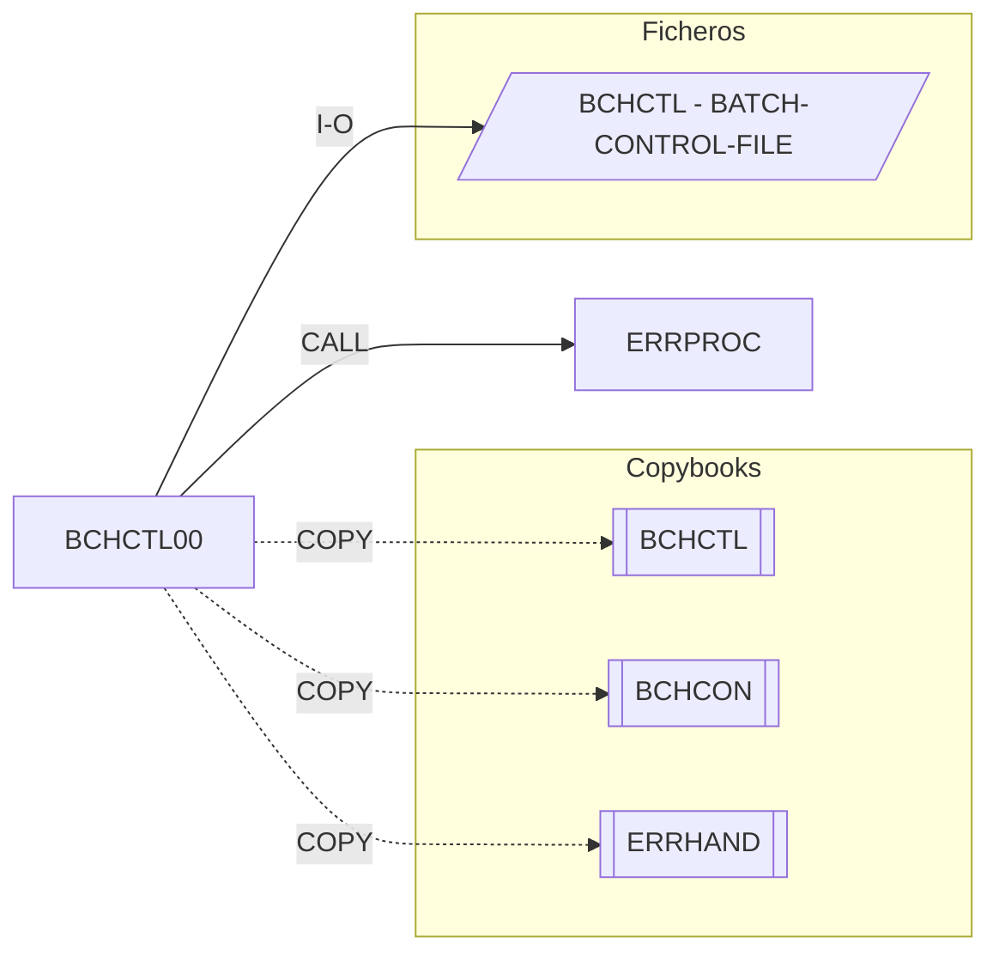

# BCHCTL00 — Batch Control Processor

Fuente: `src/programs/batch/BCHCTL00.cbl`

## Propósito

Controlador del estado de ejecución de los procesos batch. Mantiene el fichero VSAM de control de lotes (`BCHCTL`) con un registro por (job, fecha de proceso, secuencia) y ofrece cuatro funciones a los programas que lo invocan: inicializar un proceso, comprobar prerrequisitos, actualizar el estado y finalizar el proceso.

## Tipo

Subrutina batch (se invoca por `CALL` con un área de petición en `LINKAGE SECTION`; no tiene JCL propio).

## Entradas y salidas

| Recurso | DDNAME / nombre | Tipo | Uso |
|---|---|---|---|
| `BATCH-CONTROL-FILE` | `BCHCTL` | VSAM KSDS (acceso dinámico, clave `BCT-KEY`) | Lectura / escritura / reescritura de registros de control |

Copybooks:

- `BCHCTL` (FD del fichero de control: `BCT-KEY` = job + fecha + secuencia, estado, contadores, dependencias).
- `BCHCON` (constantes: estados `BCT-STAT-*` y umbrales de retorno `BCT-RC-*`).
- `ERRHAND` (área de mensaje de error `ERR-MESSAGE`, `ERR-PROGRAM`, `ERR-TEXT`).

Parámetros (`LINKAGE SECTION`, `LS-CONTROL-REQUEST`):

| Campo | PIC | Descripción |
|---|---|---|
| `LS-FUNCTION` | X(4) | `INIT`, `CHEK`, `UPDT`, `TERM` |
| `LS-JOB-NAME` | X(8) | Job/proceso |
| `LS-PROCESS-DATE` | X(8) | Fecha de proceso |
| `LS-SEQUENCE-NO` | 9(4) | Número de secuencia |
| `LS-RETURN-CODE` | S9(4) COMP | Código de retorno devuelto al llamador |

## Flujo principal

1. `0000-MAIN`: `EVALUATE` sobre `LS-FUNCTION`:
   - `INIT` → `1000-PROCESS-INITIALIZE`: abrir ficheros (`1100`), leer registro de control (`1200`), validar el proceso (`1300`) y marcar inicio (`1400`).
   - `CHEK` → `2000-CHECK-PREREQUISITES`: leer registro (`2100`), comprobar dependencias (`2200`); si `PREREQS-SATISFIED` devuelve `BCT-RC-SUCCESS`, si no `BCT-RC-WARNING`.
   - `UPDT` → `3000-UPDATE-STATUS`: leer (`3100`), actualizar estado (`3200`) y escribir (`3300`).
   - `TERM` → `4000-PROCESS-TERMINATE`: registrar finalización (`4100`) y cerrar ficheros (`4200`).
   - Otro valor → error "Invalid function code".
2. Copia `LS-RETURN-CODE` a `RETURN-CODE` y `GOBACK`.

> Nota: los párrafos de detalle (`1100-OPEN-FILES`, `1200-READ-CONTROL-RECORD`, `1300-VALIDATE-PROCESS`, `1400-UPDATE-START-STATUS`, `2200-CHECK-DEPENDENCIES`, `3200-UPDATE-PROCESS-STATUS`, `3300-WRITE-CONTROL-RECORD`, `4100-UPDATE-COMPLETION`, `4200-CLOSE-FILES`) están declarados en el comentario final como "to be implemented" y **no existen en el fuente**; el programa es un esqueleto.

## Reglas de negocio y validaciones

- Sólo se admiten las funciones `INIT`/`CHEK`/`UPDT`/`TERM`.
- La comprobación de prerrequisitos devuelve `BCT-RC-WARNING` (+4) cuando quedan dependencias pendientes, no un error.
- Los estados de proceso y umbrales de RC provienen de `BCHCON` (`R`eady, `A`ctive, `W`aiting, `D`one, `E`rror; RC 0/4/8/12/16).

## Manejo de errores y códigos de retorno

- `9000-ERROR-ROUTINE`: fija `ERR-PROGRAM = 'BCHCTL00'`, `LS-RETURN-CODE = BCT-RC-ERROR` (+8) y llama a `ERRPROC` con `ERR-MESSAGE`.
- `RETURN-CODE` final = `LS-RETURN-CODE` (0 éxito, 4 aviso, 8 error).

## Dependencias

- Llama a: `ERRPROC` (CALL).
- Copybooks: `BCHCTL`, `BCHCON`, `ERRHAND`.
- Ficheros: `BCHCTL` (BATCH-CONTROL-FILE).
- Es llamado por: ningún programa ni JCL del repositorio lo invoca (según `deps.json` y `src/jcl/`). La arquitectura documental (`documentation/technical/system-architecture.md`) lo sitúa como orquestador de `POSUPDT`, `TRNVAL00`, etc., pero no hay `CALL`/`EXEC PGM` real.

## Diagrama

