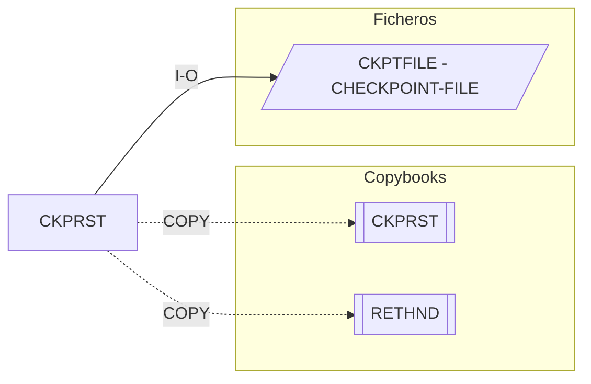

# CKPRST — Checkpoint/Restart

Fuente: `src/programs/batch/CKPRST.cbl`

## Propósito

Subrutina del marco de checkpoint/restart a nivel de programa. Recibe un área de control de checkpoint y despacha a una de cuatro operaciones: inicializar, tomar checkpoint, confirmar checkpoint y reiniciar desde el último checkpoint. Persiste la información en el fichero VSAM `CKPTFILE`.

## Tipo

Subrutina batch (`PROCEDURE DIVISION USING CHECKPOINT-CONTROL RETURN-STATUS`).

## Entradas y salidas

| Recurso | DDNAME / nombre | Tipo | Uso |
|---|---|---|---|
| `CHECKPOINT-FILE` | `CKPTFILE` | VSAM KSDS (dinámico, clave `CKR-KEY`) | Registros de checkpoint (`CHECKPOINT-RECORD`) |

Copybooks:

- `CKPRST` (usado dos veces: en la `FD` como registro `CHECKPOINT-RECORD` y en `LINKAGE` como área `CHECKPOINT-CONTROL`).
- `RETHND` (`RETURN-HANDLING` / `RETURN-STATUS`, códigos estándar `STD-ERROR-CODES`).

Parámetros (`LINKAGE SECTION`):

| Parámetro | Origen | Descripción |
|---|---|---|
| `CHECKPOINT-CONTROL` | `CKPRST.cpy` | Identificación del programa, estado (`CK-INITIAL/ACTIVE/COMPLETE/FAILED/RESTARTED`), fase, contadores y última clave procesada |
| `RETURN-STATUS` | `RETHND.cpy` | Estado de retorno al llamador |

## Flujo principal

1. `EVALUATE TRUE` sobre las condiciones `ENTRY-POINT-INIT`, `ENTRY-POINT-TAKE`, `ENTRY-POINT-COMMIT`, `ENTRY-POINT-RESTART`:
   - `PROC-INIT` — inicializar el proceso de checkpoint.
   - `PROC-TAKE-CHECKPOINT` — tomar un checkpoint.
   - `PROC-COMMIT-CHECKPOINT` — confirmar el checkpoint.
   - `PROC-RESTART` — procesar el reinicio.
2. `GOBACK`.

> Nota: los cuatro párrafos sólo contienen comentarios; la lógica no está implementada. Además, las condiciones `ENTRY-POINT-*` no están definidas en `CKPRST.cpy` (que define `CK-*`), por lo que el fuente no compilaría tal cual. El copybook documenta puntos de entrada alternativos `CKPINIT`/`CKPTAKE`/`CKPCMIT`/`CKPRSTR` que tampoco existen como programas.

## Reglas de negocio y validaciones

- Modelo de checkpoint basado en fases (`CK-PHASE-INIT/READ/PROC/...`) y estados definidos en `CKPRST.cpy`; el programa sólo enruta la petición.
- `BCHCTL.cpy` indica que `CKPRST` gestiona el checkpoint a nivel de programa mientras `BCHCTL` lo hace a nivel de job.

## Manejo de errores y códigos de retorno

- No hay tratamiento de errores explícito; `WS-FILE-STATUS` se declara pero no se consulta. El resultado se devolvería vía `RETURN-STATUS` (copybook `RETHND`).

## Dependencias

- Llama a: nadie.
- Copybooks: `CKPRST`, `RETHND`.
- Ficheros: `CKPTFILE` (CHECKPOINT-FILE).
- Es llamado por: ningún programa del repositorio (no hay `CALL 'CKPRST'` ni JCL).

## Diagrama

