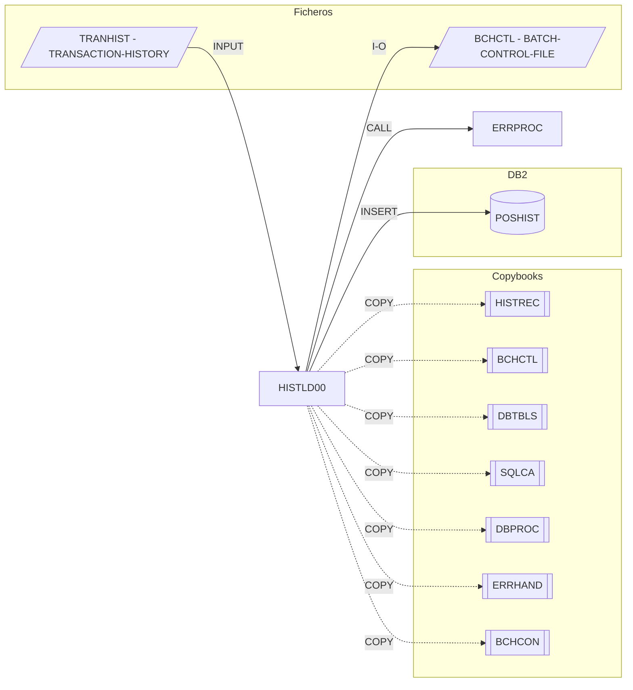

# HISTLD00 — Position History DB2 Load

Fuente: `src/programs/batch/HISTLD00.cbl`

## Propósito

Carga el histórico de transacciones desde el fichero VSAM `TRANHIST` a la tabla DB2 `POSHIST`, con commits periódicos cada 1.000 registros y actualización de un checkpoint en el fichero de control de lotes (`BCHCTL`) para permitir el reinicio.

## Tipo

Programa batch principal (sin `LINKAGE SECTION`; termina con `RETURN-CODE`).

## Entradas y salidas

| Recurso | DDNAME / nombre | Tipo | Uso |
|---|---|---|---|
| `TRANSACTION-HISTORY` | `TRANHIST` | VSAM KSDS (secuencial, clave `TH-KEY`) | Entrada: registros `HISTREC` |
| `BATCH-CONTROL-FILE` | `BCHCTL` | VSAM KSDS (dinámico, clave `BCT-KEY`) | I-O: registro de control/checkpoint del job `HISTLD00` |
| Tabla DB2 `POSHIST` | — | DB2 | Salida: `INSERT` de un registro por transacción |

Copybooks: `HISTREC` (FD), `BCHCTL` (FD), `DBTBLS` (host variables `POSHIST-RECORD`, dentro de `DECLARE SECTION`), `SQLCA`, `DBPROC` (párrafos `CONNECT-TO-DB2`, `DISCONNECT-FROM-DB2`, `DB2-ERROR-ROUTINE`), `ERRHAND`, `BCHCON`.

Parámetros: ninguno.

## Flujo principal

1. `0000-MAIN` → `1000-INITIALIZE`:
   - `1100-OPEN-FILES`: `OPEN INPUT TRANHIST`, `OPEN I-O BCHCTL`; error si status ≠ `00`.
   - `1200-CONNECT-DB2`: `PERFORM CONNECT-TO-DB2` (de `DBPROC`).
   - `1300-INIT-CHECKPOINTS`: lee el registro de control con `BCT-JOB-NAME = 'HISTLD00'`, lo marca `BCT-STAT-ACTIVE` y lo reescribe.
2. `2000-PROCESS` hasta `END-OF-FILE` o `WS-ERROR-COUNT > 100`:
   - `2100-READ-HISTORY`: lectura secuencial; incrementa `WS-RECORDS-READ`.
   - `2200-LOAD-TO-DB2`: mapea `TH-*` → `PH-*` e `INSERT INTO POSHIST VALUES (:POSHIST-RECORD)`.
   - `2300-CHECK-COMMIT`: cada `WS-COMMIT-THRESHOLD` (1000) registros hace `COMMIT WORK` y `2310-UPDATE-CHECKPOINT` (copia contadores a `BCT-RECORDS-READ/WRITTEN` y `REWRITE`).
3. `3000-TERMINATE`: `3100-FINAL-COMMIT` (commit + checkpoint), `3200-CLOSE-FILES`, `3300-DISCONNECT-DB2`, `3400-DISPLAY-STATS` (registros leídos, escritos, errores).
4. `MOVE WS-ERROR-COUNT TO RETURN-CODE` y `GOBACK`.

## Reglas de negocio y validaciones

- Un `SQLCODE = -803` (clave duplicada) se ignora silenciosamente: la carga es idempotente/reanudable.
- Cualquier otro `SQLCODE ≠ 0` cuenta como error y ejecuta `DB2-ERROR-ROUTINE`.
- El proceso se detiene tras más de 100 errores.
- Umbral de commit fijo: 1.000 inserciones.

## Manejo de errores y códigos de retorno

- `9000-ERROR-ROUTINE`: `ERR-PROGRAM = 'HISTLD00'`, `CALL 'ERRPROC' USING ERR-MESSAGE`, `ROLLBACK WORK`. No aborta: el control vuelve al párrafo llamador.
- `RETURN-CODE` = número de errores DB2 acumulados (0 = éxito).

## Dependencias

- Llama a: `ERRPROC` (CALL).
- Copybooks: `HISTREC`, `BCHCTL`, `DBTBLS`, `SQLCA`, `DBPROC`, `ERRHAND`, `BCHCON`.
- Tablas DB2: `POSHIST` (INSERT).
- Ficheros: `TRANHIST`, `BCHCTL`.
- Es llamado por: ningún JCL del repositorio. Figura como paso de `SEQ-MAIN-PROCESS` en `PRCSEQ.cpy` (`TRNVAL00 → POSUPD00 → HISTLD00`).

## Diagrama

