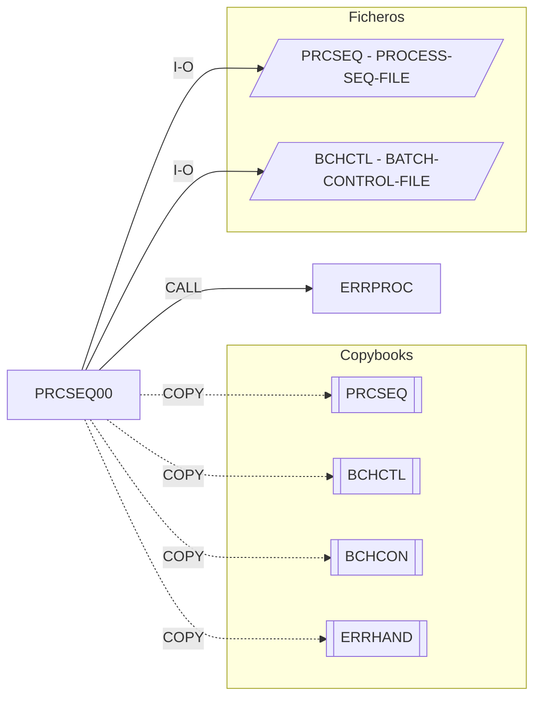

# PRCSEQ00 — Process Sequence Manager

Fuente: `src/programs/batch/PRCSEQ00.cbl`

## Propósito

Gestor de secuencias de procesos batch. A partir de las definiciones del fichero de secuencias (`PRCSEQ`) construye en memoria la lista ordenada de procesos de un tipo para una fecha, crea sus registros en el fichero de control (`BCHCTL`), entrega el siguiente proceso listo comprobando sus dependencias, refresca el estado de la secuencia y determina el resultado global al finalizar.

## Tipo

Subrutina batch (`PROCEDURE DIVISION USING LS-SEQUENCE-REQUEST`).

## Entradas y salidas

| Recurso | DDNAME / nombre | Tipo | Uso |
|---|---|---|---|
| `PROCESS-SEQ-FILE` | `PRCSEQ` | VSAM KSDS (dinámico, clave `PSR-KEY`) | I-O: definiciones de proceso (`PSR-PROCESS-ID`, `PSR-TYPE`, dependencias `PSR-DEP-*`) |
| `BATCH-CONTROL-FILE` | `BCHCTL` | VSAM KSDS (dinámico, clave `BCT-KEY`) | I-O: un registro de control por proceso de la secuencia |

Copybooks: `PRCSEQ` (FD), `BCHCTL` (FD), `BCHCON` (estados/RC), `ERRHAND`.

Tabla interna `WS-PROCESS-TABLE`: hasta 100 entradas (`WS-PROC-ID`, `WS-PROC-SEQ`, `WS-PROC-STATUS`, `WS-PROC-RC`).

Parámetros (`LS-SEQUENCE-REQUEST`):

| Campo | PIC | Descripción |
|---|---|---|
| `LS-FUNCTION` | X(4) | `INIT`, `NEXT`, `STAT`, `TERM` |
| `LS-PROCESS-DATE` | X(8) | Fecha de proceso |
| `LS-SEQUENCE-TYPE` | X(3) | Tipo de secuencia a construir (filtra `PSR-TYPE`) |
| `LS-NEXT-PROCESS` | X(8) | Salida de `NEXT` / entrada de `STAT` |
| `LS-RETURN-CODE` | S9(4) COMP | Código de retorno |

## Flujo principal

1. `0000-MAIN`: `EVALUATE` sobre la función y `MOVE LS-RETURN-CODE TO RETURN-CODE`, `GOBACK`.
2. `INIT` → `1000-INITIALIZE-SEQUENCE`:
   - `1100-OPEN-FILES`: `OPEN I-O` de ambos ficheros.
   - `1200-BUILD-SEQUENCE`: `START PRCSEQ KEY >= fecha`, lee secuencialmente y con `1210-ADD-TO-SEQUENCE` añade a la tabla los registros cuyo `PSR-TYPE = LS-SEQUENCE-TYPE`, estado inicial `READY`.
   - `1300-CREATE-CONTROL-RECORDS`: `WRITE` de un `BATCH-CONTROL-RECORD` por entrada (job, fecha, secuencia, `BCT-STAT-READY`).
3. `NEXT` → `2000-GET-NEXT-PROCESS`:
   - `2100-FIND-NEXT-READY`: primer proceso con estado `READY` → `LS-NEXT-PROCESS` (o espacios si no hay).
   - `2200-CHECK-DEPENDENCIES`: lee la definición del proceso y, por cada dependencia (`PSR-DEP-COUNT`), `2210-CHECK-DEP-STATUS`.
   - Si `LS-RETURN-CODE = 0`, `2300-UPDATE-PROCESS-STATUS`: marca el registro de control `ACTIVE`, sella `BCT-START-TIME` y `REWRITE`.
4. `STAT` → `3000-CHECK-STATUS`: `3100-READ-CONTROL-STATUS` (lee el registro de `LS-NEXT-PROCESS`), `3200-UPDATE-SEQUENCE-TABLE` (copia estado y RC a la tabla), `3300-CHECK-COMPLETION` (cuenta activos y en error).
5. `TERM` → `4000-TERMINATE-SEQUENCE`: `4100-CHECK-FINAL-STATUS` y `4200-CLOSE-FILES`.

## Reglas de negocio y validaciones

- Dependencia no finalizada (`NOT BCT-STATUS-DONE`): si es dura (`PSR-DEP-HARD`) → `BCT-RC-WARNING`; las blandas no bloquean.
- Dependencia finalizada con `BCT-RETURN-CODE > PSR-DEP-RC` (RC máximo tolerado) → `BCT-RC-ERROR`.
- Resultado final (`4100`): algún proceso en `ERROR` → RC 8; alguno aún `ACTIVE` → RC 4; si no, RC 0.
- Ausencia de secuencia para la fecha o de definición de proceso son errores.

## Manejo de errores y códigos de retorno

- `9000-ERROR-ROUTINE`: `ERR-PROGRAM = 'PRCSEQ00'`, `LS-RETURN-CODE = BCT-RC-ERROR`, `CALL 'ERRPROC'`. No termina el programa; la ejecución continúa en el párrafo llamador.
- Errores de apertura/cierre de ficheros (status ≠ `00`) y `INVALID KEY` en `START/READ/WRITE/REWRITE` pasan por `9000`.
- Nota: `WS-SUB` (usado en `2200`/`2210`) no está declarado en `WORKING-STORAGE`.

## Dependencias

- Llama a: `ERRPROC` (CALL).
- Copybooks: `PRCSEQ`, `BCHCTL`, `BCHCON`, `ERRHAND`.
- Ficheros: `PRCSEQ`, `BCHCTL`.
- Es llamado por: ningún programa ni JCL del repositorio.

## Diagrama

