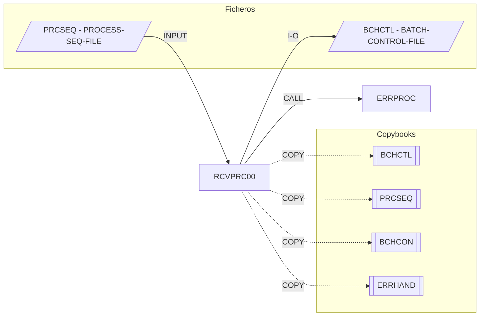

# RCVPRC00 — Process Recovery Handler

Fuente: `src/programs/batch/RCVPRC00.cbl`

## Propósito

Gestor de recuperación de procesos batch. Para un proceso, para todos los de una fecha o para todo el fichero de control, decide la acción de recuperación (reiniciar, saltar o terminar) en función de si el proceso es reiniciable y del número de reintentos, y actualiza el registro de control correspondiente.

## Tipo

Subrutina batch (`PROCEDURE DIVISION USING LS-RECOVERY-REQUEST`).

## Entradas y salidas

| Recurso | DDNAME / nombre | Tipo | Uso |
|---|---|---|---|
| `BATCH-CONTROL-FILE` | `BCHCTL` | VSAM KSDS (dinámico, clave `BCT-KEY`) | I-O: lee y reescribe estado, RC, contador de reinicios |
| `PROCESS-SEQ-FILE` | `PRCSEQ` | VSAM KSDS (dinámico, clave `PSR-KEY`) | Entrada: definición del proceso (`PSR-RESTARTABLE`) |

Copybooks: `BCHCTL` (FD), `PRCSEQ` (FD), `BCHCON`, `ERRHAND`.

Parámetros (`LS-RECOVERY-REQUEST`):

| Campo | PIC | Descripción |
|---|---|---|
| `LS-FUNCTION` | X(4) | `INIT`, `RECV`, `TERM` |
| `LS-PROCESS-DATE` | X(8) | Fecha de proceso (obligatoria) |
| `LS-PROCESS-ID` | X(8) | Proceso (obligatorio en modo `P`) |
| `LS-RECOVERY-TYPE` | X(1) | `P` proceso, `S` secuencia (fecha), `A` todo |
| `LS-RECOVERY-PARM` | X(50) | Parámetro libre (no usado) |
| `LS-RETURN-CODE` | S9(4) COMP | Código de retorno |

## Flujo principal

1. `0000-MAIN`: `EVALUATE` función; `MOVE LS-RETURN-CODE TO RETURN-CODE`; `GOBACK`.
2. `INIT` → `1000-INITIALIZE-RECOVERY`: `1100-OPEN-FILES` (`I-O BCHCTL`, `INPUT PRCSEQ`), `1200-VALIDATE-REQUEST`, `1300-SET-RECOVERY-MODE`.
3. `RECV` → `2000-PROCESS-RECOVERY`, según `WS-RECOVERY-MODE`:
   - `P` → `2100-RECOVER-PROCESS`: lee el registro de control (job+fecha), `2110-DETERMINE-ACTION`, `2120-EXECUTE-RECOVERY`.
   - `S` → `2200-RECOVER-SEQUENCE`: `START BCHCTL KEY > (fecha, LOW-VALUES)` y recorre aplicando `2100` a cada registro cuya `BCT-PROCESS-DATE` coincida.
   - `A` → `2300-RECOVER-ALL`: recorre todo el fichero aplicando `2100` a cada registro.
4. `2110-DETERMINE-ACTION`: lee `PRCSEQ`; si `PSR-RESTARTABLE` → `RESTART`; si no, `BCT-RESTART-COUNT > BCT-MAX-RESTARTS` → `TERMINATE`, en otro caso `BYPASS`.
5. `2120-EXECUTE-RECOVERY`:
   - `2121-RESTART-PROCESS`: estado `READY`, `+1 BCT-RESTART-COUNT`, sella `BCT-ATTEMPT-TS`, `REWRITE`.
   - `2122-BYPASS-PROCESS`: estado `DONE`, RC `WARNING`, descripción "Process bypassed by recovery", `REWRITE`.
   - `2123-TERMINATE-PROCESS`: estado `ERROR`, RC `ERROR`, "Process terminated by recovery", `REWRITE`.
6. `TERM` → `3000-TERMINATE-RECOVERY`: `3100-UPDATE-FINAL-STATUS` (mensaje de éxito/errores vía `ERRPROC`) y `3200-CLOSE-FILES`.

## Reglas de negocio y validaciones

- `LS-PROCESS-DATE` obligatorio; `LS-RECOVERY-TYPE` ∈ {P, S, A}; en modo `P` se exige `LS-PROCESS-ID`.
- Un proceso no reiniciable se salta (bypass) hasta agotar `BCT-MAX-RESTARTS`, después se termina en error.
- Nota: la rama `RESTART` no comprueba `BCT-MAX-RESTARTS`, así que un proceso reiniciable puede reintentarse indefinidamente.

## Manejo de errores y códigos de retorno

- `9000-ERROR-ROUTINE`: `ERR-PROGRAM = 'RCVPRC00'`, `LS-RETURN-CODE = BCT-RC-ERROR` (+8), `CALL 'ERRPROC' USING ERR-MESSAGE`; no aborta.
- `3100-UPDATE-FINAL-STATUS` también llama a `ERRPROC` para registrar el mensaje informativo final.
- `RETURN-CODE` = `LS-RETURN-CODE` (0 éxito, 8 si hubo algún error).

## Dependencias

- Llama a: `ERRPROC` (CALL, en dos puntos: `9000` y `3100`).
- Copybooks: `BCHCTL`, `PRCSEQ`, `BCHCON`, `ERRHAND`.
- Ficheros: `BCHCTL`, `PRCSEQ`.
- Es llamado por: ningún programa ni JCL del repositorio.

## Diagrama

