# Programas COBOL — grupo `batch`

Documentación funcional y subgrafo de dependencias de los programas de `src/programs/batch/`. Las aristas provienen de `documentation/dependency-graph/deps.json` (extracción estática); los JCL de `src/jcl/` aportan las relaciones `EXEC PGM`.

## Resumen del grupo

El grupo agrupa tres familias:

- **Marco de control batch** (`BCHCTL00`, `PRCSEQ00`, `RCVPRC00`, `CKPRST`): subrutinas que gestionan el fichero de control de lotes `BCHCTL`, la secuencia de procesos `PRCSEQ`, la recuperación/reinicio y los checkpoints (`CKPTFILE`). Ninguna es invocada por otro programa o JCL del repositorio.
- **Carga y actualización** (`HISTLD00`, `POSUPDT`): carga del histórico de transacciones a la tabla DB2 `POSHIST` con commits y checkpoints; `POSUPDT.cbl` está vacío.
- **Informes y códigos de retorno** (`RPTAUD00`, `RPTPOS00`, `RPTSTA00`, `RTNANA00`, `RTNCDE00`): generadores de informes de 132/133 columnas a partir de ficheros VSAM o de la tabla DB2 `RTNCODES`, y la subrutina de gestión de códigos de retorno. Los cuatro informes tienen JCL propio.

Todos los programas de control comparten `BCHCON` (estados `R/A/W/D/E`, umbrales RC 0/4/8/12/16) y `ERRHAND`, y notifican errores a `ERRPROC` (grupo `common`).

## Programas

| Programa | Propósito | Tipo | Doc |
|---|---|---|---|
| BCHCTL00 | Controlador de estado de procesos batch sobre el fichero de control `BCHCTL` (INIT/CHEK/UPDT/TERM) | Subrutina | [BCHCTL00.md](BCHCTL00.md) |
| CKPRST | Marco de checkpoint/restart a nivel de programa sobre `CKPTFILE` (esqueleto) | Subrutina | [CKPRST.md](CKPRST.md) |
| HISTLD00 | Carga `TRANHIST` (VSAM) en la tabla DB2 `POSHIST` con commit cada 1.000 registros y checkpoint en `BCHCTL` | Batch | [HISTLD00.md](HISTLD00.md) |
| POSUPDT | Actualización de posiciones — fuente vacío (0 bytes) | Batch | [POSUPDT.md](POSUPDT.md) |
| PRCSEQ00 | Construye la secuencia de procesos desde `PRCSEQ`, entrega el siguiente proceso listo comprobando dependencias | Subrutina | [PRCSEQ00.md](PRCSEQ00.md) |
| RCVPRC00 | Recuperación de procesos: reiniciar / saltar / terminar según reiniciabilidad y reintentos | Subrutina | [RCVPRC00.md](RCVPRC00.md) |
| RPTAUD00 | Informe de auditoría del sistema desde `AUDITLOG` y `ERRLOG` | Batch (JCL `RPTAUD`) | [RPTAUD00.md](RPTAUD00.md) |
| RPTPOS00 | Informe diario de posiciones desde `POSMSTRE` y `TRANHIST` | Batch (JCL `RPTPOS`) | [RPTPOS00.md](RPTPOS00.md) |
| RPTSTA00 | Informe de estadísticas y rendimiento desde `DB2STATS` y `BCHSTATS` | Batch (JCL `RPTSTA`) | [RPTSTA00.md](RPTSTA00.md) |
| RTNANA00 | Informe de análisis de códigos de retorno desde la tabla DB2 `RTNCODES` | Batch (JCL `RTNANA`) | [RTNANA00.md](RTNANA00.md) |
| RTNCDE00 | Gestor estándar de códigos de retorno; registra y analiza en `RTNCODES` | Subrutina | [RTNCDE00.md](RTNCDE00.md) |

## Subgrafo de dependencias

Incluye todas las aristas de `deps.json` cuyo `from` es un programa del grupo (59 aristas, una duplicada) más las aristas `EXECPGM` desde JCL hacia programas del grupo. Programas como rectángulos, copybooks `[[..]]`, tablas DB2 `[(..)]`, ficheros `[/../]`, JCL `{{..}}`.

```mermaid
flowchart LR
    subgraph Programas_batch["Programas del grupo batch"]
        BCHCTL00[BCHCTL00]
        CKPRST[CKPRST]
        HISTLD00[HISTLD00]
        POSUPDT[POSUPDT]
        PRCSEQ00[PRCSEQ00]
        RCVPRC00[RCVPRC00]
        RPTAUD00[RPTAUD00]
        RPTPOS00[RPTPOS00]
        RPTSTA00[RPTSTA00]
        RTNANA00[RTNANA00]
        RTNCDE00[RTNCDE00]
    end
    subgraph Programas_externos["Programas externos"]
        ERRPROC[ERRPROC]
    end
    subgraph JCL
        JCL_RPTAUD{{RPTAUD.jcl}}
        JCL_RPTPOS{{RPTPOS.jcl}}
        JCL_RPTSTA{{RPTSTA.jcl}}
        JCL_RTNANA{{RTNANA.jcl}}
    end
    subgraph Copybooks
        CPY_AUDITLOG[[AUDITLOG]]
        CPY_BCHCON[[BCHCON]]
        CPY_BCHCTL[[BCHCTL]]
        CPY_CKPRST[[CKPRST]]
        CPY_DB2STAT[[DB2STAT - no resuelto]]
        CPY_DBPROC[[DBPROC]]
        CPY_DBTBLS[[DBTBLS]]
        CPY_ERRHAND[[ERRHAND]]
        CPY_HISTREC[[HISTREC]]
        CPY_POSREC[[POSREC]]
        CPY_PRCSEQ[[PRCSEQ]]
        CPY_RETHND[[RETHND]]
        CPY_RTNCODE[[RTNCODE]]
        CPY_SQLCA[[SQLCA]]
        CPY_TRNREC[[TRNREC]]
    end
    subgraph DB2["Tablas DB2"]
        T_POSHIST[(POSHIST)]
        T_RTNCODES[(RTNCODES)]
    end
    subgraph Ficheros
        F_AUDITLOG[/AUDITLOG - AUDIT-FILE/]
        F_BCHCTL[/BCHCTL - BATCH-CONTROL-FILE/]
        F_BCHSTATS[/BCHSTATS - BATCH-STATS/]
        F_CKPTFILE[/CKPTFILE - CHECKPOINT-FILE/]
        F_DB2STATS[/DB2STATS - DB2-STATS/]
        F_ERRLOG[/ERRLOG - ERROR-FILE/]
        F_POSMSTRE[/POSMSTRE - POSITION-MASTER/]
        F_PRCSEQ[/PRCSEQ - PROCESS-SEQ-FILE/]
        F_RPTFILE[/RPTFILE - REPORT-FILE/]
        F_TRANHIST[/TRANHIST - TRANSACTION-HISTORY/]
    end
    BCHCTL00 -->|CALL| ERRPROC
    BCHCTL00 -.->|COPY| CPY_BCHCTL
    BCHCTL00 -.->|COPY| CPY_BCHCON
    BCHCTL00 -.->|COPY| CPY_ERRHAND
    BCHCTL00 -->|FILE| F_BCHCTL
    CKPRST -.->|COPY| CPY_CKPRST
    CKPRST -.->|COPY| CPY_RETHND
    CKPRST -->|FILE| F_CKPTFILE
    HISTLD00 -->|CALL| ERRPROC
    HISTLD00 -.->|COPY| CPY_HISTREC
    HISTLD00 -.->|COPY| CPY_BCHCTL
    HISTLD00 -.->|COPY| CPY_DBTBLS
    HISTLD00 -.->|COPY| CPY_SQLCA
    HISTLD00 -.->|COPY| CPY_DBPROC
    HISTLD00 -.->|COPY| CPY_ERRHAND
    HISTLD00 -.->|COPY| CPY_BCHCON
    HISTLD00 -->|SQL| T_POSHIST
    HISTLD00 -->|FILE| F_TRANHIST
    HISTLD00 -->|FILE| F_BCHCTL
    PRCSEQ00 -->|CALL| ERRPROC
    PRCSEQ00 -.->|COPY| CPY_PRCSEQ
    PRCSEQ00 -.->|COPY| CPY_BCHCTL
    PRCSEQ00 -.->|COPY| CPY_BCHCON
    PRCSEQ00 -.->|COPY| CPY_ERRHAND
    PRCSEQ00 -->|FILE| F_PRCSEQ
    PRCSEQ00 -->|FILE| F_BCHCTL
    RCVPRC00 -->|CALL| ERRPROC
    RCVPRC00 -.->|COPY| CPY_BCHCTL
    RCVPRC00 -.->|COPY| CPY_PRCSEQ
    RCVPRC00 -.->|COPY| CPY_BCHCON
    RCVPRC00 -.->|COPY| CPY_ERRHAND
    RCVPRC00 -->|FILE| F_BCHCTL
    RCVPRC00 -->|FILE| F_PRCSEQ
    RPTAUD00 -.->|COPY| CPY_AUDITLOG
    RPTAUD00 -.->|COPY| CPY_ERRHAND
    RPTAUD00 -.->|COPY| CPY_RTNCODE
    RPTAUD00 -->|FILE| F_AUDITLOG
    RPTAUD00 -->|FILE| F_ERRLOG
    RPTAUD00 -->|FILE| F_RPTFILE
    RPTPOS00 -.->|COPY| CPY_POSREC
    RPTPOS00 -.->|COPY| CPY_TRNREC
    RPTPOS00 -.->|COPY| CPY_RTNCODE
    RPTPOS00 -.->|COPY| CPY_ERRHAND
    RPTPOS00 -->|FILE| F_POSMSTRE
    RPTPOS00 -->|FILE| F_TRANHIST
    RPTPOS00 -->|FILE| F_RPTFILE
    RPTSTA00 -.->|COPY| CPY_DB2STAT
    RPTSTA00 -.->|COPY| CPY_BCHCTL
    RPTSTA00 -.->|COPY| CPY_RTNCODE
    RPTSTA00 -.->|COPY| CPY_ERRHAND
    RPTSTA00 -->|FILE| F_DB2STATS
    RPTSTA00 -->|FILE| F_BCHSTATS
    RPTSTA00 -->|FILE| F_RPTFILE
    RTNANA00 -.->|SQL INCLUDE| CPY_SQLCA
    RTNANA00 -->|SQL| T_RTNCODES
    RTNANA00 -->|FILE| F_RPTFILE
    RTNCDE00 -.->|COPY| CPY_RTNCODE
    RTNCDE00 -.->|SQL INCLUDE| CPY_SQLCA
    RTNCDE00 -->|SQL| T_RTNCODES
    JCL_RTNANA -->|EXEC PGM| RTNANA00
    JCL_RPTAUD -->|EXEC PGM| RPTAUD00
    JCL_RPTPOS -->|EXEC PGM| RPTPOS00
    JCL_RPTSTA -->|EXEC PGM| RPTSTA00
```

## Discrepancias con deps.json

1. **Arista duplicada**: `BCHCTL00 --CALL--> ERRPROC` aparece dos veces en `deps.json` aunque el fuente sólo contiene un `CALL 'ERRPROC'` (`9000-ERROR-ROUTINE`). En cambio `RCVPRC00` tiene dos `CALL 'ERRPROC'` (`9000-ERROR-ROUTINE` y `3100-UPDATE-FINAL-STATUS`) y sólo una arista; la deduplicación no es consistente, aunque el grafo resultante es correcto.
2. **`POSUPDT` sin aristas**: coherente con el fuente, que está vacío (0 bytes). La arquitectura documental (`documentation/technical/system-architecture.md`) le atribuye dependencias con `DB2CONN`, `ERRPROC`, fichero de transacciones y maestro de posiciones que no existen en el código.
3. **`RPTSTA00 --COPY--> DB2STAT` (`resolved: false`)**: el copybook no existe en `src/copybook/`. Es una dependencia real del fuente que no puede resolverse; correctamente señalada.
4. **Dependencias implícitas vía copybook no modeladas (no son aristas CALL)**: `HISTLD00` ejecuta `PERFORM CONNECT-TO-DB2`, `DISCONNECT-FROM-DB2` y `DB2-ERROR-ROUTINE`, párrafos que viven en `DBPROC.cpy`; la relación queda cubierta por la arista `COPY DBPROC`, así que no falta ninguna arista.
5. **Sin relaciones "es llamado por" para las subrutinas**: `BCHCTL00`, `PRCSEQ00`, `RCVPRC00`, `CKPRST` y `RTNCDE00` no tienen ninguna arista entrante en `deps.json`, y la revisión del código lo confirma (no hay `CALL` ni `EXEC PGM` hacia ellos). `CKPRST.cpy` documenta en comentarios los puntos de entrada `CKPINIT`/`CKPTAKE`/`CKPCMIT`/`CKPRSTR`, que no existen como programas: no procede añadir aristas.

No se ha detectado ninguna arista espuria ni ninguna dependencia real (CALL, COPY, SQL, FILE, EXEC PGM) ausente en `deps.json` para los programas del grupo.
