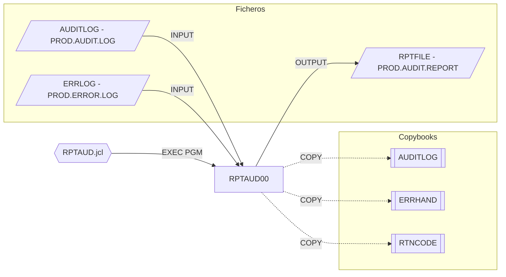

# RPTAUD00 — Audit Report Generator

Fuente: `src/programs/batch/RPTAUD00.cbl` · JCL: `src/jcl/batch/RPTAUD.jcl`

## Propósito

Genera el informe de auditoría del sistema (`SYSTEM AUDIT REPORT`) a partir del log de auditoría y del log de errores: pista de auditoría de seguridad, auditoría de procesos, resumen de errores y verificación de controles.

## Tipo

Programa batch principal, ejecutado por JCL (`EXEC PGM=RPTAUD00`).

## Entradas y salidas

| Recurso | DDNAME | Dataset (JCL) | Tipo | Uso |
|---|---|---|---|---|
| `AUDIT-FILE` | `AUDITLOG` | `PROD.AUDIT.LOG` | VSAM KSDS secuencial (clave `AUD-KEY`) | Entrada |
| `ERROR-FILE` | `ERRLOG` | `PROD.ERROR.LOG` | VSAM KSDS secuencial (clave `ERR-KEY`) | Entrada |
| `REPORT-FILE` | `RPTFILE` | `PROD.AUDIT.REPORT` | QSAM FB LRECL 132 | Salida |

Copybooks: `AUDITLOG` (FD/registro de auditoría), `ERRHAND` (en `FILE SECTION`, como registro del fichero de errores), `RTNCODE` (área de códigos de retorno).

Parámetros: ninguno.

## Flujo principal

1. `0000-MAIN` → `1000-INITIALIZE`:
   - `1100-OPEN-FILES`: `OPEN INPUT AUDIT-FILE`, `OPEN INPUT ERROR-FILE`, `OPEN OUTPUT REPORT-FILE`; cualquier status ≠ `00` → `9999-ERROR-HANDLER`.
   - `1200-WRITE-HEADERS`: fecha (`ACCEPT ... FROM DATE`) y tres líneas de cabecera.
2. `2000-PROCESS-REPORT`:
   - `2100-PROCESS-AUDIT-TRAIL` → `2110-READ-AUDIT-RECORDS`, `2120-SUMMARIZE-AUDIT`.
   - `2200-PROCESS-ERROR-LOG` → `2210-READ-ERROR-RECORDS`, `2220-SUMMARIZE-ERRORS`.
   - `2300-WRITE-SUMMARY` → `2310-WRITE-AUDIT-SUMMARY`, `2320-WRITE-ERROR-SUMMARY`, `2330-WRITE-CONTROL-SUMMARY`.
3. `3000-CLEANUP`: cierra los tres ficheros; `GOBACK`.

> Nota: los párrafos de nivel 2xx0 (`2110`, `2120`, `2210`, `2220`, `2310`, `2320`, `2330`) se invocan pero **no están definidos** en el fuente; el programa es un esqueleto.

## Reglas de negocio y validaciones

- Layout del informe: 132 columnas; detalle de auditoría (timestamp, programa, tipo, mensaje) y detalle de error (timestamp, programa, código, mensaje) definidos en `WORKING-STORAGE`.

## Manejo de errores y códigos de retorno

- `9999-ERROR-HANDLER`: `DISPLAY WS-ERROR-MESSAGE`, `RETURN-CODE = 12`, `GOBACK`.
- Éxito: `RETURN-CODE` 0 (no se modifica).
- No llama a `ERRPROC`.

## Dependencias

- Llama a: nadie.
- Copybooks: `AUDITLOG`, `ERRHAND`, `RTNCODE`.
- Ficheros: `AUDITLOG`, `ERRLOG`, `RPTFILE`.
- Es llamado por: JCL `RPTAUD` (`src/jcl/batch/RPTAUD.jcl`, `STEP01 EXEC PGM=RPTAUD00`).

## Diagrama

