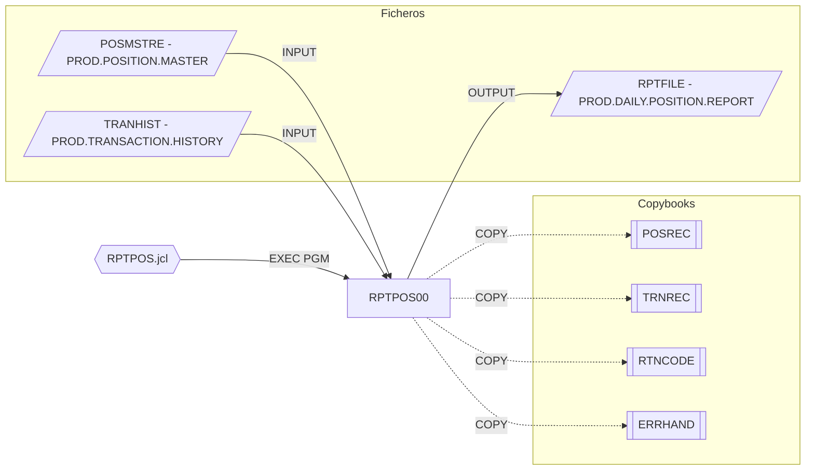

# RPTPOS00 — Daily Position Report Generator

Fuente: `src/programs/batch/RPTPOS00.cbl` · JCL: `src/jcl/batch/RPTPOS.jcl`

## Propósito

Genera el informe diario de posiciones (`DAILY POSITION REPORT`): resumen de posiciones por cartera con variación porcentual respecto al valor anterior, actividad de transacciones, excepciones y métricas de rendimiento.

## Tipo

Programa batch principal, ejecutado por JCL (`EXEC PGM=RPTPOS00`).

## Entradas y salidas

| Recurso | DDNAME | Dataset (JCL) | Tipo | Uso |
|---|---|---|---|---|
| `POSITION-MASTER` | `POSMSTRE` | `PROD.POSITION.MASTER` | VSAM KSDS secuencial (clave `POS-KEY`) | Entrada |
| `TRANSACTION-HISTORY` | `TRANHIST` | `PROD.TRANSACTION.HISTORY` | VSAM KSDS secuencial (clave `TRAN-KEY`) | Entrada |
| `REPORT-FILE` | `RPTFILE` | `PROD.DAILY.POSITION.REPORT` | QSAM FB LRECL 132 | Salida |

Copybooks: `POSREC` (registro de posición), `TRNREC` (registro de transacción), `RTNCODE`, `ERRHAND`.

Parámetros: ninguno.

## Flujo principal

1. `1000-INITIALIZE`: `1100-OPEN-FILES` (dos entradas, una salida; status ≠ `00` → `9999`), `1200-WRITE-HEADERS` (fecha y tres cabeceras).
2. `2000-PROCESS-REPORT`:
   - `2100-READ-POSITIONS`: lectura secuencial del maestro hasta `END-OF-POSITIONS`; por cada registro `2110-FORMAT-POSITION`.
   - `2110-FORMAT-POSITION`: mueve cartera, descripción, cantidad y valor actual a la línea de detalle, calcula `WS-POS-CHANGE-PCT = (actual − anterior) / anterior × 100` y escribe la línea.
   - `2200-PROCESS-TRANSACTIONS` → `2210-READ-TRANSACTIONS`, `2220-SUMMARIZE-ACTIVITY`.
   - `2300-WRITE-SUMMARY` → `2310-WRITE-TOTALS`, `2320-WRITE-EXCEPTIONS`, `2330-WRITE-METRICS`.
3. `3000-CLEANUP`: cierra ficheros; `GOBACK`.

> Nota: `2210`, `2220`, `2310`, `2320`, `2330` se invocan pero no están definidos; `END-OF-POSITIONS` tampoco está declarado en el fuente (se asume en `POSREC`/`ERRHAND`).

## Reglas de negocio y validaciones

- Variación porcentual sin protección frente a `POS-PREVIOUS-VALUE = 0` (posible `SIZE ERROR`).
- Formatos de edición: cantidad `ZZZ,ZZZ,ZZ9.99`, valor `$$$$,$$$,$$9.99`, variación `+ZZ9.99`.

## Manejo de errores y códigos de retorno

- `9999-ERROR-HANDLER`: `DISPLAY WS-ERROR-MESSAGE`, `RETURN-CODE = 12`, `GOBACK`.
- Éxito: RC 0. No llama a `ERRPROC`.

## Dependencias

- Llama a: nadie.
- Copybooks: `POSREC`, `TRNREC`, `RTNCODE`, `ERRHAND`.
- Ficheros: `POSMSTRE`, `TRANHIST`, `RPTFILE`.
- Es llamado por: JCL `RPTPOS` (`src/jcl/batch/RPTPOS.jcl`).

## Diagrama

