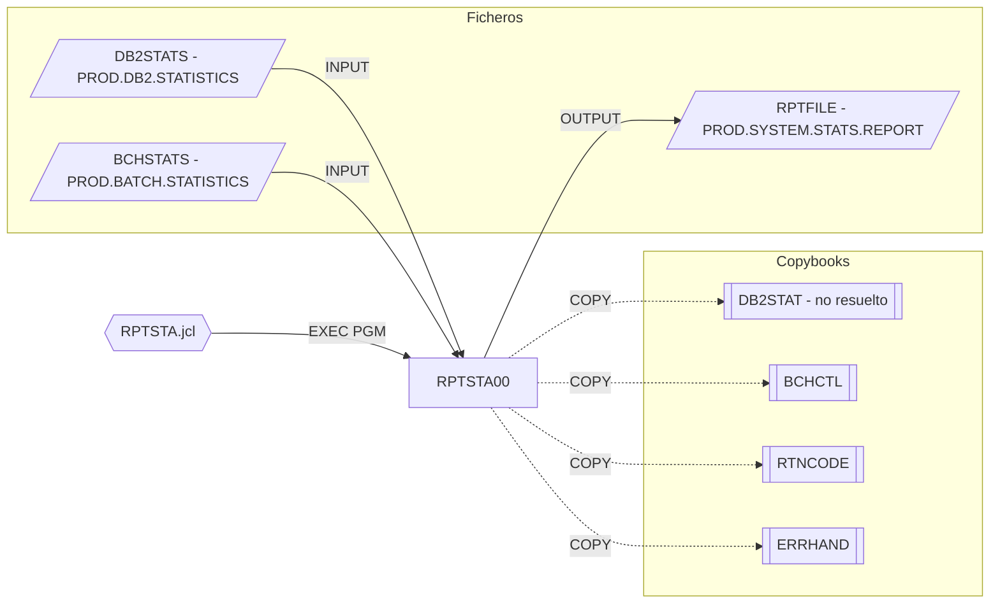

# RPTSTA00 — System Statistics Report Generator

Fuente: `src/programs/batch/RPTSTA00.cbl` · JCL: `src/jcl/batch/RPTSTA.jcl`

## Propósito

Genera el informe de estadísticas y rendimiento del sistema (`SYSTEM STATISTICS AND PERFORMANCE REPORT`): estadísticas de proceso, métricas de rendimiento DB2 (llamadas, tiempo medio de respuesta), utilización de recursos batch (jobs, tasa de éxito) y análisis de tendencias.

## Tipo

Programa batch principal, ejecutado por JCL (`EXEC PGM=RPTSTA00`).

## Entradas y salidas

| Recurso | DDNAME | Dataset (JCL) | Tipo | Uso |
|---|---|---|---|---|
| `DB2-STATS` | `DB2STATS` | `PROD.DB2.STATISTICS` | VSAM KSDS secuencial (clave `STAT-KEY`) | Entrada |
| `BATCH-STATS` | `BCHSTATS` | `PROD.BATCH.STATISTICS` | VSAM KSDS secuencial (clave `BCH-KEY`) | Entrada |
| `REPORT-FILE` | `RPTFILE` | `PROD.SYSTEM.STATS.REPORT` | QSAM FB LRECL 132 | Salida |

Copybooks: `DB2STAT` (**no existe en `src/copybook/`**, marcado `resolved: false` en `deps.json`), `BCHCTL` (usado como registro de `BATCH-STATS`), `RTNCODE`, `ERRHAND`.

Parámetros: ninguno.

## Flujo principal

1. `1000-INITIALIZE`: `1100-OPEN-FILES`, `1200-WRITE-HEADERS`, `1300-INIT-ACCUMULATORS` (`INITIALIZE WS-PERFORMANCE-METRICS`).
2. `2000-PROCESS-REPORT`:
   - `2100-PROCESS-DB2-STATS`: lectura secuencial de `DB2-STATS` hasta `END-OF-DB2-STATS`, acumulando con `2110-ACCUMULATE-DB2-STATS`.
   - `2200-PROCESS-BATCH-STATS`: idem sobre `BATCH-STATS` con `2210-ACCUMULATE-BATCH-STATS`.
   - `2300-CALCULATE-METRICS` → `2310-CALC-DB2-METRICS`, `2320-CALC-BATCH-METRICS`.
   - `2400-WRITE-REPORT` → `2410-WRITE-DB2-SECTION`, `2420-WRITE-BATCH-SECTION`, `2430-WRITE-TREND-ANALYSIS`.
3. `3000-CLEANUP`: cierra ficheros; `GOBACK`.

> Nota: los párrafos `2110`, `2210`, `2310`, `2320`, `2410`, `2420`, `2430` se invocan pero no están definidos; `END-OF-DB2-STATS` y `END-OF-BATCH-STATS` tampoco están declarados.

## Reglas de negocio y validaciones

- Métricas DB2 acumuladas: llamadas, tiempo transcurrido, CPU, espera; salida: total de llamadas y respuesta media.
- Métricas batch: jobs totales, con éxito, fallidos, tiempo; salida: total y tasa de éxito (%).

## Manejo de errores y códigos de retorno

- `9999-ERROR-HANDLER`: `DISPLAY WS-ERROR-MESSAGE`, `RETURN-CODE = 12`, `GOBACK`.
- Éxito: RC 0. No llama a `ERRPROC`.

## Dependencias

- Llama a: nadie.
- Copybooks: `DB2STAT` (no resuelto), `BCHCTL`, `RTNCODE`, `ERRHAND`.
- Ficheros: `DB2STATS`, `BCHSTATS`, `RPTFILE`.
- Es llamado por: JCL `RPTSTA` (`src/jcl/batch/RPTSTA.jcl`).

## Diagrama

