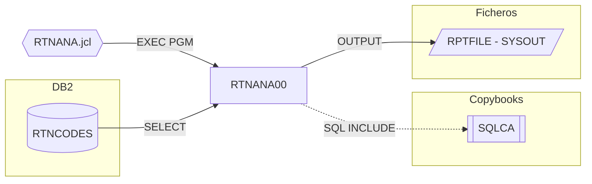

# RTNANA00 — Return Code Analysis Utility

Fuente: `src/programs/batch/RTNANA00.cbl` · JCL: `src/jcl/RTNANA.jcl`

## Propósito

Analiza los códigos de retorno registrados en la tabla DB2 `RTNCODES` y produce el informe `Return Code Analysis Report`: por cada programa, total de ejecuciones y desglose en éxito (`S`), aviso (`W`), error (`E`) y severo (`F`), más una línea de totales.

## Tipo

Programa batch principal con DB2 (ejecutado por JCL `EXEC PGM=RTNANA00` directamente, sin `IKJEFT01`/`DSN RUN`).

## Entradas y salidas

| Recurso | DDNAME | Dataset (JCL) | Tipo | Uso |
|---|---|---|---|---|
| Tabla DB2 `RTNCODES` | — | — | DB2 | Entrada: `SELECT ... GROUP BY PROGRAM_ID` vía cursor `PRGCUR` |
| `REPORT-FILE` | `RPTFILE` | `SYSOUT=*` (FBA, LRECL 133) | QSAM | Salida: informe de 133 columnas |

Copybooks/includes: `EXEC SQL INCLUDE SQLCA`.

Parámetros: ninguno.

## Flujo principal

1. `P100-INIT-PROGRAM`: `FUNCTION CURRENT-DATE`, `OPEN OUTPUT REPORT-FILE` (status ≠ `00` → RC 12 y `GOBACK`), `INITIALIZE WS-ANALYSIS-AREA`.
2. `P200-PROCESS-ANALYSIS`: declara y abre el cursor `PRGCUR` (`SELECT PROGRAM_ID, COUNT(*), COUNT(CASE STATUS_CODE='S'), ... FROM RTNCODES GROUP BY PROGRAM_ID ORDER BY PROGRAM_ID`); `P210-WRITE-HEADERS` (cabeceras con fecha y hora); `P220-PROCESS-DETAIL` hasta `SQLCODE = 100`; cierra el cursor.
3. `P220-PROCESS-DETAIL`: `FETCH` en los campos de la línea de detalle; si `SQLCODE = 0` escribe la línea y acumula los totales.
4. `P300-GENERATE-REPORT`: escribe la línea `TOTALS` con los acumulados.
5. `P900-CLOSE-FILES`: `CLOSE REPORT-FILE`; `GOBACK`.

## Reglas de negocio y validaciones

- Clasificación por `STATUS_CODE`: `S` éxito, `W` aviso, `E` error, `F` severo (coherente con `RTNCDE00`).
- Nota: los campos de destino del `FETCH` (`WS-DTL-TOTAL`, etc.) son numéricos editados (`ZZZ,ZZ9`), lo que no es válido como host variable DB2 y hace que las sumas (`ADD`) sean cuestionables.

## Manejo de errores y códigos de retorno

- Error al abrir el informe: `DISPLAY`, `RETURN-CODE = 12`, `GOBACK`.
- No se comprueba `SQLCODE` tras `DECLARE/OPEN/CLOSE`; un `SQLCODE < 0` en el `FETCH` provocaría un bucle infinito (la condición de salida es sólo `= 100`).
- Éxito: RC 0.

## Dependencias

- Llama a: nadie.
- Includes: `SQLCA`.
- Tablas DB2: `RTNCODES` (SELECT).
- Ficheros: `RPTFILE`.
- Es llamado por: JCL `RTNANA` (`src/jcl/RTNANA.jcl`).

## Diagrama

