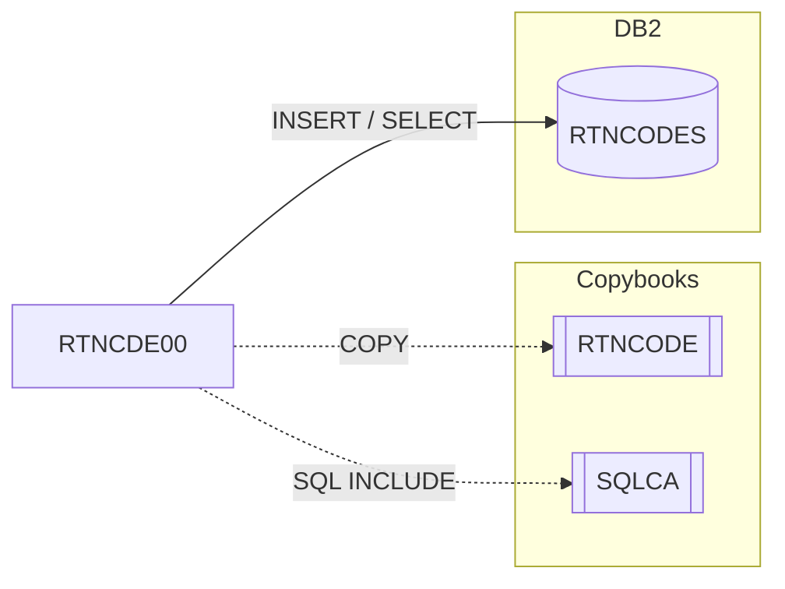

# RTNCDE00 — Standard Return Code Handler

Fuente: `src/programs/batch/RTNCDE00.cbl`

## Propósito

Subrutina de gestión estandarizada de códigos de retorno. Mantiene el código actual y el más alto alcanzado en el área `RTNCODE` del llamador, clasifica el código en un estado (éxito/aviso/error/severo), registra el código en la tabla DB2 `RTNCODES` y ofrece un análisis agregado por programa y rango de fechas.

## Tipo

Subrutina (`PROCEDURE DIVISION USING RC-REQUEST-AREA`), utilizable desde batch u online.

## Entradas y salidas

| Recurso | Tipo | Uso |
|---|---|---|
| Tabla DB2 `RTNCODES` | DB2 | `INSERT` (función LOG) y `SELECT COUNT/MAX/MIN` (función ANALYZE) |

Sin ficheros.

Copybooks/includes: `RTNCODE` (en `LINKAGE`, área `RC-REQUEST-AREA`), `EXEC SQL INCLUDE SQLCA`.

Parámetros (`RC-REQUEST-AREA`, copybook `RTNCODE`): función (`RC-INITIALIZE` `I`, `RC-SET-CODE` `S`, `RC-GET-CODE`, `RC-LOG-CODE`, `RC-ANALYZE`), `RC-PROGRAM-ID`, `RC-NEW-CODE`, `RC-CURRENT-CODE`, `RC-HIGHEST-CODE`, `RC-STATUS`, `RC-MESSAGE`, `RC-START-TIME`/`RC-END-TIME`, salidas `RC-RETURN-VALUE`, `RC-HIGHEST-RETURN`, `RC-RETURN-STATUS`, `RC-TOTAL-CODES`, `RC-MAX-CODE`, `RC-MIN-CODE`, y `RC-RESPONSE-CODE`.

## Flujo principal

1. `EVALUATE TRUE` sobre la función solicitada:
   - `P100-INIT-RETURN-CODES`: inicializa el área, programa a espacios, códigos a 0, estado `SUCCESS`, `RC-RESPONSE-CODE = 0`.
   - `P200-SET-RETURN-CODE`: si `RC-NEW-CODE > RC-HIGHEST-CODE` lo actualiza; fija `RC-CURRENT-CODE`; clasifica el estado; respuesta 0.
   - `P300-GET-RETURN-CODE`: devuelve código actual, más alto y estado.
   - `P400-LOG-RETURN-CODE`: `FUNCTION CURRENT-DATE` e `INSERT INTO RTNCODES (TIMESTAMP, PROGRAM_ID, RETURN_CODE, HIGHEST_CODE, STATUS_CODE, MESSAGE_TEXT)`.
   - `P500-ANALYZE-CODES`: `SELECT COUNT(*), MAX(RETURN_CODE), MIN(RETURN_CODE) FROM RTNCODES WHERE PROGRAM_ID = :RC-PROGRAM-ID AND TIMESTAMP BETWEEN :RC-START-TIME AND :RC-END-TIME`.
2. `GOBACK`.

## Reglas de negocio y validaciones

- Clasificación del código: `0` → `SUCCESS`; `1–4` → `WARNING`; `5–8` → `ERROR`; otro → `SEVERE`.
- El código más alto (`RC-HIGHEST-CODE`) nunca disminuye dentro de una sesión.
- Una función desconocida no produce error: el `EVALUATE` no tiene `WHEN OTHER`.

## Manejo de errores y códigos de retorno

- `RC-RESPONSE-CODE`: 0 si la operación (o el `SQLCODE`) es correcta; 8 si el `INSERT`/`SELECT` devuelve `SQLCODE ≠ 0`.
- No llama a `ERRPROC` ni modifica `RETURN-CODE`.

## Dependencias

- Llama a: nadie.
- Copybooks/includes: `RTNCODE`, `SQLCA`.
- Tablas DB2: `RTNCODES` (INSERT, SELECT).
- Es llamado por: ningún programa del repositorio (`RTNANA00` lee la misma tabla pero no lo invoca).

## Diagrama

