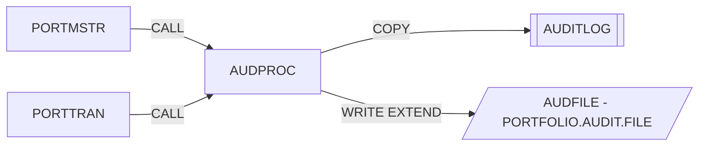

# AUDPROC – Subrutina de registro de auditoría

Fuente: `src/programs/common/AUDPROC.cbl`

## Propósito
Escribe un registro de pista de auditoría (audit trail) en el fichero secuencial `AUDFILE` a partir de la petición recibida del programa llamador. Centraliza el formato del registro de auditoría (copybook `AUDITLOG`) para que todos los programas del sistema auditen de forma homogénea.

## Tipo
Subrutina batch (invocada con `CALL 'AUDPROC' USING ...`). No usa CICS ni DB2.

## Entradas y salidas

| Elemento | Tipo | Dirección | Detalle |
|---|---|---|---|
| `LS-AUDIT-REQUEST` | Parámetro LINKAGE | E/S | Estructura de petición (ver abajo). `LS-RETURN-CODE` es de salida. |
| `AUDIT-FILE` (DDNAME `AUDFILE`) | Fichero QSAM secuencial, `RECORDING MODE F` | Salida (`OPEN EXTEND`) | Registro `AUDIT-RECORD` definido en el copybook `AUDITLOG`. En `src/jcl/portfolio/PORTDEL.jcl` se asigna a `PORTFOLIO.AUDIT.FILE` (`DISP=MOD`). |
| `AUDITLOG` | Copybook | – | Layout del registro de auditoría (`AUD-HEADER`, `AUD-TYPE`, `AUD-ACTION`, `AUD-STATUS`, `AUD-KEY-INFO`, imágenes antes/después, mensaje). |

### Estructura `LS-AUDIT-REQUEST` (LINKAGE SECTION)

| Campo | PIC | Descripción |
|---|---|---|
| `LS-SYSTEM-INFO` (`LS-SYSTEM-ID`, `LS-USER-ID`, `LS-PROGRAM`, `LS-TERMINAL`) | 4 × X(8) | Identificación del origen del evento |
| `LS-TYPE` | X(4) | Tipo de evento (`TRAN`, `USER`, `SYST`) |
| `LS-ACTION` | X(8) | Acción (`CREATE`, `UPDATE`, `DELETE`, `INQUIRE`, `LOGIN`, ...) |
| `LS-STATUS` | X(4) | Resultado (`SUCC`, `FAIL`, `WARN`) |
| `LS-KEY-INFO` (`LS-PORT-ID`, `LS-ACCT-NO`) | X(8), X(10) | Clave de negocio afectada |
| `LS-BEFORE-IMAGE` / `LS-AFTER-IMAGE` | X(100) | Imagen del dato antes/después |
| `LS-MESSAGE` | X(100) | Texto libre |
| `LS-RETURN-CODE` | S9(4) COMP | Código de retorno (salida) |

## Flujo principal

1. **`0000-MAIN`**: ejecuta `1000-INITIALIZE`, `2000-PROCESS-AUDIT`, `3000-TERMINATE` y `GOBACK`.
2. **`1000-INITIALIZE`**: obtiene el timestamp (`ACCEPT ... FROM TIME STAMP`) y abre `AUDIT-FILE` en modo `EXTEND`. Si el `FILE STATUS` no es `'00'`, muestra el error por `DISPLAY`, fija `LS-RETURN-CODE = 8`, ejecuta `3000-TERMINATE` y hace `GOBACK`.
3. **`2000-PROCESS-AUDIT`**: `INITIALIZE AUDIT-RECORD`, mueve el timestamp y todos los campos de la petición al registro `AUDIT-RECORD` y ejecuta `WRITE`. Si el `FILE STATUS` no es `'00'` devuelve `8`; si no, `0`.
4. **`3000-TERMINATE`**: cierra `AUDIT-FILE`.

## Reglas de negocio y validaciones
- No valida el contenido de la petición: cualquier valor recibido se graba tal cual. La semántica de `LS-TYPE`/`LS-ACTION`/`LS-STATUS` la definen los niveles 88 del copybook `AUDITLOG`.
- El fichero se abre en `EXTEND`, por lo que los registros se añaden al final (append) en cada llamada; cada invocación abre y cierra el fichero.
- El header `AUD-HEADER` recibe `LS-SYSTEM-INFO` mediante un `MOVE` de grupo tras haber movido `AUD-TIMESTAMP`; como `AUD-HEADER` incluye el timestamp (26 bytes) y `LS-SYSTEM-INFO` sólo tiene 32 bytes, el `MOVE` de grupo sobrescribe el timestamp con los datos de sistema y rellena el resto con espacios (posible defecto del código fuente, se documenta tal cual).

## Manejo de errores y códigos de retorno

| `LS-RETURN-CODE` | Situación |
|---|---|
| 0 | Registro escrito correctamente |
| 8 | Error al abrir (`OPEN EXTEND`) o al escribir (`WRITE`) el fichero de auditoría; el `FILE STATUS` se muestra por `DISPLAY` |

No llama a `ERRPROC`; el llamador decide qué hacer con el código de retorno.

## Dependencias

**Llama a / usa** (según `deps.json`):
- `COPY AUDITLOG` (copybook)
- Fichero `AUDFILE` (FD `AUDIT-FILE`)

**Es llamado por** (según `deps.json`): `PORTMSTR`, `PORTTRAN` (grupo *portfolio*).

No aparece en ningún `EXEC PGM=` de JCL (es subrutina).

## Diagrama

