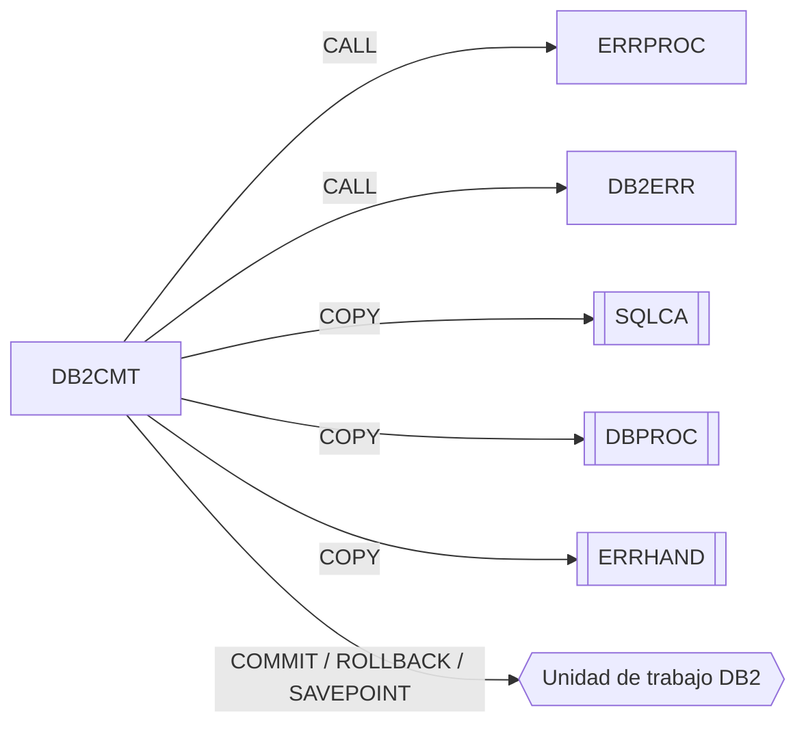

# DB2CMT – Controlador de commits DB2

Fuente: `src/programs/common/DB2CMT.cbl`

## Propósito
Centraliza la gestión de unidades de trabajo DB2 en procesos batch: commit condicionado por frecuencia, rollback, creación y restauración de savepoints y estadísticas de commits/rollbacks/savepoints.

## Tipo
Subrutina batch con SQL embebido (DB2). No usa CICS.

## Entradas y salidas

| Elemento | Tipo | Dirección | Detalle |
|---|---|---|---|
| `LS-COMMIT-REQUEST` | Parámetro LINKAGE | E/S | Función, savepoint, parámetros de commit, código de retorno y datos de error. |
| `SQLCA` | Copybook | – | `SQLCODE`. |
| `DBPROC` | Copybook | – | Procedimientos DB2 estándar (no se invocan explícitamente). |
| `ERRHAND` | Copybook | – | `ERR-MESSAGE` para `ERRPROC`. |
| `WS-COMMIT-STATS` | WORKING-STORAGE | – | Contadores `WS-COMMIT-COUNT`, `WS-ROLLBACK-COUNT`, `WS-SAVEPOINT-COUNT`. |

No accede a tablas de usuario: sólo ejecuta sentencias de control de transacción (`COMMIT WORK`, `ROLLBACK WORK`, `SAVEPOINT`, `ROLLBACK TO SAVEPOINT`).

### Estructura `LS-COMMIT-REQUEST` (LINKAGE SECTION)

| Campo | PIC | Descripción |
|---|---|---|
| `LS-FUNCTION` | X(4) | `INIT`, `CMIT`, `RBAK`, `SAVE`, `REST`, `STAT` |
| `LS-SAVEPOINT-NAME` | X(18) | Nombre del savepoint (`SAVE`/`REST`) |
| `LS-COMMIT-PARMS.LS-RECORDS-PROC` | S9(9) COMP | Registros procesados desde el último commit |
| `LS-COMMIT-PARMS.LS-COMMIT-FREQ` | S9(4) COMP | Frecuencia de commit |
| `LS-COMMIT-PARMS.LS-FORCE-FLAG` | X(1) | `'Y'` fuerza el commit |
| `LS-RETURN-CODE` | S9(4) COMP | Salida: 0/8/12 |
| `LS-ERROR-INFO.LS-SQLCODE` | S9(9) COMP | Salida: `SQLCODE` del fallo |
| `LS-ERROR-INFO.LS-ERROR-MSG` | X(80) | Salida: mensaje |

## Flujo principal

1. **`0000-MAIN`**: `EVALUATE` sobre `LS-FUNCTION`; función desconocida → `'Invalid function code'` en `ERR-TEXT` y `9000-ERROR-ROUTINE`. `GOBACK`.
2. **`1000-INITIALIZE`** (`INIT`): `INITIALIZE WS-COMMIT-STATS`, `RC = 0`.
3. **`2000-COMMIT`** (`CMIT`): si `LS-RECORDS-PROC >= LS-COMMIT-FREQ` o `LS-FORCE-COMMIT`, ejecuta `2100-ISSUE-COMMIT`; en caso contrario no hace nada (y no toca `LS-RETURN-CODE`).
4. **`2100-ISSUE-COMMIT`**: `EXEC SQL COMMIT WORK`. `SQLCODE = 0` → `+1` a `WS-COMMIT-COUNT`, `RC = 0`; si no → `LS-SQLCODE`, "Commit failed", `RC = 8`, `9100-LOG-ERROR`.
5. **`3000-ROLLBACK`** (`RBAK`): `EXEC SQL ROLLBACK WORK`; misma lógica con "Rollback failed" y `WS-ROLLBACK-COUNT`.
6. **`4000-SAVEPOINT`** (`SAVE`): `EXEC SQL SAVEPOINT :WS-SAVEPOINT-ID ON ROLLBACK RETAIN CURSORS`; éxito → `+1` a `WS-SAVEPOINT-COUNT`; fallo → "Savepoint creation failed", `RC = 8`, `9100-LOG-ERROR`.
7. **`5000-RESTORE`** (`REST`): `EXEC SQL ROLLBACK TO SAVEPOINT :WS-SAVEPOINT-ID`; éxito → `+1` a `WS-ROLLBACK-COUNT`; fallo → "Savepoint restore failed", `RC = 8`, `9100-LOG-ERROR`.
8. **`6000-STATISTICS`** (`STAT`): `DISPLAY` de los tres contadores.
9. **`9000-ERROR-ROUTINE`**: `ERR-PROGRAM = 'DB2CMT'`, `RC = 12`, `CALL 'ERRPROC' USING ERR-MESSAGE`.
10. **`9100-LOG-ERROR`**: `CALL 'DB2ERR' USING LS-ERROR-INFO`.

## Reglas de negocio y validaciones
- Regla de commit: se confirma sólo cuando el llamador ha procesado al menos `LS-COMMIT-FREQ` registros o indica `LS-FORCE-FLAG = 'Y'` (p. ej. al final del proceso). DB2CMT no reinicia `LS-RECORDS-PROC`; es responsabilidad del llamador.
- Los savepoints se crean con `ON ROLLBACK RETAIN CURSORS` (los cursores abiertos se mantienen tras un `ROLLBACK TO SAVEPOINT`).
- Los contadores viven en WORKING-STORAGE: persisten entre llamadas mientras el programa siga cargado; `INIT` los pone a cero.
- La llamada `CALL 'DB2ERR' USING LS-ERROR-INFO` pasa una estructura de 84 bytes (`SQLCODE` + mensaje), mientras que `DB2ERR` espera `LS-ERROR-REQUEST` cuyo primer campo es `LS-FUNCTION` X(4). Los primeros 4 bytes del `SQLCODE` binario se interpretarían como código de función, por lo que en la práctica DB2ERR caería en `WHEN OTHER` y llamaría a `ERRPROC` (defecto de interfaz del código fuente, se documenta tal cual).

## Manejo de errores y códigos de retorno

| `LS-RETURN-CODE` | Situación |
|---|---|
| 0 | Operación SQL correcta (o `INIT`) |
| 8 | Fallo SQL en commit / rollback / savepoint / restore; se informa `LS-ERROR-INFO` y se llama a `DB2ERR` |
| 12 | Función inválida (vía `ERRPROC`) |
| sin cambio | `CMIT` cuando no se alcanza la frecuencia y no se fuerza; `STAT` |

## Dependencias

**Llama a / usa** (según `deps.json`):
- `CALL 'ERRPROC'` y `CALL 'DB2ERR'` (grupo *common*)
- `COPY SQLCA`, `COPY DBPROC`, `COPY ERRHAND`

**Es llamado por**: ningún programa ni JCL del repositorio (`deps.json` no tiene aristas con `to = DB2CMT`).

## Diagrama

