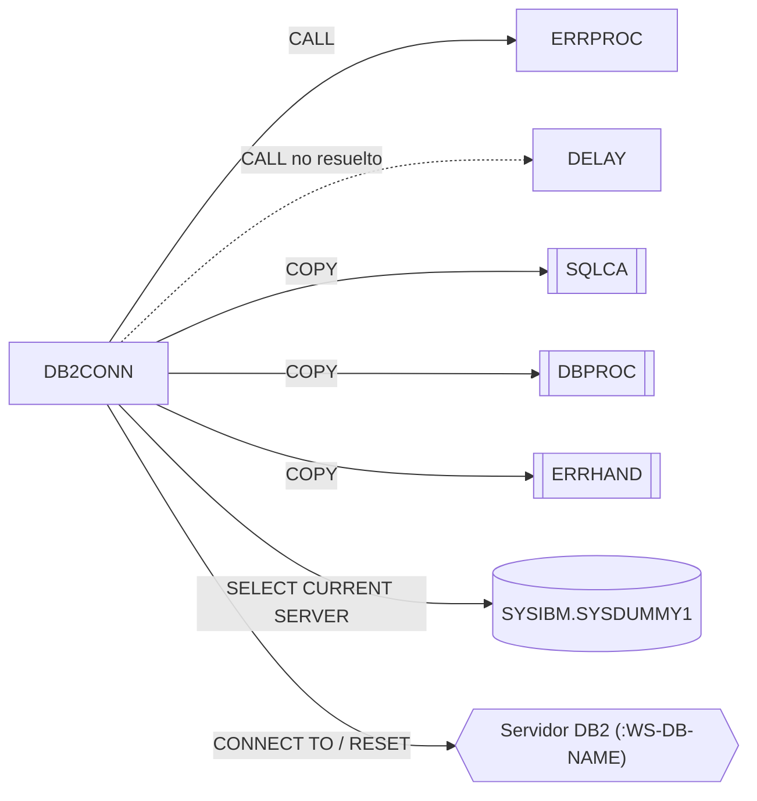

# DB2CONN – Gestor de conexión DB2

Fuente: `src/programs/common/DB2CONN.cbl`

## Propósito
Encapsula la conexión y desconexión a DB2 (`CONNECT TO` / `CONNECT RESET`) y la comprobación del estado de la conexión, con reintentos automáticos en la conexión. Devuelve al llamador el código de retorno y, en caso de fallo, el `SQLCODE` y un mensaje descriptivo.

## Tipo
Subrutina batch con SQL embebido (DB2). No usa CICS.

## Entradas y salidas

| Elemento | Tipo | Dirección | Detalle |
|---|---|---|---|
| `LS-DB2-REQUEST` | Parámetro LINKAGE | E/S | Función, nombre de BD, plan, código de retorno y datos de error. |
| `SYSIBM.SYSDUMMY1` | Tabla de catálogo DB2 | Lectura | `SELECT CURRENT SERVER` para verificar la conexión (función `STAT`). |
| `SQLCA` | Copybook | – | Área de comunicación SQL (`SQLCODE`). |
| `DBPROC` | Copybook | – | Constantes de reintento (`DB2-RETRY-WAIT`, `DB2-MAX-RETRIES`) y procedimientos DB2 estándar. |
| `ERRHAND` | Copybook | – | Estructura `ERR-MESSAGE` usada al llamar a `ERRPROC`. |

### Estructura `LS-DB2-REQUEST` (LINKAGE SECTION)

| Campo | PIC | Descripción |
|---|---|---|
| `LS-FUNCTION` | X(4) | `CONN` conectar, `DISC` desconectar, `STAT` comprobar estado |
| `LS-DB-NAME` | X(8) | Nombre del servidor/BD DB2 al que conectar |
| `LS-PLAN-NAME` | X(8) | Nombre del plan (se copia a WS pero no se utiliza en SQL) |
| `LS-RETURN-CODE` | S9(4) COMP | Salida: 0/4/8/12 |
| `LS-ERROR-INFO.LS-SQLCODE` | S9(9) COMP | Salida: `SQLCODE` del fallo |
| `LS-ERROR-INFO.LS-ERROR-MSG` | X(80) | Salida: mensaje descriptivo |

## Flujo principal

1. **`0000-MAIN`**: `EVALUATE` sobre `LS-FUNCTION` y despacha a `1000-CONNECT`, `2000-DISCONNECT` o `3000-CHECK-STATUS`; con función desconocida mueve `'Invalid function code'` a `ERR-TEXT` y ejecuta `9000-ERROR-ROUTINE`. Termina con `GOBACK`.
2. **`1000-CONNECT`**: marca desconectado, pone a cero `WS-RETRY-COUNT`, copia BD y plan a variables host y entra en un bucle `PERFORM UNTIL WS-CONNECTED OR WS-RETRY-COUNT >= WS-MAX-RETRIES (3)`:
   - `EXEC SQL CONNECT TO :WS-DB-NAME END-EXEC`.
   - Si `SQLCODE = 0`: marca conectado y `LS-RETURN-CODE = 0`.
   - Si no: incrementa el contador y ejecuta `1100-HANDLE-CONN-ERROR`.
   - Si aún quedan reintentos y no está conectado: `CALL 'DELAY' USING DB2-RETRY-WAIT` (espera de 100 unidades definida en `DBPROC`).
3. **`1100-HANDLE-CONN-ERROR`**: copia `SQLCODE` a `LS-SQLCODE`, asigna mensaje según `SQLCODE` (`-30081` → "Maximum connections exceeded", `-99999` → "Network error connecting to DB2", otro → "General DB2 connection error") y `LS-RETURN-CODE = 12`.
4. **`2000-DISCONNECT`**: sólo si `WS-CONNECTED`: `COMMIT WORK` y `CONNECT RESET`. Si `SQLCODE = 0` marca desconectado y `RC = 0`; si no, `LS-SQLCODE`, mensaje "Error disconnecting from DB2" y `RC = 8`.
5. **`3000-CHECK-STATUS`**: `SELECT CURRENT SERVER INTO :WS-DB-NAME FROM SYSIBM.SYSDUMMY1`. Si `SQLCODE = 0` marca conectado y `RC = 0`; si no, marca desconectado, informa `SQLCODE`, mensaje "DB2 connection not active" y `RC = 4`.
6. **`9000-ERROR-ROUTINE`**: `ERR-PROGRAM = 'DB2CONN'`, `LS-RETURN-CODE = 12` y `CALL 'ERRPROC' USING ERR-MESSAGE`.

## Reglas de negocio y validaciones
- Máximo 3 intentos de conexión (`WS-MAX-RETRIES`), con espera entre intentos mediante la rutina externa `DELAY`.
- `WS-CONNECTION-STATE` es WORKING-STORAGE: sólo conserva el estado entre llamadas si el programa permanece cargado (no se hace `CANCEL`). Por ello `DISC` no hace nada si en esa carga no se conectó previamente (o no se comprobó con `STAT`).
- La desconexión hace `COMMIT WORK` implícito antes de `CONNECT RESET`.
- El plan (`LS-PLAN-NAME`) se recibe pero no interviene en ninguna sentencia SQL.

## Manejo de errores y códigos de retorno

| `LS-RETURN-CODE` | Situación |
|---|---|
| 0 | Operación correcta |
| 4 | `STAT`: conexión no activa |
| 8 | `DISC`: fallo en `CONNECT RESET` |
| 12 | `CONN`: agotados los reintentos (queda el último `SQLCODE`/mensaje); o función inválida (vía `ERRPROC`) |

Los fallos SQL se devuelven al llamador en `LS-ERROR-INFO`; sólo la función inválida se notifica a `ERRPROC`.

## Dependencias

**Llama a / usa** (según `deps.json`):
- `CALL 'ERRPROC'` (resuelto, grupo *common*)
- `CALL 'DELAY'` (no resuelto: rutina externa del sistema, no existe fuente en el repositorio)
- `COPY SQLCA`, `COPY DBPROC`, `COPY ERRHAND`

**Es llamado por**: ningún programa del repositorio ni JCL lo referencia (`deps.json` no contiene aristas con `to = DB2CONN`). Los programas DB2 del repositorio usan en su lugar el párrafo `CONNECT-TO-DB2` del copybook `DBPROC`.

## Diagrama

