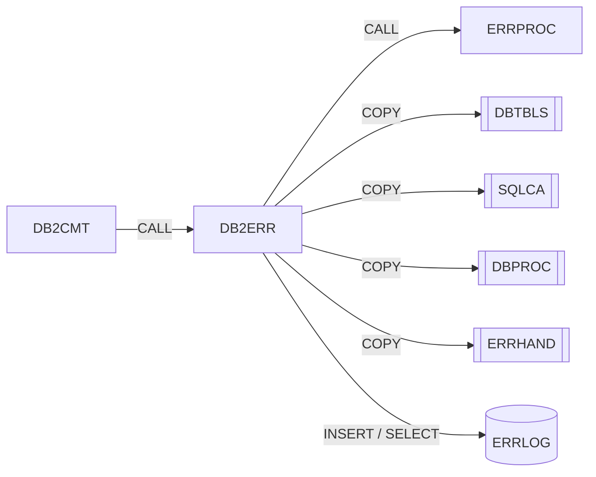

# DB2ERR – Gestor de errores SQL DB2

Fuente: `src/programs/common/DB2ERR.cbl`

## Propósito
Servicio común para errores DB2: registra el error en la tabla `ERRLOG` con una severidad calculada a partir del `SQLCODE`, diagnostica un `SQLCODE` devolviendo texto y código de retorno recomendados (incluido si procede reintentar), y recupera el último error registrado para un programa.

## Tipo
Subrutina batch con SQL embebido (DB2). No usa CICS.

## Entradas y salidas

| Elemento | Tipo | Dirección | Detalle |
|---|---|---|---|
| `LS-ERROR-REQUEST` | Parámetro LINKAGE | E/S | Función, programa, datos del error, info adicional, RC y flag de reintento. |
| Tabla `ERRLOG` | Tabla DB2 | Escritura (`INSERT`) y lectura (`SELECT`) | Layout host `ERRLOG-RECORD` del copybook `DBTBLS` (renombrado a `WS-ERRLOG-REC`). |
| `DBTBLS` | Copybook | – | Definiciones de tablas (`POSHIST-RECORD`, `ERRLOG-RECORD`); se copia con `REPLACING`. |
| `SQLCA` | Copybook | – | `SQLCODE`. |
| `DBPROC` | Copybook | – | Procedimientos DB2 estándar. |
| `ERRHAND` | Copybook | – | `ERR-MESSAGE` para `ERRPROC`. |

### Estructura `LS-ERROR-REQUEST` (LINKAGE SECTION)

| Campo | PIC | Descripción |
|---|---|---|
| `LS-FUNCTION` | X(4) | `LOG ` registrar, `DIAG` diagnosticar, `RETR` recuperar último error |
| `LS-PROGRAM-ID` | X(8) | Programa origen |
| `LS-ERROR-INFO.LS-SQLCODE` | S9(9) COMP | `SQLCODE` a tratar |
| `LS-ERROR-INFO.LS-SQLSTATE` | X(5) | `SQLSTATE` |
| `LS-ERROR-INFO.LS-ERROR-TEXT` | X(80) | Texto (entrada en `LOG`, salida en `DIAG`/`RETR`) |
| `LS-ADDITIONAL-INFO` | X(100) | Información adicional a registrar |
| `LS-RETURN-CODE` | S9(4) COMP | Salida |
| `LS-RETRY-FLAG` | X(1) | Salida (`LOG`): `'Y'` si conviene reintentar |

## Flujo principal

1. **`0000-MAIN`**: `EVALUATE` sobre `LS-FUNCTION` → `1000-LOG-ERROR`, `2000-DIAGNOSE-ERROR` o `3000-RETRIEVE-ERROR`; otro valor → `'Invalid function code'` y `9000-ERROR-ROUTINE`. `GOBACK`.
2. **`1000-LOG-ERROR`** (`LOG`): inicializa `WS-ERRLOG-REC`; rellena `EL-ERROR-TIMESTAMP` (timestamp actual), `EL-PROGRAM-ID`, `EL-ERROR-TYPE = 'D'` (dato), ejecuta `1100-SET-SEVERITY`, compone `EL-ERROR-CODE` como `'SQLCODE: nnnnnnnnn STATE: sssss'`, `EL-ERROR-MESSAGE`, fecha/hora de proceso (`FUNCTION CURRENT-DATE`), `EL-USER-ID = SPACES`, `EL-ADDITIONAL-INFO`; luego `1200-INSERT-ERROR`.
3. **`1100-SET-SEVERITY`**: clasifica `LS-SQLCODE`:
   - `-911` (deadlock) y `-913` (timeout) → severidad 2, `LS-SHOULD-RETRY`.
   - `-30081` (error de conexión) → severidad 4, sin reintento.
   - `-803` (clave duplicada) y `+100` (no encontrado) → severidad 1, sin reintento.
   - Otro negativo → severidad 3; otro no negativo → severidad 1; sin reintento.
4. **`1200-INSERT-ERROR`**: `INSERT INTO ERRLOG VALUES (:WS-ERRLOG-REC)`. `SQLCODE = 0` → `RC = 0`; si no → `'Error logging to ERRLOG'` y `9000-ERROR-ROUTINE`.
5. **`2000-DIAGNOSE-ERROR`** (`DIAG`): sin acceso a DB2; según `LS-SQLCODE` devuelve texto y RC: deadlock/timeout → "retry transaction", RC 4; `-30081` → RC 12; `-803` → RC 8; otro negativo → "Unhandled DB2 error", RC 12; otro → "DB2 warning condition", RC 4.
6. **`3000-RETRIEVE-ERROR`** (`RETR`): `SELECT ERROR_MESSAGE, ERROR_SEVERITY, ADDITIONAL_INFO FROM ERRLOG WHERE PROGRAM_ID = :LS-PROGRAM-ID AND ERROR_TIMESTAMP = (SELECT MAX(ERROR_TIMESTAMP) ...)`. Éxito → `LS-ERROR-TEXT = EL-ERROR-MESSAGE`, `RC = EL-ERROR-SEVERITY`; si no → "No error history found", RC 4.
7. **`9000-ERROR-ROUTINE`**: `ERR-PROGRAM = 'DB2ERR'`, `RC = 12`, `CALL 'ERRPROC' USING ERR-MESSAGE`.

## Reglas de negocio y validaciones
- Tabla de severidades (`EL-ERROR-SEVERITY`): 1 info, 2 warning, 3 error, 4 severe (niveles 88 de `DBTBLS`).
- Sólo los errores de concurrencia (`-911`, `-913`) se marcan como reintentables.
- Todo registro insertado se tipifica como `EL-TYPE-DATA` (`'D'`); el usuario se deja en blanco.
- `RETR` recupera únicamente el error más reciente del programa indicado.

## Manejo de errores y códigos de retorno

| Función | `LS-RETURN-CODE` | Situación |
|---|---|---|
| `LOG` | 0 | Insertado en `ERRLOG` |
| `LOG` | 12 | Fallo del `INSERT` (se notifica a `ERRPROC`) |
| `DIAG` | 4 / 8 / 12 | Según clasificación del `SQLCODE` (ver flujo) |
| `RETR` | 1–4 | Severidad del último error registrado |
| `RETR` | 4 | Sin histórico (`SQLCODE ≠ 0`) |
| cualquiera | 12 | Función inválida (vía `ERRPROC`) |

## Dependencias

**Llama a / usa** (según `deps.json`):
- `CALL 'ERRPROC'` (grupo *common*)
- `COPY DBTBLS`, `COPY SQLCA`, `COPY DBPROC`, `COPY ERRHAND`
- Tabla DB2 `ERRLOG` (`INSERT`, `SELECT`)

**Es llamado por** (según `deps.json`): `DB2CMT` (párrafo `9100-LOG-ERROR`). Ningún JCL lo referencia.

## Diagrama

