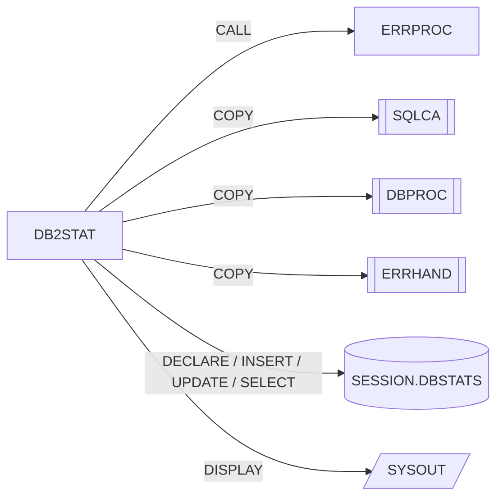

# DB2STAT – Recolector de estadísticas DB2

Fuente: `src/programs/common/DB2STAT.cbl`

## Propósito
Mantiene estadísticas de ejecución de un programa (filas leídas/insertadas/actualizadas/borradas, commits, rollbacks, tiempo de CPU y transcurrido) en una tabla temporal global de sesión `SESSION.DBSTATS`, y las muestra al finalizar.

## Tipo
Subrutina batch con SQL embebido (DB2). No usa CICS.

## Entradas y salidas

| Elemento | Tipo | Dirección | Detalle |
|---|---|---|---|
| `LS-STAT-REQUEST` | Parámetro LINKAGE | E/S | Función, programa, contadores y RC. |
| `SESSION.DBSTATS` | Tabla temporal global declarada (DGTT) | Creación, `INSERT`, `UPDATE`, `SELECT` | Se declara en `1100-CREATE-STATS-TABLE` con `ON COMMIT PRESERVE ROWS`; existe sólo durante la sesión/thread DB2. |
| `SQLCA` | Copybook | – | `SQLCODE`. |
| `DBPROC` | Copybook | – | Procedimientos DB2 estándar. |
| `ERRHAND` | Copybook | – | `ERR-MESSAGE` para `ERRPROC`. |
| `SYSOUT` | `DISPLAY` | Salida | Informe de estadísticas (`4000-DISPLAY-STATS`). |

### Estructura `LS-STAT-REQUEST` (LINKAGE SECTION)

| Campo | PIC | Descripción |
|---|---|---|
| `LS-FUNCTION` | X(4) | `INIT`, `UPDT`, `TERM`, `DISP` |
| `LS-PROGRAM-ID` | X(8) | Programa cuyas estadísticas se gestionan |
| `LS-STAT-DATA` (`LS-ROWS-READ`, `LS-ROWS-INSRT`, `LS-ROWS-UPDT`, `LS-ROWS-DELT`, `LS-COMMITS`, `LS-ROLLBACKS`) | 6 × S9(9) COMP | Contadores acumulados por el llamador |
| `LS-RETURN-CODE` | S9(4) COMP | Salida: 0 / 12 |

## Flujo principal

1. **`0000-MAIN`**: `EVALUATE` sobre `LS-FUNCTION` → `1000-INITIALIZE`, `2000-UPDATE-STATS`, `3000-TERMINATE`, `4000-DISPLAY-STATS`; otro → `'Invalid function code'` y `9000-ERROR-ROUTINE`. `GOBACK`.
2. **`1000-INITIALIZE`** (`INIT`): inicializa `WS-STATS-RECORD`, guarda `LS-PROGRAM-ID`, toma el timestamp de inicio (`WS-START-TIME`, `WS-START-TIMESTAMP`) y ejecuta `1100-CREATE-STATS-TABLE` y `1200-INSERT-INITIAL`.
3. **`1100-CREATE-STATS-TABLE`**: `DECLARE GLOBAL TEMPORARY TABLE SESSION.DBSTATS (...) ON COMMIT PRESERVE ROWS`. Se tolera `SQLCODE -601` (ya existe); cualquier otro `SQLCODE ≠ 0` → `'Error creating stats table'` y `9000-ERROR-ROUTINE`.
4. **`1200-INSERT-INITIAL`**: `INSERT INTO SESSION.DBSTATS` con el programa, `CURRENT TIMESTAMP` y contadores a 0. Éxito → `RC = 0`; fallo → `'Error initializing stats'` y `9000-ERROR-ROUTINE`.
5. **`2000-UPDATE-STATS`** (`UPDT`): copia los seis contadores de `LS-STAT-DATA` a variables host y `UPDATE SESSION.DBSTATS SET ... WHERE PROGRAM_ID = :WS-PROGRAM-ID`. Fallo → `'Error updating stats'`.
6. **`3000-TERMINATE`** (`TERM`): toma el timestamp de fin, ejecuta `3100-CALC-TIMES` y `UPDATE SESSION.DBSTATS SET END_TIME, CPU_TIME, ELAPSED_TIME`. Éxito → `RC = 0` y `4000-DISPLAY-STATS`; fallo → `'Error finalizing stats'`.
7. **`3100-CALC-TIMES`**: `WS-ELAPSED-TIME = NUMVAL(fin(1:15)) - NUMVAL(inicio(1:15))` y `WS-CPU-TIME = WS-ELAPSED-TIME × 0.65`.
8. **`4000-DISPLAY-STATS`** (`DISP`): `SELECT` de todas las métricas `INTO :WS-STATS-RECORD` y `DISPLAY` formateado; fallo → `'Error retrieving stats'`.
9. **`9000-ERROR-ROUTINE`**: `ERR-PROGRAM = 'DB2STAT'`, `RC = 12`, `CALL 'ERRPROC' USING ERR-MESSAGE`.

## Reglas de negocio y validaciones
- Una fila por `PROGRAM_ID` en `SESSION.DBSTATS`; `UPDT`/`TERM`/`DISP` sólo tienen efecto si previamente se ejecutó `INIT` en la misma sesión DB2 (la DGTT desaparece al terminar el thread).
- `WS-PROGRAM-ID` y `WS-START-TIMESTAMP` se guardan en WORKING-STORAGE en `INIT`; las funciones posteriores no releen `LS-PROGRAM-ID`, por lo que dependen de que el programa siga cargado entre llamadas.
- El tiempo de CPU no se mide: se **estima** como el 65 % del tiempo transcurrido.
- El cálculo del tiempo transcurrido usa `NUMVAL` sobre los 15 primeros caracteres del timestamp (formato `YYYYMMDDhhmmssc`), lo que produce una diferencia numérica, no una duración real en segundos (limitación del código fuente, se documenta tal cual).
- El `SELECT` de `4000-DISPLAY-STATS` devuelve 8 columnas `INTO` una única estructura `WS-STATS-RECORD` de 11 campos (uso de estructura host como lista de variables).

## Manejo de errores y códigos de retorno

| `LS-RETURN-CODE` | Situación |
|---|---|
| 0 | Operación SQL correcta |
| 12 | Cualquier fallo SQL (excepto `-601` en la declaración de la DGTT) o función inválida; el error se notifica a `ERRPROC` con `ERR-PROGRAM = 'DB2STAT'` |

## Dependencias

**Llama a / usa** (según `deps.json`):
- `CALL 'ERRPROC'` (grupo *common*)
- `COPY SQLCA`, `COPY DBPROC`, `COPY ERRHAND`
- SQL sobre `SESSION` (en `deps.json`; el objeto real es la tabla temporal `SESSION.DBSTATS`)

**Es llamado por**: ningún programa ni JCL del repositorio. En `deps.json` aparecen `RPTSTA00 --COPY--> DB2STAT` y `UTLMON00 --COPY--> DB2STAT` (no resueltos): se refieren a un **copybook** `DB2STAT` inexistente en `src/copybook/`, no a este programa (ver "Discrepancias" en el README del grupo).

## Diagrama

