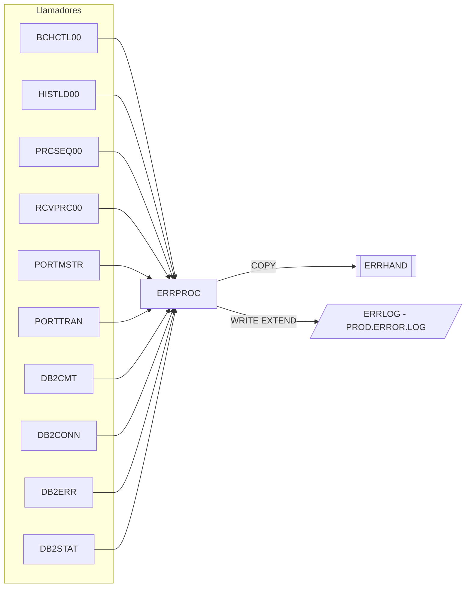

# ERRPROC – Subrutina estándar de proceso de errores

Fuente: `src/programs/common/ERRPROC.cbl`

## Propósito
Punto único de notificación de errores para los programas batch: recibe una estructura de error, la vuelca en el fichero de log secuencial `ERRLOG`, la muestra por `SYSOUT` (`DISPLAY`) y devuelve como código de retorno la severidad recibida.

## Tipo
Subrutina batch (invocada con `CALL 'ERRPROC' USING ERR-MESSAGE`). No usa CICS ni DB2.

## Entradas y salidas

| Elemento | Tipo | Dirección | Detalle |
|---|---|---|---|
| `LS-ERROR-REQUEST` | Parámetro LINKAGE | E/S | Mismo layout que `ERR-MESSAGE` del copybook `ERRHAND` (sin el timestamp) más `LS-RETURN-CODE`. |
| `ERROR-LOG` (DDNAME `ERRLOG`) | Fichero QSAM secuencial, `RECORDING MODE F`, registro `LOG-DATA X(400)` | Salida (`OPEN EXTEND`) | En `src/jcl/batch/RPTAUD.jcl` el DDNAME `ERRLOG` se asigna a `PROD.ERROR.LOG`. |
| `ERRHAND` | Copybook | – | Categorías de error (`VS`, `VL`, `PR`, `SY`), códigos de retorno estándar (0/4/8/12/16), estructura `ERR-MESSAGE` y mensajes VSAM. |

### Estructura `LS-ERROR-REQUEST` (LINKAGE SECTION)

| Campo | PIC | Descripción |
|---|---|---|
| `LS-PROGRAM-ID` | X(8) | Programa que notifica el error |
| `LS-CATEGORY` | X(2) | Categoría (`VS` VSAM, `VL` validación, `PR` proceso, `SY` sistema) |
| `LS-ERROR-CODE` | X(4) | Código de error |
| `LS-SEVERITY` | S9(4) COMP | Severidad (0, 4, 8, 12, 16) |
| `LS-ERROR-TEXT` | X(80) | Texto del error |
| `LS-ERROR-DETAILS` | X(256) | Detalles adicionales |
| `LS-RETURN-CODE` | S9(4) COMP | Salida: copia de `LS-SEVERITY` |

> Nota: los llamadores del repositorio pasan `ERR-MESSAGE` (copybook `ERRHAND`), cuyo primer campo es `ERR-TIMESTAMP` (18 bytes). ERRPROC interpreta la misma memoria como `LS-ERROR-REQUEST`, que empieza por `LS-PROGRAM-ID`; existe por tanto un desplazamiento de 18 bytes entre lo que envía el llamador y lo que ERRPROC lee (defecto del código fuente, se documenta tal cual).

## Flujo principal

1. **`0000-MAIN`**: `1000-INITIALIZE` → `2000-PROCESS-ERROR` → `3000-TERMINATE` → `GOBACK`.
2. **`1000-INITIALIZE`**: `INITIALIZE WS-WORK-AREAS`, obtiene el timestamp y abre `ERROR-LOG` en `EXTEND`. Si falla la apertura sólo muestra el `FILE STATUS` por `DISPLAY` y continúa.
3. **`2000-PROCESS-ERROR`**: rellena `ERR-MESSAGE` (WORKING-STORAGE, copybook `ERRHAND`) con el timestamp y los campos de la petición; ejecuta `2100-WRITE-LOG` y `2200-DISPLAY-ERROR`; mueve `LS-SEVERITY` a `LS-RETURN-CODE`.
4. **`2100-WRITE-LOG`**: `MOVE ERR-MESSAGE TO LOG-DATA` y `WRITE ERROR-LOG-RECORD`; si el `FILE STATUS` no es `'00'` lo muestra por `DISPLAY`.
5. **`2200-DISPLAY-ERROR`**: imprime un bloque formateado (timestamp, programa, categoría, código, severidad, mensaje, detalles) por `DISPLAY`.
6. **`3000-TERMINATE`**: cierra `ERROR-LOG`.

## Reglas de negocio y validaciones
- No filtra ni valida: todo error recibido se registra y se muestra.
- El log se abre en `EXTEND` (append) y se cierra en cada llamada.
- El código de retorno devuelto es exactamente la severidad recibida, lo que permite al llamador propagarla como `RETURN-CODE` del job.

## Manejo de errores y códigos de retorno

| `LS-RETURN-CODE` | Situación |
|---|---|
| = `LS-SEVERITY` | Siempre; ERRPROC no genera códigos propios |

Los errores de E/S del propio log (apertura/escritura) sólo se notifican por `DISPLAY`; nunca abortan el programa ni alteran el código de retorno.

## Dependencias

**Llama a / usa** (según `deps.json`):
- `COPY ERRHAND` (copybook)
- Fichero `ERRLOG` (FD `ERROR-LOG`)

**Es llamado por** (según `deps.json`): `BCHCTL00`, `HISTLD00`, `PRCSEQ00`, `RCVPRC00` (*batch*); `PORTMSTR`, `PORTTRAN` (*portfolio*); `DB2CMT`, `DB2CONN`, `DB2ERR`, `DB2STAT` (*common*). Además, el copybook `DBPROC` (párrafo `DB2-ERROR-ROUTINE`) contiene un `CALL 'ERRPROC'`, por lo que todo programa que lo copie hereda la dependencia.

No aparece en ningún `EXEC PGM=` de JCL (es subrutina).

## Diagrama

