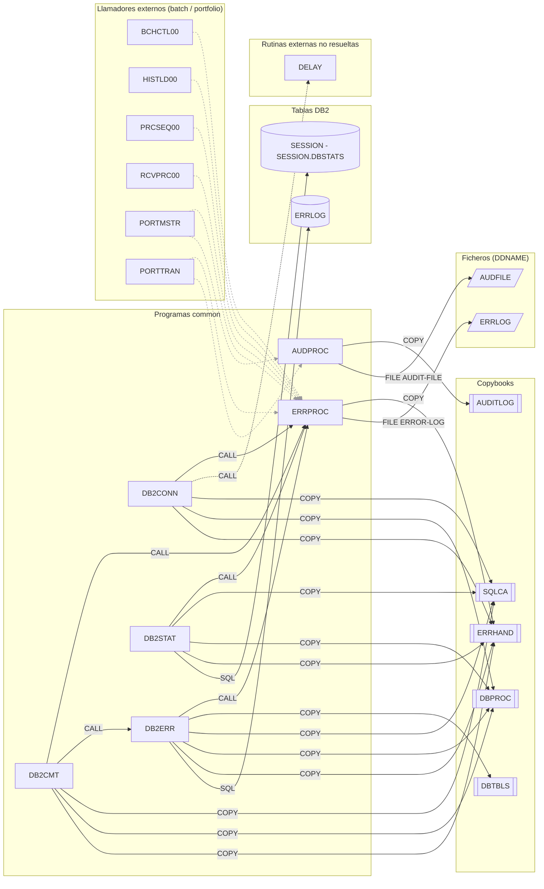

# Grupo `common` – Subrutinas comunes

Fuentes: `src/programs/common/`. Grafo de dependencias de referencia: `documentation/dependency-graph/deps.json`.

## Resumen del grupo
El grupo **common** agrupa las subrutinas de servicio transversales del sistema de gestión de carteras: registro de auditoría, notificación de errores y una familia de utilidades DB2 (conexión, control de commits, gestión de errores SQL y estadísticas). Ninguno de ellos es un programa principal: todos se invocan con `CALL ... USING` desde otros programas, no aparecen en ningún `EXEC PGM=` de `src/jcl/` y ninguno usa CICS.

- **ERRPROC** es el nodo más referenciado del sistema: lo llaman programas *batch*, *portfolio* y los cuatro programas DB2 de este grupo; además el copybook `DBPROC` lo invoca desde `DB2-ERROR-ROUTINE`.
- **AUDPROC** lo usan `PORTMSTR` y `PORTTRAN` para la pista de auditoría.
- **DB2CONN / DB2CMT / DB2ERR / DB2STAT** forman una capa de servicios DB2 con interfaz común (`LS-FUNCTION` X(4) + código de retorno); en el estado actual del repositorio sólo `DB2ERR` tiene un llamador (`DB2CMT`), el resto no es invocado por ningún programa.

## Programas

| Programa | Propósito | Tipo | Documento |
|---|---|---|---|
| AUDPROC | Escribe un registro de auditoría en el fichero `AUDFILE` | Subrutina batch (QSAM) | [AUDPROC.md](AUDPROC.md) |
| DB2CMT | Commit condicionado por frecuencia, rollback y savepoints DB2 | Subrutina batch (DB2) | [DB2CMT.md](DB2CMT.md) |
| DB2CONN | Conexión/desconexión a DB2 con reintentos y comprobación de estado | Subrutina batch (DB2) | [DB2CONN.md](DB2CONN.md) |
| DB2ERR | Registra en `ERRLOG`, diagnostica y recupera errores SQL | Subrutina batch (DB2) | [DB2ERR.md](DB2ERR.md) |
| DB2STAT | Estadísticas de ejecución en la tabla temporal `SESSION.DBSTATS` | Subrutina batch (DB2) | [DB2STAT.md](DB2STAT.md) |
| ERRPROC | Escribe y muestra errores estándar en el fichero `ERRLOG` | Subrutina batch (QSAM) | [ERRPROC.md](ERRPROC.md) |

## Subgrafo de dependencias

Incluye todas las aristas de `deps.json` cuyo `from` es un programa del grupo (líneas continuas; la arista no resuelta `DB2CONN → DELAY` en línea discontinua). Para contexto se añaden, en gris punteado, los llamadores externos del grupo (aristas de `deps.json` con `to` en el grupo).

Ningún programa del grupo es referenciado por `EXEC PGM=` en `src/jcl/`, por lo que no hay nodos JCL (`{{..}}`) en el subgrafo. Los DDNAME del grupo se asignan en JCL de otros grupos: `AUDFILE` → `PORTFOLIO.AUDIT.FILE` (`src/jcl/portfolio/PORTDEL.jcl`), `ERRLOG` → `PROD.ERROR.LOG` (`src/jcl/batch/RPTAUD.jcl`).

## Discrepancias con deps.json

Detectadas al contrastar el código fuente con las aristas de `deps.json` (no se ha modificado `deps.json`):

1. **Falta `DB2CONN --SQL--> SYSIBM.SYSDUMMY1`.** `3000-CHECK-STATUS` ejecuta `SELECT CURRENT SERVER ... FROM SYSIBM.SYSDUMMY1`; `deps.json` no registra ninguna arista SQL para DB2CONN (probablemente el extractor omite tablas de catálogo cualificadas con esquema).
2. **`DB2STAT --SQL--> SESSION` es imprecisa.** El objeto real es la tabla temporal global declarada `SESSION.DBSTATS` (`DECLARE GLOBAL TEMPORARY TABLE`, `INSERT`, `UPDATE`, `SELECT`); el extractor ha capturado sólo el cualificador de esquema `SESSION`, no la tabla `DBSTATS`. Además no es una tabla persistente del modelo de datos.
3. **Nodo `ERRLOG` ambiguo.** `deps.json` usa el mismo identificador `ERRLOG` para la tabla DB2 (`DB2ERR --SQL--> ERRLOG`, también `ERRHNDL` en *online*) y para el DDNAME del fichero secuencial (`ERRPROC --FILE--> ERRLOG`, dataset `PROD.ERROR.LOG`). Son dos objetos distintos; en un grafo combinado deberían representarse como nodos separados (aquí `ERRLOG_T` y `ERRLOG_F`).
4. **`RPTSTA00 --COPY--> DB2STAT` y `UTLMON00 --COPY--> DB2STAT` (no resueltas) no son dependencias del programa DB2STAT.** Ambos programas hacen `COPY DB2STAT.` esperando un **copybook** con ese nombre que no existe en `src/copybook/`; no invocan al programa `DB2STAT`. Si el grafo global resuelve el destino contra la lista de programas, la arista hacia el programa es espuria.
5. **`DB2CONN --CALL--> DELAY` (no resuelta)** es correcta pero corresponde a una rutina externa del sistema (espera temporizada), sin fuente en el repositorio; no es un programa faltante del proyecto.
6. **Dependencia indirecta vía copybook.** El copybook `DBPROC` contiene código de procedimiento (`DB2-ERROR-ROUTINE`) con `CALL 'ERRPROC'`; cualquier programa que copie `DBPROC` depende de ERRPROC aunque no lo llame directamente. En este grupo no altera el grafo (los cuatro programas DB2 ya llaman a ERRPROC explícitamente), pero conviene tenerlo en cuenta para otros grupos.

Observaciones de interfaz (no afectan a las aristas, pero sí a su semántica): `DB2CMT` llama a `DB2ERR` pasando `LS-ERROR-INFO` (84 bytes, sin código de función) cuando `DB2ERR` espera `LS-ERROR-REQUEST` (que empieza por `LS-FUNCTION`); y los llamadores de `ERRPROC` pasan `ERR-MESSAGE` (empieza por `ERR-TIMESTAMP`) cuando `ERRPROC` espera una estructura que empieza por `LS-PROGRAM-ID`. Ver detalle en las fichas de cada programa.
