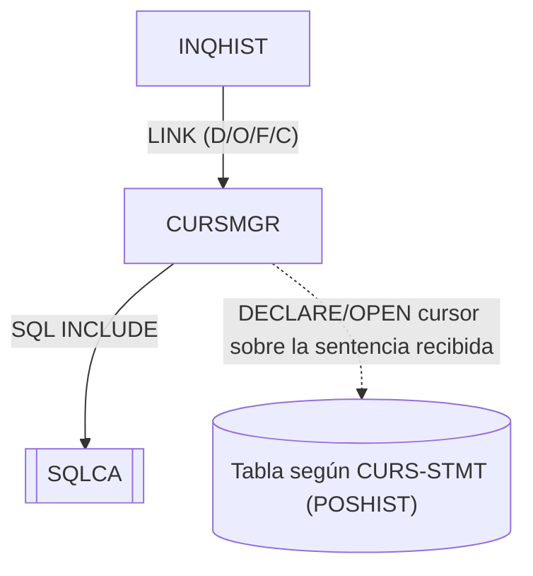

# CURSMGR — Gestor de cursores DB2 online

Fuente: `src/programs/online/CURSMGR.cbl`

## Propósito

Servicio de gestión del ciclo de vida de cursores DB2 para los programas online. Recibe una petición con el tipo de operación (declarar, abrir, fetch, cerrar), el nombre del cursor y la sentencia SQL, y devuelve el SQLCODE resultante. Está pensado para soportar fetch en array (hasta 20 filas) y estadísticas de uso del cursor.

## Tipo

Subrutina online CICS (invocada por `EXEC CICS LINK`, recibe el área de petición por `PROCEDURE DIVISION USING`).

## Entradas y salidas

| Elemento | Tipo | Uso |
|---|---|---|
| `CURSOR-REQUEST-AREA` | LINKAGE SECTION (parámetro) | `CURS-REQUEST-TYPE` (`D`/`O`/`F`/`C`), `CURS-NAME` (18), `CURS-STMT` (240), `CURS-ARRAY-FETCH` (`Y`/`N`), `CURS-RESPONSE-CODE`, `CURS-DATA-AREA` (3000), `CURS-DATA-LENGTH`. |
| `SQLCA` | `EXEC SQL INCLUDE` | Área de comunicación SQL. |
| `WS-CURSOR-STATS` | WORKING-STORAGE | Contadores de fetch (`WS-FETCH-COUNT`, `WS-ROWS-FETCHED`, `WS-FETCH-TIME`). |
| `WS-ARRAY-AREA` | WORKING-STORAGE | `WS-MAX-ROWS = 20`, `WS-ARRAY-SIZE`. |

No accede a ficheros; la tabla DB2 afectada depende de la sentencia recibida en `CURS-STMT` (en la práctica, `POSHIST` desde INQHIST).

## Flujo principal

1. **Mainline**: `EVALUATE TRUE` sobre `CURS-REQUEST-TYPE`:
   - `CURS-DECLARE` (`'D'`) → `P100-DECLARE-CURSOR`
   - `CURS-OPEN` (`'O'`) → `P200-OPEN-CURSOR`
   - `CURS-FETCH` (`'F'`) → `P300-FETCH-DATA`
   - `CURS-CLOSE` (`'C'`) → `P400-CLOSE-CURSOR`
   - Después `EXEC CICS RETURN`.
2. **P100-DECLARE-CURSOR**: `CURS-RESPONSE-CODE = 0`; fija `WS-ARRAY-SIZE` a 20 si `USE-ARRAY-FETCH`, o 1 en caso contrario; `EXEC SQL DECLARE :CURS-NAME CURSOR FOR :CURS-STMT`; si `SQLCODE ≠ 0` lo copia a `CURS-RESPONSE-CODE`.
3. **P200-OPEN-CURSOR**: reinicia contadores; `EXEC SQL OPEN :CURS-NAME`; `CURS-RESPONSE-CODE = SQLCODE` (0 si éxito).
4. **P300-FETCH-DATA** y **P400-CLOSE-CURSOR**: referenciados desde el mainline pero **no están implementados en el fuente** (el fichero termina en `P200-EXIT`). Ver "Manejo de errores".

## Reglas de negocio y validaciones

- Tamaño de array fetch: 20 filas máximo (`WS-MAX-ROWS`), 1 fila si el llamador no solicita array fetch.
- El nombre del cursor y la sentencia se reciben como variables host (`:CURS-NAME`, `:CURS-STMT`); en DB2 estándar `DECLARE CURSOR` requiere nombres estáticos y una sentencia preparada, por lo que el código representa la intención más que SQL embebido compilable.

## Manejo de errores y códigos de retorno

- `CURS-RESPONSE-CODE`: `0` éxito; en caso de error contiene el `SQLCODE` de DB2 (negativo). INQHIST interpreta `>= 0` como éxito en el fetch (incluye `+100`, fin de datos).
- No invoca a ERRHNDL ni a DB2RECV; la decisión de recuperación se deja al llamador.
- El fuente está truncado: los párrafos `P300-FETCH-DATA`/`P300-EXIT` y `P400-CLOSE-CURSOR`/`P400-EXIT` no existen y `P200-EXIT` carece de sentencia `EXIT.`; el programa no compilaría tal cual.

## Dependencias

**Llama a (deps.json, `from = CURSMGR`):**

| Destino | Tipo |
|---|---|
| SQLCA | SQL-INCLUDE |

**Es llamado por:** INQHIST (LINK, cuatro veces: D/O/F/C).

## Diagrama

