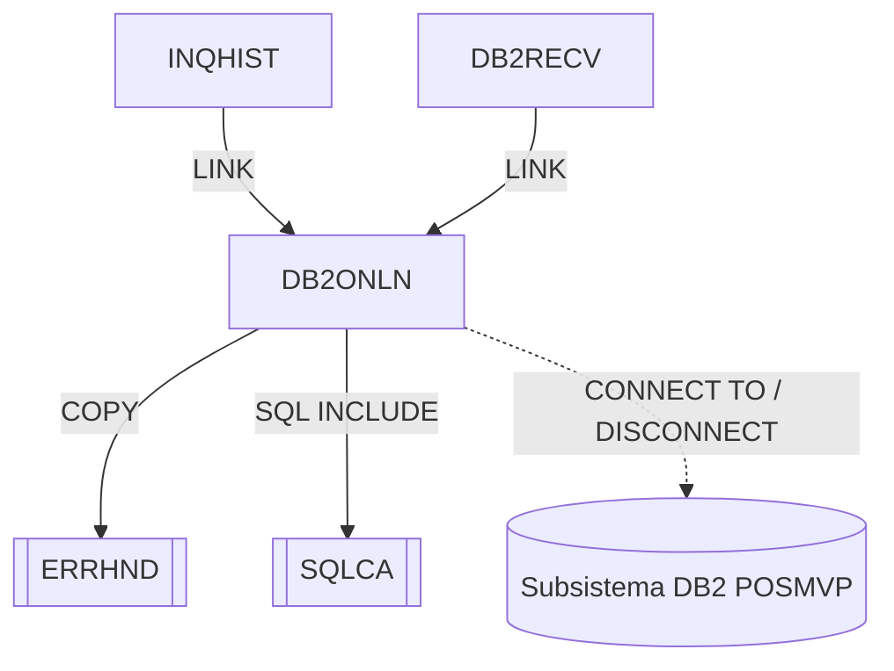

# DB2ONLN — Gestor de conexiones DB2 online

Fuente: `src/programs/online/DB2ONLN.cbl`

## Propósito

Gestiona las conexiones DB2 de los programas online: establece la conexión al subsistema `POSMVP`, la libera y consulta su estado. Mantiene un contador de conexiones activas (pool lógico con máximo 100) y genera un token de conexión para el llamador.

## Tipo

Subrutina online CICS (invocada por `EXEC CICS LINK`, recibe el área de petición por `PROCEDURE DIVISION USING`).

## Entradas y salidas

| Elemento | Tipo | Uso |
|---|---|---|
| `DB2-REQUEST-AREA` | LINKAGE SECTION (parámetro; layout equivalente al copybook `DB2REQ`) | `DB2-REQUEST-TYPE` (`C` conectar / `D` desconectar / `S` estado), `DB2-RESPONSE-CODE`, `DB2-CONNECTION-TOKEN` (16), `DB2-ERROR-INFO` (`DB2-SQLCODE`, `DB2-ERROR-MSG`). |
| `SQLCA` | `EXEC SQL INCLUDE` | Área de comunicación SQL. |
| Copybook `ERRHND` | COPY | `WS-ERROR-AREA` (declarada, no utilizada en el flujo). |
| `WS-POOL-STATS` | WORKING-STORAGE | `WS-ACTIVE-CONNECTIONS`, `WS-MAX-CONNECTIONS = 100`, etc. |
| Subsistema DB2 `POSMVP` | `EXEC SQL CONNECT TO` | Destino de la conexión (no es una tabla). |

No accede a ficheros ni tablas.

## Flujo principal

1. **Mainline**: `EVALUATE TRUE` sobre `DB2-REQUEST-TYPE`: `DB2-CONNECT` → `P100-PROCESS-CONNECT`; `DB2-DISCONNECT` → `P200-PROCESS-DISCONNECT`; `DB2-STATUS` → `P300-CHECK-STATUS`. Después `EXEC CICS RETURN`.
2. **P100-PROCESS-CONNECT**: si `WS-ACTIVE-CONNECTIONS < WS-MAX-CONNECTIONS` ejecuta `P110-ESTABLISH-CONNECTION`; si no, `DB2-ERROR-MSG = 'Maximum connections reached'` y `DB2-RESPONSE-CODE = -1`.
3. **P110-ESTABLISH-CONNECTION**: `EXEC SQL CONNECT TO POSMVP`. Si `SQLCODE = 0`: incrementa conexiones activas, `DB2-RESPONSE-CODE = 0` y ejecuta `P120-GENERATE-TOKEN`. Si no: copia `SQLCODE` y `SQLERRMC` a `DB2-ERROR-INFO`, `DB2-RESPONSE-CODE = -1`.
4. **P120-GENERATE-TOKEN**: token = `FUNCTION CURRENT-DATE` concatenado con `WS-ACTIVE-CONNECTIONS` (truncado a 16 caracteres).
5. **P200-PROCESS-DISCONNECT**: `EXEC SQL DISCONNECT`; si OK decrementa conexiones activas y `DB2-RESPONSE-CODE = 0`; si no, informa SQLCODE/SQLERRMC y `-1`.
6. **P300-CHECK-STATUS**: `EXEC SQL SELECT CURRENT SERVER INTO :DB2-ERROR-MSG`; fija `DB2-RESPONSE-CODE` a 0 o -1 según `SQLCODE`, y a continuación lo sobrescribe con `WS-ACTIVE-CONNECTIONS` (el número de conexiones activas es el valor devuelto).

## Reglas de negocio y validaciones

- Máximo 100 conexiones simultáneas (`WS-MAX-CONNECTIONS`).
- El contador de conexiones reside en WORKING-STORAGE; en CICS cada `LINK` obtiene una copia nueva de WORKING-STORAGE, por lo que el "pool" no persiste realmente entre invocaciones (observación de diseño).
- El token de conexión no se valida en ninguna operación posterior.

## Manejo de errores y códigos de retorno

| `DB2-RESPONSE-CODE` | Significado |
|---|---|
| `0` | Operación correcta (conectar/desconectar). |
| `-1` | Error: límite de conexiones alcanzado o SQLCODE ≠ 0 (detalle en `DB2-SQLCODE` / `DB2-ERROR-MSG`). |
| `n ≥ 0` (en `S`) | Número de conexiones activas. |

No invoca a ERRHNDL; el llamador (INQHIST) decide si activar DB2RECV.

## Dependencias

**Llama a (deps.json, `from = DB2ONLN`):**

| Destino | Tipo |
|---|---|
| ERRHND | COPY |
| SQLCA | SQL-INCLUDE |

**Es llamado por:** INQHIST (LINK), DB2RECV (LINK, en el reintento de conexión).

## Diagrama

