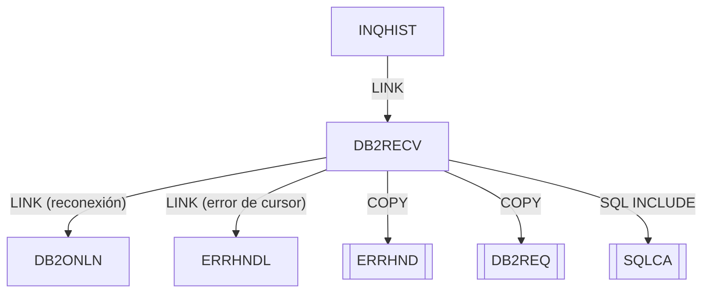

# DB2RECV — Gestor de recuperación DB2 online

Fuente: `src/programs/online/DB2RECV.cbl`

## Propósito

Implementa la lógica de recuperación ante fallos DB2 para los programas online: reintento de conexión (hasta 3 intentos con espera de 2 segundos vía DB2ONLN), rollback de la transacción en curso y recuperación de errores de cursor delegando la decisión en ERRHNDL.

## Tipo

Subrutina online CICS (invocada por `EXEC CICS LINK`, recibe el área de petición por `PROCEDURE DIVISION USING`).

## Entradas y salidas

| Elemento | Tipo | Uso |
|---|---|---|
| `RECOVERY-REQUEST-AREA` | LINKAGE SECTION (parámetro) | `RECV-REQUEST-TYPE` (`C` conexión / `T` transacción / `R` cursor), `RECV-RESPONSE-CODE`, `RECV-SQLCODE`, `RECV-ERROR-INFO` (`RECV-PROGRAM`, `RECV-CURSOR`, `RECV-MESSAGE`), `RECV-STATUS` (`S` éxito / `F` fallo / `R` reintentar). |
| `SQLCA` | `EXEC SQL INCLUDE` | Área de comunicación SQL. |
| Copybook `ERRHND` | COPY | `WS-ERROR-AREA` que se envía a ERRHNDL. |
| Copybook `DB2REQ` | COPY | `WS-DB2-REQUEST` que se envía a DB2ONLN. |
| `WS-RECOVERY-STATS` | WORKING-STORAGE | `WS-MAX-RETRIES = 3`, `WS-RETRY-INTERVAL = 2`, contador de reintentos. |

No accede a ficheros ni tablas directamente (el `ROLLBACK` afecta a la unidad de trabajo DB2 en curso).

## Flujo principal

1. **Mainline**: `EVALUATE TRUE` sobre `RECV-REQUEST-TYPE`: `RECV-CONNECTION` → `P100-RECOVER-CONNECTION`; `RECV-TRANSACTION` → `P200-RECOVER-TRANSACTION`; `RECV-CURSOR` → `P300-RECOVER-CURSOR`. Después `EXEC CICS RETURN`.
2. **P100-RECOVER-CONNECTION**: `WS-RETRY-COUNT = 0`; `PERFORM UNTIL WS-RETRY-COUNT >= WS-MAX-RETRIES`: ejecuta `P110-ATTEMPT-RECONNECT`; si `RECV-SUCCESS` sale del bucle; si no, `P120-WAIT-INTERVAL` y suma 1 al contador. Si se agotan los reintentos: `RECV-FAILED`, `RECV-RESPONSE-CODE = -1`.
3. **P110-ATTEMPT-RECONNECT**: `DB2-REQUEST-TYPE = 'C'` y `LINK PROGRAM('DB2ONLN')`. Si `DB2-RESPONSE-CODE = 0` → `RECV-SUCCESS`, `RECV-RESPONSE-CODE = 0`; si no → `RECV-RETRY` y copia `DB2-SQLCODE` a `RECV-SQLCODE`.
4. **P120-WAIT-INTERVAL**: `EXEC CICS DELAY INTERVAL(WS-RETRY-INTERVAL)`.
5. **P200-RECOVER-TRANSACTION**: `EXEC SQL ROLLBACK`; `RECV-SUCCESS`/0 si `SQLCODE = 0`, si no `RECV-FAILED`, `RECV-SQLCODE = SQLCODE`, `RECV-RESPONSE-CODE = -1`.
6. **P300-RECOVER-CURSOR**: rellena `WS-ERROR-AREA` (`ERR-PROGRAM = RECV-PROGRAM`, `ERR-PARAGRAPH = RECV-CURSOR`, `ERR-SQLCODE`, severidad `ERR-WARNING`) y `LINK PROGRAM('ERRHNDL')`. Si ERRHNDL devuelve `ERR-CONTINUE` → `RECV-RETRY`; si no → `RECV-FAILED`. Copia `ERR-MESSAGE` a `RECV-MESSAGE`.

## Reglas de negocio y validaciones

- Máximo 3 intentos de reconexión con 2 unidades de `INTERVAL` entre intentos (`EXEC CICS DELAY INTERVAL` interpreta el valor como hhmmss empaquetado; con `2` equivale a 2 segundos).
- Un error de cursor se considera recuperable (`RECV-RETRY`) únicamente si ERRHNDL lo clasifica como `ERR-CONTINUE` (severidad W o I).
- La recuperación de transacción es un `ROLLBACK` completo; no hay lógica de puntos de sincronización parciales.

## Manejo de errores y códigos de retorno

| `RECV-STATUS` | `RECV-RESPONSE-CODE` | Significado |
|---|---|---|
| `S` | `0` | Recuperación correcta. |
| `R` | (sin cambio) | Reintento pendiente / error recuperable según ERRHNDL. |
| `F` | `-1` | Recuperación fallida (reintentos agotados, rollback fallido o ERRHNDL indica no continuar). |

`RECV-SQLCODE` transporta el último SQLCODE observado; `RECV-MESSAGE` el mensaje formateado por ERRHNDL (sólo en modo `R`).

## Dependencias

**Llama a (deps.json, `from = DB2RECV`):**

| Destino | Tipo |
|---|---|
| DB2ONLN | LINK |
| ERRHNDL | LINK |
| ERRHND | COPY |
| DB2REQ | COPY |
| SQLCA | SQL-INCLUDE |

**Es llamado por:** INQHIST (LINK, modo `C`).

## Diagrama

