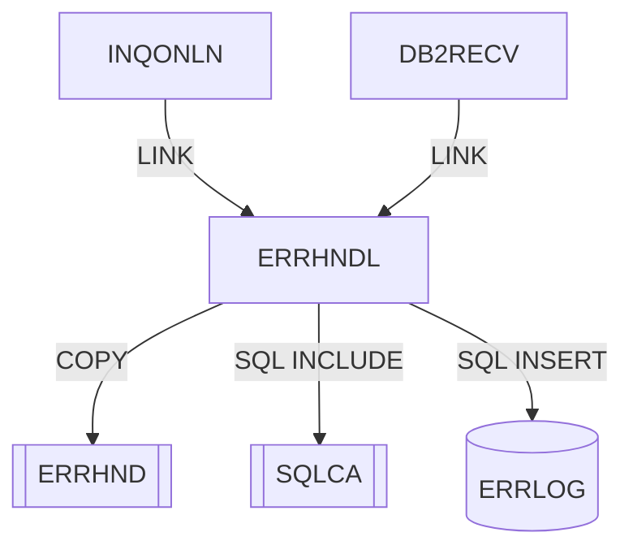

# ERRHNDL — Manejador centralizado de errores online

Fuente: `src/programs/online/ERRHNDL.cbl`

## Propósito

Punto único de tratamiento de errores para los programas online. Recibe el área de error (`ERRHND`) del programa llamador, la registra en la tabla DB2 `ERRLOG`, formatea un mensaje legible con identificador de traza y determina la acción a seguir (continuar, retornar o abend) en función de la severidad.

## Tipo

Subrutina online CICS (invocada por `EXEC CICS LINK` con `DFHCOMMAREA`).

## Entradas y salidas

| Elemento | Tipo | Uso |
|---|---|---|
| `DFHCOMMAREA` (copybook `ERRHND`) | LINKAGE SECTION | Entrada: `ERR-PROGRAM`, `ERR-PARAGRAPH`, `ERR-SQLCODE`, `ERR-CICS-RESP`, `ERR-CICS-RESP2`, `ERR-SEVERITY` (`F`/`W`/`I`), `ERR-MESSAGE`, `ERR-TRACE-ID`. Salida: `ERR-MESSAGE` formateado, `ERR-ACTION` (`R`/`C`/`A`), `ERR-TIMESTAMP`, `ERR-TRACE-ID`. |
| Copybook `ERRHND` | COPY | Área de error (WORKING-STORAGE y LINKAGE). |
| `SQLCA` | `EXEC SQL INCLUDE` | Área de comunicación SQL. |
| Tabla DB2 `ERRLOG` | `EXEC SQL INSERT` | Registro de errores (timestamp, programa, párrafo, SQLCODE, resp. CICS, severidad, mensaje, trace id). |
| `WS-ERRLOG-RECORD` | WORKING-STORAGE (`DECLARE SECTION`) | Variables host para el INSERT. |

## Flujo principal

1. **Mainline**: `P100-INIT-ERROR-HANDLER` → `P200-LOG-ERROR` → `P300-FORMAT-MESSAGE` → `P400-DETERMINE-ACTION` → `EXEC CICS RETURN`.
2. **P100-INIT-ERROR-HANDLER**: copia `DFHCOMMAREA` a `WS-ERROR-AREA`; `ERR-TIMESTAMP = FUNCTION CURRENT-DATE`; si `ERR-TRACE-ID` está en blanco genera uno con `FUNCTION RANDOM`.
3. **P200-LOG-ERROR**: copia los campos `ERR-*` a `LOG-*` y ejecuta `INSERT INTO ERRLOG VALUES (...)`. Si `SQLCODE ≠ 0`: `ERR-MESSAGE = 'Error logging failed'` y `SET ERR-FATAL TO TRUE`.
4. **P300-FORMAT-MESSAGE**: `ERR-MESSAGE = 'Error in ' + ERR-PROGRAM + ' - ' + ERR-MESSAGE + ' (' + ERR-TRACE-ID + ')'`.
5. **P400-DETERMINE-ACTION**: `EVALUATE TRUE`: `ERR-FATAL` → `ERR-ABEND`; `ERR-WARNING` → `ERR-CONTINUE`; `ERR-INFO` → `ERR-CONTINUE`; otro → `ERR-RETURN`. Devuelve `WS-ERROR-AREA` a `DFHCOMMAREA`.

## Reglas de negocio y validaciones

- Todo error se persiste en `ERRLOG` antes de decidir la acción; un fallo al persistir se escala a severidad fatal.
- Mapeo severidad → acción: `F` → `A` (abend), `W`/`I` → `C` (continuar), severidad desconocida → `R` (retornar).
- El identificador de traza (`ERR-TRACE-ID`) se conserva si el llamador lo aporta, permitiendo correlacionar varios errores de una misma transacción.
- `P300-FORMAT-MESSAGE` usa `ERR-MESSAGE` como origen y destino del `STRING` (comportamiento indefinido en COBOL estándar); observación de código.
- El fuente no respeta el formato de columnas COBOL fijo (código en columna 1); observación de código.

## Manejo de errores y códigos de retorno

| `ERR-ACTION` devuelto | Cuándo | Reacción esperada del llamador |
|---|---|---|
| `A` (`ERR-ABEND`) | Severidad `F` o fallo del INSERT en `ERRLOG` | INQONLN ejecuta `EXEC CICS ABEND ABCODE('IERR')`. |
| `C` (`ERR-CONTINUE`) | Severidad `W` o `I` | DB2RECV marca `RECV-RETRY`; INQONLN continúa. |
| `R` (`ERR-RETURN`) | Severidad no reconocida | Retornar al llamador sin continuar. |

## Dependencias

**Llama a (deps.json, `from = ERRHNDL`):**

| Destino | Tipo |
|---|---|
| ERRHND | COPY |
| SQLCA | SQL-INCLUDE |
| ERRLOG | SQL (INSERT) |

**Es llamado por:** INQONLN (LINK), DB2RECV (LINK).

## Diagrama

