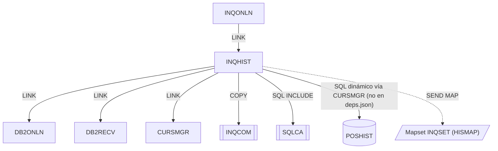

# INQHIST — Consulta de histórico de transacciones

Fuente: `src/programs/online/INQHIST.cbl`

## Propósito

Manejador de la consulta de histórico de transacciones de una cuenta. Establece la conexión DB2 a través de DB2ONLN (con recuperación vía DB2RECV si falla), construye dinámicamente una sentencia `SELECT` sobre la tabla `POSHIST` y la ejecuta mediante el gestor de cursores CURSMGR (declarar → abrir → fetch en array → cerrar). Muestra hasta 10 movimientos en la pantalla `HISMAP`.

## Tipo

Online CICS (subprograma invocado por `EXEC CICS LINK` desde INQONLN).

## Entradas y salidas

| Elemento | Tipo | Uso |
|---|---|---|
| `DFHCOMMAREA` (copybook `INQCOM`) | LINKAGE SECTION | Entrada: número de cuenta. Salida: `INQCOM-RESPONSE-CODE`, `INQCOM-ERROR-MSG`. |
| Copybook `INQCOM` | COPY | Área de comunicación. |
| `SQLCA` | `EXEC SQL INCLUDE` | Área de comunicación SQL. |
| Tabla DB2 `POSHIST` | SQL dinámico (vía CURSMGR) | `SELECT TRANS_DATE, TRANS_TYPE, TRANS_UNITS, TRANS_PRICE, TRANS_AMOUNT FROM POSHIST WHERE ACCOUNT_NO = ? ORDER BY TRANS_DATE DESC`. |
| `WS-DB2-REQUEST` | WORKING-STORAGE | Petición a DB2ONLN (misma estructura que el copybook `DB2REQ`, declarada en línea). |
| `WS-CURSOR-REQUEST` | WORKING-STORAGE | Petición a CURSMGR: cursor `HISTORY_CURSOR`, sentencia, array fetch `'Y'`, área de datos de 3000 bytes. |
| `WS-RECOVERY-REQUEST` | WORKING-STORAGE | Petición a DB2RECV (tipo `'C'` = recuperar conexión). |
| `WS-HISTORY-TABLE` | WORKING-STORAGE | Tabla de 10 entradas (fecha, tipo, unidades, precio, importe) que se envía a pantalla. |
| Mapa `HISMAP` / mapset `INQSET` | Pantalla BMS | Salida: `SEND MAP ... FROM(WS-HISTORY-TABLE)`. |

## Flujo principal

1. **Mainline**: `P100-INIT-PROGRAM` → `P200-GET-HISTORY` → `P300-FORMAT-DISPLAY` → `EXEC CICS RETURN`.
2. **P100-INIT-PROGRAM**: copia el COMMAREA, pone `WS-ROW-COUNT = 0` y `NO-MORE-ROWS`; `HANDLE CONDITION ERROR(P999-ERROR-ROUTINE)`; ejecuta `P150-DB2-CONNECT`.
3. **P150-DB2-CONNECT**:
   - `DB2-REQUEST-TYPE = 'C'` y `LINK PROGRAM('DB2ONLN')`.
   - Si `DB2-RESPONSE-CODE ≠ 0`: prepara `WS-RECOVERY-REQUEST` (`'C'`, programa `INQHIST`, SQLCODE) y `LINK PROGRAM('DB2RECV')`.
     - Si `RECV-SUCCESS` → vuelve a ejecutar `P150-DB2-CONNECT` (recursivo).
     - Si no → copia `RECV-MESSAGE` a `INQCOM-ERROR-MSG` y ejecuta `P999-ERROR-ROUTINE`.
   - Guarda `DB2-CONNECTION-TOKEN` en `WS-DB2-TOKEN`.
4. **P200-GET-HISTORY**:
   - Construye la sentencia SQL en `CURS-STMT` (ver tabla de entradas).
   - `CURS-REQUEST-TYPE = 'D'` → `LINK CURSMGR` (declarar cursor).
   - Si OK: `'O'` → `LINK CURSMGR` (abrir). Si OK: `P250-FETCH-HISTORY`.
   - Siempre: `'C'` → `LINK CURSMGR` (cerrar).
5. **P250-FETCH-HISTORY**: `'F'` → `LINK CURSMGR`; si `CURS-RESPONSE-CODE >= 0` copia `CURS-DATA-AREA` a `WS-HISTORY-TABLE`.
6. **P300-FORMAT-DISPLAY**: `SEND MAP('HISMAP') MAPSET('INQSET') FROM(WS-HISTORY-TABLE) ERASE`.
7. **P999-ERROR-ROUTINE**: mueve `SQLCODE` a `INQCOM-RESPONSE-CODE` y devuelve el COMMAREA.

## Reglas de negocio y validaciones

- El histórico se ordena por fecha descendente (movimientos más recientes primero).
- Se muestran como máximo 10 filas (`WS-HISTORY-ENTRY OCCURS 10`); CURSMGR está configurado con array fetch de hasta 20 filas, pero sólo se copian al área de 10 entradas.
- El parámetro de cuenta se pasa como marcador `?`; el programa no asigna explícitamente el valor de la cuenta al marcador (el binding depende de CURSMGR).
- Si la conexión falla y la recuperación tiene éxito se reintenta la conexión sin límite explícito en INQHIST (el límite de 3 reintentos está en DB2RECV).
- `WS-DB2-TOKEN` no está declarado en WORKING-STORAGE; observación de código.

## Manejo de errores y códigos de retorno

| Situación | Tratamiento |
|---|---|
| Fallo de `DB2ONLN` (`DB2-RESPONSE-CODE ≠ 0`) | Recuperación con `DB2RECV` tipo `'C'`; si falla, mensaje en COMMAREA y `P999-ERROR-ROUTINE`. |
| Fallo al declarar/abrir cursor (`CURS-RESPONSE-CODE ≠ 0`) | Se omite el fetch; se cierra el cursor igualmente. |
| Fetch con `CURS-RESPONSE-CODE < 0` | No se copian datos; la pantalla se envía con la tabla vacía. |
| Condición CICS `ERROR` | `P999-ERROR-ROUTINE`: `INQCOM-RESPONSE-CODE = SQLCODE`. |

No invoca a ERRHNDL directamente (lo hace indirectamente DB2RECV en el modo `'R'`, que INQHIST no usa).

## Dependencias

**Llama a (deps.json, `from = INQHIST`):**

| Destino | Tipo |
|---|---|
| DB2ONLN | LINK |
| DB2RECV | LINK |
| CURSMGR | LINK |
| INQCOM | COPY |
| SQLCA | SQL-INCLUDE |

**Dependencia no recogida en deps.json:** acceso a la tabla DB2 `POSHIST` mediante SQL dinámico construido en `P200-GET-HISTORY` (ver README del grupo, "Discrepancias").

**Es llamado por:** INQONLN (LINK).

## Diagrama

