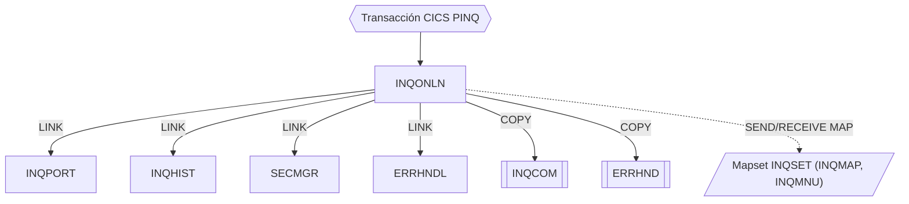

# INQONLN — Controlador principal de consultas online

Fuente: `src/programs/online/INQONLN.cbl`

## Propósito

Programa principal de la transacción CICS **PINQ** (definida en `src/cics/PORTDFN.csd`). Recibe la pantalla de consulta, valida la seguridad del usuario mediante SECMGR y enruta cada petición al manejador correspondiente: consulta de posición de cartera (INQPORT) o consulta de histórico de transacciones (INQHIST). Centraliza el tratamiento de errores delegando en ERRHNDL.

## Tipo

Online CICS (programa de transacción, punto de entrada de la transacción `PINQ`).

## Entradas y salidas

| Elemento | Tipo | Uso |
|---|---|---|
| `DFHCOMMAREA` (copybook `INQCOM`) | LINKAGE SECTION | Área de comunicación de la consulta: función (`MENU`/`INQP`/`INQH`/`EXIT`), número de cuenta, código de respuesta y mensaje de error. |
| Mapa `INQMAP` / mapset `INQSET` (`src/maps/INQSET.bms`) | Pantalla BMS | Entrada: `EXEC CICS RECEIVE MAP` sobre `WS-COMMAREA`. |
| Mapa `INQMNU` / mapset `INQSET` | Pantalla BMS | Salida: menú principal (`EXEC CICS SEND MAP`). |
| Copybook `INQCOM` | COPY | Estructura del área de comunicación (WORKING-STORAGE y LINKAGE). |
| Copybook `ERRHND` | COPY | Área de error `WS-ERROR-AREA` que se pasa a ERRHNDL. |
| `WS-SECURITY-REQUEST` | WORKING-STORAGE | Área de petición de seguridad para SECMGR (declarada en línea, misma estructura que la LINKAGE de SECMGR). |
| `EIBRESP`, `EIBRESP2`, `USERID` | CICS EIB / ASSIGN | Datos de contexto para errores y seguridad. |

No accede a ficheros ni tablas DB2 directamente.

## Flujo principal

1. **PROCEDURE DIVISION (mainline)**: `EXEC CICS HANDLE CONDITION` para `ERROR`, `PGMIDERR` y `NOTFND`, todos dirigidos a `P900-ERROR-ROUTINE`. Ejecuta `P100-PROCESS-REQUEST` en bucle hasta que `SESSION-TERMINATED` sea verdadero; después `EXEC CICS RETURN`.
2. **P100-PROCESS-REQUEST**:
   - Inicializa `WS-COMMAREA` a LOW-VALUES y hace `RECEIVE MAP('INQMAP') MAPSET('INQSET')`.
   - `EVALUATE WS-COMMAREA-FUNCTION`:
     - `'MENU'` → `P200-DISPLAY-MENU`
     - `'INQP'` → `P300-PORTFOLIO-INQUIRY`
     - `'INQH'` → `P400-HISTORY-INQUIRY`
     - `'EXIT'` → `SET SESSION-TERMINATED TO TRUE`
     - otro → `P900-ERROR-ROUTINE`
   - Ejecuta `P050-SECURITY-CHECK` (nótese que se realiza *después* del enrutado, ver reglas de negocio).
   - Si `SEC-RESPONSE-CODE ≠ 0`: copia `SEC-ERROR-INFO` a `WS-ERROR-MESSAGE`, invoca `P900-ERROR-ROUTINE` y termina con `EXEC CICS RETURN`.
3. **P200-DISPLAY-MENU**: `SEND MAP('INQMNU') MAPSET('INQSET') ERASE`.
4. **P300-PORTFOLIO-INQUIRY**: `EXEC CICS LINK PROGRAM('INQPORT') COMMAREA(WS-COMMAREA)`.
5. **P400-HISTORY-INQUIRY**: `EXEC CICS LINK PROGRAM('INQHIST') COMMAREA(WS-COMMAREA)`.
6. **P050-SECURITY-CHECK** (secuencia de tres LINK a SECMGR, encadenados por éxito):
   1. `SEC-REQUEST-TYPE = 'V'` (validar usuario); obtiene el usuario con `EXEC CICS ASSIGN USERID`.
   2. Si OK, `SEC-REQUEST-TYPE = 'A'`, recurso `INQONLN`, acceso `READ` (autorizar).
   3. Si OK, `SEC-REQUEST-TYPE = 'L'` (registrar auditoría).
7. **P900-ERROR-ROUTINE**: rellena `ERR-PROGRAM='INQONLN'`, `ERR-PARAGRAPH`, `EIBRESP`/`EIBRESP2`, severidad `ERR-WARNING`; `LINK PROGRAM('ERRHNDL')`. Si ERRHNDL devuelve `ERR-ABEND` → `EXEC CICS ABEND ABCODE('IERR')`. Copia `ERR-MESSAGE` a `WS-ERROR-MESSAGE`.

## Reglas de negocio y validaciones

- Sólo se aceptan las funciones `MENU`, `INQP`, `INQH` y `EXIT`; cualquier otro valor se trata como error.
- Todo acceso requiere pasar validación de usuario, autorización de lectura sobre el recurso `INQONLN` y registro de auditoría (SECMGR con tipos V/A/L).
- La comprobación de seguridad se ejecuta en cada iteración del bucle, pero *después* de haber realizado ya el LINK a INQPORT/INQHIST; es decir, la petición se procesa antes de verificar la autorización (observación de código, no una regla intencional documentada).
- Los campos `WS-ERROR-MESSAGE` y `WS-COMMAREA-FUNCTION` referenciados no están declarados en el fuente ni en `INQCOM` (que define `INQCOM-FUNCTION`); el programa tal cual no compilaría sin ajustes.

## Manejo de errores y códigos de retorno

- Condiciones CICS `ERROR`, `PGMIDERR`, `NOTFND` → `P900-ERROR-ROUTINE`.
- Los errores se registran a través de ERRHNDL con severidad `W` (warning). Si ERRHNDL escala la acción a `ERR-ABEND` (p. ej. falla el INSERT en `ERRLOG`), INQONLN aborta la tarea con ABEND `IERR`.
- Códigos de SECMGR: `0` OK, `8` validación/autorización denegada, `12` fallo técnico; cualquier valor ≠ 0 termina la transacción tras notificar el error.
- Los códigos de respuesta de `RECEIVE MAP`/`SEND MAP`/`LINK` se capturan en `WS-RESPONSE-CODE` pero no se evalúan explícitamente.

## Dependencias

**Llama a (deps.json, `from = INQONLN`):**

| Destino | Tipo |
|---|---|
| INQPORT | LINK |
| INQHIST | LINK |
| ERRHNDL | LINK |
| SECMGR | LINK |
| INQCOM | COPY |
| ERRHND | COPY |

**Es llamado por:** ningún programa COBOL ni JCL en deps.json. Es el programa asociado a la transacción CICS `PINQ` (`src/cics/PORTDFN.csd`).

## Diagrama

