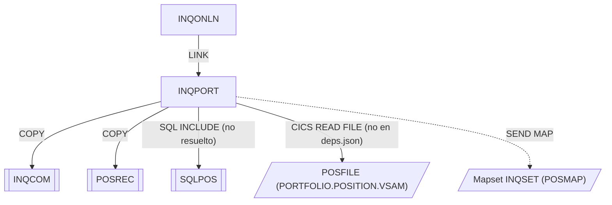

# INQPORT — Consulta de posición de cartera

Fuente: `src/programs/online/INQPORT.cbl`

## Propósito

Manejador de la consulta de posición de cartera. Lee el registro de posición de la cuenta indicada en el área de comunicación desde el fichero VSAM `POSFILE` y lo presenta en la pantalla `POSMAP`. Si no existe posición, devuelve un mensaje de error en el COMMAREA.

## Tipo

Online CICS (subprograma invocado por `EXEC CICS LINK` desde INQONLN).

## Entradas y salidas

| Elemento | Tipo | Uso |
|---|---|---|
| `DFHCOMMAREA` (copybook `INQCOM`) | LINKAGE SECTION | Entrada: `INQCOM-ACCOUNT-NO`. Salida: `INQCOM-ERROR-MSG`, `INQCOM-RESPONSE-CODE`. |
| `POSFILE` (VSAM KSDS, DSN `PORTFOLIO.POSITION.VSAM`) | Fichero CICS (`EXEC CICS READ FILE`) | Lectura del registro de posición por clave de cuenta. Definido en `src/cics/PORTDFN.csd`. |
| Copybook `POSREC` | COPY | Layout del registro de posición (`WS-POSITION-RECORD`). |
| Copybook `INQCOM` | COPY | Área de comunicación (WORKING-STORAGE y LINKAGE). |
| `SQLPOS` | `EXEC SQL INCLUDE` | Estructura DB2 de posición; **no existe en el repositorio** (edge marcado `resolved: false` en deps.json). |
| Mapa `POSMAP` / mapset `INQSET` | Pantalla BMS | Salida: `SEND MAP ... FROM(WS-POSITION-RECORD)`. |

No ejecuta sentencias SQL sobre tablas DB2 (aunque incluye `SQLPOS`).

## Flujo principal

1. **Mainline**: `P100-INIT-PROGRAM` → `P200-GET-POSITION` → si `POSITION-EXISTS` `P300-FORMAT-DISPLAY`, si no `P900-NOT-FOUND` → `EXEC CICS RETURN`.
2. **P100-INIT-PROGRAM**: inicializa `WS-POSITION-RECORD` a LOW-VALUES, copia `DFHCOMMAREA` a `WS-COMMAREA`; `HANDLE CONDITION ERROR(P999-ERROR-ROUTINE) NOTFND(P900-NOT-FOUND)`.
3. **P200-GET-POSITION**: mueve el número de cuenta del COMMAREA a `POSITION-ACCOUNT` y ejecuta `EXEC CICS READ FILE('POSFILE') INTO(WS-POSITION-RECORD) RIDFLD(POSITION-ACCOUNT) RESP(WS-RESPONSE-CODE)`. Si `RESP = DFHRESP(NORMAL)` → `POSITION-EXISTS`; si no → `NO-POSITION`.
4. **P300-FORMAT-DISPLAY**: `SEND MAP('POSMAP') MAPSET('INQSET') FROM(WS-POSITION-RECORD) ERASE`.
5. **P900-NOT-FOUND**: escribe `'Position not found for account'` en `INQCOM-ERROR-MSG` y devuelve `WS-COMMAREA` a `DFHCOMMAREA`.
6. **P999-ERROR-ROUTINE**: escribe `'Error accessing position data'` y `WS-RESPONSE-CODE` en el COMMAREA y lo devuelve al llamador.

## Reglas de negocio y validaciones

- La clave de acceso a `POSFILE` es el número de cuenta (`INQCOM-ACCOUNT-NO`, 10 caracteres).
- La ausencia de registro no se considera error técnico: se informa al usuario mediante mensaje en el COMMAREA sin abortar.
- Los campos `WS-COMMAREA-ACCOUNT-NO` referenciados no coinciden con los nombres definidos en `INQCOM` (`INQCOM-ACCOUNT-NO`); observación de código.

## Manejo de errores y códigos de retorno

| Situación | Tratamiento |
|---|---|
| `READ` con `RESP ≠ NORMAL` (incl. NOTFND) | `NO-POSITION` → `P900-NOT-FOUND`, mensaje en `INQCOM-ERROR-MSG`. |
| Condición CICS `ERROR` | `P999-ERROR-ROUTINE`: mensaje genérico y `INQCOM-RESPONSE-CODE = WS-RESPONSE-CODE`. |
| Condición CICS `NOTFND` | `P900-NOT-FOUND`. |

No invoca a ERRHNDL; el error se devuelve al llamador (INQONLN) a través del COMMAREA.

## Dependencias

**Llama a (deps.json, `from = INQPORT`):**

| Destino | Tipo | Nota |
|---|---|---|
| INQCOM | COPY | |
| POSREC | COPY | |
| SQLPOS | SQL-INCLUDE | `resolved: false` — el include no existe en `src/copybook/`. |

**Dependencia no recogida en deps.json:** lectura del fichero VSAM `POSFILE` mediante `EXEC CICS READ FILE` (ver README del grupo, "Discrepancias").

**Es llamado por:** INQONLN (LINK).

## Diagrama

