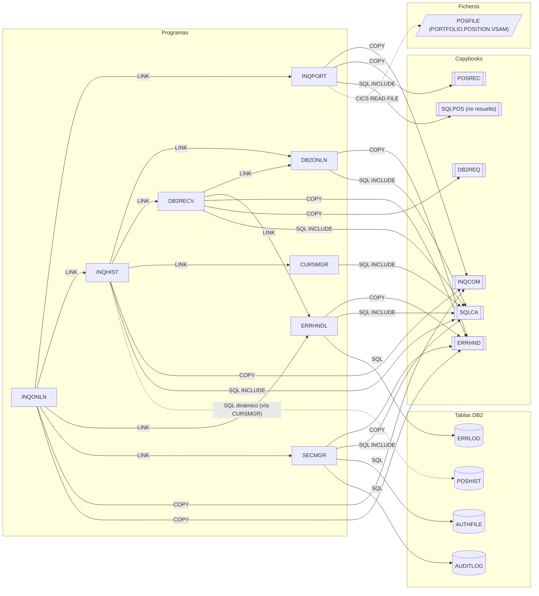

# Programas COBOL — grupo `online`

Fuentes: `src/programs/online/`. Definiciones CICS: `src/cics/PORTDFN.csd`. Mapas BMS: `src/maps/INQSET.bms`.

## Resumen del grupo

El grupo **online** implementa la transacción CICS `PINQ` de consulta de carteras. `INQONLN` es el controlador principal: recibe la pantalla, comprueba la seguridad con `SECMGR` y enruta a `INQPORT` (posición actual desde el fichero VSAM `POSFILE`) o `INQHIST` (histórico de transacciones desde la tabla DB2 `POSHIST`). El acceso a DB2 se apoya en tres servicios técnicos: `DB2ONLN` (conexión), `CURSMGR` (cursores) y `DB2RECV` (recuperación/reintentos). Todos los errores se canalizan hacia `ERRHNDL`, que los persiste en `ERRLOG` y decide la acción (continuar / retornar / abend).

Ningún programa del grupo es invocado desde JCL (`src/jcl/`); el único punto de entrada es la transacción CICS `PINQ`.

## Programas

| Programa | Propósito | Documento |
|---|---|---|
| INQONLN | Controlador de la transacción `PINQ`: recibe pantalla, valida seguridad y enruta la consulta. | [INQONLN.md](INQONLN.md) |
| INQPORT | Consulta la posición de una cuenta en el VSAM `POSFILE` y la muestra en `POSMAP`. | [INQPORT.md](INQPORT.md) |
| INQHIST | Consulta el histórico de transacciones (`POSHIST`) mediante DB2ONLN/CURSMGR y lo muestra en `HISMAP`. | [INQHIST.md](INQHIST.md) |
| CURSMGR | Servicio de ciclo de vida de cursores DB2 (declarar/abrir/fetch/cerrar). | [CURSMGR.md](CURSMGR.md) |
| DB2ONLN | Gestor de conexiones DB2 (`CONNECT TO POSMVP`, desconexión, estado). | [DB2ONLN.md](DB2ONLN.md) |
| DB2RECV | Recuperación DB2: reintento de conexión, rollback y recuperación de cursor. | [DB2RECV.md](DB2RECV.md) |
| ERRHNDL | Manejador centralizado de errores: registra en `ERRLOG` y determina la acción. | [ERRHNDL.md](ERRHNDL.md) |
| SECMGR | Seguridad: valida usuario CICS, autoriza contra `AUTHFILE` y audita en `AUDITLOG`. | [SECMGR.md](SECMGR.md) |

## Subgrafo de dependencias

Incluye todas las aristas de `documentation/dependency-graph/deps.json` cuyo `from` es un programa del grupo (29 aristas: 9 LINK, 10 COPY, 7 SQL-INCLUDE, 3 SQL). Las aristas discontinuas son dependencias detectadas en el código que no figuran en deps.json (ver "Discrepancias").

Nota: cada par `from → to` aparece una sola vez aunque el programa realice varios `LINK` al mismo destino (p. ej. INQONLN llama tres veces a SECMGR, INQHIST cuatro veces a CURSMGR).

## Discrepancias con deps.json

Dependencias reales detectadas en el código que **faltan** en deps.json:

1. **`INQPORT → POSFILE` (FILE)**: `INQPORT.cbl` ejecuta `EXEC CICS READ FILE('POSFILE')` (párrafo `P200-GET-POSITION`). El fichero está definido en `src/cics/PORTDFN.csd` (`DSNAME(PORTFOLIO.POSITION.VSAM)`). El extractor sólo detecta ficheros declarados con `SELECT ... ASSIGN`, por lo que los accesos a ficheros CICS no se recogen.
2. **`INQHIST → POSHIST` (SQL)**: `INQHIST.cbl` construye en `P200-GET-HISTORY` la sentencia `SELECT ... FROM POSHIST WHERE ACCOUNT_NO = ?` como literal y la ejecuta a través de CURSMGR. Al no ser `EXEC SQL` embebido, el extractor no la detecta. La tabla existe en `src/database/db2/POSHIST.sql`.

Aristas de deps.json que requieren matización (no espurias, pero incompletas):

3. **`INQPORT → SQLPOS` (SQL-INCLUDE, `resolved: false`)**: el include `SQLPOS` no existe en `src/copybook/`; deps.json ya lo marca como no resuelto. Se confirma que es una referencia rota en el fuente.
4. **`SECMGR → AUDITLOG` (SQL)**: es la tabla DB2 `AUDITLOG`, no el copybook `src/copybook/common/AUDITLOG.cpy` del mismo nombre. deps.json lo clasifica correctamente como `SQL`, pero cualquier consumidor del grafo que resuelva nodos sólo por nombre podría confundir ambos.

Observaciones adicionales (no son aristas de dependencia):

- `INQHIST` e `INQONLN` replican en línea la estructura de los copybooks `DB2REQ` (área de petición DB2ONLN) y la LINKAGE de CURSMGR/DB2RECV/SECMGR en lugar de usar `COPY`; por eso no aparecen aristas COPY para ellas.
- `DB2ONLN` ejecuta `EXEC SQL CONNECT TO POSMVP`; `POSMVP` es el subsistema/ubicación DB2, no una tabla, y correctamente no figura como arista SQL.
- `CURSMGR.cbl` está truncado: los párrafos `P300-FETCH-DATA` y `P400-CLOSE-CURSOR` referenciados en el mainline no existen en el fuente.
