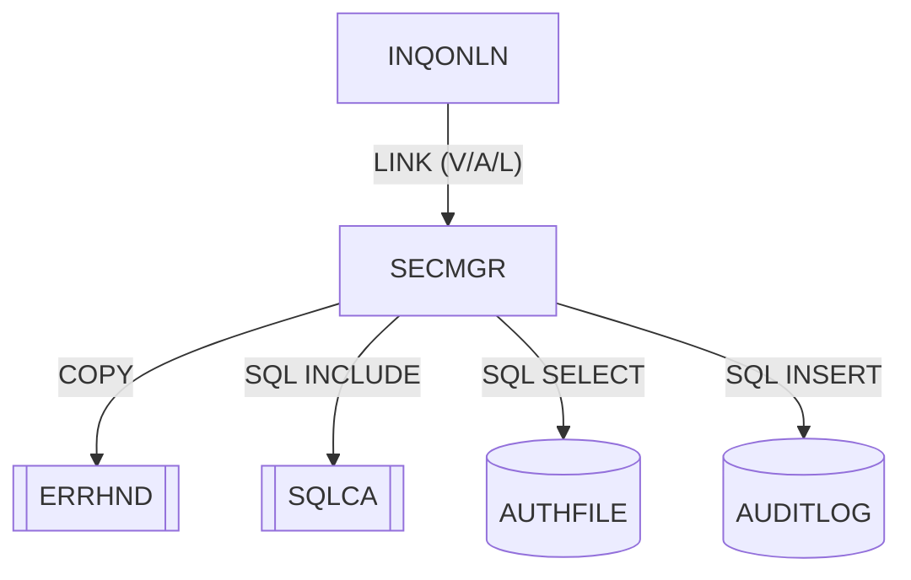

# SECMGR — Gestor de seguridad online

Fuente: `src/programs/online/SECMGR.cbl`

## Propósito

Servicio de seguridad para los programas online. Ofrece tres operaciones: validación del usuario CICS frente al usuario indicado en la petición, comprobación de autorización sobre un recurso/tipo de acceso consultando la tabla DB2 `AUTHFILE`, y registro de auditoría de acceso en la tabla DB2 `AUDITLOG`.

## Tipo

Subrutina online CICS (invocada por `EXEC CICS LINK`, recibe el área de petición por `PROCEDURE DIVISION USING`).

## Entradas y salidas

| Elemento | Tipo | Uso |
|---|---|---|
| `SECURITY-REQUEST-AREA` | LINKAGE SECTION (parámetro) | `SEC-REQUEST-TYPE` (`V` validar / `A` autorizar / `L` auditar), `SEC-USER-ID` (8), `SEC-RESOURCE-NAME` (8), `SEC-ACCESS-TYPE` (8), `SEC-RESPONSE-CODE`, `SEC-ERROR-INFO` (80). |
| `SQLCA` | `EXEC SQL INCLUDE` | Área de comunicación SQL (también usada, incorrectamente, como variable host del `COUNT(*)`). |
| Copybook `ERRHND` | COPY | `WS-ERROR-AREA` (declarada, no utilizada). |
| Tabla DB2 `AUTHFILE` | `EXEC SQL SELECT COUNT(*)` | Autorizaciones por `USER_ID`, `RESOURCE`, `ACCESS_TYPE`. |
| Tabla DB2 `AUDITLOG` | `EXEC SQL INSERT` | Pista de auditoría (`TIMESTAMP`, `USER_ID`, `TERMINAL_ID`, `TRANS_ID`, `PROGRAM`, `ACCESS_TYPE`). |
| `EXEC CICS ASSIGN USERID/TERMID/TRANSID` | CICS | Contexto de la tarea para validación y auditoría. |

## Flujo principal

1. **Mainline**: `EVALUATE TRUE` sobre `SEC-REQUEST-TYPE`: `SEC-VALIDATE` → `P100-VALIDATE-USER`; `SEC-AUTHORIZE` → `P200-CHECK-AUTH`; `SEC-AUDIT` → `P300-LOG-ACCESS`. Después `EXEC CICS RETURN`.
2. **P100-VALIDATE-USER**: `EXEC CICS ASSIGN USERID(WS-USER-ID) RESP(SEC-RESPONSE-CODE)`. Si la respuesta es `NORMAL`: si `SEC-USER-ID = WS-USER-ID` → `SEC-RESPONSE-CODE = 0`; si no → `'User validation failed'`, código `8`. Si `ASSIGN` falla → `'Unable to obtain user credentials'`, código `12`.
3. **P200-CHECK-AUTH**: `SELECT COUNT(*) INTO :WS-DB2-AREA FROM AUTHFILE WHERE USER_ID = :SEC-USER-ID AND RESOURCE = :SEC-RESOURCE-NAME AND ACCESS_TYPE = :SEC-ACCESS-TYPE`. `EVALUATE SQLCODE`: `0` y contador `> 0` → `0`; `0` y contador `= 0` → `'Access denied'`, `8`; otro → `'Authorization check failed'`, `12`.
4. **P300-LOG-ACCESS**: `WS-TIMESTAMP = FUNCTION CURRENT-DATE`; `ASSIGN USERID/TERMID/TRANSID`; copia recurso y tipo de acceso; `INSERT INTO AUDITLOG (...)`. `SQLCODE = 0` → `0`; si no → `'Audit logging failed'`, `12`.

## Reglas de negocio y validaciones

- La validación de usuario exige que el usuario de la petición coincida con el usuario CICS real de la tarea (obtenido con `ASSIGN USERID`).
- La autorización es positiva únicamente si existe al menos una fila en `AUTHFILE` para la tripleta usuario/recurso/tipo de acceso. INQONLN solicita recurso `INQONLN` y acceso `READ`.
- Toda operación auditada queda registrada con usuario, terminal, transacción, programa y tipo de acceso.
- El `COUNT(*)` se recupera en `WS-DB2-AREA` (grupo que contiene el SQLCA) y se compara numéricamente; observación de código, no compilable tal cual.

## Manejo de errores y códigos de retorno

| `SEC-RESPONSE-CODE` | Significado | `SEC-ERROR-INFO` |
|---|---|---|
| `0` | Operación correcta. | — |
| `8` | Rechazo funcional: usuario no coincide o acceso denegado. | `User validation failed` / `Access denied` |
| `12` | Fallo técnico: `ASSIGN` fallido, error SQL en autorización o auditoría. | `Unable to obtain user credentials` / `Authorization check failed` / `Audit logging failed` |

No invoca a ERRHNDL; INQONLN es quien traduce cualquier código ≠ 0 en una llamada a ERRHNDL y termina la transacción.

## Dependencias

**Llama a (deps.json, `from = SECMGR`):**

| Destino | Tipo |
|---|---|
| ERRHND | COPY |
| SQLCA | SQL-INCLUDE |
| AUTHFILE | SQL (SELECT) |
| AUDITLOG | SQL (INSERT) |

Nota: `AUDITLOG` es aquí una tabla DB2; existe también un copybook `src/copybook/common/AUDITLOG.cpy` con el mismo nombre que SECMGR **no** utiliza.

**Es llamado por:** INQONLN (LINK, tres veces: V/A/L).

## Diagrama

