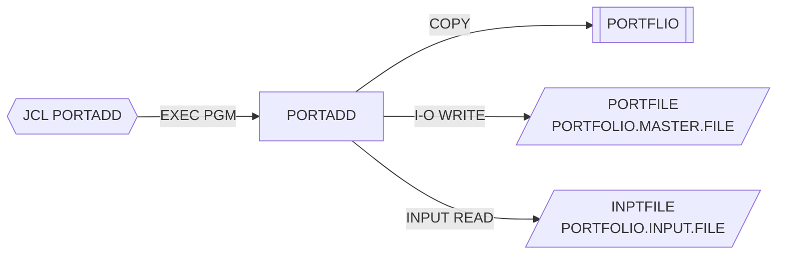

# PORTADD — Alta de carteras

## Propósito
Crea registros nuevos en el fichero maestro de carteras (VSAM KSDS) a partir de un fichero secuencial de entrada cuyo layout es el mismo que el del maestro (`PORTFLIO`). Valida mínimamente cada registro, estampa las fechas de creación/mantenimiento y contabiliza altas, duplicados y errores.

## Tipo
Batch (ejecutado por el JCL `src/jcl/portfolio/PORTADD.jcl`, `EXEC PGM=PORTADD`). Sin CICS ni DB2.

## Entradas y salidas

| Recurso | DDNAME | Organización / acceso | Uso | Layout |
|---|---|---|---|---|
| `PORTFOLIO-FILE` (PORTFOLIO.MASTER.FILE) | `PORTFILE` | VSAM INDEXED, RANDOM, clave `PORT-KEY` | `OPEN I-O`, `WRITE` | `COPY PORTFLIO` |
| `INPUT-FILE` (PORTFOLIO.INPUT.FILE) | `INPTFILE` | QSAM SEQUENTIAL | `OPEN INPUT`, `READ` | `COPY PORTFLIO` |

- Copybooks: `PORTFLIO` (registro `PORT-RECORD`, 2 veces: FD del maestro y FD de entrada).
- Tablas DB2: ninguna.
- LINKAGE SECTION: ninguna (no recibe parámetros).
- Salida adicional: mensajes por `DISPLAY` (SYSOUT) y `RETURN-CODE`.

## Flujo principal
1. `0000-MAIN`: `PERFORM 1000-INITIALIZE`, bucle `2000-PROCESS UNTIL END-OF-FILE`, `3000-TERMINATE`, `GOBACK`.
2. `1000-INITIALIZE`: inicializa contadores, obtiene la fecha actual (`ACCEPT ... FROM DATE YYYYMMDD`), abre `PORTFOLIO-FILE` en I-O y `INPUT-FILE` en INPUT. Si alguno de los dos `FILE STATUS` no es `'00'`, muestra el error, fija `WS-RETURN-CODE = 8` y ejecuta `3000-TERMINATE` (nota: no aborta; vuelve al bucle de `0000-MAIN`, véase Manejo de errores).
3. `2000-PROCESS`: `READ INPUT-FILE INTO PORT-RECORD`; en `AT END` marca fin de fichero, si no ejecuta `2100-VALIDATE-AND-ADD`.
4. `2100-VALIDATE-AND-ADD`:
   - Valida el registro (ver Reglas de negocio); si falla, incrementa `WS-ERROR-COUNT`, muestra `Invalid record data:` y sale del párrafo.
   - Asigna `WS-CURRENT-DATE` a `PORT-CREATE-DATE` y `PORT-LAST-MAINT`.
   - `WRITE PORT-RECORD` y evalúa `WS-FILE-STATUS`: `'00'` → `WS-ADD-COUNT`; `'22'` (clave duplicada) → `WS-DUP-COUNT` y mensaje; otro → `WS-ERROR-COUNT` y mensaje.
5. `3000-TERMINATE`: cierra ambos ficheros, muestra los totales (añadidos, duplicados, errores) y mueve `WS-RETURN-CODE` a `RETURN-CODE`.

## Reglas de negocio y validaciones
- Un registro se rechaza si `PORT-ID` está en blanco, `PORT-CLIENT-NAME` está en blanco o `PORT-STATUS` ≠ `'A'` (solo se dan de alta carteras activas).
- Las fechas `PORT-CREATE-DATE` y `PORT-LAST-MAINT` se sobrescriben siempre con la fecha del proceso, independientemente de lo que traiga el fichero de entrada.
- Un registro duplicado (clave `PORT-ID`+`PORT-ACCOUNT-NO` ya existente) no se considera error: se contabiliza aparte y no afecta al código de retorno.

## Manejo de errores y códigos de retorno
- `WS-SUCCESS = 0`, `WS-ERROR = 8`.
- Solo el fallo de apertura de ficheros fija `RETURN-CODE = 8`. Los errores de validación o de `WRITE` se cuentan y se muestran, pero el job termina con `RC=0`.
- Defecto latente: tras un error de `OPEN`, `1000-INITIALIZE` ejecuta `3000-TERMINATE` pero no termina el programa; el control vuelve a `0000-MAIN`, que entra en el bucle `2000-PROCESS` con ficheros cerrados (el `READ` fallará y, al no comprobarse el status de lectura, el bucle depende de que se dispare `AT END`). Además `3000-TERMINATE` se ejecutará de nuevo (segundo `CLOSE`).

## Dependencias
- **Llama a**: ningún programa (`CALL`/`LINK` inexistentes).
- **Es llamado por / ejecutado desde**: JCL `PORTADD` (`STEP1 EXEC PGM=PORTADD`).
- **Copybooks**: `PORTFLIO`.
- **Ficheros**: `PORTFILE`, `INPTFILE`.
- Aristas en `deps.json`: `PORTADD →COPY→ PORTFLIO`, `PORTADD →FILE→ PORTFILE`, `PORTADD →FILE→ INPTFILE`, `PORTADD(JCL) →EXECPGM→ PORTADD`.

## Diagrama

