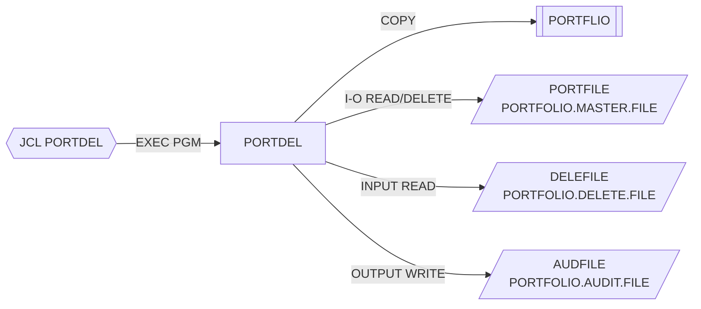

# PORTDEL — Baja de carteras

## Propósito
Procesa un fichero secuencial de solicitudes de baja y elimina del maestro de carteras (VSAM KSDS) los registros indicados, dejando constancia de cada borrado en un fichero secuencial de auditoría.

## Tipo
Batch (ejecutado por el JCL `src/jcl/portfolio/PORTDEL.jcl`, `EXEC PGM=PORTDEL`). Sin CICS ni DB2.

## Entradas y salidas

| Recurso | DDNAME | Organización / acceso | Uso | Layout |
|---|---|---|---|---|
| `PORTFOLIO-FILE` (PORTFOLIO.MASTER.FILE) | `PORTFILE` | VSAM INDEXED, RANDOM, clave `PORT-KEY` | `OPEN I-O`, `READ`, `DELETE` | `COPY PORTFLIO` |
| `DELETE-FILE` (PORTFOLIO.DELETE.FILE) | `DELEFILE` | QSAM SEQUENTIAL | `OPEN INPUT`, `READ` | `DELETE-RECORD` (en línea, 80 bytes) |
| `AUDIT-FILE` (PORTFOLIO.AUDIT.FILE, `DISP=MOD`) | `AUDFILE` | QSAM SEQUENTIAL | `OPEN OUTPUT`, `WRITE` | `AUDIT-RECORD` (en línea, 80 bytes) |

Layout de `DELETE-RECORD`: `DEL-KEY` (`DEL-ID` X(8) + `DEL-ACCT-NO` X(10)), `DEL-REASON-CODE` X(2) (`01` cerrada, `02` transferida, `03` a petición), relleno X(60).

Layout de `AUDIT-RECORD`: `AUD-TIMESTAMP` X(26), `AUD-ACTION` X(6), `AUD-KEY` X(18), `AUD-REASON` X(2), `AUD-STATUS` X(1), relleno X(27).

- Copybooks: `PORTFLIO`.
- Tablas DB2: ninguna. LINKAGE SECTION: ninguna.

## Flujo principal
1. `0000-MAIN`: `1000-INITIALIZE` → bucle `2000-PROCESS UNTIL END-OF-FILE` → `3000-TERMINATE` → `GOBACK`.
2. `1000-INITIALIZE`: inicializa contadores; abre `PORTFOLIO-FILE` (I-O), `DELETE-FILE` (INPUT) y `AUDIT-FILE` (OUTPUT). Si algún status ≠ `'00'`, muestra los tres status, fija `WS-RETURN-CODE = 8` y ejecuta `3000-TERMINATE` (sin abortar; véase Manejo de errores).
3. `2000-PROCESS`: `READ DELETE-FILE`; `AT END` marca fin, si no `2100-PROCESS-DELETE`.
4. `2100-PROCESS-DELETE`: mueve `DEL-KEY` a `PORT-KEY`, `READ PORTFOLIO-FILE` (aleatorio). Status `'00'` → `2200-DELETE-RECORD`; `'23'` → `WS-NOT-FND-COUNT` y mensaje `Record not found`; otro → `WS-ERROR-COUNT` y mensaje `Read error`.
5. `2200-DELETE-RECORD`: `DELETE PORTFOLIO-FILE`. Si `'00'` → `WS-DELETE-COUNT` y `2300-WRITE-AUDIT`; si no → `WS-ERROR-COUNT` y mensaje `Delete failed`.
6. `2300-WRITE-AUDIT`: `ACCEPT WS-TIMESTAMP FROM TIME STAMP`; rellena `AUD-TIMESTAMP`, `AUD-ACTION='DELETE'`, `AUD-KEY`, `AUD-REASON` (código de la solicitud), `AUD-STATUS` (estado que tenía la cartera) y `WRITE AUDIT-RECORD`. Si el status de auditoría ≠ `'00'` muestra aviso (no cuenta como error).
7. `3000-TERMINATE`: cierra los tres ficheros, muestra totales (borrados, no encontrados, errores) y mueve `WS-RETURN-CODE` a `RETURN-CODE`.

## Reglas de negocio y validaciones
- La baja es física (`DELETE` VSAM), no lógica; no se comprueba el estado previo de la cartera ni el código de motivo (`DEL-REASON-CODE` se copia tal cual a la auditoría).
- Se lee primero el registro para poder auditar su `PORT-STATUS` antes de borrarlo.
- Solo se audita una baja efectiva; los "no encontrados" y los errores no generan registro de auditoría.

## Manejo de errores y códigos de retorno
- `WS-SUCCESS = 0`, `WS-ERROR = 8`. Solo el fallo de `OPEN` establece `RC=8`; errores de lectura/borrado/auditoría por registro solo se contabilizan y muestran (job con `RC=0`).
- `ACCEPT ... FROM TIME STAMP` no es sintaxis estándar de Enterprise COBOL (sería `FUNCTION CURRENT-DATE`); es un punto a revisar en compilación.
- Mismo defecto latente que `PORTADD`: tras error de apertura se ejecuta `3000-TERMINATE` pero el programa sigue en `0000-MAIN` y entra en el bucle de lectura con ficheros cerrados.

## Dependencias
- **Llama a**: ningún programa.
- **Es ejecutado desde**: JCL `PORTDEL` (`STEP1 EXEC PGM=PORTDEL`).
- **Copybooks**: `PORTFLIO`.
- **Ficheros**: `PORTFILE`, `DELEFILE`, `AUDFILE`.
- Aristas en `deps.json`: `PORTDEL →COPY→ PORTFLIO`, `PORTDEL →FILE→ PORTFILE`, `PORTDEL →FILE→ DELEFILE`, `PORTDEL →FILE→ AUDFILE`, `PORTDEL(JCL) →EXECPGM→ PORTDEL`.

## Diagrama

