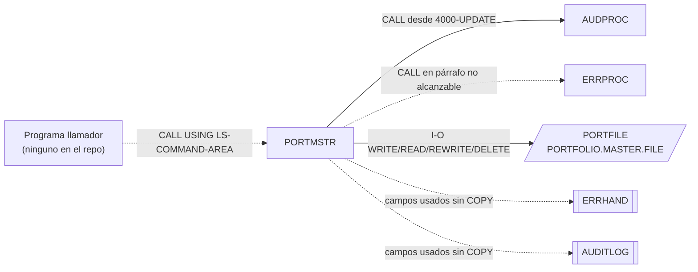

# PORTMSTR — Mantenimiento del maestro de carteras (CRUD)

## Propósito
Subrutina de mantenimiento del fichero maestro de carteras: recibe un código de comando (crear, leer, actualizar, borrar) y un registro de cartera de 100 bytes, ejecuta la operación VSAM correspondiente y devuelve un código de retorno. Incluye párrafos de ejemplo de integración con los servicios comunes `ERRPROC` (errores) y `AUDPROC` (auditoría).

## Tipo
Subrutina (`PROCEDURE DIVISION USING LS-COMMAND-AREA`), pensada para ser invocada por `CALL` desde otros programas. No usa CICS ni DB2. No tiene JCL propio.

## Entradas y salidas

| Recurso | DDNAME | Organización / acceso | Uso | Layout |
|---|---|---|---|---|
| `PORTFOLIO-FILE` | `PORTFILE` | VSAM INDEXED, DYNAMIC, clave `PORT-ID` | `OPEN I-O`, `WRITE`, `READ`, `REWRITE`, `DELETE` | `PORTFOLIO-RECORD` propio (100 bytes, en línea) |

Layout propio de `PORTFOLIO-RECORD`: `PORT-ID` X(10), `PORT-NAME` X(50), `PORT-CREATE-DATE` X(10), `PORT-STATUS` X(1), `PORT-TOTAL-VALUE` S9(13)V99 COMP-3, FILLER X(24). **No** coincide con el copybook `PORTFLIO` (clave de 18 bytes, registro de ~150 bytes) que usan el resto de programas del grupo sobre el mismo DDNAME.

- Copybooks: ninguno declarado (véase Discrepancias en el README: el código usa campos de `ERRHAND`/`AUDITLOG` sin `COPY`).
- Tablas DB2: ninguna.
- **LINKAGE SECTION** — `LS-COMMAND-AREA`:

| Campo | PIC | Sentido | Descripción |
|---|---|---|---|
| `LS-COMMAND` | X(1) | entrada | `C` crear, `R` leer, `U` actualizar, `D` borrar |
| `LS-PORTFOLIO` | X(100) | entrada/salida | Registro de cartera (entrada en C/U/D, salida en R) |
| `LS-RETURN-CODE` | S9(4) COMP | salida | 0 éxito, 8 error |

## Flujo principal
1. `0000-MAIN`: `1000-INITIALIZE`; `EVALUATE LS-COMMAND` → `2000-CREATE-PORTFOLIO` / `3000-READ-PORTFOLIO` / `4000-UPDATE-PORTFOLIO` / `5000-DELETE-PORTFOLIO`; `WHEN OTHER` → texto `Invalid command` y `9000-ERROR`. Después `6000-TERMINATE` y `GOBACK`.
2. `1000-INITIALIZE`: inicializa áreas, `OPEN I-O PORTFOLIO-FILE` (error → `9000-ERROR`), obtiene fecha actual.
3. `2000-CREATE-PORTFOLIO`: copia `LS-PORTFOLIO` al registro, `2100-VALIDATE-PORTFOLIO`; si falla → `9000-ERROR`. `WRITE`; status `'22'` → `Portfolio ID already exists`; otro ≠ `'00'` → `Error writing Portfolio record`.
4. `2100-VALIDATE-PORTFOLIO`: `PORT-ID(1:4)='PORT'` y `PORT-ID(5:5)` numérico; `PORT-NAME` no vacío; `PORT-STATUS` ∈ {`A`,`I`,`C`}. Cualquier fallo fija `WS-RETURN-CODE=8` con su texto.
5. `3000-READ-PORTFOLIO`: `READ` por clave; `'00'` → devuelve el registro en `LS-PORTFOLIO`; `'23'` → `Portfolio not found`; otro → `Error reading Portfolio`.
6. `4000-UPDATE-PORTFOLIO`: valida (`2100-VALIDATE-PORTFOLIO`), `REWRITE`; `'23'` → `Portfolio not found for update`; otro ≠ `'00'` → `Error updating Portfolio`. Finalmente `2100-LOG-PORTFOLIO-UPDATE` (auditoría vía `AUDPROC`).
7. `5000-DELETE-PORTFOLIO`: `DELETE` por clave; `'23'` → `Portfolio not found for deletion`; otro ≠ `'00'` → `Error deleting Portfolio`.
8. `6000-TERMINATE`: `CLOSE PORTFOLIO-FILE`, mueve `WS-RETURN-CODE` a `LS-RETURN-CODE`.
9. `9000-ERROR`: fija `WS-RETURN-CODE=8`, ejecuta `6000-TERMINATE` y `GOBACK` (termina la subrutina).
10. `2100-HANDLE-VSAM-ERROR` (**no se ejecuta desde ningún PERFORM**): construye una petición de error (`LS-ERROR-REQUEST`) clasificando el status VSAM (22 → warning, 23 → warning, otro → error) y `CALL 'ERRPROC'`.
11. `2100-LOG-PORTFOLIO-UPDATE`: rellena `LS-AUDIT-REQUEST` (sistema `PORTFOLIO`, usuario, terminal, tipo `TRAN`, acción `UPDATE`, estado `SUCC`, imágenes antes/después) y `CALL 'AUDPROC'`.

## Reglas de negocio y validaciones
- Formato de ID: `PORT` + 5 dígitos (difiere de `PORTVALD`, que exige 4 dígitos).
- Nombre obligatorio; estados válidos `A` (activa), `I` (inactiva), `C` (cerrada) — distinto del conjunto `A/C/S` del copybook `PORTFLIO`.
- El `REWRITE` en modo DYNAMIC sin `READ` previo no es válido en VSAM (se requiere lectura previa del registro); el programa asume que la clave del registro recibido basta.
- Solo la actualización se audita; alta y baja no generan registro de auditoría.

## Manejo de errores y códigos de retorno
- `LS-RETURN-CODE`: 0 éxito, 8 error (`WS-ERROR`). Todo error pasa por `9000-ERROR`, que cierra el fichero y hace `GOBACK`.
- `WS-ERROR-TEXT` contiene el mensaje pero **no se devuelve** al llamador ni se muestra: la rama de `ERRPROC` es código muerto.
- Problemas de compilación evidentes (código legado incompleto): `2100-HANDLE-VSAM-ERROR` y `2100-LOG-PORTFOLIO-UPDATE` referencian `LS-ERROR-REQUEST`, `LS-AUDIT-REQUEST`, `ERR-CAT-VSAM`, `ERR-VSAM-*`, `WS-FILE-STATUS`, `PORT-KEY`, `PORT-ACCOUNT-NO`, `PORT-RECORD`, `WS-BEFORE-IMAGE`, `USERID`, `TERMINAL-ID`, ninguno definido en el programa. Además hay dos párrafos con nombre `2100-…` distinto pero el mismo prefijo, y `LS-RETURN-CODE`/`LS-ERROR-TEXT` se solapan con nombres de las estructuras de `ERRPROC`.

## Dependencias
- **Llama a**: `ERRPROC` (grupo common; llamada en párrafo no alcanzable) y `AUDPROC` (grupo common; desde `4000-UPDATE-PORTFOLIO`).
- **Es llamado por**: ningún programa del repositorio hace `CALL 'PORTMSTR'` (solo aparece como ejemplo comentado en `src/copybook/common/RETHND.cpy`). Sin JCL asociado.
- **Ficheros**: `PORTFILE`.
- Aristas en `deps.json`: `PORTMSTR →CALL→ ERRPROC`, `PORTMSTR →CALL→ AUDPROC`, `PORTMSTR →FILE→ PORTFILE`.

## Diagrama

