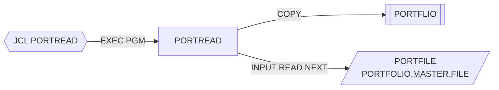

# PORTREAD — Lectura secuencial del maestro de carteras

## Propósito
Recorre secuencialmente el fichero maestro de carteras y muestra por `DISPLAY` los campos principales de cada registro, junto con el total leído. Es un programa de demostración/verificación del acceso al VSAM.

## Tipo
Batch (ejecutado por el JCL `src/jcl/portfolio/PORTREAD.jcl`, `EXEC PGM=PORTREAD`). Solo lectura.

## Entradas y salidas

| Recurso | DDNAME | Organización / acceso | Uso | Layout |
|---|---|---|---|---|
| `PORTFOLIO-FILE` (PORTFOLIO.MASTER.FILE) | `PORTFILE` | VSAM INDEXED, DYNAMIC, clave `PORT-KEY` | `OPEN INPUT`, `READ ... NEXT RECORD` | `COPY PORTFLIO` |

- Copybooks: `PORTFLIO`.
- Tablas DB2: ninguna. LINKAGE SECTION: ninguna.
- Salida: listado por SYSOUT (`DISPLAY`) y `RETURN-CODE`.

## Flujo principal
1. `0000-MAIN`: `1000-INITIALIZE` → bucle `2000-PROCESS UNTIL END-OF-FILE` → `3000-TERMINATE` → `GOBACK`.
2. `1000-INITIALIZE`: inicializa el contador, `OPEN INPUT PORTFOLIO-FILE`; si status ≠ `'00'` muestra el error, fija `WS-RETURN-CODE = 8` y ejecuta `3000-TERMINATE`.
3. `2000-PROCESS`: `READ PORTFOLIO-FILE NEXT RECORD`; `AT END` marca fin; si no, incrementa `WS-RECORD-COUNT` y ejecuta `2100-DISPLAY-RECORD`.
4. `2100-DISPLAY-RECORD`: muestra número de registro, `PORT-ID`, `PORT-ACCOUNT-NO`, `PORT-CLIENT-NAME`, `PORT-STATUS` y `PORT-TOTAL-VALUE`.
5. `3000-TERMINATE`: cierra el fichero, muestra `Total Records Read` y mueve `WS-RETURN-CODE` a `RETURN-CODE`.

## Reglas de negocio y validaciones
- Ninguna regla de negocio: no filtra ni valida registros; lista todos los del maestro en orden de clave.
- Al no hacer `START`, la lectura comienza en el primer registro de la secuencia de clave.

## Manejo de errores y códigos de retorno
- `RC=8` únicamente si falla el `OPEN`; en caso contrario `RC=0`.
- El status de cada `READ NEXT` no se comprueba salvo por `AT END`; un error de lectura distinto de fin de fichero no se detecta explícitamente.
- Mismo defecto latente que el resto de programas batch del grupo: tras un fallo de `OPEN` el control sigue hacia el bucle de lectura.

## Dependencias
- **Llama a**: ningún programa.
- **Es ejecutado desde**: JCL `PORTREAD` (`STEP1 EXEC PGM=PORTREAD`).
- **Copybooks**: `PORTFLIO`.
- **Ficheros**: `PORTFILE`.
- Aristas en `deps.json`: `PORTREAD →COPY→ PORTFLIO`, `PORTREAD →FILE→ PORTFILE`, `PORTREAD(JCL) →EXECPGM→ PORTREAD`.

## Diagrama

