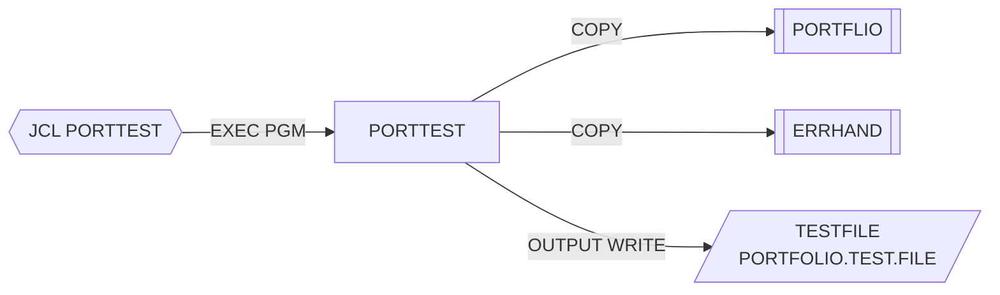

# PORTTEST — Generador de datos de prueba de carteras

## Propósito
Genera un fichero secuencial con 100 registros de cartera sintéticos (layout `PORTFLIO`) con valores pseudoaleatorios, destinado a alimentar pruebas del resto de programas del grupo (por ejemplo, como entrada de `PORTADD`).

## Tipo
Batch (ejecutado por el JCL `src/jcl/portfolio/PORTTEST.jcl`, `EXEC PGM=PORTTEST`). Sin CICS ni DB2.

## Entradas y salidas

| Recurso | DDNAME | Organización / acceso | Uso | Layout |
|---|---|---|---|---|
| `TEST-FILE` (PORTFOLIO.TEST.FILE, `DISP=(NEW,CATLG,DELETE)`, FB LRECL=200) | `TESTFILE` | QSAM SEQUENTIAL | `OPEN OUTPUT`, `WRITE` | `COPY PORTFLIO` |

- Copybooks: `PORTFLIO` (FD) y `ERRHAND` (WORKING-STORAGE; incluido pero no se usa ninguno de sus campos).
- Tablas DB2: ninguna. LINKAGE SECTION: ninguna.
- Salida adicional: `DISPLAY 'Records generated: '`.

## Flujo principal
1. `0000-MAIN`: `1000-INITIALIZE` → bucle `2000-GENERATE-RECORDS UNTIL WS-RECORD-COUNT >= WS-MAX-RECORDS` (100) → `3000-TERMINATE` → `GOBACK`.
2. `1000-INITIALIZE`: fecha actual (`ACCEPT ... FROM DATE YYYYMMDD`), `OPEN OUTPUT TEST-FILE`; si status ≠ `'00'` muestra error, ejecuta `3000-TERMINATE` y hace `GOBACK` (aquí sí termina correctamente).
3. `2000-GENERATE-RECORDS`: `INITIALIZE PORT-RECORD`, luego `2100`→`2400`, `WRITE PORT-RECORD`; si `'00'` incrementa `WS-RECORD-COUNT`, si no muestra `Error writing record` (sin incrementar: un fallo persistente de escritura produce un bucle infinito).
4. `2100-GENERATE-KEY`: `PORT-ID = 'PORT' || WS-RECORD-COUNT`; `WS-TYPE-SUB = FUNCTION RANDOM(WS-RECORD-COUNT)`; `PORT-ACCOUNT-NO = WS-RECORD-COUNT + 1000000000`.
5. `2200-GENERATE-CLIENT-INFO`: `PORT-CLIENT-NAME = 'TEST' || WS-RECORD-COUNT`; `PORT-CLIENT-TYPE` = carácter `WS-TYPE-SUB` de `'ICT'`.
6. `2300-GENERATE-PORTFOLIO-INFO`: fechas de creación y mantenimiento = fecha actual; `PORT-STATUS` = carácter aleatorio (1..3) de `'ACS'`.
7. `2400-GENERATE-FINANCIAL-INFO`: `PORT-TOTAL-VALUE = RANDOM * 1.000.000`; `PORT-CASH-BALANCE = 10 %` del valor total.
8. `3000-TERMINATE`: cierra el fichero y muestra el total generado.

## Reglas de negocio y validaciones
- Datos completamente sintéticos: claves `PORTnnnnn`, cuentas `1000000000+n`, tipos de cliente I/C/T y estados A/C/S.
- Observaciones de calidad: `FUNCTION RANDOM` devuelve un valor en [0,1), por lo que `WS-TYPE-SUB` (PIC 9) será casi siempre 0 y la referencia `WS-CLIENT-TYPES(0:1)` queda fuera de rango; `PORT-ACCOUNT-NO` es `PIC X(10)` pero se usa como receptor de `COMPUTE` (error de compilación en Enterprise COBOL). Es coherente con el propósito del repositorio (código legado imperfecto para benchmark).

## Manejo de errores y códigos de retorno
- No fija `RETURN-CODE` explícitamente (siempre 0 salvo abend).
- Único control: status del `OPEN` (termina) y del `WRITE` (solo mensaje).

## Dependencias
- **Llama a**: ningún programa.
- **Es ejecutado desde**: JCL `PORTTEST` (`STEP1 EXEC PGM=PORTTEST`).
- **Copybooks**: `PORTFLIO`, `ERRHAND`.
- **Ficheros**: `TESTFILE`.
- Aristas en `deps.json`: `PORTTEST →COPY→ PORTFLIO`, `PORTTEST →COPY→ ERRHAND`, `PORTTEST →FILE→ TESTFILE`, `PORTTEST(JCL) →EXECPGM→ PORTTEST`.

## Diagrama

