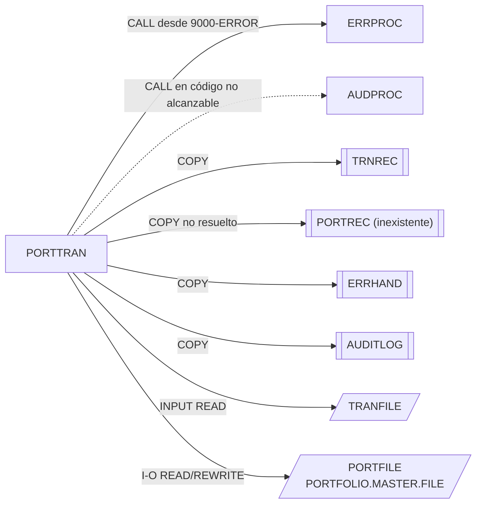

# PORTTRAN — Proceso de transacciones de cartera

## Propósito
Lee un fichero secuencial de transacciones (compras, ventas, traspasos y comisiones), valida cada una contra el maestro de carteras y —en el diseño previsto— actualiza las posiciones de la cartera y registra la operación en el log de auditoría a través de `AUDPROC`. Los errores se canalizan al gestor común `ERRPROC`.

## Tipo
Batch. No tiene JCL en `src/jcl/`; sin CICS ni DB2.

## Entradas y salidas

| Recurso | DDNAME | Organización / acceso | Uso | Layout |
|---|---|---|---|---|
| `TRANSACTION-FILE` | `TRANFILE` | QSAM SEQUENTIAL, RECFM F | `OPEN INPUT`, `READ` | `COPY TRNREC` (`TRANSACTION-RECORD`) |
| `PORTFOLIO-FILE` | `PORTFILE` | VSAM INDEXED, RANDOM, clave `PORT-ID` | `OPEN I-O`, `READ`, `REWRITE` | `COPY PORTREC` (**copybook inexistente**) |

- Copybooks: `TRNREC` (FD transacciones), `PORTREC` (FD carteras, no resuelto en el repositorio), `ERRHAND` (estructura `ERR-MESSAGE`, categorías y códigos), `AUDITLOG` (estructura `AUDIT-RECORD`).
- Tablas DB2: ninguna. LINKAGE SECTION: ninguna.
- Salida: contadores por `DISPLAY`; registros de error a `ERRPROC`; registros de auditoría a `AUDPROC`.

Campos de `TRNREC` usados: `TRN-PORTFOLIO-ID`, `TRN-TYPE` (`BU` compra, `SL` venta, `TR` traspaso, `FE` comisión), `TRN-QUANTITY`, `TRN-PRICE`, `TRN-AMOUNT`.

## Flujo principal
1. `0000-MAIN`: `1000-INITIALIZE`; si el fichero de transacciones abrió bien, bucle `2000-PROCESS-TRANSACTIONS UNTIL END-OF-FILE OR WS-ERROR-COUNT > 100`; `3000-TERMINATE`; `GOBACK`.
2. `1000-INITIALIZE`: inicializa status y contadores; `OPEN INPUT TRANSACTION-FILE` y `OPEN I-O PORTFOLIO-FILE`; cada fallo de apertura genera un error vía `9000-ERROR-ROUTINE` (el programa continúa).
3. `2000-PROCESS-TRANSACTIONS`: `READ TRANSACTION-FILE`; `AT END` marca fin; si no, incrementa `WS-READ-COUNT` y ejecuta `2100-VALIDATE-TRANSACTION`.
4. `2100-VALIDATE-TRANSACTION`: encadena `2110-CHECK-PORTFOLIO`, `2120-CHECK-TRANSACTION-TYPE` y `2130-CHECK-AMOUNTS` mientras `ERR-TEXT` siga vacío. Si todo es correcto incrementa `WS-PROCESS-COUNT`; si no, `9000-ERROR-ROUTINE`. **Nunca invoca `2200-UPDATE-POSITIONS`**: la actualización de posiciones y la auditoría no forman parte del flujo ejecutable actual.
5. `2110-CHECK-PORTFOLIO`: ID de cartera obligatorio; `READ PORTFOLIO-FILE` por `PORT-ID`; `INVALID KEY` → `Invalid Portfolio ID`.
6. `2120-CHECK-TRANSACTION-TYPE`: `TRN-TYPE` ∈ {`BU`,`SL`,`TR`,`FE`}.
7. `2130-CHECK-AMOUNTS`: `TRN-QUANTITY > 0`; para tipos ≠ `TR`, `TRN-PRICE > 0` y `TRN-AMOUNT > 0`.
8. `2200-UPDATE-POSITIONS` (**código no alcanzable**): despacha según tipo a `2210-PROCESS-BUY` (suma unidades e importe: `PORT-TOTAL-UNITS`, `PORT-TOTAL-COST`), `2220-PROCESS-SELL` (comprueba unidades suficientes y resta), `2230-PROCESS-TRANSFER` (devuelve `Transfer processing not implemented`), `2240-PROCESS-FEE` (resta el importe del coste); cada uno hace `READ` + `REWRITE` con `INVALID KEY` → `9000-ERROR-ROUTINE`. Después `2300-UPDATE-AUDIT-TRAIL`.
9. `2300-UPDATE-AUDIT-TRAIL` / `2310-WRITE-AUDIT-RECORD` (**no alcanzables**): rellenan `AUDIT-RECORD` (timestamp, programa, usuario, tipo `TRAN`, acción según tipo —BU→CREATE, SL→DELETE, TR/FE→UPDATE—, estado SUCC/FAIL, imagen anterior, mensaje) y `CALL 'AUDPROC' USING AUDIT-RECORD`; si `RETURN-CODE ≠ 0` → `9000-ERROR-ROUTINE`.
10. `3000-TERMINATE`: cierra ambos ficheros y muestra `Transactions Read`, `Transactions Process`, `Errors Encountered`.
11. `9000-ERROR-ROUTINE`: incrementa `WS-ERROR-COUNT`, fija `ERR-CATEGORY = ERR-CAT-PROC` (`PR`), `ERR-PROGRAM = 'PORTTRAN'` y `CALL 'ERRPROC' USING ERR-MESSAGE`.

## Reglas de negocio y validaciones
- Una transacción debe referenciar una cartera existente en el maestro.
- Tipos admitidos: compra (`BU`), venta (`SL`), traspaso (`TR`), comisión (`FE`).
- Cantidad siempre > 0; precio e importe > 0 salvo en traspasos.
- Venta: no se permiten ventas por más unidades de las que tiene la cartera (`Insufficient units for sale`).
- Traspasos: explícitamente no implementados.
- Umbral de tolerancia: el proceso se detiene al superar 100 errores.

## Manejo de errores y códigos de retorno
- Todos los errores pasan por `9000-ERROR-ROUTINE` → `ERRPROC` con categoría `PR` (proceso); el programa no fija `RETURN-CODE` propio (queda el que deje la última llamada).
- Un fallo de apertura del fichero de carteras no impide entrar en el bucle (solo se comprueba `WS-TRAN-STATUS`).
- Los campos `PORT-TOTAL-UNITS`, `PORT-TOTAL-COST`, `PORT-ACCOUNT-NO`, `PORT-RECORD` y `PORTFOLIO-RECORD` dependen del copybook `PORTREC`, ausente del repositorio; el programa no compila tal cual.

## Dependencias
- **Llama a**: `ERRPROC` (grupo common, desde `9000-ERROR-ROUTINE`, alcanzable) y `AUDPROC` (grupo common, desde `2310-WRITE-AUDIT-RECORD`, no alcanzable).
- **Es llamado por / ejecutado desde**: nadie; no existe JCL `EXEC PGM=PORTTRAN` ni `CALL 'PORTTRAN'` en el repositorio.
- **Copybooks**: `TRNREC`, `PORTREC` (no resuelto), `ERRHAND`, `AUDITLOG`.
- **Ficheros**: `TRANFILE`, `PORTFILE`.
- Aristas en `deps.json`: `PORTTRAN →CALL→ AUDPROC`, `PORTTRAN →CALL→ ERRPROC`, `PORTTRAN →COPY→ TRNREC`, `PORTTRAN →COPY→ PORTREC (resolved=false)`, `PORTTRAN →COPY→ ERRHAND`, `PORTTRAN →COPY→ AUDITLOG`, `PORTTRAN →FILE→ TRANFILE`, `PORTTRAN →FILE→ PORTFILE`.

## Diagrama

