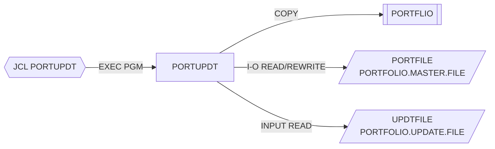

# PORTUPDT — Actualización de carteras

## Propósito
Aplica sobre el maestro de carteras (VSAM KSDS) las modificaciones contenidas en un fichero secuencial de actualizaciones. Cada registro de entrada identifica una cartera, un tipo de acción (estado, valor o nombre) y el nuevo valor.

## Tipo
Batch (ejecutado por el JCL `src/jcl/portfolio/PORTUPDT.jcl`, `EXEC PGM=PORTUPDT`). Sin CICS ni DB2.

## Entradas y salidas

| Recurso | DDNAME | Organización / acceso | Uso | Layout |
|---|---|---|---|---|
| `PORTFOLIO-FILE` (PORTFOLIO.MASTER.FILE) | `PORTFILE` | VSAM INDEXED, RANDOM, clave `PORT-KEY` | `OPEN I-O`, `READ`, `REWRITE` | `COPY PORTFLIO` |
| `UPDATE-FILE` (PORTFOLIO.UPDATE.FILE) | `UPDTFILE` | QSAM SEQUENTIAL | `OPEN INPUT`, `READ` | `UPDATE-RECORD` (en línea) |

Layout de `UPDATE-RECORD`: `UPDT-KEY` (`UPDT-ID` X(8) + `UPDT-ACCT-NO` X(10)), `UPDT-ACTION` X(1) (`S` estado, `V` valor total, `N` nombre de cliente), `UPDT-NEW-VALUE` X(50).

- Copybooks: `PORTFLIO`.
- Tablas DB2: ninguna. LINKAGE SECTION: ninguna.

## Flujo principal
1. `0000-MAIN`: `1000-INITIALIZE` → bucle `2000-PROCESS UNTIL END-OF-FILE` → `3000-TERMINATE` → `GOBACK`.
2. `1000-INITIALIZE`: inicializa contadores; abre `PORTFOLIO-FILE` (I-O) y `UPDATE-FILE` (INPUT). Si algún status ≠ `'00'` muestra el error, fija `WS-RETURN-CODE = 8` y ejecuta `3000-TERMINATE`.
3. `2000-PROCESS`: `READ UPDATE-FILE`; `AT END` marca fin; si no, `2100-PROCESS-UPDATE`.
4. `2100-PROCESS-UPDATE`: mueve `UPDT-KEY` a `PORT-KEY` y hace `READ PORTFOLIO-FILE`. Si `'00'` → `2200-APPLY-UPDATE`; en cualquier otro caso incrementa `WS-ERROR-COUNT` y muestra `Record not found` (aunque el status sea otro error).
5. `2200-APPLY-UPDATE`: según `UPDT-ACTION`:
   - `S` → `UPDT-NEW-VALUE` a `PORT-STATUS` (solo se usa el primer byte).
   - `N` → `UPDT-NEW-VALUE` a `PORT-CLIENT-NAME` (truncado a 30).
   - `V` → `UPDT-NEW-VALUE` a `WS-NUMERIC-WORK` (S9(13)V99) y de ahí a `PORT-TOTAL-VALUE`.
   - Otro valor: no se modifica nada, pero se hace `REWRITE` igualmente.
   Después `REWRITE PORT-RECORD`; `'00'` → `WS-UPDATE-COUNT`, si no → `WS-ERROR-COUNT` y mensaje `Update failed`.
6. `3000-TERMINATE`: cierra ficheros, muestra `Updates processed` y `Errors occurred`, mueve `WS-RETURN-CODE` a `RETURN-CODE`.

## Reglas de negocio y validaciones
- No se valida el contenido del nuevo valor: el estado no se restringe a `A/C/S`, y el valor numérico se mueve alfanumérico→numérico sin comprobar `NUMERIC` (riesgo de datos inválidos o abend `S0C7` en operaciones posteriores).
- No se actualiza `PORT-LAST-MAINT` ni `PORT-LAST-USER`/`PORT-LAST-TRANS` al modificar la cartera.
- Una acción desconocida produce un `REWRITE` sin cambios que se contabiliza como actualización correcta.

## Manejo de errores y códigos de retorno
- `RC=8` solo si falla el `OPEN`; los errores por registro se cuentan y muestran, con `RC=0` final.
- Defecto latente compartido con `PORTADD`/`PORTDEL`/`PORTREAD`: tras un fallo de `OPEN` no se abandona el programa.

## Dependencias
- **Llama a**: ningún programa.
- **Es ejecutado desde**: JCL `PORTUPDT` (`STEP1 EXEC PGM=PORTUPDT`).
- **Copybooks**: `PORTFLIO`.
- **Ficheros**: `PORTFILE`, `UPDTFILE`.
- Aristas en `deps.json`: `PORTUPDT →COPY→ PORTFLIO`, `PORTUPDT →FILE→ PORTFILE`, `PORTUPDT →FILE→ UPDTFILE`, `PORTUPDT(JCL) →EXECPGM→ PORTUPDT`.

## Diagrama

