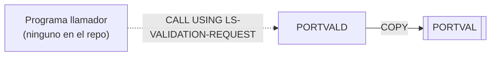

# PORTVALD — Subrutina de validación de datos de cartera

## Propósito
Subrutina reutilizable que valida un dato de cartera según el tipo solicitado (identificador, número de cuenta, tipo de inversión o importe) y devuelve un código de retorno y un mensaje de error. Las reglas, códigos y mensajes están centralizados en el copybook `PORTVAL`.

## Tipo
Subrutina (`PROCEDURE DIVISION USING`), invocable por `CALL` desde batch u online. No accede a ficheros, CICS ni DB2.

## Entradas y salidas
- **Ficheros / tablas DB2**: ninguno.
- **Copybooks**: `PORTVAL` (WORKING-STORAGE: códigos `VAL-*`, mensajes `VAL-ERR-*`, constantes y áreas de trabajo).
- **LINKAGE SECTION** — `LS-VALIDATION-REQUEST`:

| Campo | PIC | Sentido | Descripción |
|---|---|---|---|
| `LS-VALIDATE-TYPE` | X(1) | entrada | `I` ID de cartera, `A` cuenta, `T` tipo de inversión, `M` importe |
| `LS-INPUT-VALUE` | X(50) | entrada | Valor a validar |
| `LS-RETURN-CODE` | S9(4) COMP | salida | `VAL-SUCCESS`(0), `VAL-INVALID-ID`(1), `VAL-INVALID-ACCT`(2), `VAL-INVALID-TYPE`(3), `VAL-INVALID-AMT`(4) |
| `LS-ERROR-MSG` | X(50) | salida | Mensaje de `PORTVAL` o espacios si es válido |

## Flujo principal
1. `0000-MAIN`: `INITIALIZE VAL-WORK-AREAS`; `EVALUATE` sobre `LS-VALIDATE-TYPE` → `1000-VALIDATE-ID` / `2000-VALIDATE-ACCOUNT` / `3000-VALIDATE-TYPE` / `4000-VALIDATE-AMOUNT`; `WHEN OTHER` devuelve `VAL-INVALID-ID` y `'Invalid validation type'`. `GOBACK`.
2. `1000-VALIDATE-ID`: los 4 primeros caracteres deben ser `VAL-ID-PREFIX` (`'PORT'`) y las posiciones 5-8 numéricas; si no, `VAL-INVALID-ID` / `VAL-ERR-ID`.
3. `2000-VALIDATE-ACCOUNT`: `LS-INPUT-VALUE` debe ser numérico y distinto de ceros; si no, `VAL-INVALID-ACCT` / `VAL-ERR-ACCT`.
4. `3000-VALIDATE-TYPE`: el valor debe ser `STK`, `BND`, `MMF` o `ETF`; si no, `VAL-INVALID-TYPE` / `VAL-ERR-TYPE`.
5. `4000-VALIDATE-AMOUNT`: mueve el valor a `VAL-TEMP-NUM` (S9(13)V99) y comprueba `VAL-MIN-AMOUNT ≤ valor ≤ VAL-MAX-AMOUNT`; si no, `VAL-INVALID-AMT` / `VAL-ERR-AMT`.
6. En cada rama válida: `LS-RETURN-CODE = VAL-SUCCESS` y `LS-ERROR-MSG = SPACES`.

## Reglas de negocio y validaciones
- ID de cartera: `PORT` + 4 dígitos (nota: `PORTMSTR` aplica una regla ligeramente distinta, `PORT` + 5 dígitos).
- Número de cuenta: numérico y no cero. Al comprobar `IS NUMERIC` sobre los 50 bytes completos, un valor de 10 dígitos seguido de espacios se rechazará; el comentario del programa ("10 dígitos") no se cumple literalmente.
- Tipo de inversión: lista cerrada `STK/BND/MMF/ETF`.
- Importe: rango ±9.999.999.999.999,99 (en la práctica todo el dominio del PIC). La conversión de X(50) a numérico no valida que el contenido sea numérico.

## Manejo de errores y códigos de retorno
- Devuelve el resultado exclusivamente por `LS-RETURN-CODE`/`LS-ERROR-MSG`; no usa `RETURN-CODE`, no aborta ni escribe mensajes.

## Dependencias
- **Llama a**: ningún programa.
- **Es llamado por**: ningún programa del repositorio contiene `CALL 'PORTVALD'` (tampoco figura como destino en `deps.json`); no tiene JCL propio. Es un componente huérfano/pendiente de integración.
- **Copybooks**: `PORTVAL`.
- Aristas en `deps.json`: `PORTVALD →COPY→ PORTVAL`.

## Diagrama

