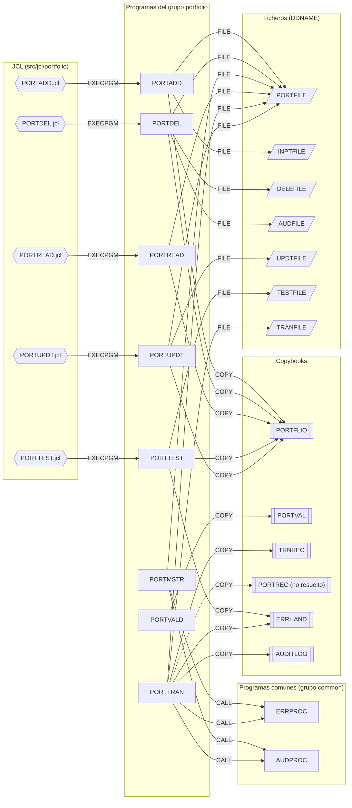

# Grupo `portfolio` — programas COBOL de gestión del maestro de carteras

## Resumen del grupo
El grupo `portfolio` (`src/programs/portfolio/`) agrupa los programas que mantienen y explotan el **fichero maestro de carteras** (VSAM KSDS `PORTFOLIO.MASTER.FILE`, DDNAME `PORTFILE`, definido por el JCL `PORTDEF`). Todos son programas batch o subrutinas sin CICS ni DB2:

- Cinco utilidades batch autónomas con su propio JCL en `src/jcl/portfolio/`: alta (`PORTADD`), baja con auditoría (`PORTDEL`), listado (`PORTREAD`), actualización (`PORTUPDT`) y generación de datos de prueba (`PORTTEST`). Todas comparten el layout `PORTFLIO`.
- Un proceso de transacciones (`PORTTRAN`) que valida movimientos contra el maestro e integra los servicios comunes `ERRPROC`/`AUDPROC`.
- Dos subrutinas invocables por `CALL`: mantenimiento CRUD (`PORTMSTR`) y validación de datos (`PORTVALD`). Ningún programa del repositorio las invoca actualmente.

Todas las dependencias externas del grupo apuntan a copybooks y programas del grupo `common` (`PORTFLIO`, `PORTVAL`, `TRNREC`, `ERRHAND`, `AUDITLOG`, `ERRPROC`, `AUDPROC`).

## Programas

| Programa | Tipo | Propósito | Documentación |
|---|---|---|---|
| PORTADD | Batch (JCL PORTADD) | Da de alta carteras en el maestro desde un fichero secuencial de entrada | [PORTADD.md](PORTADD.md) |
| PORTDEL | Batch (JCL PORTDEL) | Elimina carteras a partir de un fichero de solicitudes y escribe auditoría | [PORTDEL.md](PORTDEL.md) |
| PORTMSTR | Subrutina | Mantenimiento CRUD del maestro por comando (C/R/U/D) con auditoría vía AUDPROC | [PORTMSTR.md](PORTMSTR.md) |
| PORTREAD | Batch (JCL PORTREAD) | Lista secuencialmente el contenido del maestro de carteras | [PORTREAD.md](PORTREAD.md) |
| PORTTEST | Batch (JCL PORTTEST) | Genera 100 registros de cartera sintéticos para pruebas | [PORTTEST.md](PORTTEST.md) |
| PORTTRAN | Batch (sin JCL) | Valida transacciones (BU/SL/TR/FE) contra el maestro; errores vía ERRPROC | [PORTTRAN.md](PORTTRAN.md) |
| PORTUPDT | Batch (JCL PORTUPDT) | Aplica cambios de estado, nombre o valor a carteras existentes | [PORTUPDT.md](PORTUPDT.md) |
| PORTVALD | Subrutina | Valida ID, cuenta, tipo de inversión e importe según reglas de PORTVAL | [PORTVALD.md](PORTVALD.md) |

## Subgrafo de dependencias

Incluye todas las aristas de `documentation/dependency-graph/deps.json` cuyo `from` es un programa del grupo, más las aristas `EXECPGM` de los JCL que los ejecutan. Las aristas discontinuas señalan la única arista no resuelta (`PORTTRAN → PORTREC`).

Aristas con destino en el grupo (`to` ∈ portfolio): únicamente las cinco `EXECPGM` desde los JCL homónimos. Ningún programa del repositorio hace `CALL`/`LINK` a `PORTMSTR`, `PORTVALD` ni `PORTTRAN`.

## Discrepancias con deps.json

Las aristas de `deps.json` reflejan correctamente las sentencias `COPY`, `CALL`, `SELECT/ASSIGN` y `EXEC PGM` presentes en el código. Las siguientes observaciones matizan su interpretación (no se ha modificado `deps.json`):

1. **`PORTMSTR →CALL→ ERRPROC` es código no alcanzable.** El `CALL 'ERRPROC'` está en el párrafo `2100-HANDLE-VSAM-ERROR`, que ningún `PERFORM` invoca. La arista existe estáticamente pero no en tiempo de ejecución.
2. **`PORTTRAN →CALL→ AUDPROC` es código no alcanzable.** `CALL 'AUDPROC'` está en `2310-WRITE-AUDIT-RECORD`, invocado solo desde `2300-UPDATE-AUDIT-TRAIL` ← `2200-UPDATE-POSITIONS`, párrafo que nunca se ejecuta (`2100-VALIDATE-TRANSACTION` no lo llama). La actualización de posiciones completa (`2200`–`2310`) es código muerto.
3. **Dependencias implícitas de `PORTMSTR` sobre `ERRHAND` y `AUDITLOG` (faltan en deps.json porque no hay `COPY`).** Los párrafos `2100-HANDLE-VSAM-ERROR` y `2100-LOG-PORTFOLIO-UPDATE` usan `ERR-CAT-VSAM`, `ERR-VSAM-DUPKEY`, `ERR-WARNING`, `LS-ERROR-REQUEST`, `LS-AUDIT-REQUEST`, etc., definidos (o esperados) en los copybooks comunes `ERRHAND`/`AUDITLOG` y en las estructuras de LINKAGE de `ERRPROC`/`AUDPROC`. El programa no compila sin esas inclusiones; la dependencia real existe aunque el extractor estático no pueda verla.
4. **`PORTTRAN →COPY→ PORTREC` (resolved=false).** El copybook `PORTREC` no existe en `src/copybook/`; el layout que usa el código (`PORT-TOTAL-UNITS`, `PORT-TOTAL-COST`, `PORTFOLIO-RECORD`) tampoco coincide con `PORTFLIO`, por lo que no es un simple alias. Arista correcta pero irresoluble.
5. **`PORTMSTR →FILE→ PORTFILE` con layout incompatible.** `PORTMSTR` declara su propio registro de 100 bytes con clave `PORT-ID` X(10), mientras que `PORTDEF.jcl` define el cluster con `RECORDSIZE(200 200) KEYS(18 0)` y el resto de programas usan `PORTFLIO` (clave de 18 bytes). La arista al DDNAME es correcta, pero en la práctica `PORTMSTR` y `PORTTRAN` (clave `PORT-ID` sola) no pueden operar sobre el mismo dataset que `PORTADD`/`PORTDEL`/`PORTREAD`/`PORTUPDT`.
6. **Relación dataset–JCL no modelada.** `PORTDEF.jcl` (`EXECPGM IDCAMS`, no resuelto) crea el dataset `PORTFOLIO.MASTER.FILE` al que apunta el DDNAME `PORTFILE` de seis programas del grupo; deps.json no relaciona el JCL de definición con el fichero. Es una limitación del modelo (solo `EXEC PGM`), no un error.
7. **Programas sin punto de entrada.** `PORTMSTR`, `PORTVALD` y `PORTTRAN` no tienen JCL ni llamador en el repositorio (deps.json es coherente con ello: no hay aristas entrantes). Se documenta para que no se interprete como omisión del extractor.
8. **Dependencia declarada pero no usada.** `PORTTEST →COPY→ ERRHAND` es correcta sintácticamente, pero el programa no referencia ningún campo de `ERRHAND`.
