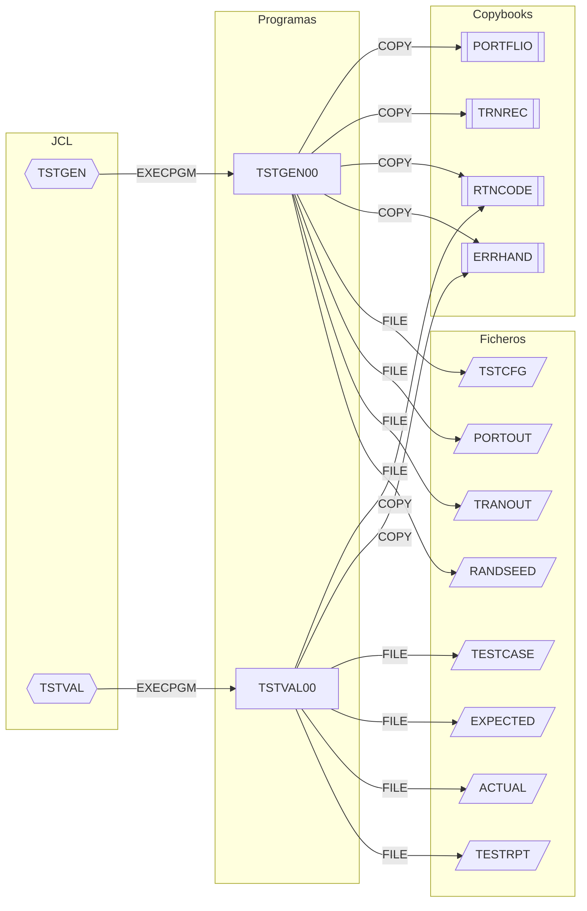

# Grupo `test` — programas COBOL de soporte a pruebas

## Resumen del grupo

El grupo `test` (`src/programs/test/`) contiene dos programas batch autónomos que
dan soporte a las pruebas de sistema del CLBS: uno genera datos de prueba
(carteras y transacciones) y otro ejecuta casos de prueba y produce un informe de
validación. Ninguno usa CICS ni DB2; solo trabajan con ficheros QSAM secuenciales y
los copybooks comunes `RTNCODE` y `ERRHAND`. Cada programa tiene su propio JCL en
`src/jcl/test/`. No llaman a ningún otro programa ni son llamados por programas
COBOL (solo por JCL).

Ambos programas son esqueletos: los párrafos que realizarían la generación de datos
y la ejecución/comparación de pruebas se invocan pero no están definidos (ver el
apartado "Estado del código" de cada ficha).

## Programas

| Programa | Propósito | Documentación |
|----------|-----------|---------------|
| TSTGEN00 | Genera ficheros de datos de prueba (carteras y transacciones) según un fichero de configuración y una semilla aleatoria | [TSTGEN00.md](TSTGEN00.md) |
| TSTVAL00 | Ejecuta casos de prueba, compara resultados esperados/reales y emite un informe de validación | [TSTVAL00.md](TSTVAL00.md) |

## Subgrafo de dependencias

Incluye todas las aristas de `documentation/dependency-graph/deps.json` cuyo `from`
es un programa del grupo, más las aristas `EXECPGM` entrantes desde los JCL del grupo.

## Discrepancias con deps.json

Ninguna. Las 14 aristas con `from` en {TSTGEN00, TSTVAL00} (6 COPY + 8 FILE) y las
2 aristas `EXECPGM` (TSTGEN→TSTGEN00, TSTVAL→TSTVAL00) coinciden exactamente con lo
que se observa en el código fuente y en los JCL; no hay CALL, LINK/XCTL, SQL INCLUDE
ni acceso a tablas DB2 en ninguno de los dos programas.

Observaciones (no afectan a `deps.json`):

- `documentation/technical/system-architecture.md` (tabla de dependencias) atribuye a
  TSTGEN00 una dependencia de `ERRPROC` y a TSTVAL00 de `DB2CONN` y `ERRPROC` con
  acceso DB2 de lectura. El código fuente no contiene ninguna de esas llamadas ni
  sentencias SQL; `deps.json` es el que refleja la realidad.
- Las cláusulas `COPY PORTFLIO REPLACING ==:PREFIX:== BY ==PORT==` y
  `COPY TRNREC REPLACING ==:PREFIX:== BY ==TRAN==` en TSTGEN00 no tienen efecto: los
  copybooks no contienen el marcador `:PREFIX:`.
